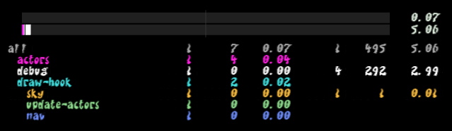
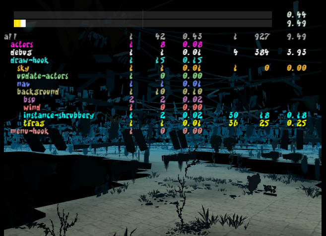
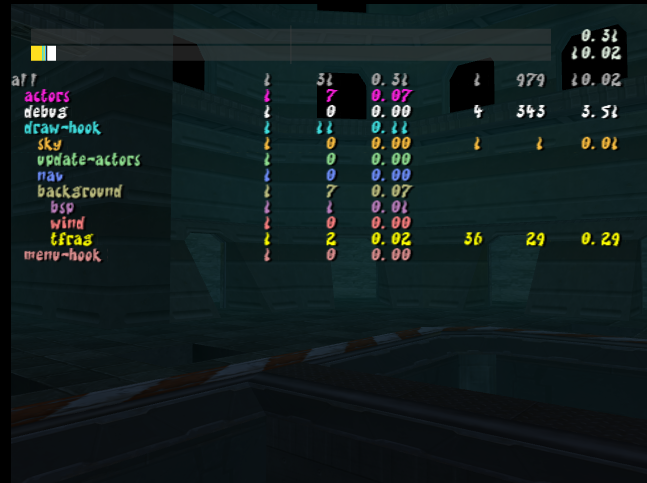
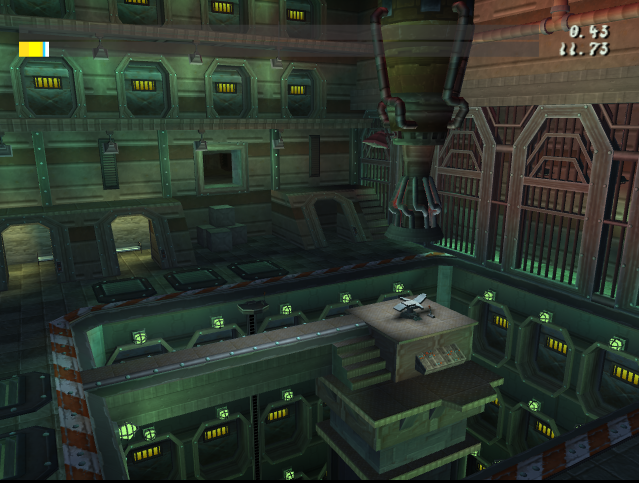
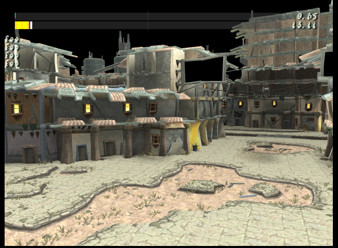
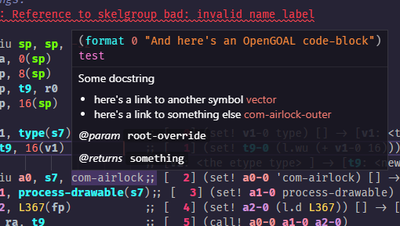

It's been quite a while since we've done a progress report, but we figured as part of the Jak 2 process it would be nice to make a return to doing them. It's nice to be able to look back on what's been accomplished as well as let people that are interested know where we are at.

With that said, there's a lot to talk about that's happened over the last month or so.

<!--truncate-->

import ReactPlayer from 'react-player'
import PRLink from '@site/src/mdx/PRLink';

## Jak 2 Decompilation

### Lots of Core Engine Files

Over the last month or so, hundreds of core files have been completed or partially started. While they aren't the most flashy thing to talk about (no screenshots to share!) it's obviously an important part of the process.

They make up a large portion of the currently 140,000 lines of code decompiled (and counting)

### Texture Support <PRLink href="https://github.com/open-goal/jak-project/pull/1866"/>

Texture support was added for Jak 2, this means we can finally see something.

> 2 years later, and we're back to where we started with Jak 1

### Shrubbery Decompiled <PRLink href="https://github.com/open-goal/jak-project/pull/1898"/> <PRLink href="https://github.com/open-goal/jak-project/pull/1914"/>

One of the last renderers in Jak 1 has been one of the first to be brought over to Jak 2. Thankfully the VU program (the most difficult part about porting this kind of code) ended up being identical to Jak 1.

### Background and TFrag <PRLink href="https://github.com/open-goal/jak-project/pull/1909"/>

While it currently lacks time of day support, it's great to see some parts of the actual levels already being rendered.

### Target (aka Jak) related code <PRLink href="https://github.com/open-goal/jak-project/pull/1861"/> <PRLink href="https://github.com/open-goal/jak-project/pull/1915"/>

A good chunk of Jak's code has already been done and will be ready to test when the time is right.

### TIE partially implemented <PRLink href="https://github.com/open-goal/jak-project/pull/1916"/>

With the TIE renderer being even partially implemented, the game's levels start to really take shape.

### Game task related code completed <PRLink href="https://github.com/open-goal/jak-project/pull/1884"/>

This is the core logic behind how the game keeps track of what you have and have not completed.

With this data, a graph was created that shows in great detail how all the tasks are interconnected, and eventually we'll probably add this to the website in a more consumable form as the full graph is massive. In the meantime, enjoy [this gigantic SVG](./img/jak2-tasks.svg).

### Progress menu (aka the "pause menu") is largely completed

Not tested yet due to being blocked by a few things, but all of the code directly related to the pause menu has been completed!

## Decompilation Tooling

### Automatic type casting is working well!

The progress pages now show the most used manual type-casts we have to do. If you compare Jak 1 with Jak 2, many of the biggest offenders in Jak 1 are no where to be found now. There is always room for improvement but this is a huge boost to speed (and consistency) already!

### LSP and related tooling continues to improve

Another nice improvement this time around is better editor tooling to help with the decompilation effort. If you've seen the `LSP` inside the `jak-project` releases and wondered what the hell it is, it's a small program that provides metadata to an IDE like VSCode. It's what provides auto-completions, on-hover text, sometimes syntax highlighting, etc. If you're interested, see the [spec](https://microsoft.github.io/language-server-protocol/specifications/lsp/3.17/specification/).

Related documentation is (/docs/developing/decompiling/editor_tools) for those interested.

### Docstring support <PRLink href="https://github.com/open-goal/jak-project/pull/1753"/>

In an effort to better document the code this time, as well as eventually support auto-generated documentation, the decompiler supports docstrings on most of the relevant areas.

This also is gradually being supported by the LSP to provide on-hover explanations of functions:

## Jak 1

### Speedrunner Mode <PRLink href="https://github.com/open-goal/jak-project/pull/1773"/>

If you are a speedrunner you are probably already well aware of this feature, but if you are not you may have noticed a new menu option related to it.

<ReactPlayer controls url="/videos/speedrunner-mode.webm" />

This mode does a few things:
- When creating a new game file, you will immediately spawn at Geyser Rock
- The autosave prompt will never appear
- The game will keep track of various progress indicators to support automatically timing your speedrun via LiveSplit

The associated leaderboard can be found here if you are interested - https://www.speedrun.com/jak1og

And the associated auto splitting LiveSplit integration (and maybe other tools in the future) can be found here - https://github.com/open-goal/speedrunning

### Cutscene Skips <PRLink href="https://github.com/open-goal/jak-project/pull/1779"/>

Most cutscenes can now be skipped in Jak 1, if you don't want to accidentally skip a cutscene there is a menu option to disable this feature

<ReactPlayer controls url="/videos/cutscene-skips.webm" />

### Brazilian Portuguese Translation <PRLink href="https://github.com/open-goal/jak-project/pull/1759"/>

Thanks to Lightbell18 and Himham for adding this translation. There are a lot of partially done translations that hopefully will be completed and make it into the game soon!:

- Swedish
- Italian - https://github.com/open-goal/jak-project/pull/1568
- Spanish - https://github.com/open-goal/jak-project/pull/1709

### Screenshot Hotkey <PRLink href="https://github.com/open-goal/jak-project/pull/1776"/>

A hotkey was added to take a screenshot, by default it is `F2`

## Launcher and Releases

### Launcher releases are now automatic <PRLink href="https://github.com/open-goal/jak-project/pull/1788"/>

A launcher release will now be built and released automatically after the main project releases.

### Future launcher releases should work on Linux <PRLink href="https://github.com/open-goal/launcher/pull/36"/>

The launcher should now work on Linux, and the next release should support it. When that finally drops, let us know if you run into any issues.

### Work continues on an improved Launcher experience

There is lots of active work to fix up the faults of the current launcher, most notably to:
- Improve the process of reporting issues such as game crashes
- Better decide where you want to install the game
- Easily apply texture replacements
- etc
