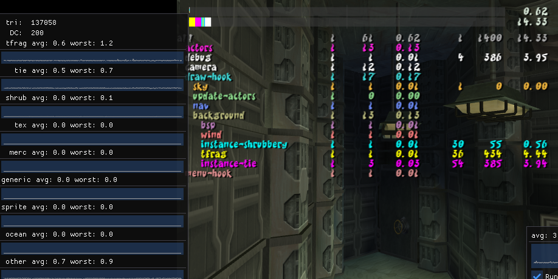
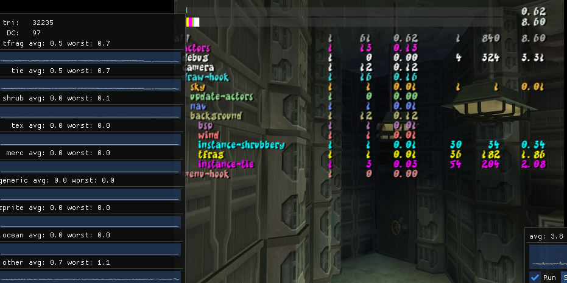

TODO

<!--truncate-->

import ReactPlayer from 'react-player'
import PRLink from '@site/src/mdx/PRLink';

## Jak 2 Decompilation

### 300 Files Started!

More files have been completed, this month we reached the 300 file started milestone.  Check the progress page for more details

### Visibility Data <PRLink href="https://github.com/open-goal/jak-project/pull/1938"/>

Visibility data has been hooked up for Jak 2 and it seems to work quite well.

<!-- TODO - columns -->




### Time of Day Support <PRLink href="https://github.com/open-goal/jak-project/pull/1943"/>

Partial time of day support has been implemented for Jak 2:


### Region Boundary Rendering <PRLink href="https://github.com/open-goal/jak-project/pull/1944"/>

More debugging code implemented and region boundary rendering now works


### Camera Code Running <PRLink href="https://github.com/open-goal/jak-project/pull/1945"/>

The camera code is now functional:

### Sky Renderer Functional <PRLink href="https://github.com/open-goal/jak-project/pull/1972"/>

The sky renderer returns:

<ReactPlayer controls url="/videos/oct-2022/sky.mp4" />

### Preliminary Sound Effect Support

A very early preview of Jak 2's sounds working

<ReactPlayer controls url="/videos/oct-2022/j2sfx.mp4" />

## Decompilation Tooling

### `defpart` and `defpartgroup` Support for Jak 2 <PRLink href="https://github.com/open-goal/jak-project/pull/1947"/>

Particle related macro support added for Jak 2

### `defskelgroup` Fixed for Jak 2 <PRLink href="https://github.com/open-goal/jak-project/pull/1958"/>

Skeleton group related macro has also been updated to support Jak 2.

### Nicer Output for `giftags` <PRLink href="https://github.com/open-goal/jak-project/pull/1970"/>

Giftags should decompile a lot better now:

```opengoal
      :gif0 (new 'static 'gif-tag64
        :nloop #x4
        :eop #x1
        :pre #x1
        :prim (new 'static 'gs-prim :prim (gs-prim-type tri-strip) :iip #x1 :tme #x1 :fge #x1 :abe #x1)
        :nreg #x3
        )
      :gif1 (new 'static 'gif-tag-regs :regs0 (gif-reg-id st) :regs1 (gif-reg-id rgbaq) :regs2 (gif-reg-id xyzf2))
```

Instead of

```opengoal
:gif (new 'static 'array uint64 2 #x303e400000008004 #x412)
```

### Offline Test Parallelization <PRLink href="https://github.com/open-goal/jak-project/pull/1974"/>

Offline test work can now be divided amongst individual threads.

This is work done in-advance of a problem -- Jak 2 has _alot_ of files.  On my old machine, a single file was taking about 120ms on average (100ms for decompilation, 20ms for compilation).  This means that Jak 2's 800-900 files would take atleast 1.5 minutes for a full test, which is too slow for fast iteration.

Now if we take that same amount of work (800 files), and divide it amongst -- let's say 32 threads (25 files per thread). We are now talking sub 10 seconds for the entire game.

## Jak 1

### Skip Added Back for Daxter/Naughty Dog Intro Cutscene <PRLink href="https://github.com/open-goal/jak-project/pull/1965"/>

Was removed a while back but has been re-added.
