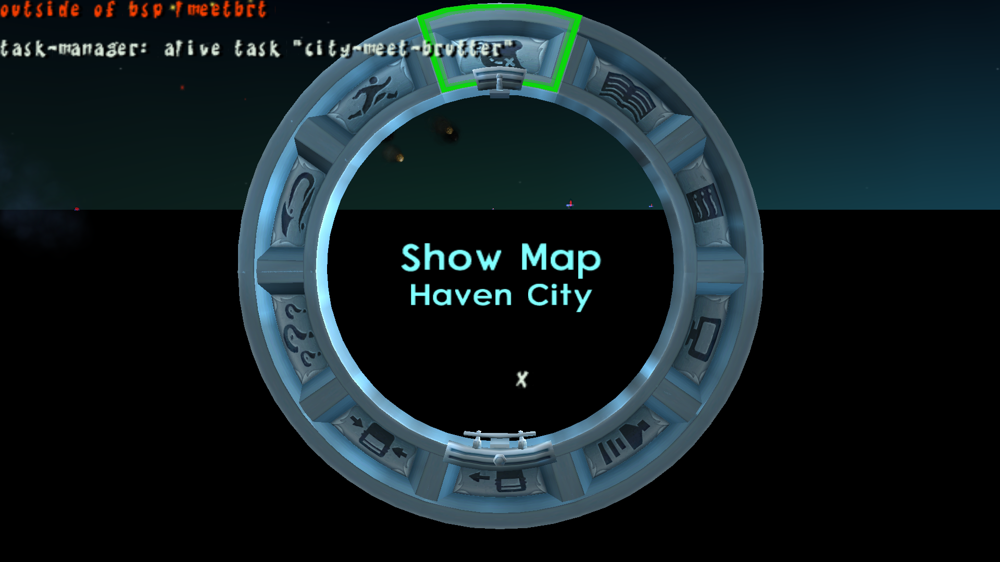
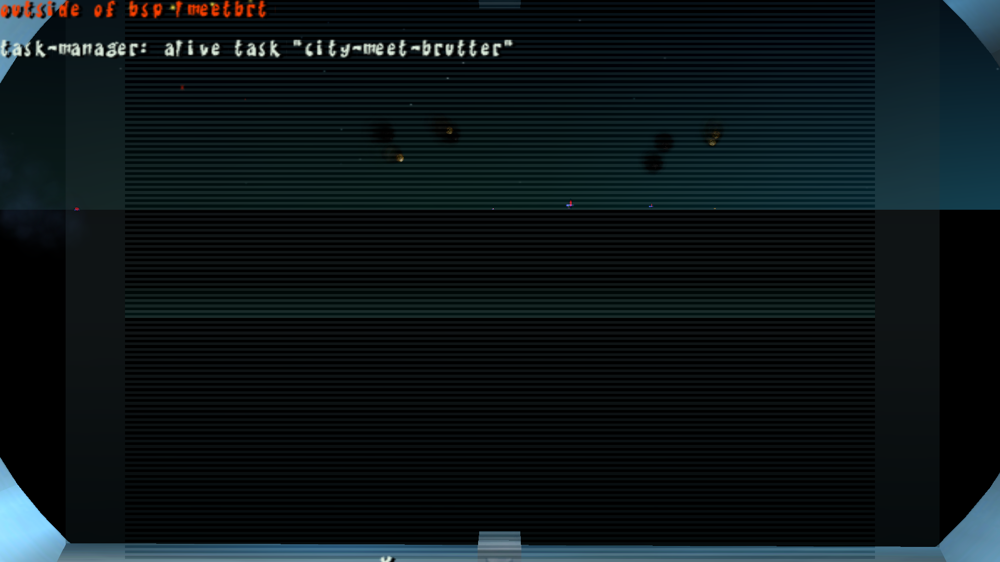
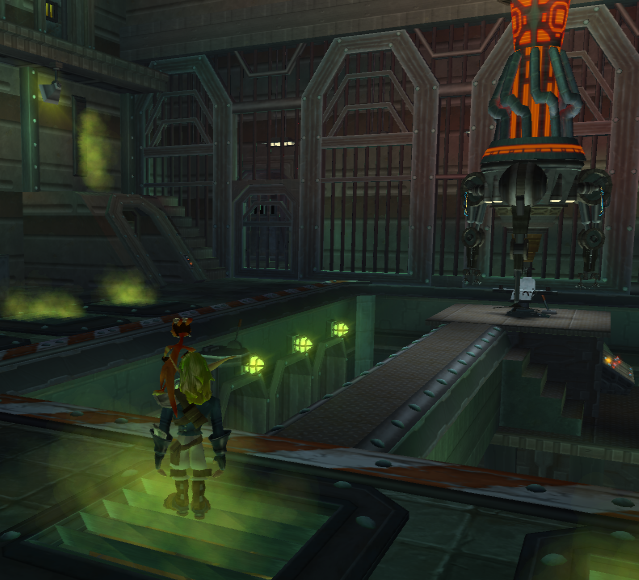
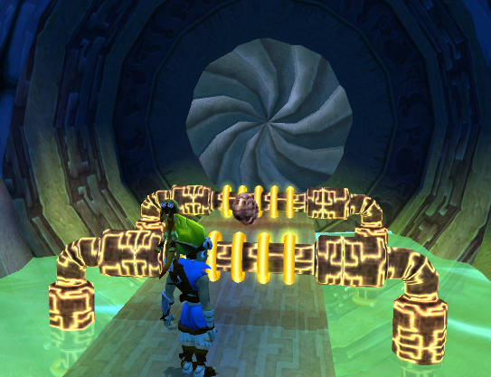

<head>
  <meta name="twitter:card" content="summary_large_image" />
</head>

Bug fixing for Jak 2 continues, along with various people working on improving their areas of interests in the project.

<!--truncate-->

## Release Info

This month's OpenGOAL Tooling (jak-project repo) release is `0.1.35`

  

    <LauncherDownloadLink />
  

:::danger
NOTE - You must be on the latest version of the launcher (`2.0.10` or above) to be able to successfully launch version `0.1.35` or above.
:::

## General Changes

### Fix Jak 1 Alpha Issues <PRLink href="https://github.com/open-goal/jak-project/pull/2458"/>

This fixed some graphical regressions:
- The sculptor's face shield lacking transparency
- Final boss' red ring attack

<ImageCompare left={require("./img/sculptor-before.png").default} right={require("./img/sculptor-after.png").default}/>

### Fix Debug Booting <PRLink href="https://github.com/open-goal/jak-project/pull/2469"/>

If you used the `Reboot in Debug` imgui menu option in the last release, it may have required multiple attempts to work properly.  This has been fixed.

## Jak 2 Fixes

### Bigmap <PRLink href="https://github.com/open-goal/jak-project/pull/2460"/>

One of the last significant features that wasn't working was the map in the progress menu.  The map still does not render, but the underlying file was decompiled and the menu as a whole works a lot better now.

<!-- TODO - no description - https://github.com/open-goal/jak-project/pull/2459 -->

### Disappearing Guards <PRLink href="https://github.com/open-goal/jak-project/pull/2470"/>

See the github description for a more comprehensive write-up.  This was one of those annoying and intermittent bugs, and it would cause guards to flicker/disappear as you travelled through the city.  This has hopefully been solved, but by the nature of these bugs it's hard to know this early on.

### Permamently Disappearing Citizens <PRLink href="https://github.com/open-goal/jak-project/pull/2472"/>

If a citizen was pushed into the border of the nav-mesh, they would permanently disappear.

### Overkilling Enemies <PRLink href="https://github.com/open-goal/jak-project/pull/2475"/>

For the longest time, it was possible to continue to hit enemies after they died.  Turned out to be a decompilation mistake.

### Some Text Fixes <PRLink href="https://github.com/open-goal/jak-project/pull/2476"/>

Fixed some issues around the text handling for every language except korean.

### Miscellaneous Renderer Fixes <PRLink href="https://github.com/open-goal/jak-project/pull/2488"/>

Some various rendering issues were fixed.  The infamous green ring is finally fixed.

### Generic and Warp Renderers <PRLink href="https://github.com/open-goal/jak-project/pull/2495"/> <PRLink href="https://github.com/open-goal/jak-project/pull/2515"/>

This resolved many feature gaps in Jak 2 graphics-wise.  Generic was needed for a variety of things, while warp is used for distortions such as the warpgates or the mirror in the hiphog.

<!-- TODO videos -->

### Version Diffs <PRLink href="https://github.com/open-goal/jak-project/pull/2528"/>

Jak 2's various versions have been compared and initial support has been added to the tooling.  Unlike with Jak 1, Jak 2's versions hardly have any practical difference between them with the only significant bug fix being related to the `Defend Stadium` mission.

### Memory Card Support <PRLink href="https://github.com/open-goal/jak-project/pull/2482"/>

Memory card support has been added for Jak 2

### Faster Elevators and Airlocks <PRLink href="https://github.com/open-goal/jak-project/pull/2478"/> <PRLink href="https://github.com/open-goal/jak-project/pull/2537"/>

Airlocks and elevators will move / open 50% faster.

<!-- TODO - overlord stuff -->

## Other Changes

### REPL Fixes <PRLink href="https://github.com/open-goal/jak-project/pull/2463"/> <PRLink href="https://github.com/open-goal/jak-project/pull/2464"/>

Two fixes involving the REPL were merged.

The first is that if you are using a non-NTSC-v1 version, you can now specify this via the `repl-config.json` file, instead of manually adding conditions to the underlying project definition.

The second is that using relative `project-path` overrides, typically via the `--proj-path` flag, should now function properly.

### CLI shim has been removed from `gk` <PRLink href="https://github.com/open-goal/jak-project/pull/2532"/>

`gk` must now be called with the new CLI format.  This is not a concern for anyone other than launcher developers.
