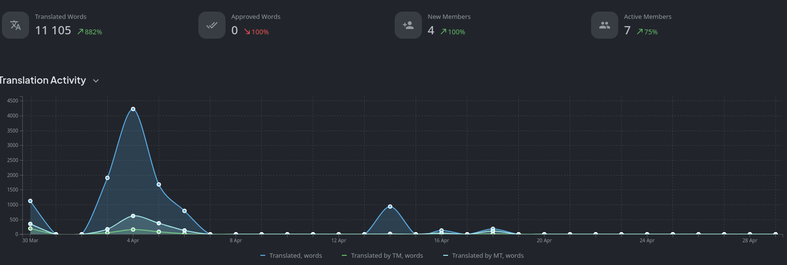
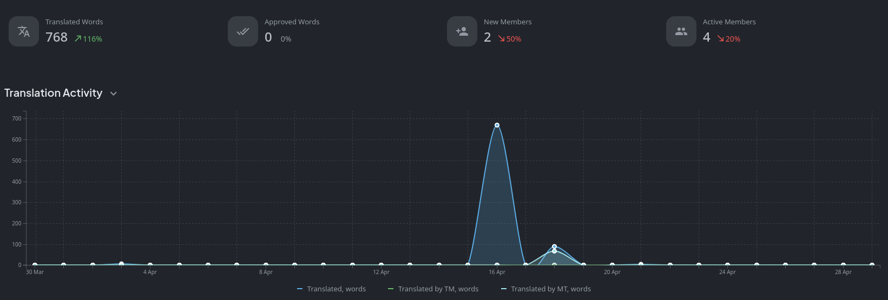
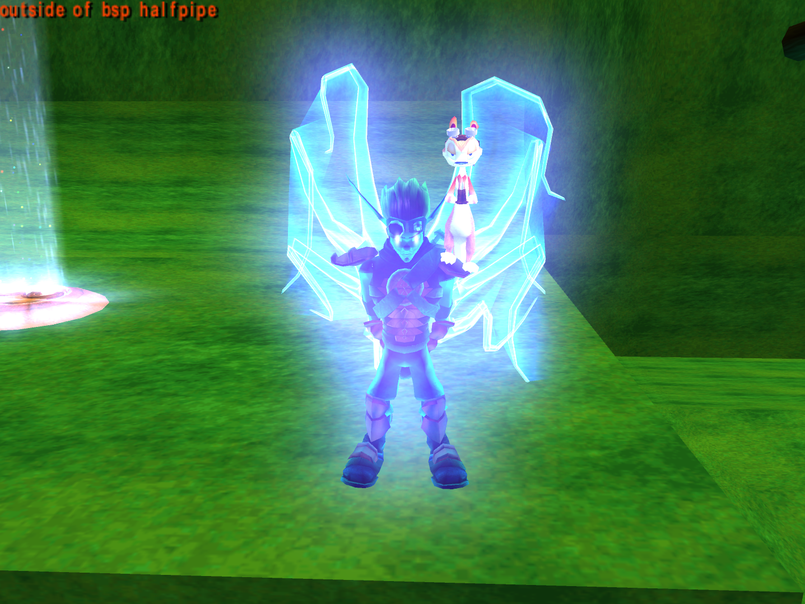

<head>
  <meta name="twitter:card" content="summary_large_image" />
</head>

Jak 3 progress is skyrocketing.

<!--truncate-->

## Release Info

This month's OpenGOAL Tooling (jak-project repo) release is `0.2.11`.

  

    <LauncherDownloadLink />
  

## Translation Contributions

### Games

### Launcher

## General Changes

### Reimplementation of GOAL `capture` System for Jak 2/3 <PRLink href="https://github.com/open-goal/jak-project/pull/3482"/>

Jak 2 and 3 had a `capture` system for taking high resolution screenshots. It would max out LODs and hide any HUD elements/text on-screen before capturing a raw image of the next frame. This feature was mainly used to aid with taking high quality screenshots used in promotional material.

This system has now been reimplemented to work with OpenGOAL and the already existing screenshot feature in the ImGUI top bar which can be accessed by pressing `Alt`. There are presets for 1080p, 2K, 4K and even 16K in case somebody needs that...

### GOAL Debugger: Reverse Backtrace Print Order <PRLink href="https://github.com/open-goal/jak-project/pull/3474"/>

Previously, when the game crashed and the GOAL debugger printed the stack trace, you would need to scroll all the way up to see the spot where the game actually crashed, which could be quite a lot of scrolling depending on how big the stack trace was.

## Jak 2

### Fix Minimap Icon Misalignment <PRLink href="https://github.com/open-goal/jak-project/pull/3481"/>

The icons on the minimap were slightly misaligned, leading to small black bars showing up next to them. This bug was also present in Jak 3 and was fixed there as well.

## Jak 3

### Decompilation Update <PRLink href="https://github.com/open-goal/jak-project/pull/3445"/> <PRLink href="https://github.com/open-goal/jak-project/pull/3450"/> <PRLink href="https://github.com/open-goal/jak-project/pull/3453"/> <PRLink href="https://github.com/open-goal/jak-project/pull/3455"/> <PRLink href="https://github.com/open-goal/jak-project/pull/3457"/> <PRLink href="https://github.com/open-goal/jak-project/pull/3460"/> <PRLink href="https://github.com/open-goal/jak-project/pull/3461"/> <PRLink href="https://github.com/open-goal/jak-project/pull/3465"/> <PRLink href="https://github.com/open-goal/jak-project/pull/3466"/> <PRLink href="https://github.com/open-goal/jak-project/pull/3468"/> <PRLink href="https://github.com/open-goal/jak-project/pull/3473"/> <PRLink href="https://github.com/open-goal/jak-project/pull/3483"/> <PRLink href="https://github.com/open-goal/jak-project/pull/3485"/> <PRLink href="https://github.com/open-goal/jak-project/pull/3487"/>

A **LOT** of files were decompiled, way too many to list here, so here's some statistics for the month of April instead:

- Roughly ~400 files were decompiled, going from around 400 files done at the start of April to ~800 out of 1008 files total
- Total decompiled code line count went from ~200k to ~750k

In the span of a single week, the game went from looking like this around the end of March:

To this:

Thankfully, a lot (but not all) of the existing renderers from previous games remained untouched for the most part, which allowed us to quickly get the game looking very close to how it should be. Jak 3 does have a few new renderers though, the main ones are `hfrag` and `prim`.

`hfrag` is the renderer for the desert sand. It's currently being worked on and it appears to be quite complicated.

Not too much is known about `prim` yet, but it appears to be used for all kinds of things, most prominently light trails (e.g. the grenades fired from the Plasmite RPG or the Dune Hopper, Beam Reflexor shots, Needle Lazer, etc.), cloth simulation and some lightning effects (Arc Wielder).

As of right now, with the exception of the Wastelander rescue mission, the entirety of Act 1 is playable as well as the following missions from Act 2 and 3:

- All Sewer missions
- All Haven Forest missions
- All War Factory missions
- Destroy Dark Eco Tanks
- Race for More Artifacts
- Destroy Metal-pedes in Nest
- Rescue Seem at Temple
- Defend Spargus From Attack
- Destroy Metal Head Tower
- Reach Catacombs via Palace Ruins
- Reach Precursor Core
- Destroy Final Boss

Aside from the rest of the missing game and graphics code, there are still two other big missing pieces which we will very likely not get until quite a bit later: Music and cutscenes.

Jak 3 completely changes the way music playback works, as it is now streamed instead of sequenced like before. On top of that, Jak 3 uses "Overlord 2", a new version of Naughty Dog's IOP driver "Overlord" which was used for streaming data off the DVD, such as files for cutscene animations, "spooled" animations like the Terraformer walking animation (which, fun fact, is around six minutes long!) or Jak's idle animations and audio for cutscenes and voice lines.

Currently, we're just reusing Jak 2's version of Overlord which allows for the basics like the (very buggy) playback of most sound effects and level loading, but we will eventually need to decompile Overlord 2 in order to get proper music and cutscene playback.

Here's a bunch of videos showing off more progress (roughly in chronological order):

- It might have been April Fools' Day, but this was definitely real: `target` (Jak) was successfully spawned for the first time on April 1st.

<ReactPlayer
  controls
  url={"https://www.youtube.com/watch?v=ZtIRhGOX9SU"}
  className="blog-video"
/>

- Since we didn't have the foreground model renderer ("MERC") implemented yet, we needed to draw Jak's bones using debug tools to see anything.

<ReactPlayer
  controls
  url={"https://www.youtube.com/watch?v=TfreMXr6iJQ"}
  className="blog-video"
/>

- Implementation of MERC a few hours later. It might look bad, but it was actually implemented correctly from the start, there were just some other missing components like the time of day and mood lighting which meant that foreground models would not receive any color information. Jak's model is missing because it turned out that it was stored in a completely different set of files compared to the previous games, so we needed to add extra code for extracting the model data from those files.

<ReactPlayer
  controls
  url={"https://www.youtube.com/watch?v=aK-rADppHoY"}
  className="blog-video"
/>

- The debug menu was added.

<ReactPlayer
  controls
  url={"https://www.youtube.com/watch?v=2KiE7MuBfXg"}
  className="blog-video"
/>

- Mood and time of day are used for the background/foreground lighting. Mood is used to apply special effects to the background, like weather (rain, lightning) or torch/lamp/electric gate lights. The time of day system uses 8 color palettes that are interpolated between. The colors are all baked into the level geometry.

<ReactPlayer
  controls
  url={"https://www.youtube.com/watch?v=BbiIbZm6FLs"}
  className="blog-video"
/>

<ReactPlayer
  controls
  url={"https://www.youtube.com/watch?v=JWpMhkwYAPc"}
  className="blog-video"
/>

- Regions use the game's built in script system in order to load levels, play cutscenes if certain conditions are met, define water volumes, etc. when either Jak or the camera passes through them. They can be spheres, planes or boxes.

<ReactPlayer
  controls
  url={"https://www.youtube.com/watch?v=MHJU0cputec"}
  className="blog-video"
/>

- The ragdoll editor was used to test out and modify ragdoll animations for specific skeletons. You could select each joint separately, modify some parameters and print the current setup to the listener to copy it into your ragdoll setup code. It crashes right before the interesting part in the video because some things weren't implemented yet.

<ReactPlayer
  controls
  url={"https://www.youtube.com/watch?v=90UJoLgSg7Q"}
  className="blog-video"
/>

- BLERC was added, used for facial animations.

<ReactPlayer
  controls
  url={"https://www.youtube.com/watch?v=7_osPeQlmzw"}
  className="blog-video"
/>

- The lightning renderer was added, used by Dark Jak and in many other places.

<ReactPlayer
  controls
  url={"https://www.youtube.com/watch?v=-Sawjr8fJQ0"}
  className="blog-video"
/>

- Fun fact: Did you know that Jak has a special animation for switching ladder sides? You probably didn't, because this ladder from the test level "halfpipe" is the only one in the game that actually allows you to do this, so this animation goes completely unused in the base game.

<ReactPlayer
  controls
  url={"https://www.youtube.com/watch?v=5HcUEZFlgH8"}
  className="blog-video"
/>

- First attempt at spawning enemies that use nav meshes to move around. I thought there was a bug in the code causing the enemies to not move around, but it turned out I simply forgot to turn on the enemy navigation logic...

<ReactPlayer
  controls
  url={"https://www.youtube.com/watch?v=MpyUDyaZOcc"}
  className="blog-video"
/>

- After implementing the game's mission and task system, I decompiled the code for a single mission to test it out. This led to the first fully completable mission in OpenGOAL, "Escort Bomb Train"!

<ReactPlayer
  controls
  url={"https://www.youtube.com/watch?v=mFPNCb78F-E"}
  className="blog-video"
/>

- Right after that, I went to work on more of the code for the Eco Mine missions, next up was the boss battle against the Precursor Robot.

<ReactPlayer
  controls
  url={"https://www.youtube.com/watch?v=mDkzJvKEuwE"}
  className="blog-video"
/>

- Work on the code for the desert vehicles began a bit after that because a lot of missions require them. The desert vehicle code ended up being around 30 files and, just like Jak 2's vehicle code, was extremely awful to sift through, but luckily, everything mostly worked on the first try. It may be a bit hard to notice, but if you look closely, you can see that Jak is not actually sitting in the vehicle until the vehicle takes an impact and forces him to play an animation. The cause for this was eventually tracked down to be a single function using the wrong return value.

<ReactPlayer
  controls
  url={"https://www.youtube.com/watch?v=JsPN-44VQJM"}
  className="blog-video"
/>

<ReactPlayer
  controls
  url={"https://www.youtube.com/watch?v=SfS186dZF04"}
  className="blog-video"
/>

<ReactPlayer
  controls
  url={"https://www.youtube.com/watch?v=LyxfL6rOWRI"}
  className="blog-video"
/>

<ReactPlayer
  controls
  url={"https://www.youtube.com/watch?v=RrIZYA84efw"}
  className="blog-video"
/>

<ReactPlayer
  controls
  url={"https://www.youtube.com/watch?v=_YazQ9QNeK0"}
  className="blog-video"
/>

<ReactPlayer
  controls
  url={"https://www.youtube.com/watch?v=IhvNuA0b6UE"}
  className="blog-video"
/>

<ReactPlayer
  controls
  url={"https://www.youtube.com/watch?v=cFHEivV3igI"}
  className="blog-video"
/>

<ReactPlayer
  controls
  url={"https://www.youtube.com/watch?v=RxpSTsv1Q3w"}
  className="blog-video"
/>

<ReactPlayer
  controls
  url={"https://www.youtube.com/watch?v=SCVWrH4yKAY"}
  className="blog-video"
/>

<ReactPlayer
  controls
  url={"https://www.youtube.com/watch?v=MhVtGxbVed0"}
  className="blog-video"
/>

<ReactPlayer
  controls
  url={"https://www.youtube.com/watch?v=GpOJxyCQm6M"}
  className="blog-video"
/>

<ReactPlayer
  controls
  url={"https://www.youtube.com/watch?v=ra8RXPTUiBQ"}
  className="blog-video"
/>

### PC Kernel Implementation <PRLink href="https://github.com/open-goal/jak-project/pull/3472"/> <PRLink href="https://github.com/open-goal/jak-project/pull/3479"/>

The `pckernel` used in the previous games was reimplemented for Jak 3. It contains basically all of our custom code that provides extra PC-specific functionality, such as the Discord Rich Presence integration or the controller LED effect. For Jak 3, the controller LED feature was expanded to change color when you're Light Jak.
