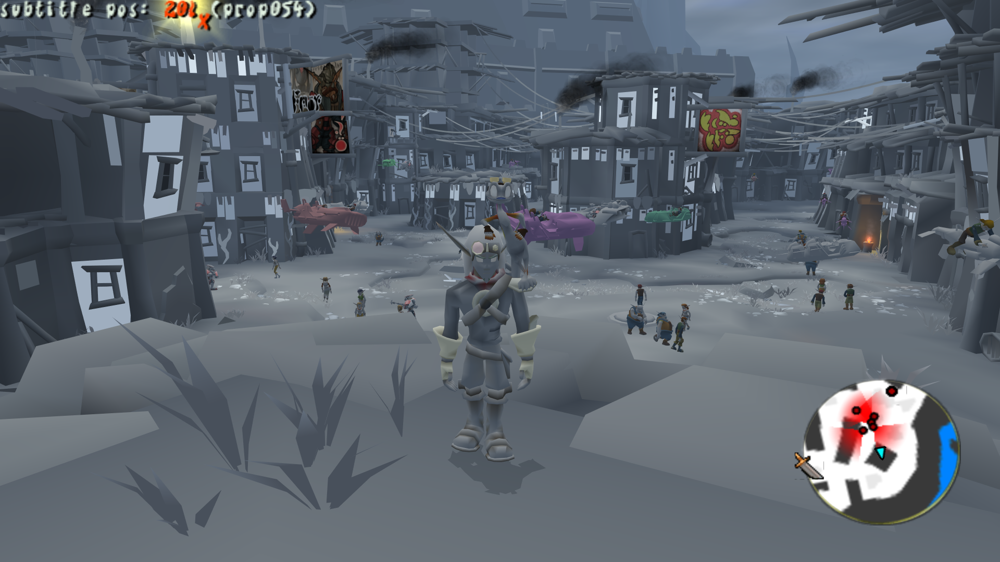
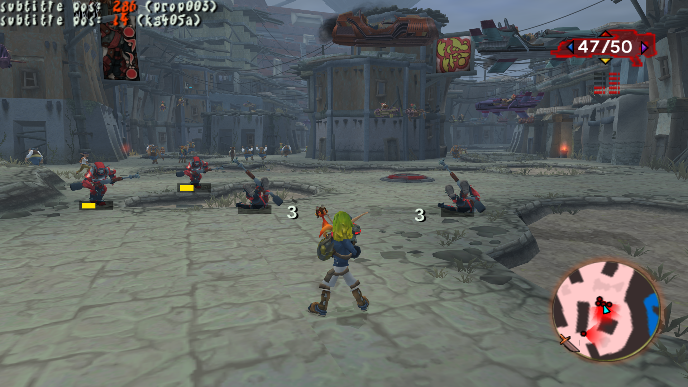
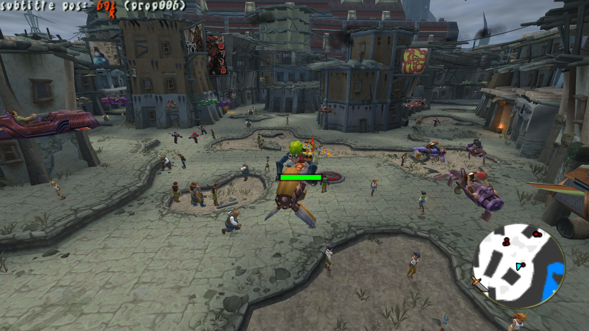
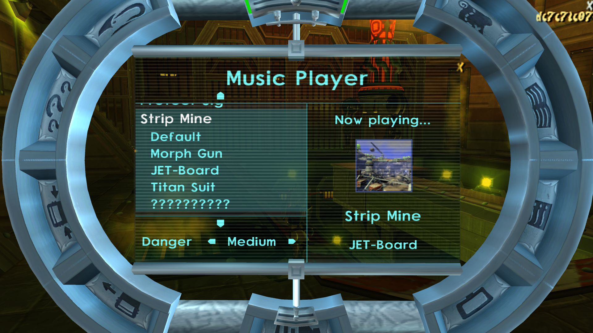
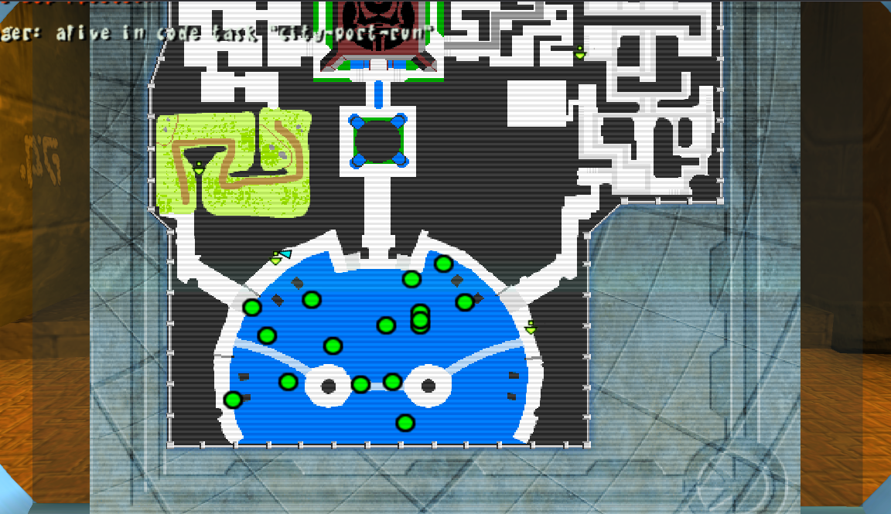
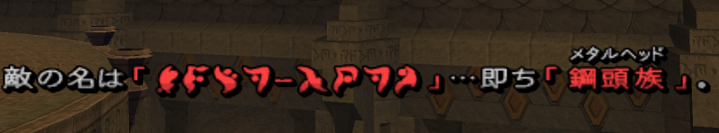
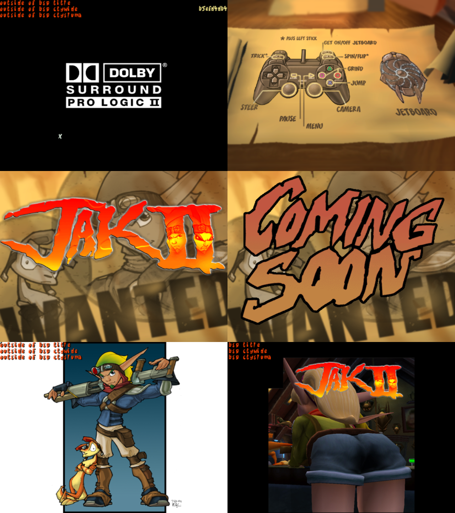
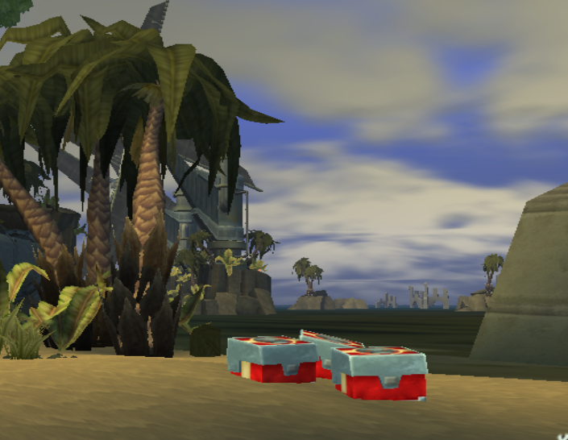

<head>
  <meta name="twitter:card" content="summary_large_image" />
</head>

Custom level support has gotten some love and Jak 2 got lots of small graphical improvements/fixes.

<!--truncate-->

## Release Info

This month's OpenGOAL Tooling (jak-project repo) release is `0.1.40`.

  

    <LauncherDownloadLink />
  

## Known Issues

- If you are not using 100% display scaling, your game may:
  - Boot with the wrong resolution in fullscreen mode
  - Minimize itself when in fullscreen mode
  - See https://github.com/open-goal/jak-project/issues/2930

## General Changes

### Fix Keyboard Binds Being Immediately Assigned While Rebinding <PRLink href="https://github.com/open-goal/jak-project/pull/2895"/>

## Jak 1

### Add Support for Polish Alphabet Characters <PRLink href="https://github.com/open-goal/jak-project/pull/2931"/>

Support for the Polish character set was added, allowing people to start work on translating the game to Polish.

### Fix Custom Level Crash with Multiple Ambients <PRLink href="https://github.com/open-goal/jak-project/pull/2891"/>

Having more than one ambient present in a custom level would cause a crash on load due to a bug in the level builder.

### Fix "vis" Load Boundaries in Custom Levels <PRLink href="https://github.com/open-goal/jak-project/pull/2896"/>

The game expects levels to have a lowercase nickname to make things like vis boundaries work.

### Fix Custom Level Crash During Level Unload <PRLink href="https://github.com/open-goal/jak-project/pull/2898"/>

Fixes a crash that would occur when loading and unloading custom levels and normal levels.

### Fix Wrong File Paths for GOAL Data Files <PRLink href="https://github.com/open-goal/jak-project/pull/2932"/>

After we started to work on Jak 2, we split up our file paths so we have `jak1` and `jak2` folders. However, some of the debug code which reads compiled object files at runtime was never changed to accomodate this until now.

The result was that whenever the game tried to link a data file like an art group (which contains information about a particular model) from there, it would fail because it couldn't find the file. This issue mainly manifested in custom levels, where it would cause any actor whose art group failed to load to not show up.

### Add Support for Packing Models and Textures Directly Into Custom Levels <PRLink href="https://github.com/open-goal/jak-project/pull/2936"/>

Another issue that has plagued custom levels for the longest time has been that if you wanted to have any non-common actor in your level, such as the floating platforms seen in Spider Cave, you would need to sacrifice one of the two level slots for a normal level that has the actor you need in order for it to be rendered properly (otherwise, it would just either be invisible or, due to the last issue mentioned, not spawn in at all).

Now, you are able to specify which art groups you want to use in your level and the level builder will pack all the models and their textures directly into the level, removing the need to waste one of the level slots.

### Fix Game Territory Being Wrong <PRLink href="https://github.com/open-goal/jak-project/pull/2946"/>

The territory/region the game was compiled in was incorrectly always set to NTSC-U/SCEA (American version). The territory is used to change a few minor behaviors throughout the game, most notable the Sony titles ("Sony Computer Entertainment America" vs. "Sony Computer Entertainment Europe"), the Japanese sound effects and the date format on the save files. This has now been corrected and the correct region will be picked when you compile the game through the launcher now.

## Jak 2

### Fix Palace Airlock Not Opening After Baron Boss Fight <PRLink href="https://github.com/open-goal/jak-project/pull/2863"/>

One of the last few major gameplay bugs remaining, the door back to the city not opening after the first Baron fight has been fixed.

### New Secrets

Like in Jak 1, we're adding new secrets to the game for a little bit of extra fun. Some of the new cheats include:

- Turbo JET-Board (in the city and Haven Forest)
- Real time of day (adjusts the day/night cycle to your system clock)
- No textures
- Music player
- Vehicle invulnerability
- Health bars and damage numbers for enemies and vehicles
- Peaceful city
- Item magnet
- Precursor Orb tracker menu

### Music Player <PRLink href="https://github.com/open-goal/jak-project/pull/2900"/>

Just like in Jak 1, we also added a music player secret to Jak 2.

You can play any track in the game once unlocked, all their variations (gun/board/mech/etc.) and even set the excitement level!

### Fix Translucent Shrubs <PRLink href="https://github.com/open-goal/jak-project/pull/2899"/>

Some shrubs were being drawn as translucent when they shouldn't be.

### Fix Sprite Glow Clipping <PRLink href="https://github.com/open-goal/jak-project/pull/2902"/>

The sprites spawned by the sun were being rendered too far away and not showing up. Now we can be blinded by the sun again, just as Rubin intended.

### Bigmap Support <PRLink href="https://github.com/open-goal/jak-project/pull/2906"/>

The big map in the progress menu finally works properly!

### Fix BLERC on Warp Objects <PRLink href="https://github.com/open-goal/jak-project/pull/2907"/>

Blend shapes were broken on objects using the warp effect, such as the Hip Hog mirror. This caused it to look far more "warped" than it should.

### Fix Sprite Glow Flickering <PRLink href="https://github.com/open-goal/jak-project/pull/2912"/>

Occasionally, glow sprites would flicker and disappear. This annoying error is now fixed.

### Fix Sprite Glow Depth Test Issues <PRLink href="https://github.com/open-goal/jak-project/pull/2923"/>

Fixes cases where glow sprites could be seen through other glow sprites and the opposite behavior where a hidden glow sprite was making glow sprites in front not get drawn.

<ReactPlayer
  controls
  url={require("./video/sprite-glow-depth-test.mp4").default}
  className="blog-video"
/>

### Fix Minimap Arrow and Icon Motion <PRLink href="https://github.com/open-goal/jak-project/pull/2913"/> <PRLink href="https://github.com/open-goal/jak-project/pull/2929"/>

The texture for the player arrow on the minimap is now drawn correctly and does not get squished at widescreen when facing left or right. The icon motion has been smoothed out as well, instead of snapping to the original game's 512x416 framebuffer.

### Japanese Subtitle Support <PRLink href="https://github.com/open-goal/jak-project/pull/2914"/> <PRLink href="https://github.com/open-goal/jak-project/pull/2916"/> <PRLink href="https://github.com/open-goal/jak-project/pull/2917"/>

OpenGOAL now supports Jak 2's fancy Japanese subtitles, the splash screens and the scrap books. These are all static images and not text rendered at run-time.

### Improved Clouds <PRLink href="https://github.com/open-goal/jak-project/pull/2921"/>

The cloud textures now use the correct colors and match the original game!

### Toxic Slime Texture Animations <PRLink href="https://github.com/open-goal/jak-project/pull/2922"/>

The last of the missing texture animations, the toxic slime in the Weapons Factory, has been added.

<ReactPlayer
  controls
  url={require("./video/slime.mp4").default}
  className="blog-video"
/>

### Fix Incorrect Music Playing Sometimes <PRLink href="https://github.com/open-goal/jak-project/pull/2938"/>

A small issue, but fixed nonetheless. This was causing music variations or alternate versions to not play sometimes.

### Fix Bug in Outro Cutscene <PRLink href="https://github.com/open-goal/jak-project/pull/2952"/>

The Port scene in the outro cutscene had a bug that froze the background clock even after the cutscene ended, freezing all water, cloud and skull gem animations until something caused it to go back to normal speed, such as failing a mission or the Dark Bomb.

## Tooling Improvements

### Subtitle Editor Fixes <PRLink href="https://github.com/open-goal/jak-project/pull/2941"/>

The subtitle editor wasn't working correctly for Jak 1. This has been addressed, and a couple new small features were added as a bonus.
