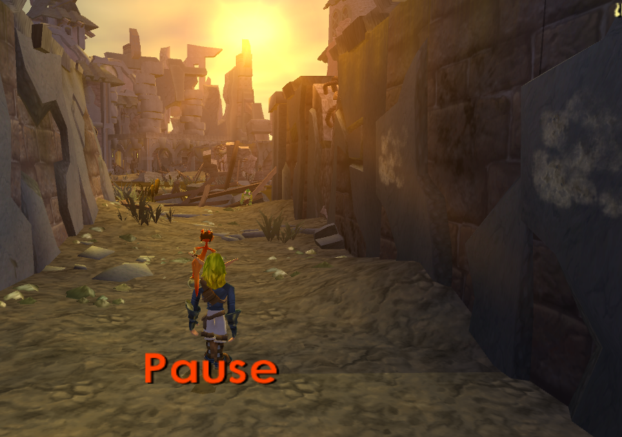
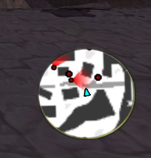

<head>
  <meta name="twitter:card" content="summary_large_image" />
</head>

Custom level support has gotten some love and Jak 2 got lots of small graphical improvements/fixes.

<!--truncate-->

## Release Info

This month's OpenGOAL Tooling (jak-project repo) release is `0.1.40`.

  

    <LauncherDownloadLink/>
  

## General Changes

### Fix Keyboard Binds Being Immediately Assigned While Rebinding <PRLink href="https://github.com/open-goal/jak-project/pull/2895"/>

## Jak 1

### Add Support for Polish Alphabet Characters <PRLink href="https://github.com/open-goal/jak-project/pull/2931"/>

Support for the Polish character set was added, allowing people to start work on translating the game to Polish.

### Fix Custom Level Crash with Multiple Ambients <PRLink href="https://github.com/open-goal/jak-project/pull/2891"/>

Having more than one ambient present in a custom level would cause a crash on load due to a bug in the level builder.

### Fix "vis" Load Boundaries in Custom Levels <PRLink href="https://github.com/open-goal/jak-project/pull/2896"/>

The game expects levels to have a lowercase nickname to make things like vis boundaries work.

### Fix Custom Level Crash During Level Unload <PRLink href="https://github.com/open-goal/jak-project/pull/2898"/>

Fixes a crash that would occur when loading and unloading custom levels and normal levels.

### Fix Wrong File Paths for GOAL data files <PRLink href="https://github.com/open-goal/jak-project/pull/2932"/>

After we started to work on Jak 2, we split up our file paths so we have `jak1` and `jak2` folders. However, the `out/obj` path, which is where GOAL object files are located, was never changed to accomodate this until now.

The result was that whenever the game tried to link a data file like an art group (which contains information about a particular model), it would fail because it couldn't find the file. This issue mainly manifested in custom levels, where it would cause any actor whose art group failed to load to not show up.

### Add Support for Packing Models and Textures Directly Into Custom Levels <PRLink href="https://github.com/open-goal/jak-project/pull/2936"/>

Another issue that has plagued custom levels for the longest time has been that if you wanted to have any non-common actor in your level, such as the floating platforms seen in Spider Cave, you would need to sacrifice one of the two level slots for a normal level that has the actor you need in order for it to be rendered properly (otherwise, it would just either be invisible or, due to the last issue mentioned, not spawn in).

Now, you are able to specify which art groups you want to use in your level and the level builder will pack all the models and their textures directly into the level, removing the need to waste one of the level slots.

## Jak 2

### Fix Palace Airlock Not Opening After Baron Boss Fight <PRLink href="https://github.com/open-goal/jak-project/pull/2863"/>

One of the last few gameplay bugs remaining, the door back to the city not opening after the first Baron fight has been fixed.

### New Secrets

Like in Jak 1, we're adding new secrets to the game for a little bit of extra fun. Some of the new cheats include:

- Turbo JET-Board (in the city and Haven Forest)
- Real time of day (adjusts the day/night cycle to your system clock)
- No textures
- Music player
- Vehicle invulnerability
- Health bars and damage numbers for enemies and vehicles
- Peaceful city
- Item magnet
- Precursor Orb tracker

<!-- TODO some pictures -->

### Music Player <PRLink href="https://github.com/open-goal/jak-project/pull/2900"/>

Just like in Jak 1, we also added a music player secret to Jak 2.

You can play any track in the game once unlocked, all their variations (gun/board/mech/etc.) and even set the excitement level!

### Fix Translucent Shrubs <PRLink href="https://github.com/open-goal/jak-project/pull/2899"/>

Some shrubs were being drawn as translucent when they shouldn't be.

### Fix Sprite Glow Clipping <PRLink href="https://github.com/open-goal/jak-project/pull/2902"/>

Now we can be blinded by the sun again, just as Rubin intended.

### Bigmap Support and Minimap Texture Filtering <PRLink href="https://github.com/open-goal/jak-project/pull/2906"/>

The big map in the progress menu finally works and the minimap now has texture filtering.

### Fix BLERC on Warp Objects <PRLink href="https://github.com/open-goal/jak-project/pull/2907"/>

Facial animations were broken on objects using the warp effect, such as the Hip Hog mirror.

### Fix Sprite Glow Flickering <PRLink href="https://github.com/open-goal/jak-project/pull/2912"/>

### Fix Minimap Arrow Alpha <PRLink href="https://github.com/open-goal/jak-project/pull/2913"/>

The texture for the player arrow on the minimap is now drawn correctly.

### Japanese Subtitle Support <PRLink href="https://github.com/open-goal/jak-project/pull/2914"/> <PRLink href="https://github.com/open-goal/jak-project/pull/2916"/> <PRLink href="https://github.com/open-goal/jak-project/pull/2917"/>

OpenGOAL now supports Jak 2's very fancy Japanese subtitles.

### Improved Clouds <PRLink href="https://github.com/open-goal/jak-project/pull/2921"/>

### Toxic Slime Texture Animations <PRLink href="https://github.com/open-goal/jak-project/pull/2922"/>

The last of the missing texture animations, the toxic slime in the Weapons Factory, has been added.

<ReactPlayer
  controls
  url={require("./video/slime.mp4").default}
  className="blog-video"
/>

### Fix Sprite Glow Depth Test Issues <PRLink href="https://github.com/open-goal/jak-project/pull/2923"/>

Fixes cases where glow sprites could be seen through other glow sprites.

### Minimap Improvements <PRLink href="https://github.com/open-goal/jak-project/pull/2929"/>

Fixes an issue in widescreen where the player arrow would get squished depending on the facing angle and smoothens the icon motion.

### Fix Incorrect Music Playing Sometimes <PRLink href="https://github.com/open-goal/jak-project/pull/2938"/>

## Tooling Improvements

### Subtitle Editor Fixes <PRLink href="https://github.com/open-goal/jak-project/pull/2941"/>