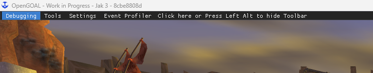
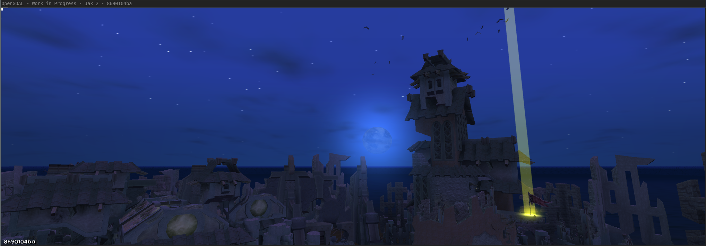
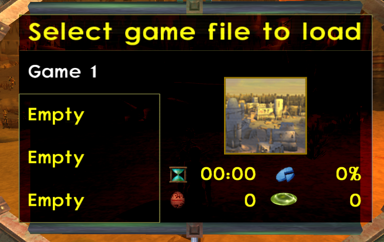

<head>
  <meta name="twitter:card" content="summary_large_image" />
</head>

Despite the holiday season, some work was still accomplished.

<!--truncate-->

## Release Info

This month's OpenGOAL Tooling (jak-project repo) release is `0.2.21`.

  

    <LauncherDownloadLink />
  

## General Changes

### Support Apple Silicon via the Launcher <PRLink href="https://github.com/open-goal/launcher/pull/648"/>

To coincide with the changes in last month's upgrade, the launcher is now natively built for Apple Silicon and the application will actually let you install the tooling and games appropriately.

### Support Caron Diacritics and Czech Alphabet <PRLink href="https://github.com/open-goal/jak-project/pull/3815"/> <PRLink href="https://github.com/open-goal/jak-project/pull/3816"/>

Caron diacritics have been added to the games font, as well as some additional diacritics to fully support the Czech alphabet. A reminder once again that if you would like to translate the games into a language but your font is not fully supported, please still reach out. As long as the alphabet only requires some simple modifications with the game's existing glyphs (such as adding diacritics to the latin alphabet) it's relatively simple to accomodate.

### Avoid Duplicate Model Replacement Processing <PRLink href="https://github.com/open-goal/jak-project/pull/3789"/>

Store a small database of which models have already been swapped out in a level to prevent duplicate processing.

Also a small fix for cases where using a model replacement that has no armature would cause merc nightmares due to only having a `max_bones` of 3.

### Support Hiding ImGUI with a mouse click <PRLink href="https://github.com/open-goal/jak-project/pull/3791"/>

Yet another way to hide the topbar.

### Support Drawing Custom Models for Foreground HUD Elements <PRLink href="https://github.com/open-goal/jak-project/pull/3793"/>

Add a version of `draw-bones-hud` that uses merc to support drawing foreground HUD elements that use custom models.

### Fix Animations Involving a full 180 degree Rotation <PRLink href="https://github.com/open-goal/jak-project/pull/3794"/>

Fixes the issue with animations doing a full 180 degree rotation and disappearing. The quaternions in the GLB export "flip", and when interpolating animation frames in between a flip, we got bogus quaternions.

Also fix a crash in `goalc` when using merc models without any materials.

### Convert Inverse-Multiplication into Division in Decompiled Output <PRLink href="https://github.com/open-goal/jak-project/pull/3795"/>

More readable output

### Improved Color Palette Generation for Custom Levels <PRLink href="https://github.com/open-goal/jak-project/pull/3797"/>

A few improvements to color palette selection. These were made by tracing some particularly bad colors through and seeing where it made obviously bad decisions for splitting. I tested on crystal cave, and a test GLBs from Kuitar that previously had issues with alpha.

- The previous approach to splitting was based on trying to keep a tree of deduplicated colors balanced (same count in each leaf). This is not really a good idea for generating color palettes. A better approach is to try to minimize the volume of the child node, limiting how inaccurate a color can be. Splitting is now chosen based on the average of the _deduplicated channel values_, which in practice seems to work pretty well for Kuitar's levels. Other approaches could work here too.
- The previous approach of alternating through dimensions to split on was kept.
- The depth of the KD tree during the initial split was increased, allowing it to use up to 8192 colors, instead of just 1024.
- In most cases, not all child nodes of the tree have colors in them, meaning that a tree of depth 13 would have less than 8192 colors. If this happens, child nodes are split until the color count reaches 8192. The selection of which nodes to split is somewhat arbitrary, but is breadth-first. The axis for splitting is the one with the largest range. (which might be a better idea in general?)

On crystal-cave, the worst case color error was reduced from 221 to 9.

### Option to copy mod/eye draws from Original Model <PRLink href="https://github.com/open-goal/jak-project/pull/3800"/>

Two new flags were added to the Blender plugin to allow reusing the mod and/or eye draws of the original model that is being replaced. Works pretty well for eyes, but the blerc draws can cause some Z-fighting with the non-moving parts of the model.

### Fix Animation Compression for Custom Actors <PRLink href="https://github.com/open-goal/jak-project/pull/3802"/>

Fix a missing scale factor when using the large mode in the animation compressor. This would make some joints have a translation of near 0 if the original animation had stuff moving a large distance

### Improve Camera Math <PRLink href="https://github.com/open-goal/jak-project/pull/3825"/>

I finally went through and worked out the math for the camera matrix, and improved how it works for PC rendering. I was able to finally avoid the double perspective divide issue, which I always thought would cause accuracy issues.

This will help tfrag, tie (no envmap), shrub, and hfrag have less z-fighting in cases where the camera and the thing you're looking at are pretty close, but the entire level is far from the origin - like jak 3 temple. I was able to modify the camera matrix so we don't have to do all the weird scaling/addition in the shader.

Here's a screenshot from the temple oracle checkpoint, cropped from 4k. This used to have a lot of fighting issues.

It doesn't help issues where the thing you're looking at is very far away (jak 1 mountains, some jak 2 city stuff). It also doesn't help with jak's skirt/scarf, since those use a different renderer.

There's definitely more to do here, but this is a good starting point and proof that I can at least figure out the math.

### Increase Print Buffer and Check Size <PRLink href="https://github.com/open-goal/jak-project/pull/3826"/>

This should fix the crash when entering the freedom HQ elevator. It was caused by a large number of prints, one for each process in the city being killed by `check-for-rougue-process`, which would overflow the print buffer. So I increased the print buffer.

Detecting buffer overflow here is hard because lots of things are allowed to write to it, including the user's GOAL print methods. I added a basic check that will assert when there's 1k or less space in the buffer. It won't catch every overflow, but it would have caught this one.

## Jak 2 and Jak 3

### Unstretch Sun and Moon <PRLink href="https://github.com/open-goal/jak-project/pull/3822"/>

Fix the issue where the moon gets wide when using PC aspect ratios

## Jak 3

### Fix Cloth Disappearing after 600 Orbs <PRLink href="https://github.com/open-goal/jak-project/pull/3790"/>

After collecting 600 orbs, cloth systems that didn't have any `alt-tex-name`s defined would vanish because the `static-cloth-params` macro doesn't default them to `#f`.

### Fix Missing Shadows on Light Jak Wings <PRLink href="https://github.com/open-goal/jak-project/pull/3803"/>

### Adjust Overlord SPU DMA to Avoid Audio Hangs <PRLink href="https://github.com/open-goal/jak-project/pull/3804"/>

Change jak 3 SPU DMA to run the interrupt handler "immediately" (or at least before `DMA_SendToSPUAndSync` returns).

This fixes an issue where audio can hang during fast cutscene playback. I'm hoping it fixes more issues with looping/stuck audio as well, but this needs more testing.

I originally wanted to do it this way, but thought that it didn't work - from Jak 2 it seemed like things broke if the DMA was too fast. But, at least for Jak 3, everything seems to work like this. This will remove a huge source of non-deterministic timing in audio stuff and hopefully make things easier to debug. It also means that a large portion of streaming audio code will never have to run - from the game's point of view there's always the next SPU buffer available.

### Fix issue where VAG Streams Never Queue <PRLink href="https://github.com/open-goal/jak-project/pull/3805"/>

Accidentally incrementing `s` twice in the loop, so queued streams in slot 1, and 3 were skipped by the overlord.
This would usually cause the audio to never start playing because the game would wait for the audio to successfully get queued.

### Workaround Language Setting Issue <PRLink href="https://github.com/open-goal/jak-project/pull/3818"/>

In Jak 3, the default PC settings file would have a language of 255 because it runs before the first settings update. This would cause the game to crash the second time it is started.

### Update texture remap table <PRLink href="https://github.com/open-goal/jak-project/pull/3821"/>

Jak 2 and 3 use this annoying trick where they store multiple images in the same texture by just changing the CLUT. This breaks some PC code because those two textures will have the same TBP address. so there's a table of remaps to fix this, generated by the decompiler. Unfortunately, I generated that table before the decompiler loaded the .STR file with these textures, so it was missing the remaps. This is automatically generated in the texture folder when you run the decompiler - I just copied it to the C++ file.

### Fix Cloth NaNs <PRLink href="https://github.com/open-goal/jak-project/pull/3827"/>

Kind of silly fix.

The cloth update function sometimes runs before the "setup" is done (`need-setup` is set), which divides by zero in a bunch of places. This fix prevents NaNs from spreading during this time.
