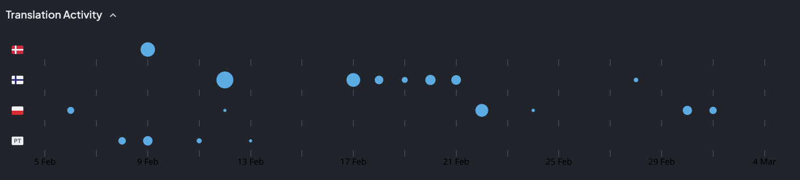
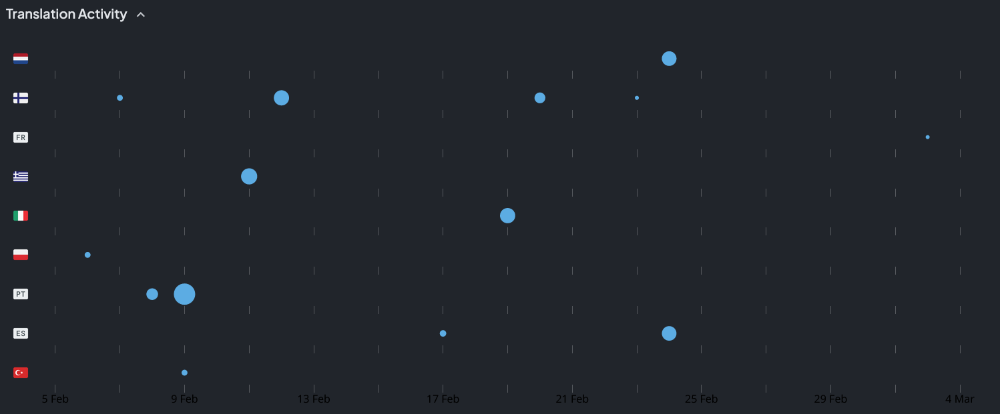
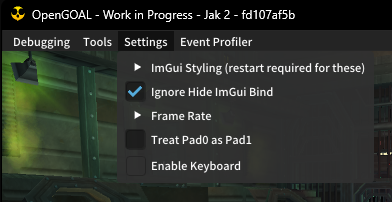

<head>
  <meta name="twitter:card" content="summary_large_image" />
</head>

Jak 3 decompilation progress is in full swing, as well as a few notable additions to the other games.

<!--truncate-->

## Release Info

This month's OpenGOAL Tooling (jak-project repo) release is `0.2.8`.

  

    <LauncherDownloadLink />
  

## Translation Contributions

### Games

### Launcher

## Important Changes

### Black Screen when Launching the Game

This has been a very highly reported issue since the release of Jak 2, with many duplicate issues and Discord threads https://github.com/open-goal/jak-project/issues/3279

We seem to have narrowed this down to a problem not in our code, but in third-party software that causes similar issues in a whole host of other games and applications. The culprit appears to be `Nahimic` which is an audio thing pushed by various manufacturers (ASUS, Steelseries, etc).

:::important
If you have this issue, please try and follow the steps described here and see if that resolves the issue https://github.com/open-goal/jak-project/issues/3279#issuecomment-1975011557.

If it does resolve the issue, let us know in the Discord so we can wrap this one up as "not our fault" and add relevant documentation to the installation guides.
:::

### Keyboard Controls are Disabled by Default now <PRLink href="https://github.com/open-goal/jak-project/pull/3295"/>

Keyboard controls are now disabled by default in order to resolve unexpected behaviour caused by Steam Input that several users have ran into from time to time.

:::tip
It is important to note that if no controllers are detected, the keyboard controls will be temporarily enabled.
:::

So why was this done?

Steam Input is something that tries to, among several things, improve controller support for games. One of the ways it accomplishes this is by mapping controller inputs to keyboard inputs, so when you press a button on your controller it simultaneously hits a respective key on your keyboard.

Users were complaining that when they pressed for example `X` on their controller, the game would pause, or in other words it would simultaneously hit `Start`. The "solution" for a while was to suggest closing Steam which is obviously less than ideal. You can probably already guess what the problem is from the above, `X` is bound to `Enter` on the keyboard via Steam Input and the game is simultaneously processing both inputs.

The game's input system has been explicitly designed to take in input from multiple sources simultaneously so TLDR -- you can't just temporarily ignore one source (and how would you know which is the right thing to ignore as well!). The straight-forward and consistent solution is to disable the keyboard by default as it is not the way most people play the games.

There is also a new way to enable or disable the keyboard setting via the "topbar" incase you have no way to navigate to the in-game pause menu to enable it for the first time. However in most situations this should not be required, as mentioned above, if no controllers are detected the keyboard inputs are automatically enabled for you.

## General Changes

### Accurate autosplitting on orb counts during screen blackouts <PRLink href="https://github.com/open-goal/jak-project/pull/3297"/>

When the screen would blackout, orb counts would temporarily be `0` which would cause false-positive autosplitter splits, should be fixed.

### Better mouse support <PRLink href="https://github.com/open-goal/jak-project/pull/3383"/>

Mouse settings are now properly wired up in Jak 2, additionally some bugs with the mouse support have been addressed. Most notably before it was not properly detecting when you stopped moving the mouse since it is entirely based on relative motion, now the game will detect when the mouse has stopped moving and reset the sticks to a neutral state.

### C++ 20 <PRLink href="https://github.com/open-goal/jak-project/pull/3193"/>

C++ 20 is the latest version of C++ that has widespread compiler support, so it's nice to have that updated. More standard library features to take advantage to cleanup some of our code.

### Cleanup Joint Decompression <PRLink href="https://github.com/open-goal/jak-project/pull/3369"/>

The joint code has been cleaned up and documented, this may help us or someone else support importing and exporting animations!

This is also an optimization, the new joint decompression code is faster.

### Fix Sprite-Distort Related Crash <PRLink href="https://github.com/open-goal/jak-project/pull/3357"/>

There is a potential crash when a level was loaded due to the `sprite-distort` tables not being initialized yet. This would result in a race, and the backend rendering code would sometimes crash. This is a long-standing bug that was "recently" (read months ago) made more likely once the sprite limit was raised -- the larger the table, the more likely it would hit an invalid uninitialized index.

This finally fixes that by ensuring the tables are initialized and we no longer have random startup crashes!

If you ever have a crash going forward with the log `weird sprite_distort startup crash happened again!` scream and let us know!

## Jak 2

### Custom speedrun categories <PRLink href="https://github.com/open-goal/jak-project/pull/3378"/>

It is possible to create a JSON file with custom category settings, for example starting with certain cheats enabled, or with a game task pre-completed.

These custom categories can be made via the speedrunner menu and they live in (on windows for example) `AppData/OpenGOAL/jak2/features/speedrun-categories.json`.

:::tip
See the PR for the example file used in the demonstration video below, editing the file manually is required for removing, renaming and changing the starting continue point if it doesn't start from Fortress Escape
:::

<ReactPlayer
  controls
  url={require("./vid/speedrun-categories.mp4").default}
  className="blog-video"
/>

### High-fps input buffer and cloud speed <PRLink href="https://github.com/open-goal/jak-project/pull/3178"/>

The input buffer has been given a larger size depending on your framerate. Often times the frame buffer for inputs would be too small in practice on higher framerates, leading to inputs being dropped. For example the time between pressing `X` after jumping to double jump.

Additionally, the clouds should move at a more correct pace now.

## Jak 3

### Decompilation Update <PRLink href="https://github.com/open-goal/jak-project/pull/3377"/> <PRLink href="https://github.com/open-goal/jak-project/pull/3374"/> <PRLink href="https://github.com/open-goal/jak-project/pull/3373"/> <PRLink href="https://github.com/open-goal/jak-project/pull/3371"/> <PRLink href="https://github.com/open-goal/jak-project/pull/3370"/> <PRLink href="https://github.com/open-goal/jak-project/pull/3365"/> <PRLink href="https://github.com/open-goal/jak-project/pull/3364"/> <PRLink href="https://github.com/open-goal/jak-project/pull/3363"/> <PRLink href="https://github.com/open-goal/jak-project/pull/3359"/> <PRLink href="https://github.com/open-goal/jak-project/pull/3362"/> <PRLink href="https://github.com/open-goal/jak-project/pull/3352"/> <PRLink href="https://github.com/open-goal/jak-project/pull/3356"/>

Many files have been decompiled in Jak 3 so far, many of which are simple ones or ones that were mostly unchanged from Jak 2.

One new feature that had to be detected and handled was inherited non-virtual states.

The ability to persist process stack-size overrides via a json file has already been added. This is nice because previously we would manually change these values in the files meaning we could accidentally revert that adjustment. When the stack size is too small, the game crashes, so this is one less thing to have to worry about causing a regression.
