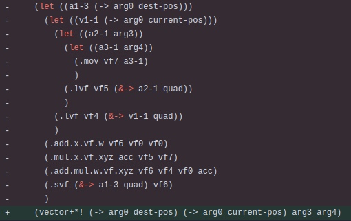

<head>
  <meta name="twitter:card" content="summary_large_image" />
</head>

A big translation update, and a couple Jak 3 fixes.

<!--truncate-->

## Release Info

This month's OpenGOAL Tooling (jak-project repo) release is `0.2.24`.

  

    <LauncherDownloadLink />
  

## General Changes

## Linux Built on Ubuntu 22.04 Now <PRLink href="https://github.com/open-goal/jak-project/pull/3860"/>

Ubuntu 20.04 is end-of-life, this means that our minimum glibc and what-not has been updated, the launcher will soon follow suit.

## Translations <PRLink href="https://github.com/open-goal/jak-project/pull/3590"/> <PRLink href="https://github.com/open-goal/jak-project/pull/3872"/>

All translations have been updated and added to the menus of the games.  The Italian translations are one that got a major bump, and the changes _may_ not have made it into this month's release due a mistake on my part, they should sort themselves out by next month however.

The game's translations havn't been updated since October so, apologies for that.

## Jak 3

### Envmap Fixes <PRLink href="https://github.com/open-goal/jak-project/pull/3862"/>

This fixes some env-map related issues in the subrail sections.  It still may not be perfect but it's looking better.

Before:

<ReactPlayer
  controls
  url={require("./video/envmap_before.mp4").default}
  className="blog-video"
/>

After:

<ReactPlayer
  controls
  url={require("./video/envmap_after.mp4").default}
  className="blog-video"
/>

### Fix Subrail crash <PRLink href="https://github.com/open-goal/jak-project/pull/3863"/>

Small crash fixed in the subrail section introduced by the vector decompilation cleanup.

## Tooling Improvements

### Better vector function decompilation output <PRLink href="https://github.com/open-goal/jak-project/pull/3861"/>

Vector operation related outputs is now a lot less verbose!

