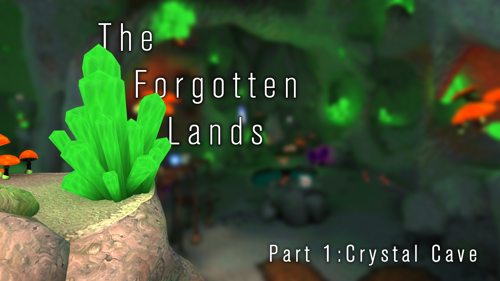

<head>
  <meta name="twitter:card" content="summary_large_image" />
</head>

The first progress report to kick off the year and perhaps surprisingly, a big one!  Lots of missions are partially working and large portions of the remaining complicated systems in Jak 2 are on their way to completion.  We even have some new features in Jak 1 to share!

<!--truncate-->

## Project Level News

This month's release is:
- `0.1.32` OpenGOAL Tooling (jak-project repo)
- distributed via the `1.8.0` Launcher release

<div className="row markdownMarginBottom">
  <div className="col col--6">
    <LauncherDownloadLink />
  </div>
</div>

## Community Spotlight

I figured these monthly reports would be a great place to highlight some of the stuff people are making with OpenGOAL.

### Crystal Cave by *Kuitar*



Probably the biggest thing that happened this month was the alpha release of Kuitar's custom level, **Crystal Cave**. Despite custom level tooling currently being hit-or-miss, it is amazing what Kuitar has been able to achieve in spite of it.  Having such a high-fidelity example hopefully inspires others to follow suit and continues to help motivate development for better tooling.  You can check it out via the [Unofficial Mod Launcher](https://opengoal-unofficial-mods.github.io/)

:::info
Additionally, Kuitar put together a fairly comprehensive guide for making a custom level.  [Which you can find here](/docs/developing/custom_levels/intro)
:::
### Precursor Orb Hunt by *barg034*

Another mod that came out this month was barg's **Precursor Orb Hunt**.  It moves around all collectables, not just the orbs!  It's a pretty challenging mod, asking the player to know a lot of the movement techniques Jak is capable of.  If that sounds interesting, you can also check it out via the [Unofficial Mod Launcher](https://opengoal-unofficial-mods.github.io/) and be aware of [baby mode](https://github.com/dallmeyer/opengoal-orbhunt/blob/main/README.md#opengoal---the-precursor-orb-hunt).

## Jak 1 and General Fixes

### Sound Bugs <PRLink href="https://github.com/open-goal/jak-project/pull/2083"/> <PRLink href="https://github.com/open-goal/jak-project/pull/2107"/>

The last release broke some sound related stuff. The gist of the situation is that Jak 1 and Jak 2's underlying audio code is not isolated from each other and as work is being done to improve things for Jak 2, this can potentially cause regressions for Jak 1.

### Better Sound in Mirror Mode <PRLink href="https://github.com/open-goal/jak-project/pull/2094"/>

In addition to audio bugs being fixed, some improvements were made for flipping the sound when mirror mode is enabled.

### Jungle Mirrors Respect First-person Camera Settings <PRLink href="https://github.com/open-goal/jak-project/pull/2112"/>

The mirrors in jungle were not respecting the first person camera settings, this change fixes that issue so they should behave as you would expect.

### Mouse Control issue <PRLink href="https://github.com/open-goal/jak-project/pull/2109"/>

There was an issue where your mouse position would always be `0,0`. Yet another thing that was introduced a while ago and is now fixed.

### `border-mode` Debug Menu Option <PRLink href="https://github.com/open-goal/jak-project/pull/2132"/>

This menu option was missed during the fix from last month. Hopefully this is the end of issues like this!

### EMERC Renderer <PRLink href="https://github.com/open-goal/jak-project/pull/2147"/> <PRLink href="https://github.com/open-goal/jak-project/pull/2161"/>

This improves environment mapping (shiny surfaces) in both Jak 1, and Jak 2.  In Jak 1, things always fell back to a rather unoptimized renderer called `generic`.  In Jak 2 they improved this with `emerc` so this is an example of something that can be backported and used in the earlier game.

For Jak 1 this means much better performance in applicable areas.  Jak 1 will still fall back to `generic` for blend shapes / eyes / etc, atleast for now.

<ImageCompare left={require("./img/emerc-before.png").default} right={require("./img/emerc-after.png").default}/>

> The white bar is `generic` which is completely eliminated with EMERC

:::info
If you think you've found a graphical issue, please reach out to us if so!

Issues we are already currently aware of:
- Red eco rings on the final boss
:::

### Screenshotting Side-effects <PRLink href="https://github.com/open-goal/jak-project/pull/2160"/>

There were some issues associated with taking screenshots.
1. They included overlays and such which isn't the most convenient behavior
2. But worse, after taking the screenshot, the `sprite-distort` renderer would stop working properly.  This was especially obvious around the warp gates.

### Checkpoint and Speedrunner Menu <PRLink href="https://github.com/open-goal/jak-project/pull/2162"/>

This is a great example of a speedrunning driven improvement also improving the game for normal players.  In addition to full game runs, speedrunners also like doing individual levels.  In Jak 1, these are especially annoying to do because there is no built-in level select like there is in Jak 2 or Jak 3.

This change essentially adds a level select menu, that is tailored towards these individual level runs.  It automatically progresses the game as required, for example getting certain powercells or marking certain cutscenes as completed.  This also finally adds a quick way to reset your run via the same menu.

:::tip
You bring up this menu by pressing L1 + R1 + X + Start while speedrunner mode is enabled.
:::

<ReactPlayer controls url={require("./video/il-select.mp4").default} className="blog-video"/>

In addition, a new `Checkpoint Select` menu was added to the `Secrets` menu once you finish the game.  Allowing you to quickly warp anywhere, from anywhere.

<ReactPlayer controls url={require("./video/checkpoint-select.mp4").default} className="blog-video"/>

In the future, expect a `Level Select` menu for normal users to be added that would allow you to replay an area without having to mess around with a bunch of save files or the built-in debug menu.  This should be fairly simple to add since it will be very similar to the individual level menu, just with some differences on what should be pre-unlocked.

## Jak 2

We've decompiled **a lot** of files, at this point it's easier to just look at our progress from a high level perspective of what works and what went into making it work.

### Basic Enemy Navigation (nav-mesh) <PRLink href="https://github.com/open-goal/jak-project/pull/2077"/>

Normal ground enemies use a `nav-mesh` to know where to go and how to get there.  This is very complicated code, which only got more complicated in Jak 2, but as you can imagine it prevents a lot of things from working properly.  Well this month we finally finished it up:

<ReactPlayer controls url={require("./video/nav-mesh.mp4").default} className="blog-video"/>

> Jak 2's nav-mesh debugging isn't as cool as Jak 1's by default.  But you can atleast see the 2-D mesh that the enemies adhere to.

In Jak 1, this would have basically meant that all enemy movement was sorted out.  But this is Jak 2, so of course it isn't that easy.  In Jak 2 there are all kinds of other `nav` like systems.  For example, the flying enemies, the vehicle traffic, etc.  However these systems are either smaller in scope, or built ontop of the basic system we've finished here.

:::info
If you are _really_ interested in how this works, besides reading the OpenGOAL code, their basic nav-mesh design is described in **Game Programming Gems 3**
:::

### Collectables <PRLink href="https://github.com/open-goal/jak-project/pull/2082"/>

A fairly critical piece of Jak's gameplay.  For Jak 2 this also includes things like health-packs, skull-gems, ammo, etc.

### HUD <PRLink href="https://github.com/open-goal/jak-project/pull/2084"/> <PRLink href="https://github.com/open-goal/jak-project/pull/2088"/>

The HUD is now mostly working.  Just like in Jak 1 the HUD code is one of the few places that has some very strange edge-cases we have to deal with and work around involving the layout of the associated types.

<ReactPlayer controls url={require("./video/hud.mp4").default} className="blog-video"/>

### Particle Fixes <PRLink href="https://github.com/open-goal/jak-project/pull/2088"/>

Unfortunately, the issue causing the insanely fast spawning of bullet shells has been fixed :(

<ReactPlayer controls url={require("./video/shells.mp4").default} className="blog-video"/>

### Streaming Audio Work <PRLink href="https://github.com/open-goal/jak-project/pull/2096"/>

One of the last major missing pieces regarding audio is the streaming audio.  This includes some sound-effects but more importantly all of the dialogue.  It's still not done yet, but progress is being made!

### Jetboard Training <PRLink href="https://github.com/open-goal/jak-project/pull/2090"/>

The jetboard training mission is one of the first missions we got mostly working from beginning to end.

Additionally, a small feature was added to truly complete that skateboarding video game experience.  I suppose this would be one of the first mods for Jak 2 as well!

<ReactPlayer controls url={require("./video/jetboard.mp4").default} className="blog-video"/>

### Catch Scouts <PRLink href="https://github.com/open-goal/jak-project/pull/2090"/> <PRLink href="https://github.com/open-goal/jak-project/pull/2106"/>

With the jetboard training mission working, the next logical mission to try to get working was `Catch Scouts`. For the most part, this is yet another mission we have working end to end.

<ReactPlayer controls url={require("./video/scouts.mp4").default} className="blog-video"/>

### The Titansuit <PRLink href="https://github.com/open-goal/jak-project/pull/2091"/> <PRLink href="https://github.com/open-goal/jak-project/pull/2099"/> <PRLink href="https://github.com/open-goal/jak-project/pull/2114"/> <PRLink href="https://github.com/open-goal/jak-project/pull/2152"/>

The core code for the titansuit / mechsuit was decompiled, and is pretty much working in it's associated missions.

<ReactPlayer controls url={"https://www.youtube.com/watch?v=8tJlI_88NjQ"} className="blog-video"/>

<ReactPlayer controls url={"https://www.youtube.com/watch?v=Hj9aefxAUtU"} className="blog-video"/>

### Discord RPC <PRLink href="https://github.com/open-goal/jak-project/pull/2100"/>

Initial Discord RPC support was added to Jak 2.  For now we havn't done all the screenshots for the various times of day for all levels, mostly because the levels aren't done yet.

Our plan is to add the game name to the RPC string, for example `Playing OpenGOAL` will become `Playing OpenGOAL - Jak 1`, this is for a few reasons:
1. It doesn't add too much extra clutter
2. Discord limits the amount of images you can have _per game_ so by making a separate application for each game, we have a fresh image limit to work with.
   1. Jak 2 has a lot more levels, and if Jak 3 is ever done there is no way we would be able to stay within the limit without sacrificing variety.
3. It gives us back a string that we can use for more interesting things.
   1. Instead of the `Playing the Precursor Legacy...` text, we can make it say something more useful like `Doing a Speedrun`, or in Jak 2 you could imagine it saying what mission you are currently on `Catching Scouts...`

### Crimson Guards and Dig <PRLink href="https://github.com/open-goal/jak-project/pull/2092"/> <PRLink href="https://github.com/open-goal/jak-project/pull/2119"/>

Normal on-foot crimson guards are working, along with a bunch of missions that they are a part of.

<ReactPlayer controls url={require("./video/guards.mp4").default} className="blog-video"/>

This also includes the dig mission

<ReactPlayer controls url={require("./video/dig.mp4").default} className="blog-video"/>

And fortress related missions (notice the broken hovering crimson guards)

<ReactPlayer controls url={require("./video/fordump.mp4").default} className="blog-video"/>

<ReactPlayer controls url={require("./video/fortress-friends.mp4").default} className="blog-video"/>

### Minimap <PRLink href="https://github.com/open-goal/jak-project/pull/2118"/>

The minimap code has been decompiled.  There isn't much to show other than the empty ring for now, as actually rendering the minimap requires some other stuff to be finished.  Maybe next month :)

### Sewer Turrets and Jetboard Mission <PRLink href="https://github.com/open-goal/jak-project/pull/2108"/>

More mostly completable missions!

<ReactPlayer controls url={require("./video/sewer-enemy.mp4").default} className="blog-video"/>

<ReactPlayer controls url={require("./video/sewer-board.mp4").default} className="blog-video"/>

### Mountain Temple is sort of Working <PRLink href="https://github.com/open-goal/jak-project/pull/2110"/>

There is still a good amount of mountain temple that doesn't work or look properly yet.  But there is a good amount that does!

<ReactPlayer controls url={"https://www.youtube.com/watch?v=EkdPVqQXwqE"} className="blog-video"/>

Essentially all the shiny precursor metal surfaces don't render properly and there are minor issues around the various animations that play throughout the level.  Critical parts of the mission like the block puzzle and falling boulder sections have some bugs as well.

### Strip mine missions <PRLink href="https://github.com/open-goal/jak-project/pull/2111"/>

These missions were decompiled for a week or so without being able to be tested.  This was related to an issue in the level extraction itself, which when fixed allowed this level to be played as well as the drill platform.

<ReactPlayer controls url={require("./video/strip-rescue.mp4").default} className="blog-video"/>

<ReactPlayer controls url={"https://www.youtube.com/watch?v=8C5Z3aNOnjA"} className="blog-video"/>

<ReactPlayer controls url={require("./video/strip-eggs.mp4").default} className="blog-video"/>

### A bunch of AI related code <PRLink href="https://github.com/open-goal/jak-project/pull/2127"/>

Jak 2 has a bunch of dedicated systems for controlling other characters. For example in sewer escort or when escorting Sig at the pumping station, there is a lot of code to make them react appropriately and follow the pre-determined mission path.  This has been decompiled and will hopefully be put to the test soon.

### Mars Tomb <PRLink href="https://github.com/open-goal/jak-project/pull/2114"/>

While not yet totally complete, some of mars tomb is now functional:

<ReactPlayer controls url={"https://www.youtube.com/watch?v=0FpVqH6Kcx0"} className="blog-video"/>

<ReactPlayer controls url={"https://www.youtube.com/watch?v=pN1jqBeHO14"} className="blog-video"/>

### Ruins Tower <PRLink href="https://github.com/open-goal/jak-project/pull/2114"/>

Getting this mission to work end-to-end highlighted a lot of missing pieces.  It's still not perfect (as with most missions that work right now), but it's fairly well along.  One of the interesting things to note is how detailed some of the original animations and effects were (see the falling platforms), with OpenGOAL we can now see them in their full glory :)

<ReactPlayer controls url={"https://www.youtube.com/watch?v=fm2al5kqoBQ"} className="blog-video"/>

### A bunch of enemies <PRLink href="https://github.com/open-goal/jak-project/pull/2101"/>

A long list of enemies were fully decompiled and added to the code base.  A lot of the previous videos would have been pretty boring without this work being done!

<ReactPlayer controls url={"https://www.youtube.com/watch?v=RnQ38kX-A-8"} className="blog-video"/>

### Pumping Station <PRLink href="https://github.com/open-goal/jak-project/pull/2134"/>

Most of the pumping station related enemies and code was decompiled.  There are still some bugs remaining, mostly related to the Spyders (the metal heads that shoot at you on 4 legs).

### Side Missions <PRLink href="https://github.com/open-goal/jak-project/pull/2143"/>

Almost all side missions scattered around haven city are mostly working.  For example there no speeches or the physical computer kiosk to interact with yet.

### Ocean Renderer <PRLink href="https://github.com/open-goal/jak-project/pull/2142"/>

At first we were just concerned with fixing the issue related to the ocean lacking collision.  But now the ocean is more or less fully rendering with the only minor issue being that the environment mapping currently uses a placeholder texture.

<ReactPlayer controls url={"https://www.youtube.com/watch?v=bPqckATicws"} className="blog-video"/>

### Metal Head Arcade <PRLink href="https://www.youtube.com/watch?v=f6HPWKO0yAc"/>

The metalhead arcade is also working quite well.  The score counter needs some work but other than yet, add another completable mission to the pile!

<ReactPlayer controls url={"https://www.youtube.com/watch?v=f6HPWKO0yAc"} className="blog-video"/>

### Underport <PRLink href="https://github.com/open-goal/jak-project/pull/2163"/>

The underport levels are sort of working.  Similar to the ammo dump mission at fortress, the fullscreen underwater effect doesn't really work yet.  And the Sig escort portion has issues where the centipede cutscenes don't play.

### Palace Roof Fight <PRLink href="https://github.com/open-goal/jak-project/pull/2170"/>

Texture issues aside, the fight on the palace roof with the baron is now totally working end-to-end.

<ReactPlayer controls url={"https://www.youtube.com/watch?v=e3IBm6SwAyI"} className="blog-video"/>

### Destroy Equipment at Port <PRLink href="https://github.com/open-goal/jak-project/pull/2169"/>

The mission where you destroy the blue devices for Krew in the port area is now working. You have to do it on the jetboard because vehicles still aren't working yet but that's about it.

<ReactPlayer controls url={require("./video/portrun.mp4").default} className="blog-video"/>

## Jak 2 - Decompilation Tooling

### Filtering On-Screen Debug Text <PRLink href="https://github.com/open-goal/jak-project/pull/2085"/>

If you've ever used Jak's debug mode, you know things can get a bit...messy.  Now there is a new ImGUI menu to make this much cleaner.  You can filter by the content of the strings as well as by how far away they are from Jak.

<ReactPlayer controls url={require("./video/debug-text.mp4").default} className="blog-video"/>

:::info
This feature should also work in Jak 1.
:::

### Pre-populated list of types to cast to <PRLink href="https://github.com/open-goal/jak-project/pull/2098"/> <PRLink href="https://github.com/open-goal/opengoal-vscode/pull/181"/> <PRLink href="https://github.com/open-goal/opengoal-vscode/pull/184"/>

When using the VSCode extension to type/stack/label cast something, the field will now be pre-populated with all available types.  There is a `__custom` option to enter a free-form string like before as well.

### Better handling of art constants <PRLink href="https://github.com/open-goal/jak-project/pull/2097"/>

This improves both Jak 1 and Jak 2.  Up until now, Jak 2's decompiled code hasn't had the nicely named art references we would like.  Some changes were made to always have the art constants / art group information on hand so the output will be consistent and readable.

### Responsive offline test output <PRLink href="https://github.com/open-goal/jak-project/pull/2105"/>

In a previous progress report, I showed off the nice new offline-test output.  One of the issues with this is if you had more threads than your terminal could display -- it looked terrible.  No more! It now factors in the amount of rows in your terminal and adjusts how many threads it shows.  It will also prefer active threads and hide completed ones.

### REPL QoL Improvements <PRLink href="https://github.com/open-goal/jak-project/pull/2104"/> <PRLink href="https://github.com/open-goal/jak-project/pull/2176"/>

As we are now launching the game a lot to test or debug things, some changes were added to make this workflow better.

Now your `startup[-jak1|-jak2].gc` file can be split into two sections, so when you re-listen to the game, it will run the second section automatically.  This is super useful for spawning yourself at the mission you are trying to test, toggle on debug options, etc.

REPL keybinds can also now be customized via the JSON settings file, and you can list all current keybinds with `(repl-keybinds)`

### More docstrings! <PRLink href="https://github.com/open-goal/jak-project/pull/2139"/>

You can now more easily add docstrings to method implementations of child-types, as well as to the individual state handlers.

### Much cleaner `game.gp` syntax <PRLink href="https://github.com/open-goal/jak-project/pull/2103"/>

At the moment, this is only being used in Jak 2's project file.  But this improvement has turned it's `game.gp` file from a 4,000 to 5,000 line file -- down into a 200 - 300 line file.  Each DGO is added with a single line, referencing the `.gd` file, and that file's contents is used to import all necessary source files, texture pages and art files.

```opengoal
(cgo-file "pri.gd" ("$OUT/obj/los-control.o"))
```

Looking forward, this aligns with the goal of trying to make it easier for mods to be isolated projects that are included with the base game's build.

## Mod Tooling

Not a ton to talk about here yet, but figured I'd call some things out for the people that are working on custom levels / mods.

### Add base_id for custom levels <PRLink href="https://github.com/open-goal/jak-project/pull/2079"/>

Before it was possible for actors to share the same ID as an actor in another level.  This is less than ideal, so there is now a way for the user to specify a `base_id` to avoid or debug this issue.

### Ambient support <PRLink href="https://github.com/open-goal/jak-project/pull/2173"/>

Ambient support has being added for custom levels.  This lets you do things like play hints when Jak enters a given area.

This PR also serves as a fantastic example for how we would currently go about adding support for something.  If you are working on a custom level and are struggling to do something because it isn't supported yet, consider doing the C++ work and submitting a PR so we can improve the experience together.

```json
  "ambients": [
    {
      "trans": [-27.34, 92.7, 22.24, 10.0],
      "bsphere": [-27.34, 92.7, 22.24, 10.0], // required for the game to know when you are in range of the ambient
      "lump": {
        "name": "crystalc-ambient-1", // ambient name
        "type": "'hint",              // ambient type
        "text-id": ["int32", 4297],   // game-text-id to display (if this is >4095, it will display multiple times)
        "play-mode": "'notice"        // not sure if this needed/used with level hints
      }
    }
  ]
```
