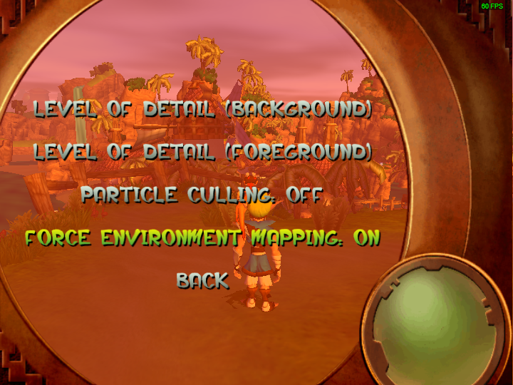

First progress report to kick off the year.  This is going to be a big one!  Lots of missions are partially working and large portions of the remaining complicated systems in Jak 2 are on their way to completion.

<!--truncate-->

## Project Level News

This month's release is:
- `0.1.32` OpenGOAL Tooling (jak-project repo)
- distributed via the `1.8.0` Launcher release

## Community Spotlight

### Crystal Cave by Kuitar

Figured these monthly reports would be a great time to highlight some of the stuff people are making with OpenGOAL.

Probably the biggest thing that happened this month was the alpha release of Kuitar's custom level, Crystal Cave. Despite custom level tooling being hit-or-miss currently, it is amazing what Kuitar has done so far.  Having such a high-fidelity example hopefully inspires others and continues to help motivate people to walk to make better tooling for custom levels!  You can get it via the [Unofficial Mod Launcher](https://opengoal-unofficial-mods.github.io/)

### Precursor Orb Hunt by barg034

Another mod that came out this last month was barg's Precursor Orb Hunt.  Which manipulates and moves around all collectables, not just orbs!  It's pretty challenging, asking the player to know a lot of the movement tech Jak has to offer.  If that sounds interesting you can also get it via the [Unofficial Mod Launcher](https://opengoal-unofficial-mods.github.io/) and be aware of [baby mode](https://github.com/dallmeyer/opengoal-orbhunt/blob/main/README.md#opengoal---the-precursor-orb-hunt).

## Jak 1 and General Fixes

### Sound Bugs Fixed <PRLink href="https://github.com/open-goal/jak-project/pull/2083"/>

Last release broke some sound stuff, as many people noticed. The gist of the situation is that Jak 1 and Jak 2's underlying audio code is not isolated and as things are improved and fixed on the Jak 2 side, this can potentially cause regressions back over on Jak 1.

### Better sound in Mirror Mode <PRLink href="https://github.com/open-goal/jak-project/pull/2094"/>

In addition to some audio bugs being fixed, some improvements were made for flipping the sound when mirror mode is enabled.

### Jungle mirrors respect first-person camera settings <PRLink href="https://github.com/open-goal/jak-project/pull/2112"/>

The mirrors in jungle were not respecting your first person camera settings, this change fixes that issue so they should behave as you would expect.

### Mouse control issue fixed <PRLink href="https://github.com/open-goal/jak-project/pull/2109"/>

There was an issue where your mouse position offsets would always be `0,0`. Yet another thing that was introduced a while ago and is now fixed.

### Fix sound bank allocation <PRLink href="https://github.com/open-goal/jak-project/pull/2107"/>

Some more audio fixes, this has some overlap with Jak 1 as well.

### `border-mode` debug menu option fixed <PRLink href="https://github.com/open-goal/jak-project/pull/2132"/>

This menu option was missed during the fixes from last month. Hopefully this is the end of this issue!

### EMERC Renderer <PRLink href="https://github.com/open-goal/jak-project/pull/2147"/>

This improves environment mapping (shiny textures) in both Jak 1, and Jak 2.  In Jak 1, things always fell back to a rather unoptimized renderer called `generic`.  In Jak 2 they improved this, so this is an example of something that could be backported and used in the earlier game.

For Jak 1 this means much better performance in applicable areas.  Though not in all areas, Jak 1 will still fall back to `generic` for blend shapes / eyes / etc.

<ImageCompare left={require("./img/emerc-before.png").default} right={require("./img/emerc-after.png").default}/>

> The white bar is `generic` which is completely eliminated with EMERC

:::tip
A new menu option has been added to toggle this new renderer on or off.  If you think you see a graphical issue, try toggling the option to confirm that is indeed the culprit, and please reach out to us if so!

Issues we are already currently aware of:
- Red eco rings on the final boss look off
:::

## Jak 2

We've decompiled a lot of files, at this point it's probably easier to just look at things from the high level perspective of what works and what went into making it work.

### Traditional Enemy Navigation (nav-mesh) <PRLink href="https://github.com/open-goal/jak-project/pull/2077"/>

Normal ground enemies use a `nav-mesh` to know where to go and how to get there.  This is very complicated code, but as you can imagine prevents a lot of things from working properly.  Well this month we finally finished it up:

<ReactPlayer controls url={require("./video/nav-mesh.mp4").default} />

> Jak 2's nav-mesh debugging isn't as cool as Jak 1's by default.  But you can atleast see the 2d mesh that the enemies adhere to.

In Jak 1, this would have basically meant that all enemy movement was sorted out.  But this is Jak 2, so of course it isn't that easy.  In Jak 2 there are all kinds of other `nav` like systems.  For example, the flying enemies, the vehicle traffic, etc.  However these enemies are either smaller in scope, or built ontop of the basic system we've finished here.

### Collectables <PRLink href="https://github.com/open-goal/jak-project/pull/2082"/>

A fairly critical piece of Jak's gameplay.  Collectables was decompiled and is now working as well:

### HUD <PRLink href="https://github.com/open-goal/jak-project/pull/2084"/> <PRLink href="https://github.com/open-goal/jak-project/pull/2088"/>

The HUD is now mostly working.  Just like in Jak 1, the HUD code is one of the few places that has some very strange edge-cases we have to deal with or work-around involving the layout of the associated types.

<ReactPlayer controls url={require("./video/hud.mp4").default} />

### Particle Fixes <PRLink href="https://github.com/open-goal/jak-project/pull/2088"/>

Unfortunately, the issue causing the massive spawning of bullet shells is been fixed :(

<ReactPlayer controls url={require("./video/shells.mp4").default} />

### Streaming Audio Work <PRLink href="https://github.com/open-goal/jak-project/pull/2096"/>

One of the last major missing things in Jak 2's audio is streaming audio.  This includes some sound-effects but mostly all of the dialogue.  It's still not done yet but, progress is being made!

### Jetboard Training <PRLink href="https://github.com/open-goal/jak-project/pull/2090"/>

The JetBoard training mission is one of the first missions we have mostly working.  As well as a new little feature was added to truly complete the skateboarding video game experience.

<ReactPlayer controls url={require("./video/jetboard.mp4").default} />

### Scouts Mission <PRLink href="https://github.com/open-goal/jak-project/pull/2090"/> <PRLink href="https://github.com/open-goal/jak-project/pull/2106"/>

With the JetBoard training mission working, the next logical mission to try to get to work is `Catch Scouts`. For the most part, yet another mission we have working now.

<ReactPlayer controls url={require("./video/scouts.mp4").default} />

### The Titansuit <PRLink href="https://github.com/open-goal/jak-project/pull/2091"/> <PRLink href="https://github.com/open-goal/jak-project/pull/2099"/> <PRLink href="https://github.com/open-goal/jak-project/pull/2114"/>

The core code for the titansuit / mech suit was decompiled, and for the most part works in the relevant missions.

<ReactPlayer controls url={"https://www.youtube.com/watch?v=8tJlI_88NjQ"} />

<ReactPlayer controls url={"https://www.youtube.com/watch?v=Hj9aefxAUtU"} />

### Discord RPC <PRLink href="https://github.com/open-goal/jak-project/pull/2100"/>

Initial Discord RPC support was added to Jak 2.  For now we havn't done all the screenshots at the various times of day for all the levels, mostly because the levels aren't done yet.  Our plan is to add the game name to the RPC string, for example `Playing OpenGOAL` will become `Playing OpenGOAL - Jak 1`, this is for a few reasons:
1. it doesn't add too much extra clutter
2. Discord limits the amount of images you can have _per game_ so by making a separate game, we have a fresh image limit, Jak 2 has a lot more levels!
3. it gives us back a string we can use for more interesting things.  Instead of the `Playing the Precursor Legacy...` string, we can make it say something more useful like `Doing a Speedrun`.

### Crimson Guards and Dig <PRLink href="https://github.com/open-goal/jak-project/pull/2092"/> <PRLink href="https://github.com/open-goal/jak-project/pull/2119"/>

Normal, on foot crimson guards are working now along with a bunch of missions that they are a part of.

<ReactPlayer controls url={require("./video/guards.mp4").default} />

This also includes the dig mission

<ReactPlayer controls url={require("./video/dig.mp4").default} />

And fortress related missions (notice the broken hovering crimson guards)

<ReactPlayer controls url={require("./video/fordump.mp4").default} />

<ReactPlayer controls url={require("./video/fortress-friends.mp4").default} />

### Minimap <PRLink href="https://github.com/open-goal/jak-project/pull/2118"/>

The minimap code has been decompiled.  There isn't much to show other than the empty ring for now, as actually rendering the minimap requires some other stuff to be finished.  Maybe next month :)

### Sewer Turrets and JetBoard mission <PRLink href="https://github.com/open-goal/jak-project/pull/2108"/>

More mostly completable missions!

<ReactPlayer controls url={require("./video/sewer-enemy.mp4").default} />

<ReactPlayer controls url={require("./video/sewer-board.mp4").default} />

### Mountain temple sort of working <PRLink href="https://github.com/open-goal/jak-project/pull/2110"/>

There is still a good amount of mountain temple that doesn't work or look properly yet.  But there is a good amount that does!

<ReactPlayer controls url={"https://www.youtube.com/watch?v=EkdPVqQXwqE"} />

### Strip mine missions <PRLink href="https://github.com/open-goal/jak-project/pull/2111"/>

These missions were decompiled for a week or so without being able to be tested.  This was related to an issue in the level extraction itself, which when fixed allowed this level to be played as well as the drill platform.

<ReactPlayer controls url={require("./video/strip-rescue.mp4").default} />

<ReactPlayer controls url={"https://www.youtube.com/watch?v=8C5Z3aNOnjA"} />

<ReactPlayer controls url={require("./video/strip-eggs.mp4").default} />

### A bunch of AI related code <PRLink href="https://github.com/open-goal/jak-project/pull/2127"/>

Jak 2 has a bunch of systems related to controlling other characters, for example in sewer escort or when escorting Sig at the pumping station.  This code has been decompiled and will hopefully be put to the test soon.

### Mars Tomb <PRLink href="https://github.com/open-goal/jak-project/pull/2114"/>

While not yet totally complete, some of mars tomb is now functional:

<ReactPlayer controls url={"https://www.youtube.com/watch?v=0FpVqH6Kcx0"} />

<ReactPlayer controls url={"https://www.youtube.com/watch?v=pN1jqBeHO14"} />

### Ruins Tower <PRLink href="https://github.com/open-goal/jak-project/pull/2114"/>

Getting this mission to totally work highlighted a lot of mission pieces.  It's still not perfect as with most missions that work right now, but it's fairly well along.  One of the interesting things about it is how detailed some of the original animations were (see the falling platforms), with OpenGOAL we can now see them in their full glory :)

<ReactPlayer controls url={"https://www.youtube.com/watch?v=fm2al5kqoBQ"} />

### A bunch of enemies <PRLink href="https://github.com/open-goal/jak-project/pull/2101"/>

A long list of enemies were fully decompiled and added to the code base.  A lot of the previous videos would have been pretty boring without this work!

<ReactPlayer controls url={"https://www.youtube.com/watch?v=RnQ38kX-A-8"} />

### Pumping Station <PRLink href="https://github.com/open-goal/jak-project/pull/2134"/>

Most of the pumping station related enemies and code was decompiled.  There are still some bugs remaining, mostly related to the Spyders (the metal heads that shoot at you on 4 legs).

### Side Missions <PRLink href="https://github.com/open-goal/jak-project/pull/2143"/>

Almost all side missions scattered around haven city are mostly working (no speeches or the physical computer kiosk yet).

### Ocean Renderer <PRLink href="https://github.com/open-goal/jak-project/pull/2142"/>

We fixed the issue recently so you could collide with the ocean, but now you can actually see the ocean too!

<ReactPlayer controls url={"https://www.youtube.com/watch?v=bPqckATicws"} />

### Metal Head Arcade <PRLink href="https://www.youtube.com/watch?v=f6HPWKO0yAc"/>

The metalhead arcade is also mostly functioning.  The score counter needs some work but other than yet, add another completable mission to the pile!

## Jak 2 - Decompilation Tooling

### Filtering On-Screen Debug Text <PRLink href="https://github.com/open-goal/jak-project/pull/2085"/>

If you've ever used Jak's debug mode, you know things can get a bit...messy.  Now there is a new ImGUI menu to make this much cleaner.  You can filter by the content of the strings as well as by how far away they are from Jak.

<ReactPlayer controls url={require("./video/debug-text.mp4").default} />

This feature should also work in Jak 1.

### Pre-populated list of types to cast to <PRLink href="https://github.com/open-goal/jak-project/pull/2098"/> <PRLink href="https://github.com/open-goal/opengoal-vscode/pull/181"/> <PRLink href="https://github.com/open-goal/opengoal-vscode/pull/184"/>

When using the VSCode extension to type/stack/label cast something, the field will now be pre-populated with all available types.  There is a `__custom` option to enter a free-form string like before as well.

### Better handling of art constants <PRLink href="https://github.com/open-goal/jak-project/pull/2097"/>

This improves both Jak 1 and Jak 2.  Up until now, Jak 2's decompiled code hasn't had the nicely named art references we would like.  Some changes were made to always have the art constants / art group information on hand so the output will be consistent and readable.

### Responsive offline test output <PRLink href="https://github.com/open-goal/jak-project/pull/2105"/>

In a previous progress report, I showed off the nice new offline-test output.  One of the issues with this is if you had more threads than your terminal could display -- it looked terrible.  No more! It now factors in the amount of rows in your terminal and adjusts how many threads it shows.  It will also prefer active threads and hide completed ones.

### REPL QoL Improvements <PRLink href="https://github.com/open-goal/jak-project/pull/2104"/>

As we are now launching the game a lot to test or debug things, some changes were added to make this better.

Now your `startup.gc` file can be split into two sections, so when you re-listen to the game, it will run the second section automatically.  This is super useful for spawning yourself at the mission you are trying to test, toggle on debug options, etc.

REPL keybinds can also now be customized via the JSON settings file, and you can list all current keybinds with `(repl-keybinds)`

### More docstrings! <PRLink href="https://github.com/open-goal/jak-project/pull/2139"/>

You can now more easily add docstrings to method implementations of child-types, as well as the individual state handlers.

## Mod Tooling

Not a ton to talk about here yet, but figured I'd call some things out for the people that are working on custom levels / mods.

### Add base_id for custom levels <PRLink href="https://github.com/open-goal/jak-project/pull/2079"/>

Before it was possible for actors to share the same ID as an actor in another level.  This is less than ideal, so there is now a way for the user to specify a `base_id` to avoid or debug this issue.
