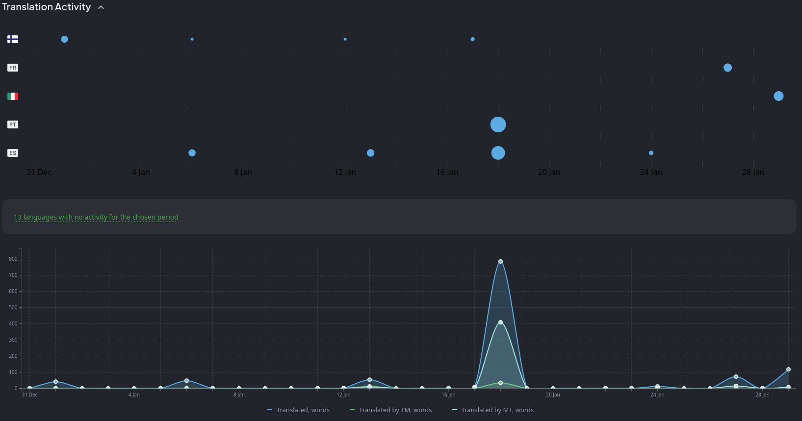
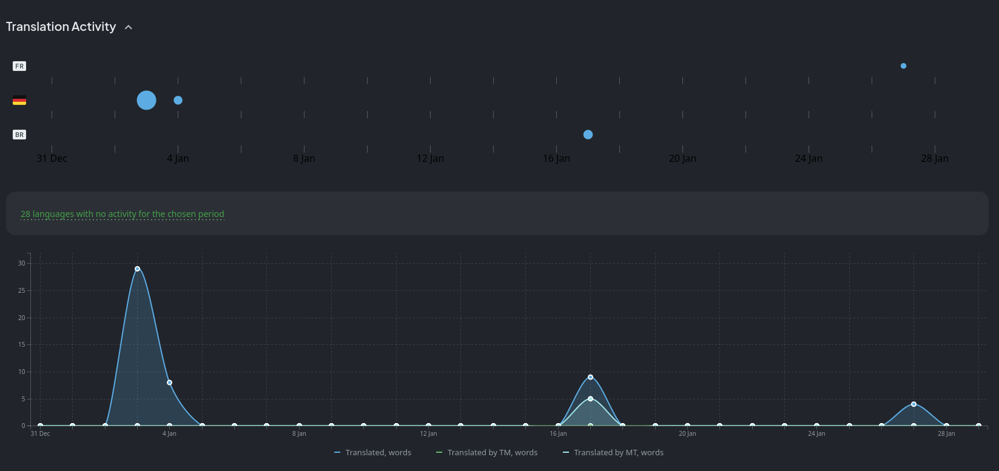
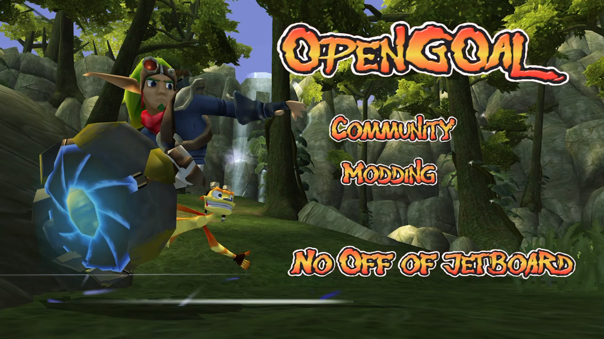
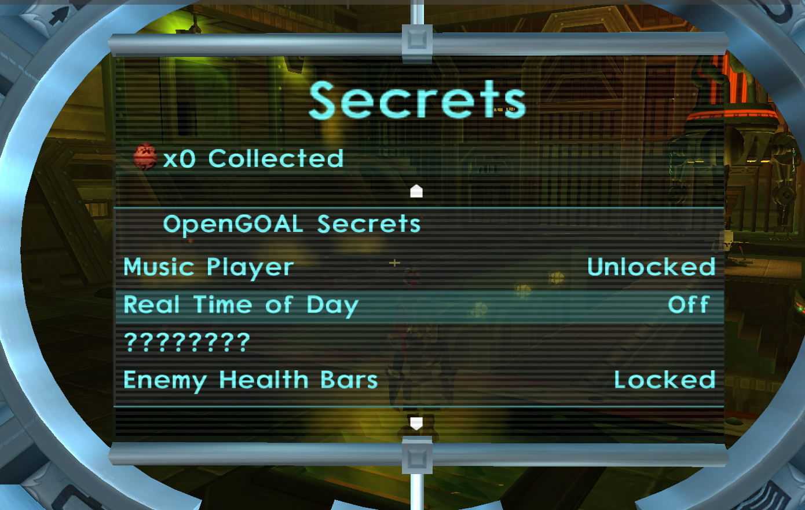
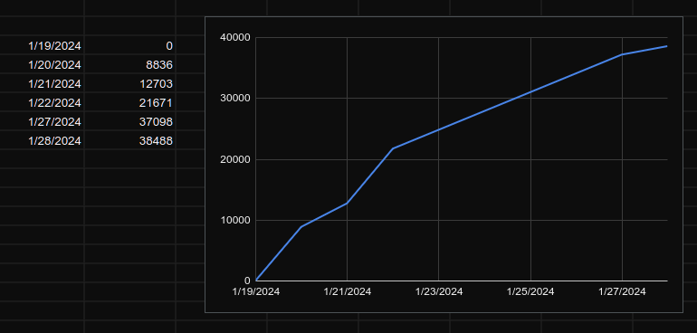

<head>
  <meta name="twitter:card" content="summary_large_image" />
</head>

New year, new game.

<!--truncate-->

## Release Info

This month's OpenGOAL Tooling (jak-project repo) release is `0.2.7`.

  

    <LauncherDownloadLink/>
  

## Translation Contributions

### Games

### Launcher

## Community Spotlight

### Modding Community Event: No OoJ ("No Off of Jetboard")

Are you interested in learning more about the programming language that powers Jak and Daxter or just want to experiment?

The modding community is currently hosting an event where they collaboratively work on a Jak 2 mod that permanently forces Jak to be on the jetboard. The idea is to help more people get into modding. There's a bunch of issues that can be worked on and are assigned difficulties, ranging from very easy to hard. Anybody interested is welcome to join, learn and help out.

[Join the Unofficial OpenGOAL Modding Discord server](https://discord.gg/CMhWwRS2Qe) for more details.

## General Changes

### Fix Remapping Bug with Analog Triggers <PRLink href="https://github.com/open-goal/jak-project/pull/3294"/>

### Fix Custom Screenshots and Move Screenshot Directory <PRLink href="https://github.com/open-goal/jak-project/pull/3339"/>

A bug with taking custom resolution screenshots using the ImGui menu (accessed by pressing `Alt`) was fixed. The `screenshots` directory was also moved. It can now be found under `~/.config/OpenGOAL/game_name/screenshots` on Linux and `AppData\Roaming\OpenGOAL\game_name\screenshots` on Windows.

### Support for Jak 2/3 Collision Extraction <PRLink href="https://github.com/open-goal/jak-project/pull/3292"/> <PRLink href="https://github.com/open-goal/jak-project/pull/3348"/>

Collision for Jak 2/3 levels can now be extracted in `.obj` format and there is now a `rip_collision` flag in the decompiler config for this.

## Custom Levels

### Support `.glb` Files Exported with glTF 2.0/Blender 4.0 <PRLink href="https://github.com/open-goal/jak-project/pull/3268"/> <PRLink href="https://github.com/open-goal/jak-project/pull/3322"/>

Previously, only `.glb` files that were exported using versions of Blender older than 4.0 would be supported for custom levels due to the way the GLB exporter for Blender 4.0 would store vertex colors.

### Enum Support in Lumps <PRLink href="https://github.com/open-goal/jak-project/pull/3305"/>

Some actor properties use numeric values, be it as a bitfield to toggle certain flags or a number to specify e.g. what type of collectable it is.

In the code, we have enums (such as `pickup-type`) for this that map to a specific number to make it easier to identify what the value means. When defining actors in custom levels, you had to use the corresponding numeric value for this, so instead of e.g. `(pickup-type fuel-cell)`, it would be `6`.

This change allows you to use enums inside of the custom level JSON and adds more lump types for special cases that use enums.

### Automatically Sort Actors by ID <PRLink href="https://github.com/open-goal/jak-project/pull/3315"/>

You can manually specify actor IDs when creating actors, but when giving actors IDs out of order, entity lookups would fail because the underlying code does a binary search that expects the entity list to be sorted.

Now, you can specify IDs in whatever order you like and the actor list will automatically be sorted and checked for duplicate IDs before the level is built.

### Many New Lump Types <PRLink href="https://github.com/open-goal/jak-project/pull/3324"/> <PRLink href="https://github.com/open-goal/jak-project/pull/3337"/>

In addition to the `enum-int32`, `enum-uint32`, `water-height`, `eco-info` and `vector3m` lump types that were added with enum support, a good chunk of other new types were added:

- `cell-info`: Like `eco-info`, but automatically fills in the pickup type and amount, so you only need to define the `game-task`.
- `buzzer-info`: Like `eco-info`, but automatically calculates the required `amount` value for the scout fly based on the scout fly ID (starting from 0) and the `game-task` given.
- `symbol`: Allows you to define a list of symbols.
- `type`: Like `symbol`, but defines a list of types instead.
- `string`: Like `symbol` and `type`, but defines a list of strings instead.

Examples for all of these and more can be found in [`test-zone.jsonc`](https://github.com/open-goal/jak-project/blob/master/custom_levels/jak1/test-zone/test-zone.jsonc).

## Jak 2

### Fix Volume Falloff for VAG Streams <PRLink href="https://github.com/open-goal/jak-project/pull/3314"/>

Voice lines that play will now properly have their volume lowered depending on the camera's distance to the sound origin.

### Fix Shadow Bug on Precursor Orbs <PRLink href="https://github.com/open-goal/jak-project/pull/3271"/>

Due to a small bug in the decompiler output, orb shadows were broken.

### New PC Cheats Added to Menu <PRLink href="https://github.com/open-goal/jak-project/pull/3275"/>

The new cheats that were teased back in the [August 2023 report](https://opengoal.dev/blog/progress-report-aug-2023#new-secrets) have now been fully integrated into the game's menu! You can find them at the bottom of the secrets menu. Some of them will just require a specific number of orbs, others will require you to complete certain challenges, just like Ratchet and Clank's skill point system.

### Statistics Tracker <PRLink href="https://github.com/open-goal/jak-project/pull/3288"/>

Another miscellaneous feature that we're adding is a tracker for a bunch of statistics like total kills with all weapons and types of attacks like spins, punches, uppercuts, etc.

There is no menu for it yet, but a lot of the groundwork is in place.

## Jak 3

### Final Prep Work for Decompilation <PRLink href="https://github.com/open-goal/jak-project/pull/3300"/> <PRLink href="https://github.com/open-goal/jak-project/pull/3098"/> <PRLink href="https://github.com/open-goal/jak-project/pull/3310"/> <PRLink href="https://github.com/open-goal/jak-project/pull/3311"/> <PRLink href="https://github.com/open-goal/jak-project/pull/3308"/> <PRLink href="https://github.com/open-goal/jak-project/pull/3316"/>

Earlier this month, we started cleaning up the last remaining loose ends preventing us from fully getting started on decompiling Jak 3, most crucial of which was the decompilation of the C kernel, required for setting up the game's runtime and bootstrapping the GOAL kernel in order to build and load GOAL code.

### Jak 3 Decompilation Has Officially Started <PRLink href="https://github.com/open-goal/jak-project/pull/3319"/> <PRLink href="https://github.com/open-goal/jak-project/pull/3321"/> <PRLink href="https://github.com/open-goal/jak-project/pull/3326"/> <PRLink href="https://github.com/open-goal/jak-project/pull/3332"/> <PRLink href="https://github.com/open-goal/jak-project/pull/3328"/> <PRLink href="https://github.com/open-goal/jak-project/pull/3330"/> <PRLink href="https://github.com/open-goal/jak-project/pull/3331"/> <PRLink href="https://github.com/open-goal/jak-project/pull/3333"/> <PRLink href="https://github.com/open-goal/jak-project/pull/3334"/> <PRLink href="https://github.com/open-goal/jak-project/pull/3335"/> <PRLink href="https://github.com/open-goal/jak-project/pull/3338"/> <PRLink href="https://github.com/open-goal/jak-project/pull/3340"/> <PRLink href="https://github.com/open-goal/jak-project/pull/3344"/> <PRLink href="https://github.com/open-goal/jak-project/pull/3345"/> <PRLink href="https://github.com/open-goal/jak-project/pull/3346"/> <PRLink href="https://github.com/open-goal/jak-project/pull/3347"/> <PRLink href="https://github.com/open-goal/jak-project/pull/3349"/>

With all the loose ends tied up, we wasted no time getting back into decomp:

(As a comparison, reaching 20k lines of code in Jak 1 took about 167 days and Jak 2 took a few weeks.)

Jak 3 has just about 1000 files we need to go through, compared to Jak 2's 811 files. In less than 10 days, we already finished over 100 of the early engine files. This, however, doesn't mean the rest of the files will be done as quickly because the majority of these files were extremely similar, if not identical to Jak 2 thus far. Once we're done with the engine files (which is ~440 files), most of the mission and gameplay code will be completely new.

It will be a while before the game can actually "boot", as we still need to go through a bunch more files to get the main game loop up and running. Once we get there, though, there is some hope that we will be able to reimplement the main foreground and background renderers much more quickly than we did for Jak 2, as a lot of the code appears to be basically unchanged, with the exception of one new renderer added in Jak 3 (`hfrag`) used to draw the desert dunes.

The website has not yet been set up to track Jak 3 decompilation progress, but we should hopefully have that in place soon so you can follow along.
