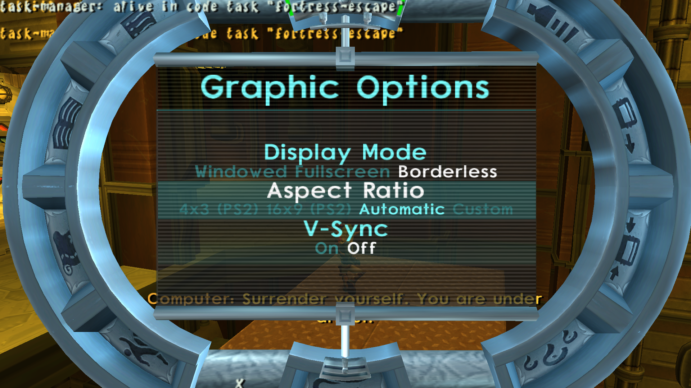

<head>
  <meta name="twitter:card" content="summary_large_image" />
</head>

Intel macOS support and texture pack management has landed as well as a ton of progress on texture animations in Jak 2.

<!--truncate-->

## Release Info

This month's OpenGOAL Tooling (jak-project repo) release is `0.1.39`

  

    <LauncherDownloadLink />
  

:::danger
NOTE - You must be on the latest version of the launcher (`2.0.10` or above) to be able to successfully launch version `0.1.35` or above.
:::

## Known Issues

- Speedrunner mode is no longer skipping the intro cutscene when starting a new game
  - https://github.com/open-goal/jak-project/issues/2871

## General Changes

### Intel macOS Support <PRLink href="https://github.com/open-goal/jak-project/pull/2780"/> <PRLink href="https://github.com/open-goal/jak-project/pull/2798"/> <PRLink href="https://github.com/open-goal/jak-project/pull/2811"/> <PRLink href="https://github.com/open-goal/jak-project/pull/2817"/>

Huge shoutout to [fabjan](https://github.com/fabjan) who contributed a handful of changes to make OpenGOAL run on Intel macOS. The key things that had to change were:

- Updating the C++ project and assembly code to work in this environment
- Changing the OpenGL shader code to support OpenGL 4.1

:::danger
This does not extend to native Apple Silicon (and therefore ARM64) support
:::

There may be some issues as this is the first macOS release, but you _should_ be able to install the game via the launcher just like any other supported platform. The [installation instructions](/docs/usage/installation/) have been updated, however there isn't a whole lot to say -- the launcher installs like any other common MacOS application. Download the `.dmg` and drag-and-drop it into your `Applications` folder.

### Texture Pack Support in the Launcher <PRLink href="https://github.com/open-goal/launcher/pull/271"/>

The launcher can now be used to manage texture packs. You can even add multiple packs at the same time.

:::caution
As with most initial implementations, you should expect some potential bugs or rough edges. However the most likely bug you will run into is the texture pack being in an unsupported format. Texture pack authors will have to update their packs accordingly.
:::

- Information for end-users can be found [here](/docs/usage/texture_replacement)
- Information for texture pack authors can be found [here](/docs/developing/texture_packs)

### Translation Updates

- Finnish is now 100% translated
- Danish is around 80%
- Many languages in the Launcher have seen progress as well

### Improve Keyboard and Mouse Code <PRLink href="https://github.com/open-goal/jak-project/pull/2807"/>

The initial SDL keyboard and mouse code had some issues, for example, inputs remaining stuck for a variety of potential causes. These problems should hopefully be addressed.

### Fix Vibration for Small Buzz Motor <PRLink href="https://github.com/open-goal/jak-project/pull/2846"/>

Vibration on the "small" motor was only using 1/255th of the force that it should, making it practically unnoticable.

## Jak 1

### Missing Facial Animations in Title Screen <PRLink href="https://github.com/open-goal/jak-project/pull/2801"/>

There was a missing edge-case after floating-point BLERC was added where Jak and Daxter lacked facial animations during the opening logos.

### NaN bug in Ice Sliding Animation <PRLink href="https://github.com/open-goal/jak-project/pull/2851"/>

There was a bug in Jak's ice sliding animation, causing it to get stuck on a specific frame. When getting damaged in this state, the game would try to play an eye animation for Daxter and crash due to reading bogus memory.

### Fix Potential Crash When Loading Files <PRLink href="https://github.com/open-goal/jak-project/pull/2850"/>

Sometimes when a level started to load it would pick the wrong filename and crash immediately.

### Actor Culling Option No Longer Flipped <PRLink href="https://github.com/open-goal/jak-project/pull/2852"/>

The text for the "Actor Culling" option in the menu was inverted, which lead to confusing behavior.

## Jak 2

### Decompiler Improvements <PRLink href="https://github.com/open-goal/jak-project/pull/2796"/> <PRLink href="https://github.com/open-goal/jak-project/pull/2808"/> <PRLink href="https://github.com/open-goal/jak-project/pull/2810"/> <PRLink href="https://github.com/open-goal/jak-project/pull/2828"/>

- Fixed empty boxed arrays of strings breaking some decomp (`ctywide-speech` and `race-info`).
- Added a `decomp-as` tag to decompiler types so that the static data decompiler can use macros like `meters` and `seconds` on fields that aren't of type `meters` or `time-frame`.
- Added an `override` tag to decompiler types which overrides the type of field with that name.
- Fixed enum detection breaking in rare cases.
- Fixed in-place op detection for some operations.
- Improved `send-event` decompilation.

### Fix missing eyes and animations <PRLink href="https://github.com/open-goal/jak-project/pull/2799"/>

Some cutscenes had missing eyes or animations, particularly `fortress-save-friends-res`.

### Adjust Jak 2's File Tree <PRLink href="https://github.com/open-goal/jak-project/pull/2806"/>

The original file structure was made more than a year ago without a ton of context around each file. As a result, some things ended up in the wrong spot or had confusing names.

### Race and Defend Stadium Regressions <PRLink href="https://github.com/open-goal/jak-project/pull/2816"/> <PRLink href="https://github.com/open-goal/jak-project/pull/2848"/>

There were some regressions from a previous cleanup causing the races and the Defend Stadium mission to crash. Somehow it's always these missions.

### Fix Original Game Stadium Crash <PRLink href="https://github.com/open-goal/jak-project/pull/2843"/>

In the original game, if you selected a specific stadium race, went into the Stadium, ran back immediately to the Stadium computer and loaded a different race that does not change the layout (e.g. selecting the reverse variation, or simply looping over the menu back to the same race), the game would crash upon entering the Stadium or dying in the vicinity.

This happened because the particular race data levels (stored separately from the Stadium layout levels) might own a type that is only defined in the Stadium layout levels if the race data gets loaded first. If that race data level were to be unloaded then, such as when scrolling through the Stadium computer menu, that type becomes undefined and unusable until a new Stadium layout level is loaded again, which is easy not to do.

This has been fixed by making sure the layout level is always loaded first.

### Fix Mouse Positioning <PRLink href="https://github.com/open-goal/jak-project/pull/2818"/>

Better mouse cursor positioning when the game is letterboxed.

### Prepare Jak 2 Translation Files for Crowdin <PRLink href="https://github.com/open-goal/jak-project/pull/2802"/>

The subtitle files for Jak 2 have been adjusted to support Crowdin in the future. As soon as they are fully transcribed in English, they will be made available for translation there.

### Bump Minimap Icon Limit to 256 from 64 <PRLink href="https://github.com/open-goal/jak-project/pull/2826"/>

Some missions add a lot more icons to the minimap than the original game permitted, so raising the limit fixes that.

### Fix Font Shadow Offset <PRLink href="https://github.com/open-goal/jak-project/pull/2822"/>

Same hack as in Jak 1, the font shadow is no longer affected by the aspect ratio of the game.

### Fix Overlord Related Crash <PRLink href="https://github.com/open-goal/jak-project/pull/2834"/>

A rare crash when loading certain levels have been fixed.

### Fix Shrub Alpha Blending <PRLink href="https://github.com/open-goal/jak-project/pull/2853"/>

Transparency on shrub decals have been fixed.

### Fix City Billboards <PRLink href="https://github.com/open-goal/jak-project/pull/2853"/>

The billboards all over the city now render properly.

### Texture Animations <PRLink href="https://github.com/open-goal/jak-project/pull/2819"/> <PRLink href="https://github.com/open-goal/jak-project/pull/2829"/> <PRLink href="https://github.com/open-goal/jak-project/pull/2831"/> <PRLink href="https://github.com/open-goal/jak-project/pull/2835"/> <PRLink href="https://github.com/open-goal/jak-project/pull/2842"/> <PRLink href="https://github.com/open-goal/jak-project/pull/2847"/>

A bunch of work has occurred this month around getting texture animations working and being more efficient. There is still some work left to do, but quite a lot is already working, such as skull gems and security gates.

<ReactPlayer
  controls
  url={"https://www.youtube.com/watch?v=Cgs3o4apXTE"}
  className="blog-video"
/>

### Support Textures in Progress Menu <PRLink href="https://github.com/open-goal/jak-project/pull/2838"/>

The textures used as part of the progress menu are now properly loaded and rendered.

### Widescreen Fixes for Progress Menu and Proof of Concept Custom Menu <PRLink href="https://github.com/open-goal/jak-project/pull/2843"/> <PRLink href="https://github.com/open-goal/jak-project/pull/2849"/>

A bunch of fixes have been added to make the UI elements fit within the progress menu view in widescreen.

And, as a proof of concept, there is now a new graphics options menu for PC-specific settings.

### Missing Yakow Texture Workaround <PRLink href="https://github.com/open-goal/jak-project/pull/2849"/>

One of the textures for the Yakow is missing in the original game and would show up completely black. In OpenGOAL, it happened to use a minimap texture as a "placeholder".

The missing texture has been replaced with a similar enough fur texture that doesn't look too out of place.

## Tooling Improvements

### Per-game REPL history <PRLink href="https://github.com/open-goal/jak-project/pull/2805"/>

By default, the REPL will now save it's history separately depending on the game (jak1 or jak2).
