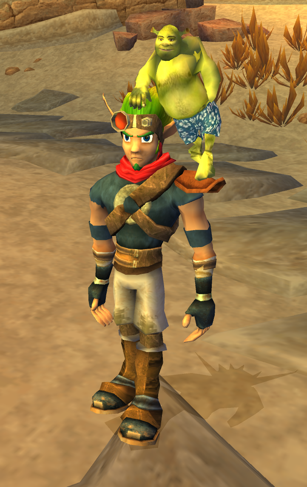
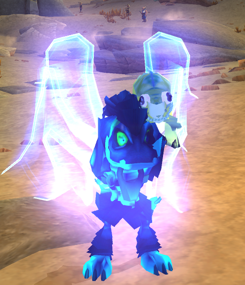
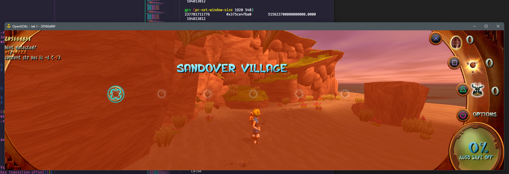
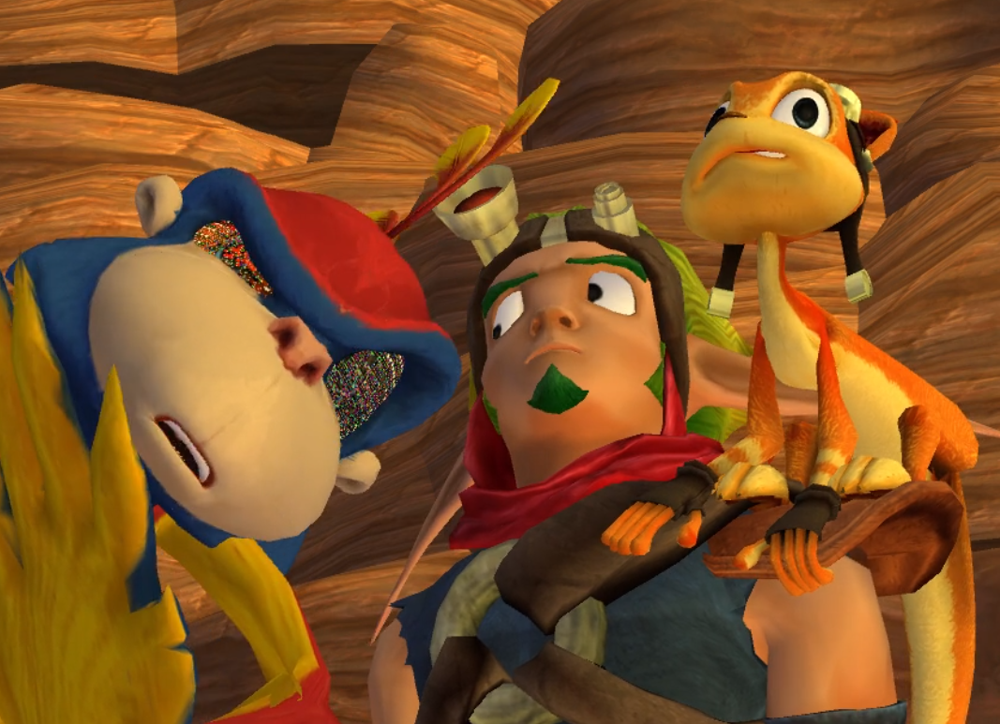

<head>
  <meta name="twitter:card" content="summary_large_image" />
</head>

Jak 3 finally gets music and cutscene support and plenty of bugfixes.

<!--truncate-->

## Release Info

This month's OpenGOAL Tooling (jak-project repo) release is `0.2.15`.

  

    <LauncherDownloadLink />
  

## General Changes

### Support For Model Replacements <PRLink href="https://github.com/open-goal/jak-project/pull/3597"/>

It is now possible to replace any in-game foreground/character model with a model of your choosing. This works for all three games.

The process is similar to texture replacements. The game will check `custom_assets/<GAME>/merc_replacements` for any models to replace. The file name has to match a merc model name, such as `eichar-lod0` for Jak's model in Jak 1 (so you'd have a path like `custom_assets/jak1/merc_replacements/eichar-lod0.glb`). Unlike texture replacements, the model files just go in the root `merc_replacements` folder without any subfolders (this will probably change in the future to allow you to replace models on a per level basis).

Once you have your replacements set up, the decompiler/extractor, just like with texture replacements, has to be run again in order to apply the changes.

:::warning
Things to keep in mind:

- The replacement has to be a GLTF model (file extension `.glb`). Blender 4.0 is recommended for this. Blender 4.2 should also work, but you may have to change it to use byte color or the vertex coloring can look messed up. Blender 4.1 will **NOT** work due to a quirk in the GLTF exporter.
- This change is purely visual and quite rudimentary, it does not actually replace the model's skeleton/bones. It will try to match the replacement models' bone weights to the original skeleton, so don't expect the replacement to look very good unless it matches the original skeleton well.
:::

<ReactPlayer controls url={require("./video/babak-and-frong.mp4").default} />

## Jak 1

### Fix Progress Menu Exit Sound Not Respecting SFX Volume <PRLink href="https://github.com/open-goal/jak-project/pull/3574"/>

A longstanding vanilla bug, the sound that plays when exiting the progress menu would not respect the SFX volume setting and always play at max volume even when muted.

### Increased Input Buffer at Higher Frame Rates <PRLink href="https://github.com/open-goal/jak-project/pull/3578"/>

This feature was already present in Jak 2 and has now been ported to Jak 1 and 3.

By default, at 60 FPS, the game has an input buffer that stores the last 3 frames of input and uses that when checking for button presses. At higher frame rates, this buffer would remain the same, leading to more easily mistimed inputs.

The buffer has been increased to 15 frames and, depending on the frame rate setting, will check a certain amount of frames of input.

### Fix Sprite Positioning on Non-Standard Aspect Ratios <PRLink href="https://github.com/open-goal/jak-project/pull/3596"/>

On non-standard aspect ratios, HUD sprites would quickly become misaligned. A lot of these issues have been mitigated with a mix of a bunch of manual adjustments for the most common aspect ratios, approximations for anything in-between and hiding offending elements in certain cases.

## Jak 3

### Prim Renderer <PRLink href="https://github.com/open-goal/jak-project/pull/3607"/> <PRLink href="https://github.com/open-goal/jak-project/pull/3609"/>

The prim renderer has now been implemented. It's used for a variety of effects, most notably:

- Cloth physics simulation, e.g. Jak's skirt and scarf.
- "New" lightning effects (in addition to the [old lightning renderer](https://www.youtube.com/watch?v=-Sawjr8fJQ0) from Jak 2), e.g. Arc Wielder, Dark Jak projectile attack.
- "Light trails", e.g. Beam Reflexor, Plasmite RPG trail, Dune Hopper grenade trail, vehicle tire tracks, etc.

<ReactPlayer controls url={require("./video/cloth.mp4").default} />

TODO small compilation video here

### Plenty of Bug Fixes <PRLink href="https://github.com/open-goal/jak-project/pull/3581"/> <PRLink href="https://github.com/open-goal/jak-project/pull/3584"/> <PRLink href="https://github.com/open-goal/jak-project/pull/3593"/> <PRLink href="https://github.com/open-goal/jak-project/pull/3603"/> <PRLink href="https://github.com/open-goal/jak-project/pull/3606"/>

A good number of bugs have been fixed:

- In the Arena and Marauder Stronghold missions, some Marauders would spawn out of bounds.
- When catching a second leaper in the Leaper Corral mission and watching the cutscene, Jak and the Sand Shark would be moved to an invalid position, instantly failing the mission by drowning.
- The hovering KG robots' hand cannons were missing, making them unable to shoot Jak.
- Rings would not spawn for side missions.
- A crash during final boss.
- A lot of cutscene models would be aggressively culled, making them invisible. The cause for this was a wrong skeleton setup, leading to the game use the wrong joint when doing culling checks.
- Sometimes, models would skip updating their textures, which caused Skull Gems to occasionally not have their animated texture in certain spots.
- After getting cloth physics working, NPCs that use them would fail to spawn because their process heap was not big enough.
- During cutscenes, eye textures would not be assigned properly to models, leading to some very goofy results.

<ReactPlayer controls url={require("./video/eye.mp4").default} />

### Implement Missing Texture Animations <PRLink href="https://github.com/open-goal/jak-project/pull/3577"/> <PRLink href="https://github.com/open-goal/jak-project/pull/3586"/> <PRLink href="https://github.com/open-goal/jak-project/pull/3587"/> <PRLink href="https://github.com/open-goal/jak-project/pull/3586"/> <PRLink href="https://github.com/open-goal/jak-project/pull/3611"/>

Initial texture animation support was added a while back, and now most of the missing texture animations have been added as well. [A couple of issues still remain](https://github.com/open-goal/jak-project/issues/3582), but the majority of the effects work.

TODO compilation video here

### Overlord 2 <PRLink href="https://github.com/open-goal/jak-project/pull/3567"/>

The biggest missing puzzle piece, Overlord 2, has been decompiled and implemented.

This means we now finally have music, cutscene and voice line playback! While this means that there's now a number of new bugs to fix, it goes a long way towards making the game feel more complete.
