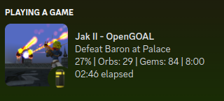
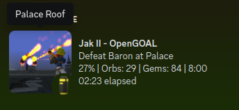
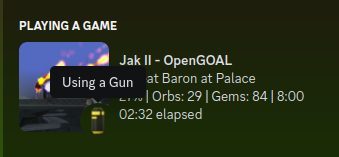
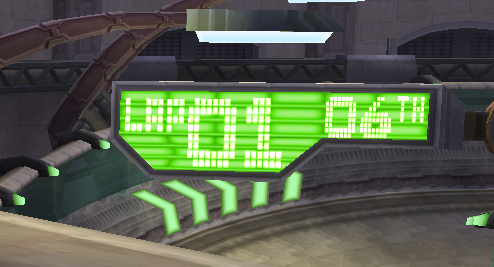

<head>
  <meta name="twitter:card" content="summary_large_image" />
</head>

TODO

<!--truncate-->

## Release Info

This month's OpenGOAL Tooling (jak-project repo) release is `0.1.37`

  

    <LauncherDownloadLink />
  

:::danger
NOTE - You must be on the latest version of the launcher (`2.0.10` or above) to be able to successfully launch version `0.1.35` or above.
:::

## General Changes

### Remove IOP Left-Over <PRLink href="https://github.com/open-goal/jak-project/pull/2681"/>

Some code was accidentally left in last release that caused the IOP thread to run way more often than it should. This may fix performance issues if you are running on lower tier hardware.

### Replacing GLFW with SDL <PRLink href="https://github.com/open-goal/jak-project/pull/2397"/> <PRLink href="https://github.com/open-goal/jak-project/pull/2691"/> <PRLink href="https://github.com/open-goal/jak-project/pull/2694"/> <PRLink href="https://github.com/open-goal/jak-project/pull/2697"/> <PRLink href="https://github.com/open-goal/jak-project/pull/2730"/>

This is a huge change to all of the code that handles the game's graphics output and input handling (controllers, keyboards, mice).

SDL was choosen because it has better native support for DualShock / DualSense controllers, so this should hopefully put an end to all of the workarounds people have been employing to get their controllers to work for a long time (ie. running Steam alongside the game).

Additionally, it's a huge cleanup to all of the related code which should make it easier to add more features and fix issues as they are found.

From a user's perspective, essentially nothing should have changed in terms of functionality.  There are a bunch of new features, including being able to re-map your bindings via the pause menu.

:::tip
Existing controller keybindings will not automatically be converted, you will need to reset them up yourself via the new menus
:::

:::info
Note, if you are on linux and you get an error like: `SDL Error: gl_make_display failed - Could not create display window - Cause: SDL not configured with OpenGL/GLX support` in the game's log files. It means you probably don't have `mesa` installed in your environment properly.

Instructions for how to do so is going to differ from distro to distro, so seek out information on how to do that.
:::

You can find updated documentation on all the new settings [here](/docs/usage/settings/#input-options)

This was a very big change, but did go through a lot of testing so hopefully no major issues are found. If you do find any major issues, report them as per usual!

### Screenshots (F2) Copy to Clipboard <PRLink href="https://github.com/open-goal/jak-project/pull/2739"/>

Windows only, when pressing the screenshot keybind, the contents will also override your current clipboard so you can paste them somewhere like Discord.

## Jak 2 Fixes

### Patch floats on Bogus Collide Frags <PRLink href="https://github.com/open-goal/jak-project/pull/2686"/>

Bad collision hashes were causing floating point related crashes. This fixed a crash around the hover guards in rescue friends.

### Fix Crane Drawing in Drill Platform <PRLink href="https://github.com/open-goal/jak-project/pull/2692"/>

Part of the crane in the Drill Platform was not drawing correctly due to using the wrong LOD.

### Joint to Bone NaN <PRLink href="https://github.com/open-goal/jak-project/pull/2698"/>

Addresses problems like where the krew hologram's effect was stretched towards the `0,0,0` origin.

### Subtitle Support <PRLink href="https://github.com/open-goal/jak-project/pull/2672"/> <PRLink href="https://github.com/open-goal/jak-project/pull/2708"/>

Jak 2 thankfully already has subtitle support, but there is still some functionality that we'd like to add (like speaker text) as well as allowing other audio sources outside of cutscenes to be subtitled.

### `battle` bugs <PRLink href="https://github.com/open-goal/jak-project/pull/2707"/>

<!-- TODO - no screenshots for spyder envmap fix -->

Fixes problems around ambush/battle sections. For example all of the `monster-frog`s in Mar's Tomb would immediately spawn at one location in the lobby area.

### Floating Point BLERC <PRLink href="https://github.com/open-goal/jak-project/pull/2715"/>

BLERC (short for "Blend Shape MERC", MERC being the main foreground renderer) is used to modify MERC models by updating vertex positions in order to display facial animations.

Because the original BLERC used integers, it made the animations look a bit choppy in some places, but we have rewritten BLERC to use floats instead (we call it BLERF), smoothing the animations out a lot as a result. BLERF has been backported to Jak 1 as well.

There is still a small issue for now where BLERF doesn't work on the Hip Hog mirror, visible in some cutscenes.

In the process, there were also some fixes to bones that fixed a weird flickering light problem in Atoll.

### Discord RPC <PRLink href="https://github.com/open-goal/jak-project/pull/2714"/>

[A little over a year ago](https://github.com/open-goal/jak-project/pull/1137), we added Discord Rich Presence support to Jak 1, displaying your progress and images for the current level at different times of day and various other stuff. Now, as Jak 2 is slowly becoming more presentable with only a few renderers missing, we have added Rich Presence support to it as well.

Jak 2's Rich Presence will display various statistics about your progress/game state:

- The currently active mission
- Completion percentage
- Orb and skull gem counters
- Time of day
- Various states the player may be in (using a gun, riding the jetboard, playing as Daxter, watching a cutscene, etc.)

You can also hover over the images to display level name and player state tooltips:

For Jak 2, we took over 200 pictures for not only every single level at day and at night, but also images specific to every mission and side mission in the game. While you're in a mission, the mission specific image will display, otherwise it will revert to the current level image.

### Fog Color Messes With Warp Effect <PRLink href="https://github.com/open-goal/jak-project/pull/2740"/>

Fixes an issue where fog color would also affect warp, particularly noticable in the Nest area.

### Orb Softlocks <PRLink href="https://github.com/open-goal/jak-project/pull/2753"/> <PRLink href="https://github.com/open-goal/jak-project/pull/2757"/> <PRLink href="https://github.com/open-goal/jak-project/pull/2767"/> <PRLink href="https://github.com/open-goal/jak-project/pull/2781"/>

The original game had quite a few situations that could completely lock you out of some Precursor Orbs on that save file. The ones that were fixed in these PRs include:

- Allowing you to return to the Metal Head Nest after beating the game to pick up any potential missed orbs.
- An orb in Sewers that becomes unobtainable after starting the Sewer Escort mission.
- After winning a race and beating a record time, the orbs are awarded immediately instead of spawning a golden orb that starts hovering towards Jak and can be missed if you exit out of the race too quickly.

The latter fix means that all side missions will now immediately award orbs instead of spawning a pickup that can be missed under certain conditions. While this behavior is a bit of a deviation from the original game, it ended up saving us a lot of headaches as more and more issues were discovered with the original behavior and it is also consistent with how Jak 3 awards side mission orbs.

### Stadium Particles <PRLink href="https://github.com/open-goal/jak-project/pull/2783"/>

We were missing the file containing particle definitions for the Stadium level, this file has now been decompiled and the particles show up correctly.

