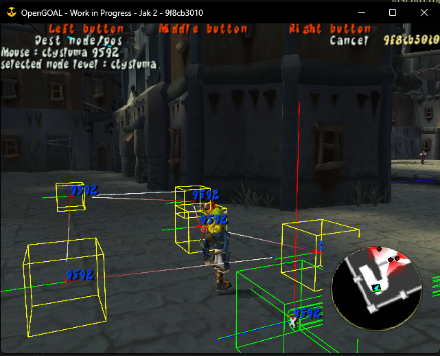

<head>
  <meta name="twitter:card" content="summary_large_image" />
</head>

One of the biggest rewrites we've done in a while has been released, and as usual, work continues on bug fixing and quality-of-life improving Jak 2.

<!--truncate-->

## Release Info

This month's OpenGOAL Tooling (jak-project repo) release is `0.1.37`

  

    <LauncherDownloadLink />
  

:::danger
NOTE - You must be on the latest version of the launcher (`2.0.10` or above) to be able to successfully launch version `0.1.35` or above.
:::

## General Changes

### Remove IOP Left-Over <PRLink href="https://github.com/open-goal/jak-project/pull/2681"/>

Some code was accidentally left-in last release that caused the IOP thread to run way more often than it should. This may fix performance issues if you are running on lower tier hardware.

### Replacing GLFW with SDL <PRLink href="https://github.com/open-goal/jak-project/pull/2397"/> <PRLink href="https://github.com/open-goal/jak-project/pull/2691"/> <PRLink href="https://github.com/open-goal/jak-project/pull/2694"/> <PRLink href="https://github.com/open-goal/jak-project/pull/2697"/> <PRLink href="https://github.com/open-goal/jak-project/pull/2730"/>

This is a huge change to all of the code that handles the game's graphics output and input handling (controllers, keyboards, mice).

SDL was choosen because it has more up-to-date support for DualShock / DualSense controllers, so this should hopefully put an end to most (if not all) of the workarounds people have been employing to get their controllers to work for a long time (i.e. running Steam alongside the game).

Additionally, it's a huge cleanup to all of the related code which should make it easier to add more features and fix issues as they are found.

From a user's perspective, essentially nothing should have changed in terms of functionality.  There are a bunch of new features though, including being able to re-map your bindings via the pause menu.

:::tip
Existing controller keybindings will not automatically be converted, you will need to set them up yourself via the new menus.
:::

:::info
Note, if you are on Linux and you get an error like: `SDL Error: gl_make_display failed - Could not create display window - Cause: SDL not configured with OpenGL/GLX support` in the game's log files, you probably don't have `mesa` installed in your environment properly.

Instructions for how to do so is going to differ from distro to distro, so seek out information online on how to do that.
:::

You can find updated documentation on all the new settings [here](/docs/usage/settings/#input-options).

This was a very big change but it did go through a lot of testing so hopefully no major issues are found. However, if you do find any major issues please report them as per usual!

### Screenshots (F2) Copy to Clipboard <PRLink href="https://github.com/open-goal/jak-project/pull/2739"/> <PRLink href="https://github.com/open-goal/jak-project/pull/2746"/> <PRLink href="https://github.com/open-goal/jak-project/pull/2750"/>

This is a Windows only change. When pressing the screenshot keybind (F2), the image will also be placed on your clipboard so you can paste them somewhere like Discord.

Screenshots will also come out at the correct scaling now too.

### Translation Updates <PRLink href="https://github.com/open-goal/jak-project/pull/2770"/> <PRLink href="https://github.com/open-goal/jak-project/pull/2774"/>

There has been a quite a bit of translation progress this month.

Swedish translations were further improved; also Finnish, Dutch and Danish subtitles are actively being translated with Danish already at 60%! With that being the case, we've added those 3 languages to the in-game option menu.

A quick reminder for translators: keep in mind that Jak 1 has a very limited character set.  This is mostly an issue for Japanese but we've recently added an automatic check that will detect any bad characters when we go to add the translations to the game.  The entire supported character set is detailed [here](https://opengoal.dev/docs/contributing/text-translations#supported-characters).

## Jak 2 Fixes

### Patch floats on Bogus Collide Frags <PRLink href="https://github.com/open-goal/jak-project/pull/2686"/>

Bad collision hashes were causing floating point related crashes, such as around the hover guards in the Fortress rescue portion.

### Fix Crane in Drill Platform and Ruins Walls <PRLink href="https://github.com/open-goal/jak-project/pull/2692"/>

Part of the crane in the Drill Platform, and the breakable portions of the walls in Dead Town were not drawing correctly due to using the wrong LOD.

### Joint to Bone NaN <PRLink href="https://github.com/open-goal/jak-project/pull/2698"/>

Addresses problems like Krew's hologram's effect being stretched towards the `0,0,0` origin.

### Subtitle Support <PRLink href="https://github.com/open-goal/jak-project/pull/2672"/> <PRLink href="https://github.com/open-goal/jak-project/pull/2708"/>

Jak 2 thankfully already has subtitle support, but there is still some functionality that we'd like to add (like speaker text) as well as allowing other audio sources outside of cutscenes to be subtitled.

### `battle` bugs <PRLink href="https://github.com/open-goal/jak-project/pull/2707"/>

Fixes problems around ambush and battle sections. For example all of the `monster-frog`s in Mar's Tomb would spawn with an extremely short cooldown.

### Floating Point BLERC <PRLink href="https://github.com/open-goal/jak-project/pull/2715"/>

BLERC (short for "Blend Shape MERC", MERC being the main foreground renderer) is used to modify MERC models by updating vertex positions in order to display facial animations.

The original implementation of "blerc" used integers, which made the animations look a bit choppy in some places due to the low precision, but we have rewritten it to use floats instead (we call it BLERF sometimes), which smooths the facial animations of characters out since they can now be interpolated with a much higher precision. BLERF has been backported to Jak 1 as well.

There is still a small issue for now where BLERF doesn't work on the Hip Hog mirror, visible in some cutscenes.

In the process, there were also some fixes to bones that fixed a weird occasional flickering light problem in the Pumping Station.

### Discord RPC <PRLink href="https://github.com/open-goal/jak-project/pull/2714"/>

[A little over a year ago](https://github.com/open-goal/jak-project/pull/1137), we added Discord Rich Presence support to Jak 1, displaying your progress and images for the current level at different times of day and various other stuff. Now, as Jak 2 is slowly becoming more presentable with only a few renderers missing, we have added Rich Presence support to it as well.

Jak 2's Rich Presence will display various statistics about your progress/game state:

- The currently active mission
- Completion percentage
- Orb and skull gem counters
- Time of day
- Various states the player may be in (using a gun, riding the jetboard, playing as Daxter, watching a cutscene, etc.)

You can also hover over the images to display level name and player state tooltips:

For Jak 2, we took over 200 pictures for not only every single level at day and at night, but also images specific to every mission and side mission in the game. While you're in a mission, the mission specific image will display, otherwise it will default to the current level image.

### Fog Color Messes With Warp Effect <PRLink href="https://github.com/open-goal/jak-project/pull/2740"/>

Fixes an issue where fog color would also affect warp, particularly noticeable in the Nest area.

### Orb Softlocks <PRLink href="https://github.com/open-goal/jak-project/pull/2753"/> <PRLink href="https://github.com/open-goal/jak-project/pull/2757"/> <PRLink href="https://github.com/open-goal/jak-project/pull/2767"/> <PRLink href="https://github.com/open-goal/jak-project/pull/2781"/>

The original game had quite a few situations that could completely lock you out of some Precursor Orbs on that save file. The ones that were fixed in these PRs include:

- Allowing you to return to the Metal Head Nest after beating the game to pick up any potentially missed orbs.
- An orb in Sewers that becomes unobtainable after starting the Sewer Escort mission.
- After winning a race and beating a record time, the orbs are awarded immediately instead of spawning a golden orb that starts hovering towards Jak and can be missed if you exit out of the race too quickly.
- All side missions will now immediately award orbs instead of spawning a pickup that can be missed under certain conditions. While this behavior is a bit of a deviation from the original game, it ended up saving us a lot of headaches as more and more issues were discovered with the original behavior and it is also consistent with how Jak 3 awards side mission orbs.

### More In-Game Editor Work <PRLink href="https://github.com/open-goal/jak-project/pull/2771"/>

Some additional work was done on the remaining code for the in-game editors. The next main task will be seeding the database with all of the game's data so the editors actually have something to edit.

The following is a screenshot of the `nav-graph-editor` with some placeholder data.

### Stadium Particles <PRLink href="https://github.com/open-goal/jak-project/pull/2783"/>

We were missing the file containing particle definitions for the inside of the Stadium level, this file has now been decompiled and the particles show up correctly.

## Tooling Improvements

### Newlines and the REPL <PRLink href="https://github.com/open-goal/jak-project/pull/2784"/>

The REPL will now support multi-line pasting via terminals that properly support bracketed paste mode.  This does **not** include [powershell](https://github.com/PowerShell/PSReadLine/issues/1471) or command prompt!

It also supports new-lines while typing normally (`Ctrl+J` or `Ctrl+Enter`); this should work in any terminal.
