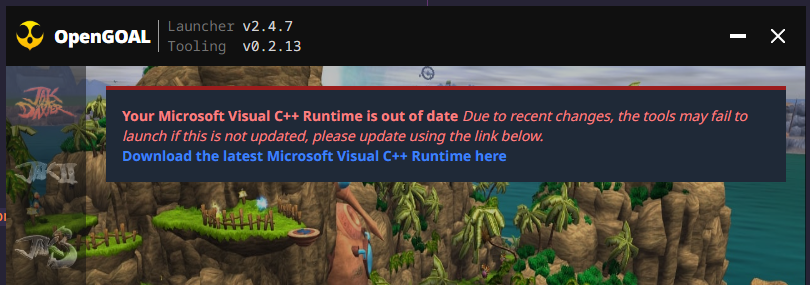
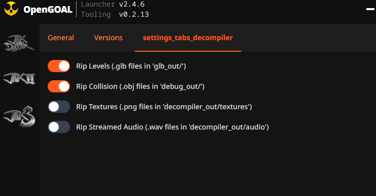
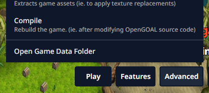
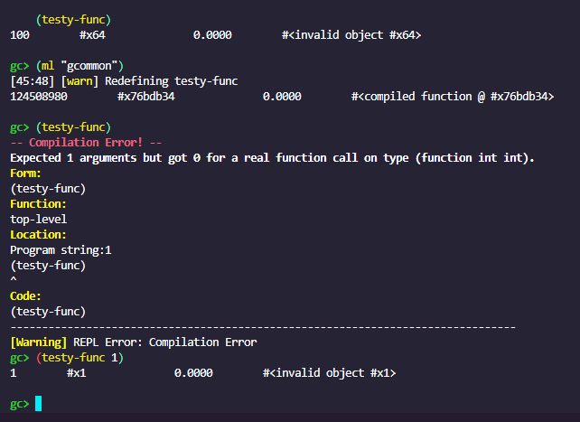
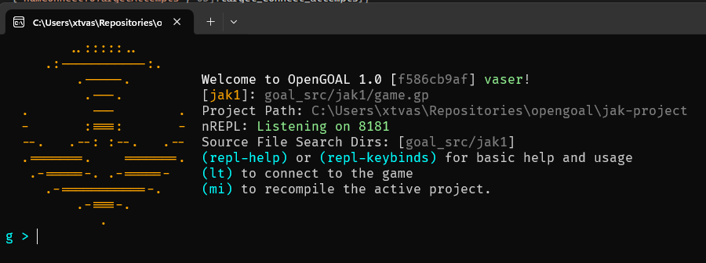
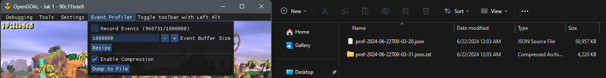

<head>
  <meta name="twitter:card" content="summary_large_image" />
</head>

Work on Jak 3 continues to make slow, yet steady progress. Plus an exciting announcement.

<!--truncate-->

## Release Info

This month's OpenGOAL Tooling (jak-project repo) release is `0.2.14`.

  

    <LauncherDownloadLink />
  

## General Changes

### OpenGOAL Merch Survey

This is the aforementioned exciting announcement.  It's taken a few months to get most of the designs ready to present but atleast I'm
fairly excited about it.

I thought it would be nice to have some physical merchandise to go along with the project, not only because I thought we could make something cool and there isn't a ton of quality stuff out there, but also because it kinda serves as a reward/reminder for all the work we've put into the project.

Additionally, for a long time people have consistently brought up the desire to donate or contribute financially.  This is still off the table for several reasons, but purchasing merchandise is different than a donation.  It's not just gifting money away and it doesn't create a sense of obligation -- you are getting something out of the deal.

So, if you are interested and you want to see the design previews, their potential prices, and give feedback (please be respectful) check out [the google form](https://forms.gle/5DyurhxR1AfFpjpx6).

:::info
I will close form submissions when next month's progress report goes live, and if there's sufficient interest, we'll move forward with making it a real thing.
:::

### VCC Runtime Update <PRLink href="https://github.com/open-goal/launcher/pull/512"/>

:::danger
Due to recent changes surrounding how the OpenGOAL binaries are built, if you are on Windows, you are probably
going to want to update to the latest version of the VCC Runtime or the games will no longer launch.
:::

The launcher (if you update it) should detect if you are running an old version, and if so, give you the link to
go and update it.

If you don't use the launcher, use the following link [https://aka.ms/vs/17/release/vc_redist.x64.exe](https://aka.ms/vs/17/release/vc_redist.x64.exe)

### Launcher Decompiler Options <PRLink href="https://github.com/open-goal/jak-project/pull/3560"/>

People have wanted a simple way to use the launcher to extract textures, audio, etc for a while.  This has required them to either:
- manually edit the `.jsonc` config files and run the decompile option
- be unable to, as the `extractor` binary could not do things like extract audio.

Well no more, not only does the `extractor` binary now support anything the normal `decompiler` binary does -- but the launcher now has settings to do all of this for you.  Just enable what you want, and run the decompiler through `Advanced` on the respective game:

There is also a new button to open the folder that the game's data is located in, this is useful to quickly find the folder where your textures/audio/etc are extracted to.  For example textures get extracted to `.../decompiler_out/<GAME>/textures`

### A Flatpak Release is Coming <PRLink href="https://github.com/open-goal/jak-project/pull/508"/>

While technically coming from an unofficial source, Milkfat32 has taken it upon themselves to go through the process of getting the launcher into a flatpak and added to flathub.

At this point I don't think it's released yet, but if that is of interest to you, be on the lookout.

The hope is that it can be made an official thing in the future as flatpak support with the launcher's framework improves (it seems to be part of their V2 plan, which is due sometime this year).

## Game Changes

### Jak 3 Airlock Speedups and Temporary Cutscene Fixes <PRLink href="https://github.com/open-goal/jak-project/pull/3543"/>

Just like in Jak 2, code has been added to make airlocks open faster if you so choose.

Additionally, as Overlord2 is still being worked on, cutscenes have to be hacked around.  This change improves the way the cutscenes temporarily skipped.

### Jak 1 eco meter was flashing the wrong color <PRLink href="https://github.com/open-goal/jak-project/pull/3549"/>

Fixed

### Jak 1 enforce certain settings in speedrunner mode <PRLink href="https://github.com/open-goal/jak-project/pull/3553"/>

Certain settings like `PS2 Actor Vis` and framerate were mistakenly only enforced at the start of a run.  This only impacted Jak 1.

## Tooling Changes

### REPL Improvements <PRLink href="https://github.com/open-goal/jak-project/pull/3545"/>

One of the coolest parts about using OpenGOAL is the REPL and making changes while the game is live.  Well atleast it is, until you change
something that the compiler doesn't like.  Such as a function definition, or a type definition.

This would require you to completely restart your REPL, re-compile the project, and then you can continue your work.  `goalc` is noble for
trying to prevent these types of redefinitions, but during development and experimentation it's the opposite of what you want.

There is a new `permissiveRedefinitions` boolean option you can put in your `repl-config.json` file to enable this behaviour.  It's early days so it
may still not allow redefining everything, make an issue when/if you encounter such situations.

Additionally, there's a cooler welcome screen that provides more information in a more condensed format.  This is something that hasn't been changed in years!

### Better Event Profiling <PRLink href="https://github.com/open-goal/jak-project/pull/3561"/>

If you have a problem related to frame-pacing or performance, you'll often be told to record a profile dump via the ImGUI topbar.

However this tool had it's limitations.  For one thing, the maximum number of events were quite low, only amounting to a handful of seconds that could be recorded.  Additionally the size of the profile dump would be quite large given the amount of time it would take.  Lastly the UI wouldn't really tell you anything to suggest how quickly you were hitting the limit.

All of these things have been fixed:
- You can change the maximum number of events that are recorded
- You can enable compression on the output (approximately a 10x reduction)
- The UI shows how quickly it's recording, letting you know if you need to bump up your max or not.

