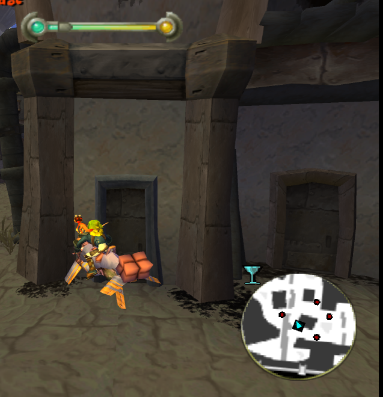
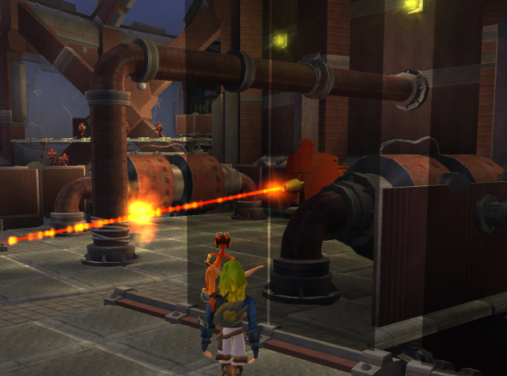
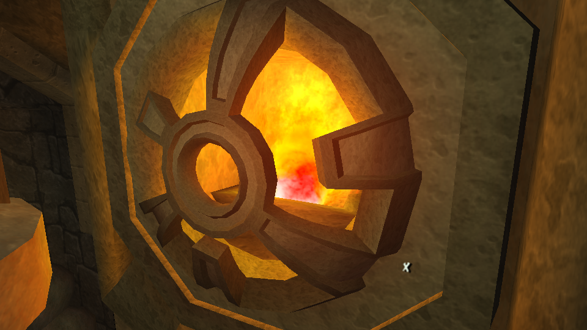
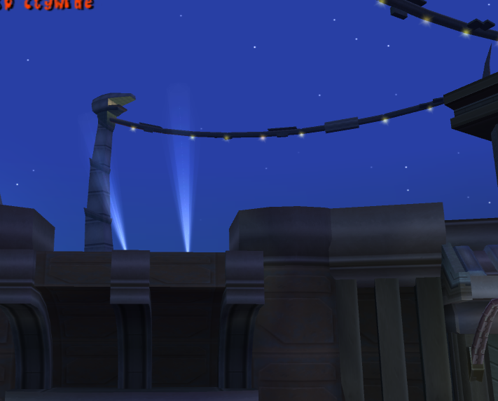

<head>
  <meta name="twitter:card" content="summary_large_image" />
</head>

The theme for this month was definitely fixing bugs and that will likely continue for awhile. At this point, basically all missions and side missions function to some degree.

<!--truncate-->

## Release Info

This month's OpenGOAL Tooling (jak-project repo) release is `0.1.34`

<div className="row markdownMarginBottom">
  <div className="col col--6">
    <LauncherDownloadLink />
  </div>
</div>

## Community Spotlight

This month, a few multiplayer mods have been developed and are still in early stages but felt like they are definitely worth a shoutout.

### Barg's Modding Tutorials

Barg took the time to do some write-ups about how some of the mods he and Zed were made.  If you are interested in how the game works, or are interested in making some
source-code modifications of your own, they are worth the read and are well written / accessible to a beginner.

[Check them out here](/docs/category/modding-examples)

### Dexz's Multiplayer Speedrunning `TeamRun`

This a speedrun focused multiplayer mod where players either work together or battle it out to finish a run.

[Here's it briefly in action](https://twitter.com/i/status/1637974774444969991)

If you are interested in giving it a shot, the only location with instructions right now is in the Jak Speedruns discord.

### Zed and Barg's Multiplayer Hide'n'Seek

Zed and Barg have on-and-off tried to get multiplayer gameplay working since Jak 1 was running.  They have tried a variety of...interesting strategies...to accomplish this but this is by far their best iteration yet with an entire new minigame built around it.

This is only a preview / early test of it, but you can [see it in action here as well](https://twitter.com/i/status/1641957172669022209)

## Launcher Changes <PRLink href="https://github.com/open-goal/launcher/pull/104"/>

You may notice that I did not call out _which_ launcher release is tied to this month's tooling release and that is because the launcher has significantly changed recently, hopefully for the better. Let's talk about the major changes and how it effects usage.

:::info
You will have to intentionally download and update to the new launcher, you will not get prompted to update from `1.X.X` to the latest release.
:::

### Won't launch at all on Windows?

First off, there was unfortunately a somewhat recent breaking release of WebView2 (which the launcher uses) that seems to be kicking around on some people's machines. There are two options to fix this:
1. I pin the version that the launcher installer comes with, which would increase the download size by 150MB or so
2. Users that are affected have to manually update the release on their machine.

I've choosen the latter as this is a temporary and localized issue and it isn't worth bloating the install size for everyone. All you should have to do is download the `x64 Standalone Installer` from [here](https://developer.microsoft.com/en-us/microsoft-edge/webview2/#download-section). **If the installation fails, you may have to run it as administrator.**

If you're interested, these are the underlying issues:
- https://github.com/MicrosoftEdge/WebView2Feedback/issues/3138#issuecomment-1387432722
- https://github.com/MicrosoftEdge/WebView2Feedback/issues/3137
- https://github.com/MicrosoftEdge/WebView2Feedback/issues/3136

:::tip
If this doesn't resolve your issue, feel free to reach out in either the Discord or the GitHub page.
:::

### Basic Usage

The new launcher is not tightly coupled to a particular `jak-project` release any longer. This means you can rollback to a previous version if we break something, or even run a custom version (ie. mods). The [installation instructions](/docs/usage/installation/) have been updated, and a new video tutorial is being worked on.

### Asking for help

:::tip
If you are asking for help, please follow the [instructions here](https://github.com/open-goal/launcher#asking-for-help) to download and attach the `zip` file it produces wherever you are asking for help (Discord / GitHub)
:::

You can inspect the contents of the `zip` before sending it if you so choose, but it contains things like:
- your save files
- your logs
- your settings
- some general hardware information (CPU/GPU/etc)

For the most part, the launcher seems to work well for most people, and a good amount of early bugs have already been caught and fixed. Bear with us as we iron out the remaining issues. You can always fallback to using the `jak-project` release directly if something isn't working for you.

## General Changes

### Empty log file crash <PRLink href="https://github.com/open-goal/jak-project/pull/2299"/>

It doesn't seem like anyone ran into this problem, but if you somehow ended up with an empty log file, the game would crash on startup. This has been fixed.

### Fix Dull Envmaps <PRLink href="https://github.com/open-goal/jak-project/pull/2303"/>

The effect that envmaps had were half as much as they should have been, this has been fixed and is quite noticable in areas like the rivers in Forbidden Jungle.

### Re-organize decompiler configuration <PRLink href="https://github.com/open-goal/jak-project/pull/2185"/>

A common mistake users have found themselves making when trying to manually decompile the games is not adjusting the correct config file. For example, they have a PAL ISO but modify the configurations intended for the NTSC releases.

This change attempts to simplify that story. There is now a central config file for each game with the ability to add overrides for a particular version. This not only makes it easier for normal users, but it got rid of a few thousand lines of redundant configuration.

:::info
This should have no effect on the ability to extract the game with any ISO. But if we missed something and your particular ISO no longer works to install the game, please reach out. Reminder that you must provide your own legitimate ISO sourced from a legitimate copy.
:::

### Eyes drawn via MERC <PRLink href="https://github.com/open-goal/jak-project/pull/2300"/>

This change does effect Jak 2 as well, but this now means that Jak will be fully drawn using MERC!

<ReactPlayer controls url="https://www.youtube.com/watch?v=zi8P2ufS6g0" className="blog-video"/>

### Add documentation to the `gk` binary <PRLink href="https://github.com/open-goal/jak-project/pull/2310"/>

You can finally run a `gk --help` to get a listing of all the available flags and what they do. This was the final, and arguably most important, binary that did not have a self-documenting help flag.

Please note that the entire syntax of calling `gk` has changed. An important thing to keep in mind is that arguments are consumed in two locations:
1. within the initial C++ runtime of `gk`, often to set things like the project path or the game version (jak1 / jak2)
    - These flags follow a typical CLI convention, single hyphen for short forms, and a double hyphen for long-form args
2. passed through to the actual OpenGOAL kernel to be used by the game.
    - These flags all use a single hyphen and is a left over from the original game kernel. This could be changed, but there isn't a huge incentive to do so.

For most users, you won't care about any of this as you either run it with no arguments (double-clicking it) or the launchers handle it for you.

:::danger
Attention [mod-]launcher developers. This change added a temporary shim to convert the old argument format into the new argument format. This will go away in the next months release and the new format will be assumed. But I will include a way to obtain the version so you can handle the old and new formats accordingly.
:::

### Disable autosave check in Jak 1 <PRLink href="https://github.com/open-goal/jak-project/pull/2312"/>

A fairly significant performance issue was found involving File I/O and memory card file saving. If you are using a weaker PC or slower hardware (HDD instead of an SSD) you may notice a significant difference.

### Use ETIE in Jak 1 <PRLink href="https://github.com/open-goal/jak-project/pull/2329"/>

Another example of backporting an improved renderer from Jak 2 to Jak 1. ETIE is now used for rendering shiny surfaces, hopefully the only differences that are noticed are the performance gains.

### Fix OpenGOAL subtraction bug <PRLink href="https://github.com/open-goal/jak-project/pull/2399"/>

It's been quite a while since we've had a compiler bug. A bug in the subtraction function was found where the first argument would be evaluated and emitted twice. In most cases this was not a problem, for example take the following code:

```opengoal
(- 2 2)
```
> It doesn't matter that `2` is evaluated twice, it's still `2`!  So the answer is `0`

But take another more sinister example:

```opengoal
(let ((x 0))
  (- (1+! x) 2))
```
> With the bug, the answer here would also be `0`.

It's kind of surprising that this has gone so long without being noticed, but it ended up being the root cause of some issues in Jak 2 (turrets always looking down in the fortress missions for example). Because the argument was also being emitted twice, this fix improves the performance of the subtraction function by a small (insignificant) amount.

### Updated Spanish Translation <PRLink href="https://github.com/open-goal/jak-project/pull/2322"/>

Some spanish text entries have been updated

### Italian Subtitles <PRLink href="https://github.com/open-goal/jak-project/pull/1568"/>

This PR has been in the works for a very long time and it has finally been merged! This adds Italian translations for the subtitles as well as probably a few other things.  Thanks to all the people that have worked on this (over 10!).

## Jak 2 Fixes

### Minimap <PRLink href="https://github.com/open-goal/jak-project/pull/2280"/>

The minimap is now mostly functional! There are still a few bugs with some icons stretching across the entire minimap and the minimap looking low-res.



### MERC effect fixes <PRLink href="https://github.com/open-goal/jak-project/pull/2292"/>

MERC models can now use all 64 effects properly in OpenGOAL, which fixes some invisible characters like Jinx.

### Bombbots Crash <PRLink href="https://github.com/open-goal/jak-project/pull/2296"/>

When the bombbots exploded, the game would crash. This has now been fixed, which means the bombbots mission can be completed.  This also includes the side mission that reuse this objective.

<ReactPlayer controls url={require("./vid/bombots.mp4").default} className="blog-video"/>

### Texture Scrolling <PRLink href="https://github.com/open-goal/jak-project/pull/2303"/>

This feature is also used in Jak 1 now, but it is more impactful in Jak 2 where a decent amount of assets were dependent on it, namely most conveyor belts found throughout the game as well as the rim on the warp gates. In Jak 1 this means a reduced dependence on `generic` which translates into improved performance.

<ReactPlayer controls url="https://www.youtube.com/watch?v=JwGgvItBcGA" className="blog-video"/>

### Elevators! <PRLink href="https://github.com/open-goal/jak-project/pull/2304"/>

Elevators are finally functioning properly. They go down when you expect them to, and even go up when you expect them to. As with most bugs, this ended up being a small mistake related to function argument types.

<ReactPlayer controls url={require("./vid/elevators.mp4").default} className="blog-video"/>

### Cleanup script evaluation output <PRLink href="https://github.com/open-goal/jak-project/pull/2315"/>

They use the newly added script system in Jak 2 quite heavily. So improving the output of the script related code is a very nice change.

### Finish off the stadium code <PRLink href="https://github.com/open-goal/jak-project/pull/2294"/>

The `stadium-obs` file was finished off, which most importantly allowed the `Protect Stadium` mission to function.

<ReactPlayer controls url="https://www.youtube.com/watch?v=05gAQuCBBQs" className="blog-video"/>

### Fix `focus-test?` macro <PRLink href="https://github.com/open-goal/jak-project/pull/2321"/>

Some of the decompiler output around `focus-test?` `(zero? (logand ...))` and `(not (logtest? ...))` has been improved.

### ETIE <PRLink href="https://github.com/open-goal/jak-project/pull/2326"/>

ETIE is one of the new renderers in Jak 2 in the same vain as EMERC. It is used for rendering environment mapped background elements, such the precursor metal in mountain temple.

<ReactPlayer controls url="https://www.youtube.com/watch?v=B5Tztbkx4m0" className="blog-video"/>

### Fix a bunch of texture lookup issues <PRLink href="https://github.com/open-goal/jak-project/pull/2373"/>

There were a ton of texture related problems, most notably related to the lasers being red instead of blue due to sharing the same image but different palettes.

### Fix partially invisible TFrags <PRLink href="https://github.com/open-goal/jak-project/pull/2381"/>

There were some gaps in a few of the new tfrag features added in Jak 2 that were not supported yet.

### Support STR files <PRLink href="https://github.com/open-goal/jak-project/pull/2390"/>

Support has been added for Jak 2's `STR` files, aka the cutscene files. This allows you to dump the subtitle text and images, if you'd like.

### Fix light indices <PRLink href="https://github.com/open-goal/jak-project/pull/2393"/>

Fix some bugs involving the decompilation of one of the functions for drawing actors on-screen causing elements to appear solid black. Notably the turrets in the palace or certain airlocks.

### Resolve flickering and some depth issues <PRLink href="https://github.com/open-goal/jak-project/pull/2406"/>

This resolves the intermittent flicker that could be seen between loads, as well as some mistakes related to the glass in the palace and the eyes in the final cutscene.



### Glow sprite double draw with black squares <PRLink href="https://github.com/open-goal/jak-project/pull/2415"/>

Glow sprites were being drawn twice, sometimes with a black square.

### Fix particle definitions <PRLink href="https://github.com/open-goal/jak-project/pull/2412"/> <PRLink href="https://github.com/open-goal/jak-project/pull/2413"/> <PRLink href="https://github.com/open-goal/jak-project/pull/2423"/>

Many particle groups (effects) had the wrong parameters for scale and rotation due to a bug in the decompiler, including but not limited to:
- the flame pots in Mar's Tomb
- panels in the Fortress leading up to the prison cells
- the dark eco pickup
- signs scattered all over the city
- fruit from baskets and stands
- the warp gate and the Rift Ring.

These now render as they should.



### Fog fixes <PRLink href="https://github.com/open-goal/jak-project/pull/2424"/>

`disable-fog` is handled better now, for example the searchlights on the fortress now appear much better than before.



### `enter-state` and HUD related sprite crash <PRLink href="https://github.com/open-goal/jak-project/pull/2428"/>

`HUD` related sprite assert issues have been fixed, which were causing some crashes in some cutscenes and during rain. Also, the underlying issue for why Sig could never jump up the first pipe in his escort mission has been fixed. It was due to a missed conditional branch added for Jak 2.

### Fix some original game bugs/crashes <PRLink href="https://github.com/open-goal/jak-project/pull/2331"/> <PRLink href="https://github.com/open-goal/jak-project/pull/2402"/>

A few nasty bugs from the original game that were causing crashes have been fixed, such as loading the palace cable mission after spawning in the city which was causing one of the level files to start loading and then immediately get cancelled, which is not handled properly.

Another bug that was causing crashes in both the original PS2 game and OpenGOAL was actors placed around levels using types from different levels that could be unloaded. The easiest way to trigger this one is by going out of bounds at the end of the "Rescue Friends in Fortress" mission. Now you can go out of bounds to your heart's content!

### Vortex Renderer <PRLink href="https://github.com/open-goal/jak-project/pull/2441"/>

A new renderer in Jak 2, used only for the intro sequence.  The vortex texture is still missing.

<ReactPlayer controls url={require("./vid/vortex.mp4").default} className="blog-video"/>

### Shuttle Underground Fighters <PRLink href="https://github.com/open-goal/jak-project/pull/2444"/>

One of the very last missions to be supported due to missing decompilation.  It now works, as does the side mission that reuses the objective.

<ReactPlayer controls url="https://youtu.be/86JRlMxYVRI" className="blog-video"/>

### Destroy Hellcat Cruisers <PRLink href="https://github.com/open-goal/jak-project/pull/2445"/>

THE last mission that was not functioning at all due to missing decompilation!

<ReactPlayer controls url={require("./vid/hellcats.mp4").default} className="blog-video"/>

## Other Changes

### Remove deprecated CLI args in `goalc` <PRLink href="https://github.com/open-goal/jak-project/pull/2301"/>

The `--auto-lt` and `--auto-dbg` flags have been removed from `goalc`. These have been deprecated for a few months, so if you depended on them, it's time to change to the `startup[-jak1|jak2].gc` file instead which allows for the same sort of behaviour and more!  You can learn more [here](https://github.com/open-goal/jak-project/blob/master/goal_src/user/readme.md)

## Upcoming Work

### Replacing GLFW with SDL2 <PRLink href="https://github.com/open-goal/jak-project/pull/2397"/>

This has turned into a massive project because it essentially means redoing all the code that does fundamental things like drawing the video and handling the user input.

However it feels worth it for multiple reasons, firstly it has long been a problem that users have trouble getting their controller properly detected. There are still no guarantees here, but it should hopefully be a lot better. Secondly, it presents an opportunity to revamp and cleanup our code around these things -- a lot of tech debt and complexity has built up over the last 2-3 years making it a pain to add new features or fix bugs at times.

So in the spirit of making it easier to add new features, it felt appropriate to not just ship with better controller support, but to make the entire input system more useful and comprehensive. Once this PR merges (hopefully next month) there will be features like:
- Remapping controller / keyboard / mouse binds via the normal start menu
- Customize mouse sensitivity and direction
- Movement of Jak via the mouse
- Ability to disable keyboard input
- Ability to disable mouse input
- Controller selection with per-controller binds
  - Will react gracefully if controllers are plugged-in or unplugged, and remember which controller should be Port 1
- Likely a few other minor things

### Translation Tracker <PRLink href="https://github.com/open-goal/jak-project/pull/1760"/>

I will be working on using [Crowdin](https://www.crowdin.com/) to make it easier to track and submit translations for the areas that we can (custom strings that we have added, not the base text for the games).

This should hopefully make it easier for non-technical translators to submit and improve translations instead of having to make a PR.  With that said, you may still want to run the game locally in order to test your translations.  Additionally, effective subtitle translations will still need to use the old methods, but something is better than nothing.
