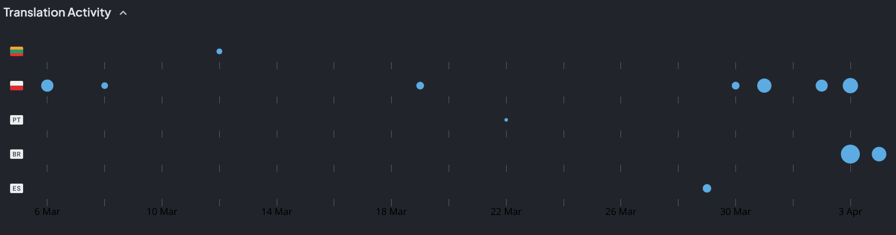
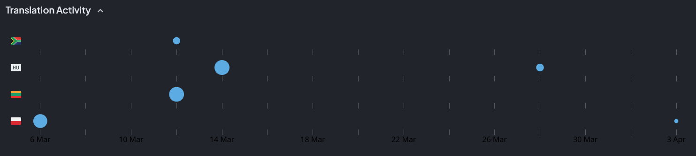

<head>
  <meta name="twitter:card" content="summary_large_image" />
</head>

Jak 3 decompilation progress continues, there will be a lot to share next month.

<!--truncate-->

## Release Info

This month's OpenGOAL Tooling (jak-project repo) release is `0.2.9`.

<div className="row markdownMarginBottom">
  <div className="col col--12">
    <LauncherDownloadLink />
  </div>
</div>

## Translation Contributions

### Games



### Launcher



## General Changes

### Move to MacOS 12 <PRLink href="https://github.com/open-goal/jak-project/pull/3407"/>

macOS 11 has been out of date for quite a few months at this point, and the free GitHub runner that uses the end-of-life image is soon to be removed.

### Improve and better understand bones code <PRLink href="https://github.com/open-goal/jak-project/pull/3425"/>

The bones code was ported from MIPS2C to OpenGOAL, making it much easier to study and even faster (though likely neglible in practice).

### More Control-Flow Support in OpenGOAL <PRLink href="https://github.com/open-goal/jak-project/pull/3426"/>

Labels, breaks and continues are now supported in the following:

```opengoal
(while)
(until)
(dotimes)
(countdown)
(loop)
(doarray)
```

### LSP Improvements <PRLink href="https://github.com/open-goal/jak-project/pull/3437"/>

See the linked PR for examples and demos on what was added. To sum it up, if you write OpenGOAL code you may notice a lot more functionality via the LSP (which is automatically grabbed for you by the VSCode extension).

I am about halfway through atleast partially implementing all main LSP features, progress can be tracked here if you are curious - https://github.com/open-goal/opengoal-vscode/issues/256

### Website Freshen-up

The design of the website has been the same for quite some time so it was freshened up a bit.

## Jak 1

### Fix Graphics Menu Options <PRLink href="https://github.com/open-goal/jak-project/pull/3421"/>

Jak 1's graphics menu would be different if your monitor was only 60hz. That isn't necessarily a problem...but the alternate version was missing the option to change the monitor the game was displayed on.

Fixed by consolidating things into a single menu varient.

## Jak 2

### Save `pc-settings.gc` Periodically <PRLink href="https://github.com/open-goal/jak-project/pull/3396"/>

There were issues where unlocked cheats would seemingly not be unlocked when the user would normally expect them to be.  This was solved by periodically saving the cheat progress.

### Fix some speedrunner mode issues <PRLink href="https://github.com/open-goal/jak-project/pull/3413"/>

The speedrunner mode menu will no longer open during blackout screens, this was apparently causing issues.

### Temporary workaround for speedrunner route at lifeseed <PRLink href="https://github.com/open-goal/jak-project/pull/3418"/>

There is still a potential crash that occurs when obtaining the lifeseed at deadtown as fast as possible, see https://github.com/open-goal/jak-project/issues/2988

However, in the meantime a hack was added to stop the game from out-right crashing.  The cutscene will not function properly if you get the game into the bad state, but it won't crash.

If this causes other issues, let us know and it can be reverted but it seems to do the job.

## Jak 3

### Decompilation Update <PRLink href="https://github.com/open-goal/jak-project/pull/3412"/> <PRLink href="https://github.com/open-goal/jak-project/pull/3420"/> <PRLink href="https://github.com/open-goal/jak-project/pull/3424"/> <PRLink href="https://github.com/open-goal/jak-project/pull/3427"/> <PRLink href="https://github.com/open-goal/jak-project/pull/3428"/> <PRLink href="https://github.com/open-goal/jak-project/pull/3429"/> <PRLink href="https://github.com/open-goal/jak-project/pull/3432"/> <PRLink href="https://github.com/open-goal/jak-project/pull/3433"/> <PRLink href="https://github.com/open-goal/jak-project/pull/3434"/> <PRLink href="https://github.com/open-goal/jak-project/pull/3438"/>

Many things were decompiled:
- Sprite related files
- Lots of engine code
  - foreground
  - bones
  - font
  - background
  - shrubbery
  - tfrag
  - tie
  - prim
  - level
  - main
  - gun projectiles

### `get-texture` macro in decompiled code <PRLink href="https://github.com/open-goal/jak-project/pull/3432"/>

Replaces code that involves `lookup-texture-by-id` or `lookup-texture-by-id-fast` to be much more clean and concise.

### More macro detection <PRLink href="https://github.com/open-goal/jak-project/pull/3436"/>

`ja` macro detection was fixed and there is a now `part-tracker-spawn` macro detection. More changes to make the decompiler produce a much nicer end-result.

### Support for self-referential virtual state inheritance <PRLink href="https://github.com/open-goal/jak-project/pull/3438"/>

In Jak 3, they seemingly added support for virtual states inheriting from it's own type's fellow virtual states. Fun.