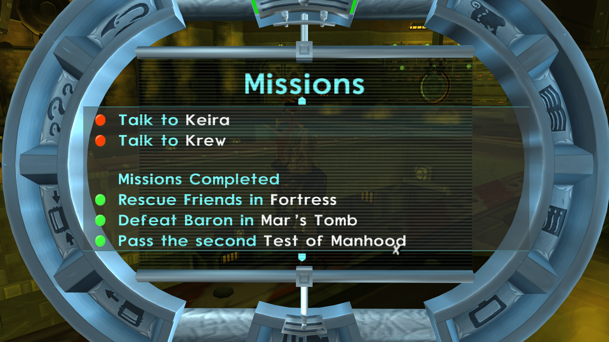
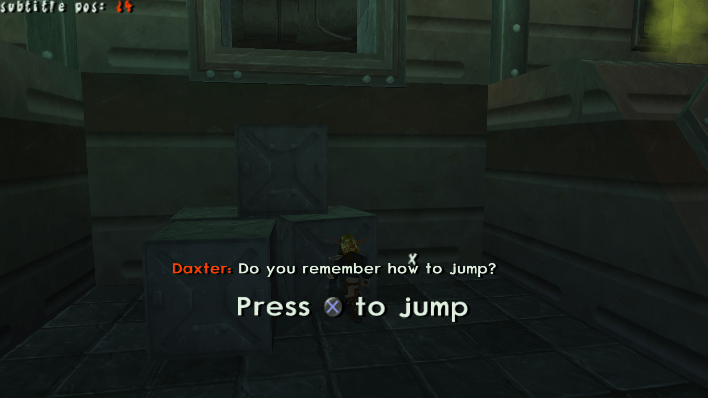

<head>
  <meta name="twitter:card" content="summary_large_image" />
</head>

I never know what to say here

<!--truncate-->

## Release Info

This month's OpenGOAL Tooling (jak-project repo) release is `0.1.36`

  

    <LauncherDownloadLink />
  

:::danger
NOTE - You must be on the latest version of the launcher (`2.0.10` or above) to be able to successfully launch version `0.1.35` or above.
:::

## General Changes

### Translate all the Things <PRLink href="https://github.com/open-goal/jak-project/pull/2613"/> <PRLink href="https://github.com/open-goal/jak-project/pull/1760"/> <PRLink href="https://github.com/open-goal/jak-project/pull/2637"/> <PRLink href="https://github.com/open-goal/jak-project/pull/2644"/>

A lot of work finally fell in place this month to make translating more accessible.  We now have two Crowdin projects:
- https://crowdin.com/project/opengoal
  - Covers custom game text that we have added to the game
  - Subtitles that don't have an audio accompaniment
- https://crowdin.com/project/opengoal-launcher
  - The launcher

Many people have already submitted translations for a variety of languages, most of the custom text has been translated into all available languages and the launcher is now in over a dozen languages.

:::tip
If you are someone who is going to translate the subtitles via Crowdin, and you use a YouTube video to watch the cutscenes. It would be a huge help to organize and collect timestamps for each cutscene name. If you do this, reach out and we can put the list (even a partial one) on the website so others can use it!
:::

### `Press O to Talk` Bug Fixed <PRLink href="https://github.com/open-goal/jak-project/pull/2642"/>

An old Jak 1 fix was accidentally removed when cleaning some code up that allowed you to talk to NPCs when you were definitely not supposed to.

### Fix Jak 1 Racer HUD <PRLink href="https://github.com/open-goal/jak-project/pull/2648"/>

The racer hud was mis-aligned, similar to the previous issue. Fixed

### Add back Orb Glow <PRLink href="https://github.com/open-goal/jak-project/pull/2650"/>

Was accidentally removed.

### Compile on GCC13 <PRLink href="https://github.com/open-goal/jak-project/pull/2640"/>

### Swedish Subtitles for Jak 1 <PRLink href="https://github.com/open-goal/jak-project/pull/2667"/>

Jak 1 now has Swedish subtitles!

## Jak 2 Fixes

### Decomp `ctywide-speech` <PRLink href="https://github.com/open-goal/jak-project/pull/2612"/>

One of the last files that was blocked (and still technically is, just was fixed manually). Fixes missing dialogue (guards / citizens) when wandering through the city.

<!-- TODO - video? -->

### `blit-displays` <PRLink href="https://github.com/open-goal/jak-project/pull/2616"/> <PRLink href="https://github.com/open-goal/jak-project/pull/2620"/>

Adds sprite distort, fixes buggy sprite rendering in progress, adds scissoring support (used in various scrolling menus) and a very basic implementation of `blit-displays`. This is enough to make the fade effect in the progress menu work, along with all the menus working properly without needing to use the REPL. This does not make screen flipping and the filter when failing a mission work.

### Shadows <PRLink href="https://github.com/open-goal/jak-project/pull/2632"/> <PRLink href="https://github.com/open-goal/jak-project/pull/2647"/>

Shadows are now properly rendering

<!-- TODO video -->

### Non-nauseating full-screen warp effects at higher aspect ratios <PRLink href="https://github.com/open-goal/jak-project/pull/2603"/>

Full screen effects like in the fortress turret cam, or underport were rough at extreme aspect ratios.

<!-- TODO video? -->

### Improve decompilation of subtask macros <PRLink href="https://github.com/open-goal/jak-project/pull/2654"/>

### Fillout text entry names <PRLink href="https://github.com/open-goal/jak-project/pull/2640"/>

### Add `current-time` macro to cleanup code <PRLink href="https://github.com/open-goal/jak-project/pull/2662"/>

### VAG Player <PRLink href="https://github.com/open-goal/jak-project/pull/2664"/>

New debug menu to easily play sounds

## Upcoming Work

### Hint Subtitle Support in Jak 2 <PRLink href="https://github.com/open-goal/jak-project/pull/2672"/>

Hint subtitles will be a thing in Jak 2.

