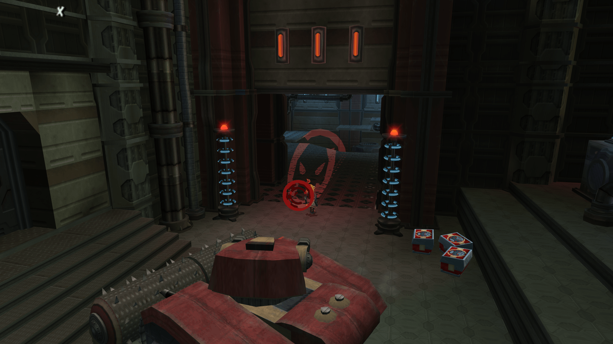
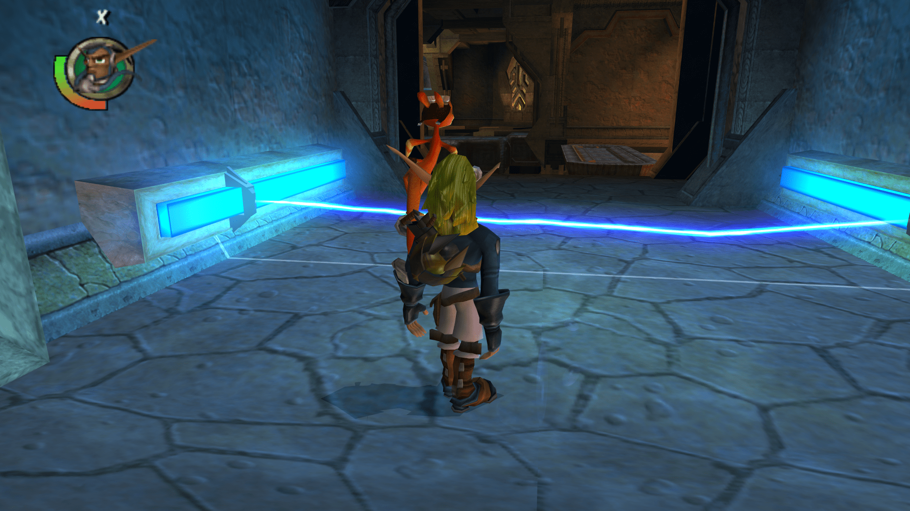

<head>
  <meta name="twitter:card" content="summary_large_image" />
</head>

I never know what to say here, we did some things.

<!--truncate-->

## Release Info

This month's OpenGOAL Tooling (jak-project repo) release is `0.1.36`

  

    <LauncherDownloadLink />
  

:::danger
NOTE - You must be on the latest version of the launcher (`2.0.10` or above) to be able to successfully launch version `0.1.35` or above.
:::

## General Changes

### Translate all the Things <PRLink href="https://github.com/open-goal/jak-project/pull/2613"/> <PRLink href="https://github.com/open-goal/jak-project/pull/1760"/> <PRLink href="https://github.com/open-goal/jak-project/pull/2637"/> <PRLink href="https://github.com/open-goal/jak-project/pull/2644"/>

A lot of work finally fell in place this month to make translating more accessible.  We now have two Crowdin projects:
- https://crowdin.com/project/opengoal
  - Covers custom game text that we have added to the game
  - Subtitles that don't have an audio accompaniment
- https://crowdin.com/project/opengoal-launcher
  - The launcher

Many people have already submitted translations for a variety of languages, most of the custom text has been translated into all available languages and the launcher is now in over a dozen languages.

:::tip
If you are someone who is going to translate the subtitles via Crowdin, and you use a YouTube video to watch the cutscenes. It would be a huge help to organize and collect timestamps for each cutscene name. If you do this, reach out and we can put the list (even a partial one) on the website so others can use it!
:::

### Regressions fixed

There were a few major re-writes to large swathes of code and a few manual changes were accidentally undone, leading to a few bugs to re-appear. The following have been fixed:
- "Press Circle to talk" appearing when it shouldn't and letting you talk from NPCs you shouldn't. <PRLink href="https://github.com/open-goal/jak-project/pull/2642"/>
- Racer HUD being misaligned. <PRLink href="https://github.com/open-goal/jak-project/pull/2648"/>
- Orb glow not existing. <PRLink href="https://github.com/open-goal/jak-project/pull/2650"/>

### Compile on GCC13 <PRLink href="https://github.com/open-goal/jak-project/pull/2640"/>

### Swedish Subtitles for Jak 1 <PRLink href="https://github.com/open-goal/jak-project/pull/2667"/>

Jak 1 now has Swedish subtitles!

## Jak 2 Fixes

### Regressions <PRLink href="https://github.com/open-goal/jak-project/pull/2676"/> <PRLink href="https://github.com/open-goal/jak-project/pull/2680"/>

During some codebase cleanup and improvements, we accidentally introduced a few regressions, such as crashes during the Forest Scouts mission or after winning a race, which have been fixed.

### Decomp `ctywide-speech` <PRLink href="https://github.com/open-goal/jak-project/pull/2612"/>

One of the last files that was blocked (and still technically is, just was fixed manually). Fixes missing dialogue (guards / citizens) when wandering through the city.

<ReactPlayer controls url="https://www.youtube.com/watch?v=6oDq1bPxKSE" className="blog-video"/>

### `blit-displays`, `sprite-distort` <PRLink href="https://github.com/open-goal/jak-project/pull/2616"/> <PRLink href="https://github.com/open-goal/jak-project/pull/2620"/>

Fixes some sprites rendering in the progress menu in both Jak 1 and 2 crashing the game when the sprite renderer was disabled, which is used in Jak 1 as the progress menu is no longer made of sprites there.

Adds the `sprite-distort` renderer, which acts the exact same way as it did in Jak 1. This is used for heat haze-like effects throughout the game, distinct from the warp renderer. They're used for the JET-Board trail, various fire jets and effects, the Blaster, some underwater effects, etc.

Adds part of the `blit-displays` system. This is used to copy and modify the screen framebuffer and apply screen-wide effects, such as screen flipping. However, right now all it can do is copy an entire framebuffer at once, which is used for the fade-to-orange effect when the progress menu is opened. Screen flipping and the filter when failing a mission still do not work. This system is also used to make the progress menu load all of its icons, so the menus are now fully functional without needing to use the REPL.

<ReactPlayer controls url="https://youtu.be/0Tws1FSt2ys" className="blog-video"/>

### Shadows <PRLink href="https://github.com/open-goal/jak-project/pull/2632"/> <PRLink href="https://github.com/open-goal/jak-project/pull/2647"/>

Shadows are now properly rendering! The shadow renderer has been completely rewritten in OpenGL instead of directly running the original game's VU code for it, improving performance by quite a bit (although it was never really a very heavy renderer in the first place). There are still a few bugs with shadows flickering occasionally.

The system is overall very similar to Jak 1, but there are some new special cases like the KG logo for the Fortress tank and the lasers in Underport that use a colored light volume instead of a dark shadow.

### Non-nauseating full-screen warp effects at higher aspect ratios <PRLink href="https://github.com/open-goal/jak-project/pull/2603"/>

Full screen effects like in the fortress turret cam, or underport were rough at extreme aspect ratios.

<!-- TODO video? -->

### Improve decompilation of subtask macros <PRLink href="https://github.com/open-goal/jak-project/pull/2654"/>

This makes the code related to the missions in the game much easier to understand.

### Fillout text entry names <PRLink href="https://github.com/open-goal/jak-project/pull/2640"/>

### Add `current-time` macro to cleanup code <PRLink href="https://github.com/open-goal/jak-project/pull/2662"/>

### VAG Player <PRLink href="https://github.com/open-goal/jak-project/pull/2664"/>

A new debug menu that allows for quick playback of any audio file in the game, which is mainly going to be used for the transcription and translation of subtitles for the new subtitle system.

<ReactPlayer controls url="https://youtu.be/og3uIeO6O-I" className="blog-video"/>

## Upcoming Work

### Non-cutscene Subtitle Support in Jak 2 <PRLink href="https://github.com/open-goal/jak-project/pull/2672"/>

Unlike Jak 1, Jak 2 has subtitles by default, but only for cutscenes. We created a new and improved subtitle system and editor to handle all audio present throughout the game.

In addition to handling audio outside of cutscenes, the new system offers the following improvements over both Jak 1's custom subtitle system we added a while back and the original Jak 2 subtitles:

- Option for displaying color-coded speaker name.
- Handles playing multiple lines intelligently (even from the same source), moving newer subtitles up as they show up with a subtitle already present or when other text messages or prompts appear (e.g. "Press X to jump").
- Doesn't hide the bottom HUD while subtitles are active.

As of right now, we only have a small portion of lines transcribed (there's thousands of voicelines!) and while the new system also supports cutscenes, this has not been tested yet and we still have to look at how to merge the original subtitles into the new system in order to avoid having to rewrite the script.

<ReactPlayer controls url="https://www.youtube.com/watch?v=cLIwkdJm8BQ" className="blog-video"/>

