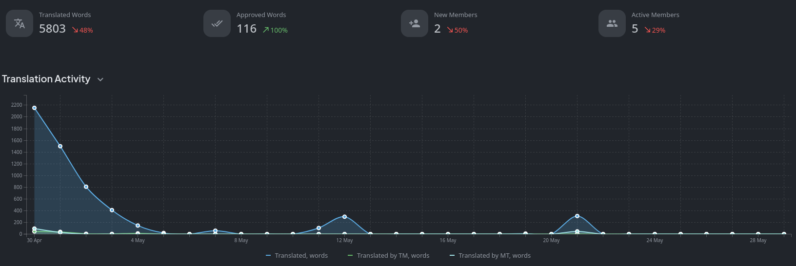
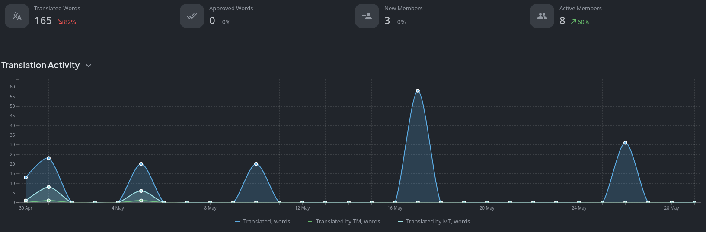
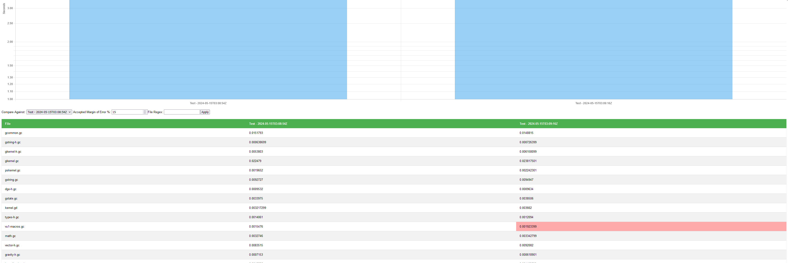
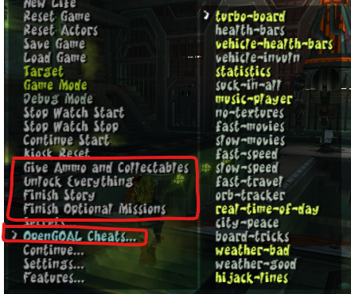
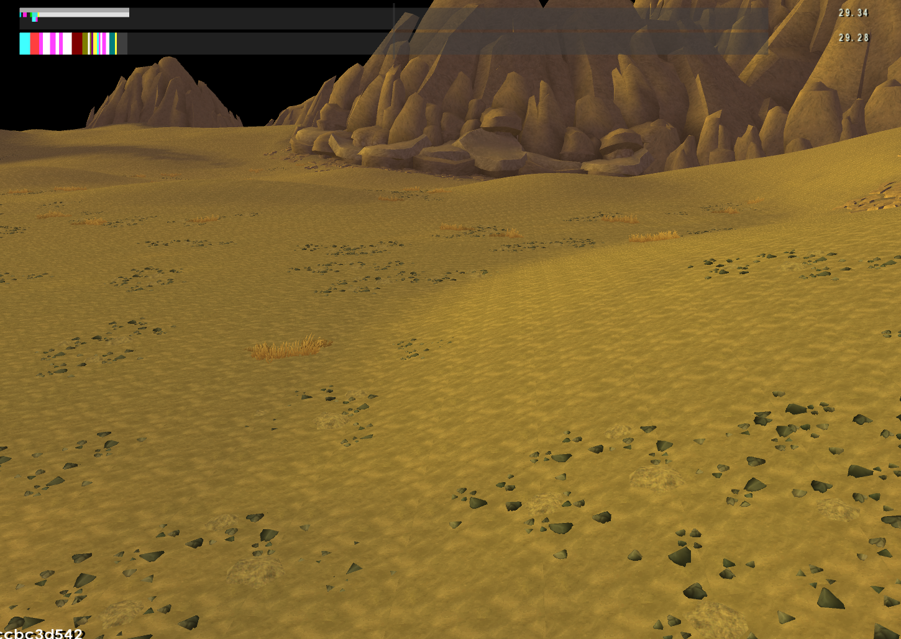
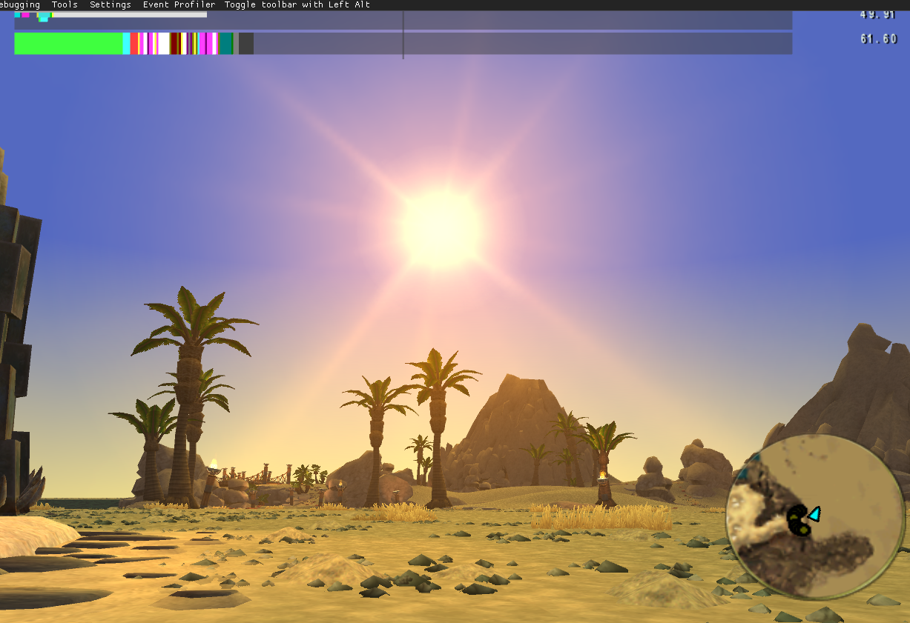
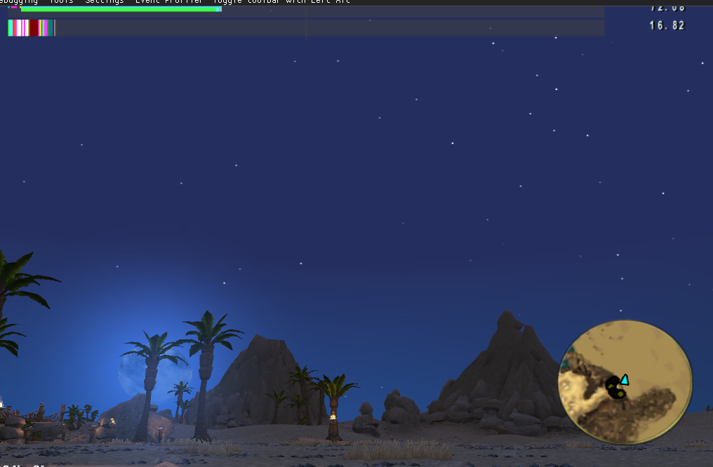
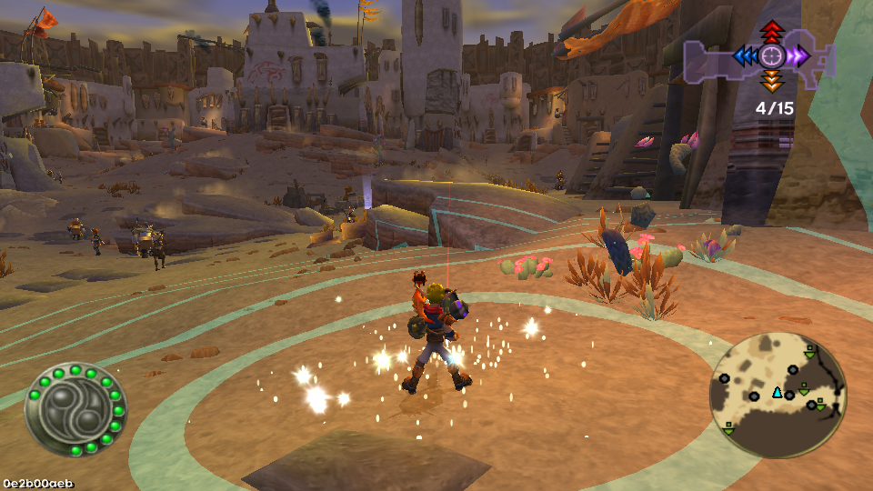
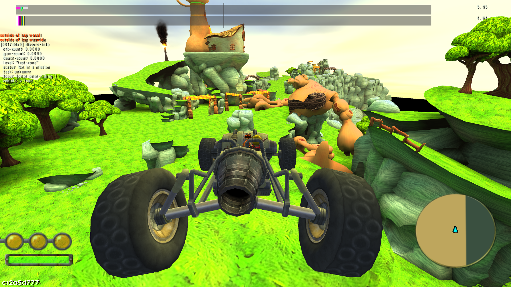

<head>
  <meta name="twitter:card" content="summary_large_image" />
</head>

Jak 3 decompilation is nearing completion.

<!--truncate-->

## Release Info

This month's OpenGOAL Tooling (jak-project repo) release is `0.2.13`.

  

    <LauncherDownloadLink />
  

## Translation Contributions

### Games

### Launcher

## General Changes

### Folder Location/Name Changes

Some folders have been renamed and/or moved.

The `custom_levels` folder was renamed to `custom_assets` and will, as the name suggests, house any form of custom asset the game needs (e.g. custom levels, textures, models, audio, etc.).

If you use any texture replacements, the game now looks for the `texture_replacements` folder in `custom_assets/<GAME>/texture_replacements` and it now works on a per-game basis instead of having a single folder for all three games.

### GOAL Compiler - Dependency Graph <PRLink href="https://github.com/open-goal/jak-project/pull/3505"/>

Still in early stages, preliminary work on generating a dependency graph for Jak 1's codebase has begun.

The current dependency tracking situation for our compiler is quite a mess. You can only use things that were defined in files that were compiled earlier in the build order and if you make a change to a file that is very early in the build order, incremental builds require you to build almost every file again, even though a majority of those files are false dependencies.

Once we have a proper dependency graph, these problems should go away and we get even more benefits:

- A proper build order with compiler warnings that tell you when something you try to use is not available at build time.
- Less boilerplate in the project makefile.
- Adding new source files becomes much simpler.
- Easier sharing of common code between two games.

### GOAL Compiler - Performance Report <PRLink href="https://github.com/open-goal/jak-project/pull/3519"/>

A tool was added to store the result of compiling a project in order to compare against other builds with respect to compile time.

## Jak 1

### "Build Actor" Tool <PRLink href="https://github.com/open-goal/jak-project/pull/3266"/> <PRLink href="https://github.com/open-goal/jak-project/pull/3540"/>

A very exciting new feature for custom level authors: You can now import models from Blender into the game to use for creating your own actors!

To clarify: This does **not** allow you to replace existing models, only add new ones to custom levels.

This is still in very early stages and may be improved upon in the future, but it works well enough for making some very basic custom actors, like your own collectables for example.

There are some limitations:

- You cannot import any animations, the model only has a single default idle animation that does nothing. The game's animation system is extremely complex and the format for animation data is very complicated and not well understood, so this will not be happening for a while.
- The model only has a single bone, located at its root.
- If the actor is using a collision mesh, collision is limited to 255 vertices per `collide-mesh`, although an actor can have multiple `collide-mesh`es as needed. Every object in Blender that has custom collision properties set will get its own `collide-mesh`.

An example actor was added to the `test-zone` level (accessible from the debug menu under Game -> Continue -> `test-zone-start`) that can be used as a starting point. The GOAL code for it is located in `test-zone-obs.gc`. Thanks to Kuitar for providing the model!

I wrote a small guide on how to use the tool [here](/docs/developing/custom_levels/custom_actors).

## Jak 2

### New Debug Menu Options <PRLink href="https://github.com/open-goal/jak-project/pull/3539"/>

For people that want to quickly give themselves a 124% save file, orbs/gems or just want to mess around with the cheats we added without unlocking them first, a couple of new debug menu options were added. The debug menu can be opened in Jak 2 by rebooting the game in debug mode (press Alt to bring up the top bar -> "Debugging" -> "Reboot in Debug Mode") and pressing L3 + Start.

## Jak 3

### `hfrag` Renderer <PRLink href="https://github.com/open-goal/jak-project/pull/3509"/>

`hfrag`, the desert renderer, was added. It's still missing the fancy texture animations for now, though.

### Sky Renderer <PRLink href="https://github.com/open-goal/jak-project/pull/3514"/>

The sky renderer has been added.

### Shadow Renderer <PRLink href="https://github.com/open-goal/jak-project/pull/3530"/> <PRLink href="https://github.com/open-goal/jak-project/pull/3532"/>

The shadow renderer was added.

New in Jak 3: The special effect for the Mass Inverter uses the shadow renderer.

### Custom Level Support <PRLink href="https://github.com/open-goal/jak-project/pull/3522"/>

Custom level support has been added to Jak 3.

### Decompilation Is Nearing Completion <PRLink href="https://github.com/open-goal/jak-project/pull/3506"/> <PRLink href="https://github.com/open-goal/jak-project/pull/3513"/> <PRLink href="https://github.com/open-goal/jak-project/pull/3515"/>

As of May 16th, all of the game's mission/gameplay code has been decompiled. The only things remaining that are actually needed are a couple of small files for setting up texture animations and a single large file (`bigmap`, used for the world map in the progress menu), the rest that were skipped are files that we don't need on PC for the game to function, like files used only for debugging PS2 hardware features, debugging graphics code or renderer code that was completely rewritten in C++ and is not required anymore.

:::info
Please keep in mind that this does **not** mean that the game is almost finished!
:::

The decompilation is only part of the effort, as we now need to squash all of the bugs that we find (and there are quite a few that we discovered so far, [here is the list](https://github.com/orgs/open-goal/projects/3/views/13) where we keep track in case you are curious), work on the remaining graphics stuff (`prim`, `blit-displays` and more) and, most importantly, finish Overlord 2 which will probably take up most of the time.
