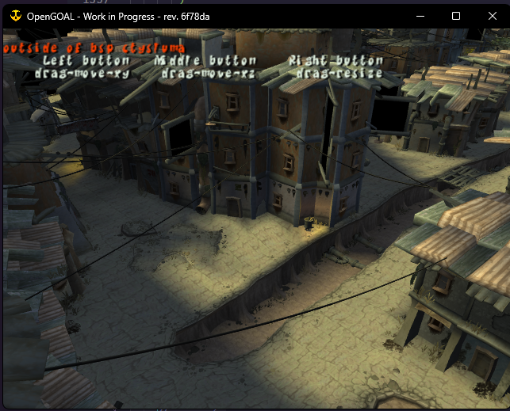

<head>
  <meta name="twitter:card" content="summary_large_image" />
</head>

Quite a lot of developments near the end of this month to share!

<!--truncate-->

## Project Level News

### Monthly Release Cadence

Along with every progress report we will be doing a release alongside it. This is for two main reasons

1. So we don't have a gigantic release in a few months from now and can fix bugs closer to when they are created
2. So the small amount of Jak 1 improvements can be released and used (ie. translations)

This month's release is:

- `0.1.30` OpenGOAL Tooling (jak-project repo)
- distributed via the `1.6.1` Launcher release

### Linux Launcher

If you're on Linux, we now distribute the Launcher via an AppImage. You can find instructions on how to use it [here](/docs/usage/installation/)

Let us know if you encounter any issues as it's still fairly fresh, and thanks to [qurious-pixel](https://github.com/open-goal/launcher/pull/61) for finding and helping to fix some early issues. This isn't the first open-source project's AppImage they've helped with! ;)

## Jak 1

### French Subtitles and Game Text <PRLink href="https://github.com/open-goal/jak-project/pull/2024"/>

A big translation contribution has merged, adding French translations for subtitles and the menu text additions we've added.

### Italian Game Text <PRLink href="https://github.com/open-goal/jak-project/pull/2037"/>

Work continues on the Italian subtitle translation as well, this only adds translations for our custom menu text additions.

## Jak 2 - Decompilation

### Collison Work

If you havn't gathered from the previous reports, collision is one of the biggest hurdles and we are still working our way through it.

#### Collide Shape and Others <PRLink href="https://github.com/open-goal/jak-project/pull/2008"/>

#### Spatial Hash <PRLink href="https://github.com/open-goal/jak-project/pull/2009"/>

#### Collide Cache Fixes <PRLink href="https://github.com/open-goal/jak-project/pull/2031"/>

### Cleanup of Files to get Target Working

`target` is the internal name for Jak, and a decent amount of time went into:

- cleaning up files we already had done
- completing a few files we skipped
- patching around bugs we've yet to solve

All in an effort to get Jak spawning in so we could test a bunch of stuff (like collision!)

#### Camera Code Cleanup <PRLink href="https://github.com/open-goal/jak-project/pull/2010"/>

#### Remaining Target and Drawing Code <PRLink href="https://github.com/open-goal/jak-project/pull/2012"/> <PRLink href="https://github.com/open-goal/jak-project/pull/2017"/> <PRLink href="https://github.com/open-goal/jak-project/pull/2026"/> <PRLink href="https://github.com/open-goal/jak-project/pull/2021"/> <PRLink href="https://github.com/open-goal/jak-project/pull/2027"/> <PRLink href="https://github.com/open-goal/jak-project/pull/2034"/>

#### generic-obs <PRLink href="https://github.com/open-goal/jak-project/pull/2013"/>

#### lightning-draw <PRLink href="https://github.com/open-goal/jak-project/pull/2019"/>

After a lot of work, we've succeeded and Jak is working pretty well already. Here's a bunch of test footage

<ReactPlayer controls url={require("./video/jak-collision.mp4").default} />

<ReactPlayer controls url={require("./video/jetboard.mp4").default} />

<ReactPlayer controls url={require("./video/jak-and-daxter.mp4").default} />

### In-game Editor Progress <PRLink href="https://github.com/open-goal/jak-project/pull/2029"/>

Jak 2 actually had a built-in editor that originally communicated with a MySQL database. This seems to have been used to allow the artists to move around various objects and lights within the levels, potentially collaboratively, and is one of the reasons why the game has some rudimentary mouse support.

It's still very much a work-in-progress and it doesn't do much yet, but we've finally gotten to the point where opening the editor no longer crashes the game, and some of the mouse code has started to be implemented.



<ReactPlayer controls url={require("./video/mouse.mp4").default} />

### Progress Menu "Opens"! <PRLink href="https://github.com/open-goal/jak-project/pull/2035"/>

While it's still not rendering properly yet and there are some critical pieces of code still missing; you can atleast open, close and cycle through the progress ring menu.

<ReactPlayer controls url={require("./video/progress-ring.mp4").default} />

### Sound-Effects Working in Game <PRLink href="https://github.com/open-goal/jak-project/pull/1991"/>

Soon the game will not be completely silent with audio work continuing and already working in-game to some extent, atleast with sound-effects.

<ReactPlayer controls url={require("./video/ingame-sfx.mp4").default} />

### MERC Rendering Progress

And we also don't have to be stuck looking at Jak's skeleton for much longer with MERC already starting to work:

<ReactPlayer controls url="https://www.youtube.com/watch?v=P55uBaoWXfA" />
<br />

## Jak 2 - Decompilation Tooling

### Better Documentation for using PAL <PRLink href="https://github.com/open-goal/jak-project/pull/1995"/>

While we don't recommend using a non-NTSC black label if you plan on developing, it isn't impossible and some better documentation was added to address this.

The reason we stick to one version is so everyone is all on the same page and working against the same target. Later versions obviously contain changes which can conflict with the manual type casts and such that we are forced to do.

> This of course can be worked around, but someone has to be the first to add these version-specific manual casts (potentially among other work)!

### REPL Quality of Life Increases

#### Key-binds, config, and startup commands <PRLink href="https://github.com/open-goal/jak-project/pull/2030"/>

As the REPL starts to be used more to test the actual game and debug problems, it's rough edges present themselves once again.

For example, you can find yourself running the same commands over and over to do things like:

- connect to the game
- attach a debugger (and continue from the initial break)
- open the backtrace when a crash occurs
- stop the debugger once it's crashed so you can relaunch it

Now, all of these tasks (and a few more) can be done with hotkeys

Additionally, you can define commands to automatically run on startup _and_ I'm slowly transitioning away from CLI args to a config file scheme.

<ReactPlayer controls url={require("./video/repl-binds.mp4").default} />

These key-bindings can be found [here](https://github.com/open-goal/jak-project/blob/master/common/goos/ReplUtils.cpp#L147) and ignore the comments, at the time of writing they were accidentally not updated to match the code!

#### Simplfy Reloading of an Object File <PRLink href="https://github.com/open-goal/jak-project/pull/2036"/>

One of the reasons why GOAL was so cool is they could edit source code, re-compile it, and reload it while the game was still running. Imagine doing something like tweaking Jak's speed without having to close and re-open the game every iteration.

This is done via the following function:

```opengoal
(ml "path-to-file-relative-to-project-dir")
```

However this can be a pain at times, especially since we've organized Jak 2's code in a much more nested-folder structure and we don't provide decent editor tooling to just say, for example, _reload this file when I save it_.

So this provides a decent workaround where you can just provide the name of the object file you want to reload and the REPL will go looking for it, if it finds it, it'll provide the full path on your behalf. For example

```opengoal
(ml "target")
```

:::tip
If you are constantly using `(mi)` and reloading the game from scratch to test changes, you should give this a shot instead!
:::
