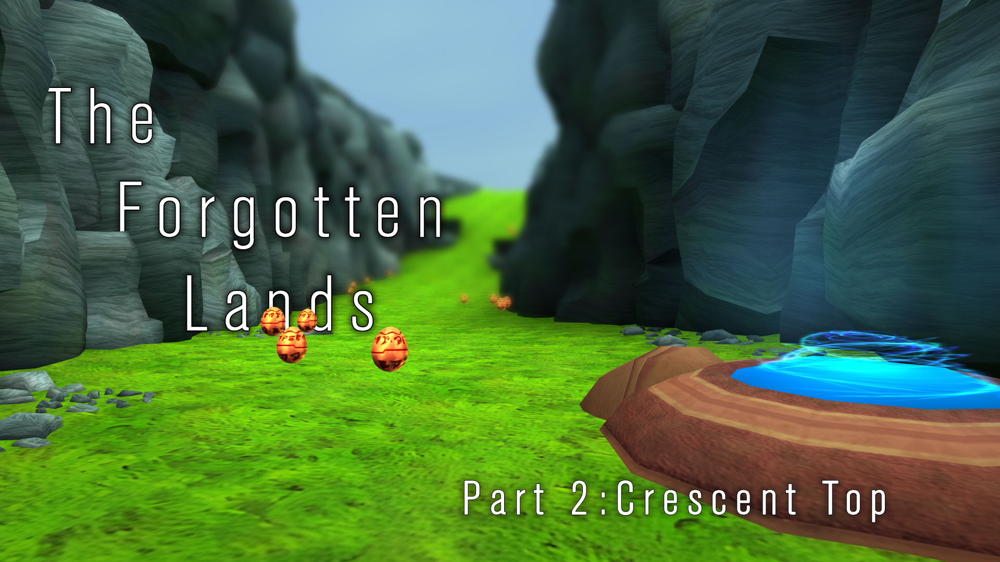
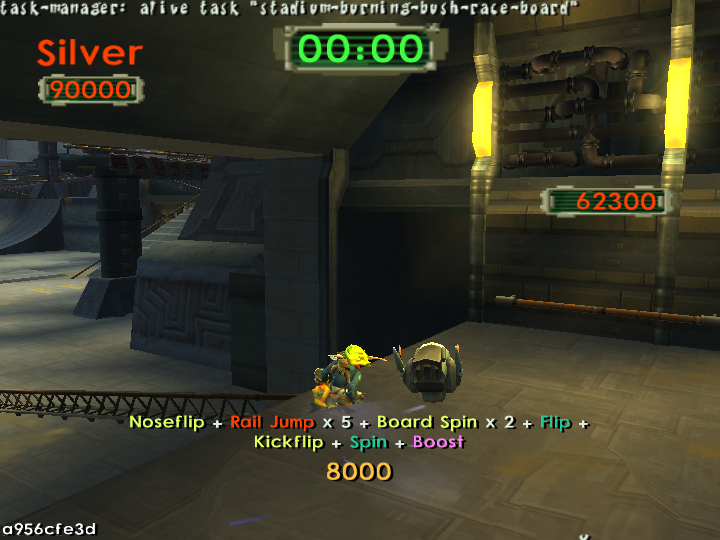
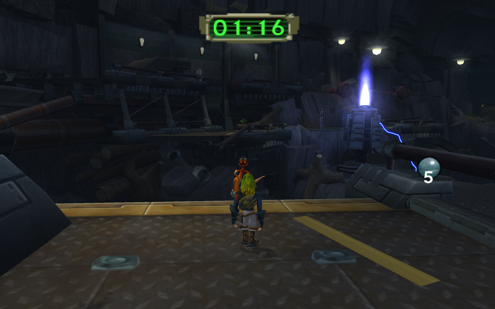

<head>
  <meta name="twitter:card" content="summary_large_image" />
</head>

TODO

<!--truncate-->

## Release Info

This month's OpenGOAL Tooling (jak-project repo) release is `0.2.4`.

  

    <LauncherDownloadLink/>
  

## Community Spotlight

### The Forgotten Lands - Chapter 2 by Kuitar

After 10 months since the release of Crystal Cave, Kuitar is back at it again with the second chapter of his mod "The Forgotten Lands", a new adventure with a new storyline and levels to explore! Featuring numerous additions and improvements to Crystal Cave as well as a bunch of completely new content, you can check it out in the [unofficial mod launcher](https://jakmods.dev).

Kuitar and I have also written a small release blog with some behind the scenes info on the level creation process and the code for the custom actors and music/hint systems you can check out [here](https://docs.google.com/document/d/1YBty5hZeAzFM2U7N3czlNhNrTFMq6NGaBxrtLF3n3nY) (it is recommended you play the mod first before reading it as it spoils some of the new content).

## Translation Contributions

### Games

### Launcher

## General Changes

### Add Jak 2 Custom Text to Crowdin <PRLink href="https://github.com/open-goal/jak-project/pull/3141"/>

Custom text we added in Jak 2 can now be translated via Crowdin. This does not include the original game's cutscene subtitles yet, but does include the new hint subtitles that were transcribed from the voice lines that play outside of cutscenes.

### Allow Replacing All Instances of a Texture with One Texture <PRLink href="https://github.com/open-goal/jak-project/pull/3234"/>

Previously, if you wanted to e.g. replace the textures for the Babak Lurker, this would have required replacing every instance of the texture for each level it appears in.

With this change, you can just put your replacement texture in an `_all` folder and it will automatically replace the texture wherever it appears. The normal path takes priority over the `_all` folder, so you can still replace textures on a per-level basis if you so choose.

## Jak 1

### Fix Projectile Bug <PRLink href="https://github.com/open-goal/jak-project/pull/3187"/>

A decompilation mistake was causing the Mother Spider's projectile to die immediately upon spawning.

## Jak 2

### Fallback English Text <PRLink href="https://github.com/open-goal/jak-project/pull/3128"/>

When using a language other than English that does not have a particular string localized, instead of using an `UNKNOWN ID` placeholder, the game will now fall back to the English version of the string.

### Improve Sky Performance <PRLink href="https://github.com/open-goal/jak-project/pull/3130"/>

On launch day, we got many reports of users getting terrible performance upon entering an outdoors area. It turns out this was an issue with Intel GPU drivers, where putting a lot of static data inside of shaders related to texture animations for the slime in the Weapons Lab would cause massive performance drops in the Sky renderer.

### Don't Force UK English on PAL version <PRLink href="https://github.com/open-goal/jak-project/pull/3142"/>

People who used a PAL ISO to decompile the game would have unlocalized menu options for any custom text because the game language would be forced to UK English.

### Fix Crash During Jetboard Training in Japanese <PRLink href="https://github.com/open-goal/jak-project/pull/3143"/> <PRLink href="https://github.com/open-goal/jak-project/pull/3171"/>

Due to an unhandled character sequence, the game would crash when trying to print a particular Japanese string.

### Fix Various High FPS Bugs <PRLink href="https://github.com/open-goal/jak-project/pull/3147"/> <PRLink href="https://github.com/open-goal/jak-project/pull/3177"/>

- At higher frame rates (144+), the Palace rotation effect when you're in the Throne Room would be broken because the rotation angle would become so small that some trigonometry functions would end up returning 0.
- First person camera turning speed.
- Speed of the texture scroll effect.
- Speed of the minimap wanted flash.
- Speed of flashing icons on the minimap (such as the kid during the escort kid mission).
- Ambush speed of Ginsu Metal Heads.

### Localize Trick Board Names And Use Large Font <PRLink href="https://github.com/open-goal/jak-project/pull/3157"/> <PRLink href="https://github.com/open-goal/jak-project/pull/3161"/>

Previously, the newly added board trick display just used the actual enum values for the trick names, now the names have been localized properly and it was changed to use the large font.

### Add Missing PC Options to Progress Menu <PRLink href="https://github.com/open-goal/jak-project/pull/3167"/> <PRLink href="https://github.com/open-goal/jak-project/pull/3238"/> 

On launch, we were missing a lot of options in the menus that we still had to hook up, such as MSAA, resolution, PS2 Options and the ability to quit the game from the title screen menu.

This also implemented the previously non-functional camera options, though they are still ineffective when entering a turret as of right now.

### Fix Missing Discord RPC Mission Images When Not in Debug Mode <PRLink href="https://github.com/open-goal/jak-project/pull/3176"/>

When playing the game in retail mode, the level icons would not show up on Discord's Rich Presence when a mission was active.

### Speedrunner Mode Improvements <PRLink href="https://github.com/open-goal/jak-project/pull/3131"/> <PRLink href="https://github.com/open-goal/jak-project/pull/3132"/> <PRLink href="https://github.com/open-goal/jak-project/pull/3181"/> <PRLink href="https://github.com/open-goal/jak-project/pull/3182"/>

- Automatically re-enable autosave when a speedrun is started.
- Allow opening the Speedrun Menu with L1 + R1 + Start.
- Dialogue no longer interferes with using Warp Gates or starting cutscenes.
- Added Category Support to Speedrun Menu.
- Back up and restore cheats when Speedrunner Mode is disabled.

### Fix "Select Controller" Option in Menu <PRLink href="https://github.com/open-goal/jak-project/pull/3191"/>

The "Select Controller" option in the menu was not working properly before.

### Transcribe Remaining English Subtitles <PRLink href="https://github.com/open-goal/jak-project/pull/3199"/>

The remaining English voice lines that play outside of cutscenes have been transcribed.

Some people have already started translating them to other languages, if you are interested in helping out, check out our [Crowdin page](https://crowdin.com/project/opengoal).

### Vehicle Hijack Lines PC Cheat <PRLink href="https://github.com/open-goal/jak-project/pull/3205"/>

Jak 2 has a **lot** of unused voice lines that still remain in the game files. One example of this are Jak and civilian voice lines that would have played when stealing a zoomer, similar to GTA.

A while back, I uploaded a video on my channel, showing off what the feature would have looked like (with a very high chance to play for demonstration purposes):

<ReactPlayer controls url="https://www.youtube.com/watch?v=YAksNB7E94E"/>
 

Due to popular demand, I decided to add this feature to OpenGOAL as one of the new PC cheats. When enabled, it has a random chance to play one of the Jak lines and a subsequent civilian line when stealing a zoomer (or only a Jak line when stealing a KG Bike/Hellcat).

The PC cheats are currently not yet fully done and can only be used via the REPL for now, but once they are complete and a menu for them is added, you will be able to adjust this random chance if you feel it happens too frequently.

### Fix Enemy Death Sounds Not Playing <PRLink href="https://github.com/open-goal/jak-project/pull/3206"/>

Enemies would previously not play their death sound due to a small bug.

### Fix Dark Jak Punch and Samos Sounds <PRLink href="https://github.com/open-goal/jak-project/pull/3214"/>

The Dark Jak punch sound and some Young Samos sounds should now play.

### Increase Level Graphics Loading Speed And Fix Stuttering During Unloading <PRLink href="https://github.com/open-goal/jak-project/pull/3227"/>

There have been some reports of people entering a level before the game had time to load in the level graphics, so the loading speed has been increased.

Similarly, during level graphics unloading, some people would encounter stutters, so fewer things are being unloaded per frame now.

This only affects the graphics and not any actual level loads.

### Support for Per-Prototype Shrub Visibility <PRLink href="https://github.com/open-goal/jak-project/pull/3228"/>

There have been many (too many...) reports of people thinking that the Strip Mine Eco Wells mission was not completable because of a missing rail section. The confusion only compounded because it looked like part of the rails were visible in OpenGOAL.

In reality, these rails are not needed at all to complete the mission and are, in fact, completely hidden on PS2, only showing up on the next Strip Mine visit where you have to drop the crate onto the Metal Head eggs.

OpenGOAL simply failed to hide the part of the rails that is made up of "shrubs". This bug has been fixed, which should hopefully clear up the confusion.

### Split up Language and Text Language settings <PRLink href="https://github.com/open-goal/jak-project/pull/3233"/>

Text language is now a new setting that can be selected separately from voice language.

### Support Deadzone Setting <PRLink href="https://github.com/open-goal/jak-project/pull/3239"/>

The analog deadzone setting would previously, like the camera options, not have any effect when changed.

### Fix Use-After-Free Bug in Children of `nav-enemy` <PRLink href="https://github.com/open-goal/jak-project/pull/3240"/>

This bug was the cause of some random crashes in the city and even though we knew about it for many months, it took us a very long time to finally figure it out. We even had a consistent setup for reproducing it, but had no clue what was causing it because the error we got was quite mysterious.

In the end, we found that it always happened when the current level was unloaded while a civilian was cowering on the ground due to Jak using the jetboard near them. This eventually lead to us finally realizing the cause was that during level unloading, the level's navigation mesh is unloaded, invalidating the `nav-control` for any process using that nav mesh, but the code for the civilian's `cower-ground` state is still trying to use it, crashing the game.

### Add Menu Option for Setting Game Territory <PRLink href="https://github.com/open-goal/jak-project/pull/3242"/> <PRLink href="https://github.com/open-goal/jak-project/pull/3243"/>

You can now select the territory the game should use. Useful if you want to e.g. play the game with civilians as they would behave in the Japanese version of the game.

### Add 90 FPS Menu Option <PRLink href="https://github.com/open-goal/jak-project/pull/3245"/>

A 90 FPS option was added to the frame rate setting for Steam Deck OLED users.
