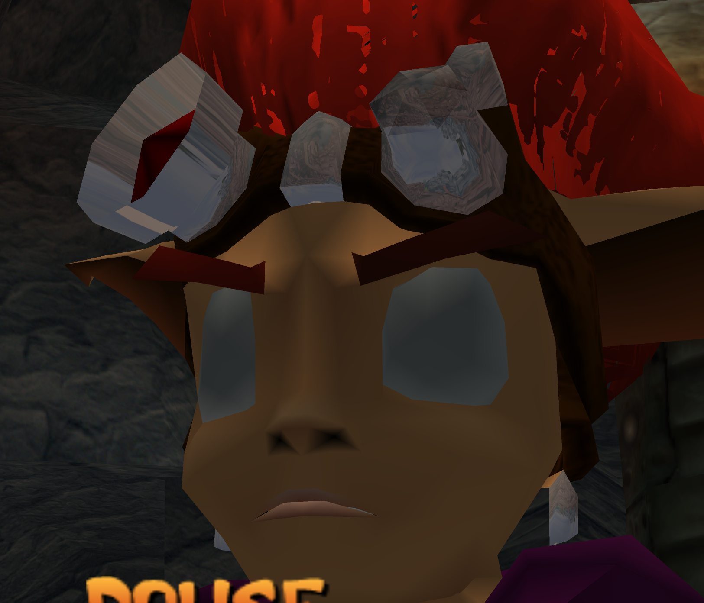
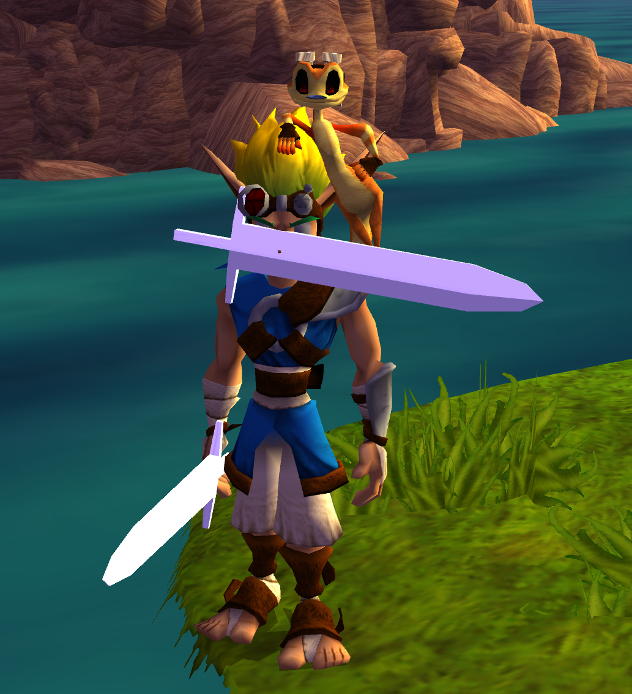
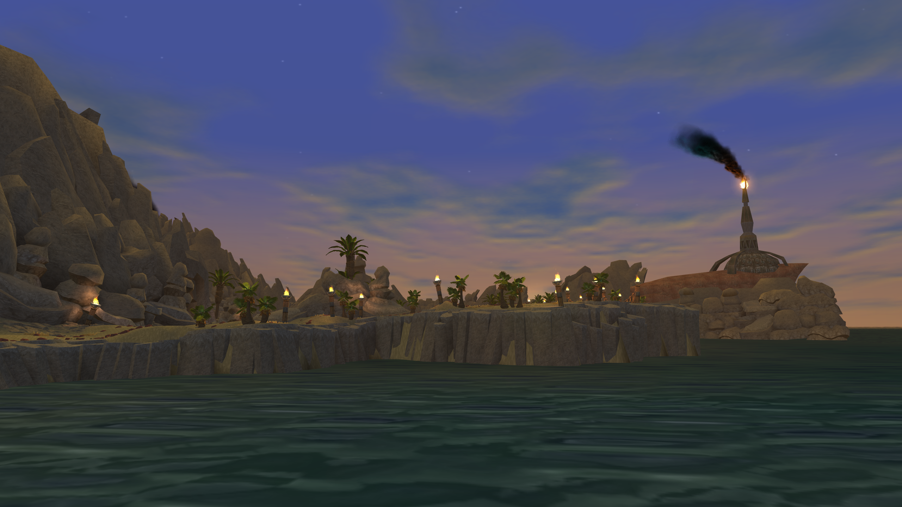
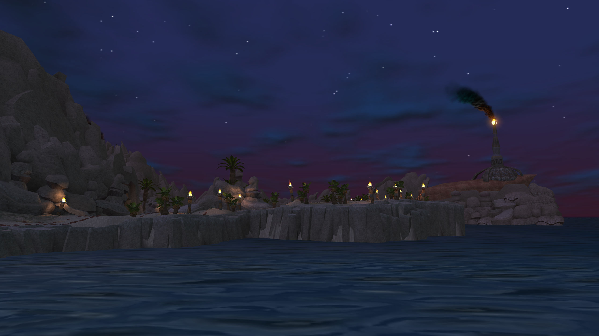
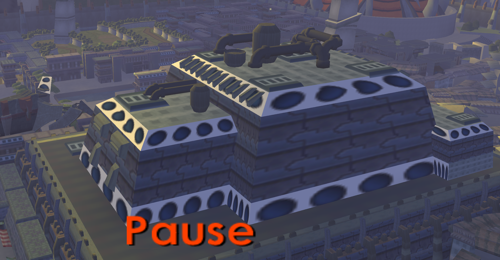
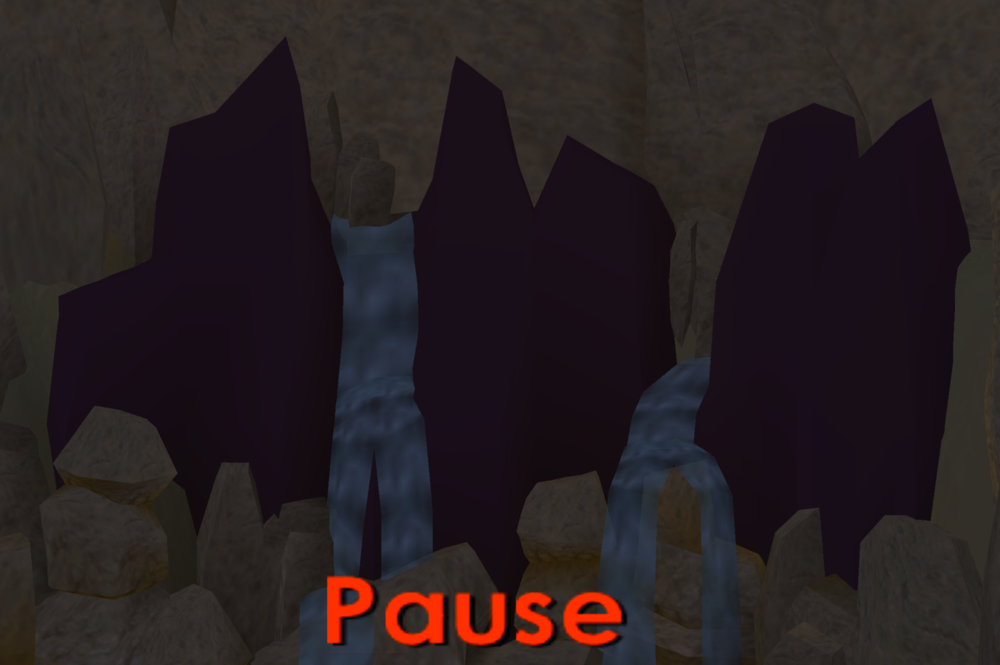
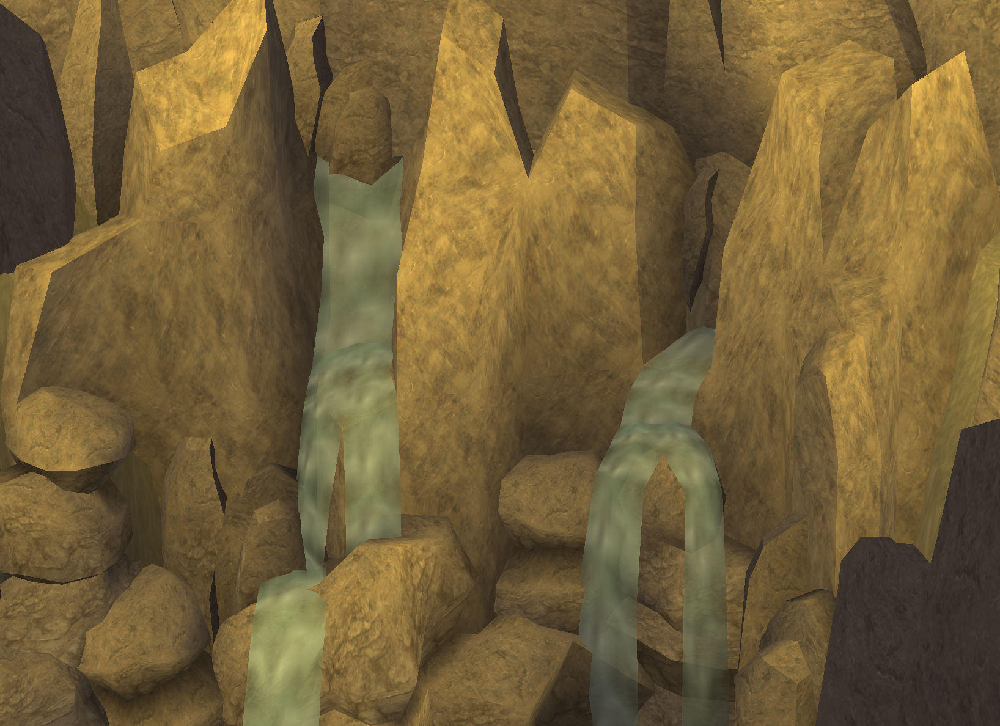

<head>
  <meta name="twitter:card" content="summary_large_image" />
</head>

Wouldn't you know it, more Jak 3 fixes!

<!--truncate-->

## Release Info

This month's OpenGOAL Tooling (jak-project repo) release is `0.2.19`.

<div className="row markdownMarginBottom">
  <div className="col col--12">
    <LauncherDownloadLink />
  </div>
</div>

## Community Spotlight

:::info
If you want to play these mods, follow the instructions [here](https://jakmods.dev/) to set up the mod list for the OpenGOAL launcher.
:::

### Jak The Chicken

Jak the Chicken, a mod that brings the gameplay mechanics and levels from the PS1 game "Mort the Chicken" to Jak, is not a new mod, but it has recently taken the Jak speedrunning community by storm after a couple of big updates by author Zed, which included tons of bug fixes and a facelift for all the levels. The short length and replayability make for a highly movement focused run with little room for mistakes or to catch your breath. Since the end of October, the Any% time has been lowered from ~11m all the way to 9m28s and counting.

There is also an open tournament going on that was recently announced and even has a small cash prize pool for the top 3 finalists. If you are interested, you can check out the latest announcement in the [Jak Racing Discord](https://discord.gg/NYfqndF) for more information on how to register. Ricky also has a good tutorial video for the Any% route if you want to learn:

<ReactPlayer
  controls
  url={"https://www.youtube.com/watch?v=mAQiAT_50Qw"}
  className="blog-video"
/>

## General Changes

### Fix Crash With Long Filenames <PRLink href="https://github.com/open-goal/jak-project/pull/3771"/>

If the game was installed in a really long file path (128+ characters) and tried to access files in that path (e.g. from reading/writing to the settings file), the game could crash due to a buffer overflow as there was only space for 128 characters in the character buffer.

### Support Apple Silicon Via Rosetta 2 <PRLink href="https://github.com/open-goal/jak-project/pull/3754"/>

Apple's compatibility layer for running x86 applications, Rosetta 2, has received AVX2 support in macOS Sequoia, meaning that after some updates to our CPU checking code, it is now possible to run OpenGOAL on Apple silicon devices via Rosetta 2.

### Fix Fullscreen On macOS <PRLink href="https://github.com/open-goal/jak-project/pull/3756"/>

Due to an issue with high DPI screens, turning on fullscreen on macOS would cause the game to be displayed in a small area inside the game window.

### `get-texture` Macro For Jak 1 and Jak 2 <PRLink href="https://github.com/open-goal/jak-project/pull/3778"/>

The `get-texture` macro added during the decompilation of Jak 3 has been backported to Jak 1 and 2's codebase. A database of every texture and texture page in the game is built during asset extraction, which is then used to turn code like this:

```opengoal
(set! *font-texture* (lookup-texture-by-id (new 'static 'texture-id :index #x1 :page #x4fe)))
```

Into:

```opengoal
(set! *font-texture* (get-texture ascii.12lo gamefontnew))
```

The `defpart` macro was also adjusted to support this:

```opengoal
(defpart 304
  :init-specs
  ((:texture (new 'static 'texture-id :page #x2))
   (:num 1.0)
   ...))
```

```opengoal
(defpart 304
  :init-specs
  ((:texture (bigpuff effects))
   (:num 1.0)
   ...))
```

## Custom Models

### Environment Mapping Support <PRLink href="https://github.com/open-goal/jak-project/pull/3777"/> <PRLink href="https://github.com/open-goal/jak-project/pull/3782"/> <PRLink href="https://github.com/open-goal/jak-project/pull/3784"/> <PRLink href="https://github.com/open-goal/jak-project/pull/3785"/>

It is now possible to apply environment mapping effects to materials to give models a shiny effect. Works with model replacements and custom actors.

<ReactPlayer controls url={require("./video/envmap.mp4").default} />



### Allow Custom Bone Weights <PRLink href="https://github.com/open-goal/jak-project/pull/3761"/>

With a new flag in the OpenGOAL Blender plugin, it is now possible to use custom bone weights to improve the look of model replacements.

<ReactPlayer
  controls
  url={"https://youtu.be/4VUTGA7-910"}
  className="blog-video"
/>



## Jak 3

### Fix `precd` Extraction <PRLink href="https://github.com/open-goal/jak-project/pull/3744"/>

A bug in the background geometry data for `precd`, the Dark Ship hangar area, was causing the level extraction to fail. With this, every level in the game is now accessible!


### Fix For Ocean Crash <PRLink href="https://github.com/open-goal/jak-project/pull/3746"/>

Rarely, when a level was being loaded, the game would crash somewhere in the graphics code for the ocean renderer. This was very consistent when using the warp gate after getting Light Jak Heal. This turned out to be a four year old bug that has miraculously never caused issues until now, where DMA transfer sizes would be considered to be 12 bits in size instead of 16 bits.

### Port of Jak 2 Subtitle System <PRLink href="https://github.com/open-goal/jak-project/pull/3758"/>

The improved subtitle system that we added in Jak 2, with support for non-cutscene subtitles, color-coded speaker names, etc. was brought over to Jak 3. Even excluding cutscenes, Jak 3 has **a LOT** of text (and tons and tons of unused voice lines as well), so transcribing all of that is going to take a while.


### Speedrunner Mode <PRLink href="https://github.com/open-goal/jak-project/pull/3761"/>

Speedrunner mode has been ported over to Jak 3.


### Add Highres Sky <PRLink href="https://github.com/open-goal/jak-project/pull/3761"/>

Another feature brought over from Jak 2, the high resolution sky texture animations have been added to Jak 3.




### Fix Soundbank Unloading <PRLink href="https://github.com/open-goal/jak-project/pull/3762"/>

Fixed an issue with unloading soundbanks, which was the cause of a couple of issues, like the blue gun variants using the wrong sounds from each other.

### Fix Marauder Spawns <PRLink href="https://github.com/open-goal/jak-project/pull/3765"/>

Marauders would often spawn halfway clipped into the ground and in other weird spots due to a decompilation mistake.

### Fix Intro Crash <PRLink href="https://github.com/open-goal/jak-project/pull/3770"/>

After watching the intro cutscene all the way to the end, the game would crash as soon as it transitions to displaying the title screen.

### Fix Ragdolls Settling Too Early <PRLink href="https://github.com/open-goal/jak-project/pull/3775"/>

A small decompilation error was causing ragdolls to be considered "settled" too early.

### Fix Some Background Textures <PRLink href="https://github.com/open-goal/jak-project/pull/3777"/>

Some background elements in levels had missing textures, on OpenGOAL, this would manifest by using the texture in texture slot 0, which happens to be the default eye texture, resulting in this:




On the original PS2, it looked like this:




We changed it to use suitable replacements:




### Fix Music Not Pausing <PRLink href="https://github.com/open-goal/jak-project/pull/3783"/>

Music now pauses correctly when entering the progress menu or select pausing.
