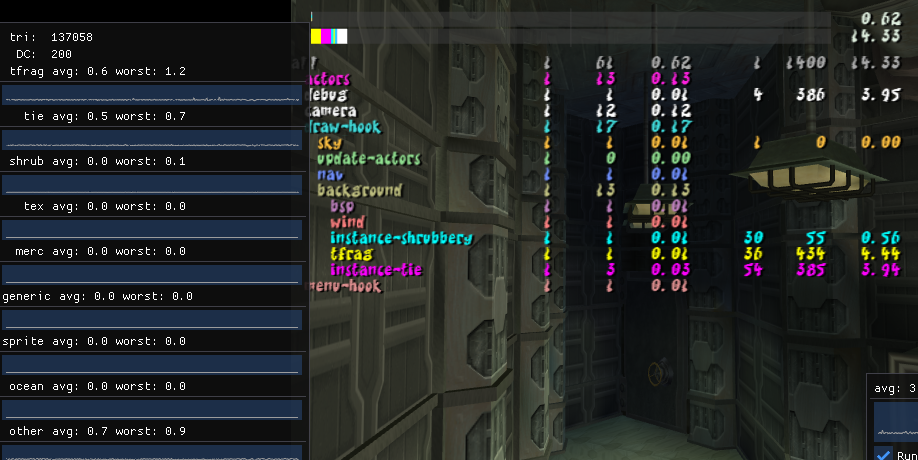
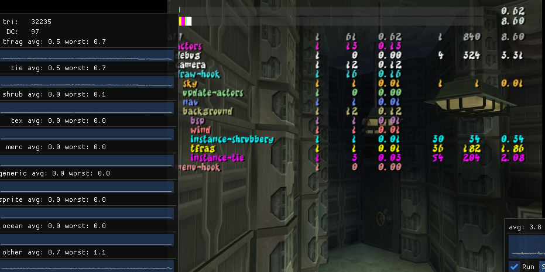
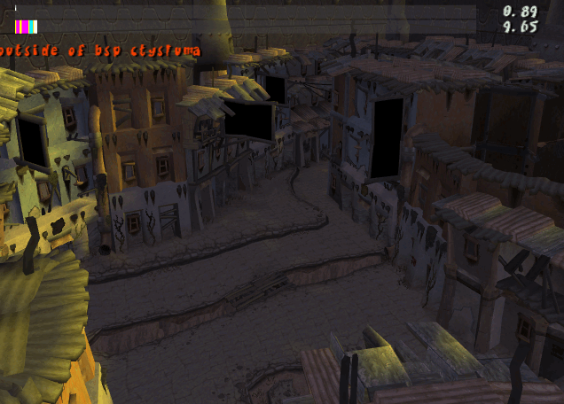
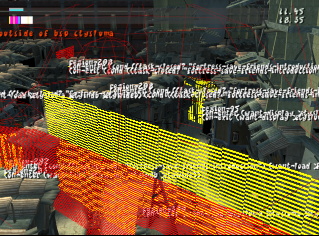
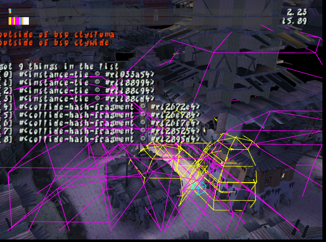

Another month gone, we're slowing down a little bit with the end of the year drawing close.  But there are still some things to share.

<!--truncate-->

## Jak 2 Decompilation

### 300 Files Started!

More files have been completed, this month we reached the 300 file started milestone.  Check the progress page for more details if you are interested.

Also by the time you are reading this we may have reached our 2000th GitHub issue / pull request (1999 at the time of writing)!

### Visibility Data <PRLink href="https://github.com/open-goal/jak-project/pull/1938"/>

Visibility data has been hooked up for Jak 2 and it seems to work quite well.


> Off


> On

### Partial Time of Day Support <PRLink href="https://github.com/open-goal/jak-project/pull/1943"/>

Partial time of day support has been implemented for Jak 2:



### Region Boundary Rendering <PRLink href="https://github.com/open-goal/jak-project/pull/1944"/>

More debugging code implemented and region boundary rendering now works



### Camera Code Running <PRLink href="https://github.com/open-goal/jak-project/pull/1945"/>

The camera code is now functional:

<ReactPlayer controls url={require("./video/camera.webm").default} />

### Sky Renderer Functional <PRLink href="https://github.com/open-goal/jak-project/pull/1972"/>

The sky renderer returns:

<ReactPlayer controls url={require("./video/sky.webm").default} />

The stars are no longer particles like they were in Jak 1!

### Preliminary Sound Effect Support <PRLink href="https://github.com/open-goal/jak-project/pull/1991"/>

A early preview of Jak 2's audio working

Various Sound Effects
<audio controls src={require("./audio/sfx.mp3").default}/>

Ambience 1
<audio controls src={require("./audio/ambience1.mp3").default}/>

Ambience 2
<audio controls src={require("./audio/ambience2.mp3").default}/>

Ambience 3
<audio controls src={require("./audio/ambience3.mp3").default}/>

Ambience 4
<audio controls src={require("./audio/ambience4.mp3").default}/>

### Work has begun on the collision code <PRLink href="https://github.com/open-goal/jak-project/pull/1998"/>

One of the more painful and historically problematic areas has been the collision code.  Additionally, in Jak 2 there are entirely new systems we will have to contend with, `collide-hash` was one of these and isn't well tested _yet_.

Here's some debugging visualizations from the collision code that has been done so far.



### Bulk of the Ocean Renderer <PRLink href="https://github.com/open-goal/jak-project/pull/1994"/>

The Ocean renderer was a painful one in Jak 1, and it has changed a bit in Jak 2 but is thankfully largely the same.

One cool thing about Jak 2 is that the ocean is different depending on the level, where as Jak 1's was always the same style and color.

## Decompilation Tooling

### `defpart` and `defpartgroup` Support for Jak 2 <PRLink href="https://github.com/open-goal/jak-project/pull/1947"/>

Particle related macro support added for Jak 2

### `defskelgroup` Fixed for Jak 2 <PRLink href="https://github.com/open-goal/jak-project/pull/1958"/>

Skeleton group related macro has also been updated to support Jak 2.

### Nicer Output for `giftags` <PRLink href="https://github.com/open-goal/jak-project/pull/1970"/>

Giftags should decompile a lot better now:

```opengoal
      :gif0 (new 'static 'gif-tag64
        :nloop #x4
        :eop #x1
        :pre #x1
        :prim (new 'static 'gs-prim :prim (gs-prim-type tri-strip) :iip #x1 :tme #x1 :fge #x1 :abe #x1)
        :nreg #x3
        )
      :gif1 (new 'static 'gif-tag-regs :regs0 (gif-reg-id st) :regs1 (gif-reg-id rgbaq) :regs2 (gif-reg-id xyzf2))
```

Instead of

```opengoal
:gif (new 'static 'array uint64 2 #x303e400000008004 #x412)
```

### Offline Test Parallelization <PRLink href="https://github.com/open-goal/jak-project/pull/1974"/>

Offline test work can now be divided amongst individual threads.

This is work done in-advance of a problem -- Jak 2 has _alot_ of files.  Currently a single file can take about 120ms on average (100ms for decompilation, 20ms for compilation).  This means that Jak 2's 800-900 files would take atleast 1.5 minutes for a full test, which is too slow for fast iteration.

Now if we take that same amount of work (800 files), and divide it amongst -- let's say 32 threads (25 files per thread). We are now talking sub 10 seconds for the entire game.

## Jak 1

### Skip Added Back for Daxter/Naughty Dog Intro Cutscene <PRLink href="https://github.com/open-goal/jak-project/pull/1965"/>

Was removed a while back but has been re-added.

### Spanish Game Text <PRLink href="https://github.com/open-goal/jak-project/pull/1980"/>

Spanish translation was improved by adding translations for most of the game text translations.
