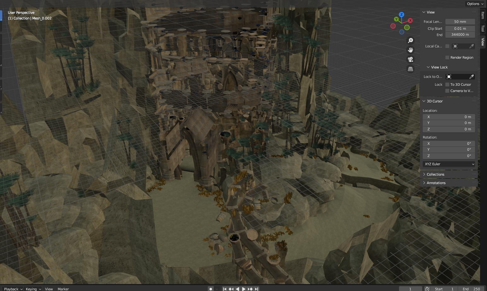

<head>
  <meta name="twitter:card" content="summary_large_image" />
</head>

The wait is finally over.

<!--truncate-->

## Release Info

This month's OpenGOAL Tooling (jak-project repo) release is `0.1.44`.

<div className="row markdownMarginBottom">
  <div className="col col--6">
    <LauncherDownloadLink/>
  </div>
</div>

## Jak 2 Beta Release

With this month, the long wait is finally over! We feel that Jak 2 is now in a good enough state to release as an open beta on the launcher. It is still not perfect and we are aware of some remaining bugs that we still need to iron out, but the game is 100% completable!

:::tip
You will require the latest version of the launcher **2.3.0** to install and play Jak 2 with it!
:::

Coinciding with this release, we have put together an updated tutorial for newcomers on how to install the game, some common troubleshooting steps and how to report any issues you may experience:

<ReactPlayer
  controls
  url="https://www.youtube.com/watch?v=K84UUMnkJc4"
  className="blog-video"
/>

[We have a project board on our GitHub](https://github.com/orgs/open-goal/projects/3/views/8) that lists known bugs for Jak 2.
If you encounter anything that is not listed there, you can:

- [Create an issue on GitHub](https://github.com/open-goal/jak-project/issues) using the Jak 2 bug report template, filling out as much information as you can.
- [Join our Discord server](https://discord.gg/ugmTTV2wGP) and report your problem in the `help-and-questions` channel by creating a new thread (ensuring that your problem is not already reported). If you're using the launcher, make sure to also upload the support package, that will make it much easier for us to help.

:::danger
Some of the bigger gameplay issues we are aware of:

- Camera Options and a few other menu options are not implmented yet.
- Occasionally, some sound effects can cut off abruptly. This is particularly an issue in the gun course and when playing at higher frame rates.
- This is an original game bug, but there are some sounds (such as Sig's Peace Maker charging sound) that always play at max volume regardless of audio settings and also play even if the game is paused.
- The texture for the ocean is still a bit wrong.
- Some HUD Elements might not line up correctly.

For common problems relating to the launcher and the installation process, refer to the video linked above.
:::

## Translation Contributions

### Games


### Launcher


## General Changes

### Bone Export for Models <PRLink href="https://github.com/open-goal/jak-project/pull/3087"/>

When exporting models, bones will now also be exported if the model has any.


### Formatter Rewrite and Documentation <PRLink href="https://github.com/open-goal/jak-project/pull/3096"/>

The OpenGOAL formatter has gotten a rewrite, refactor and some [documentation](https://github.com/open-goal/jak-project/blob/master/common/formatter/README.md) that gives insight into the problem of trying to write a new formatter for a custom language. It turns out it's not super easy, even if your language is a Lisp!

### Texture Merging <PRLink href="https://github.com/open-goal/jak-project/pull/3083"/>

A new decompiler feature similar to texture replacements, but the non-transparent part of the replacement image is merged into the original texture instead of replacing it completely.

### Compiler Speedups <PRLink href="https://github.com/open-goal/jak-project/pull/3066"/>

A lot of under the hood optimizations to the GOOS interpreter have been made that resulted in a ~50% reduction in compile times.

### Support for Packing Textures in Custom Levels <PRLink href="https://github.com/open-goal/jak-project/pull/3089"/>

Some of the game's textures are not part of any art group or the common level files, which previously meant that the only way to use them in a custom level would be to have another level loaded that has them. One particular example of this is the HUD for the Zoomer. Now, you can specify which textures to separately pack into a custom level.

### Better Detection of Art Groups and `joint-node-index` Macro <PRLink href="https://github.com/open-goal/jak-project/pull/3061"/>

The decompiler now goes through all of the game's art groups to extract information about the joints of a model in order to turn code like this:

```opengoal
(create-splash
  (-> self water)
  (the-as float 0.6)
  (vector<-cspace! (new 'stack-no-clear 'vector) (-> self node-list data 37))
  0
  (-> self control transv)
  )
```

Into:

```opengoal
(create-splash
  (-> self water)
  (the-as float 0.6)
  (vector<-cspace! (new 'stack-no-clear 'vector) (joint-node-index eichar-lod0-jg mouth))
  0
  (-> self control transv)
  )
```

Which gives us a much better understanding of what is going on. `eichar` is the name of Jak's model in Jak 1 (`lod0` is the highest level of detail and `jg` is "joint geometry"), so this code is creating water splash particles at the position of Jak's mouth.

Additionally, the art group detection has been vastly improved to detect 99% of occurences and turns code like this:

```opengoal
(let ((v1-12 (ja-group)))
  (if (and v1-12 (or (= v1-12 (-> self draw art-group data 29)) (= v1-12 (-> self draw art-group data 28))))
      (ja-channel-push! 1 (seconds 0.03))
      (ja-channel-push! 1 (seconds 0.08))
      )
  )
```

Into:

```opengoal
(let ((v1-12 (ja-group)))
  (if (and v1-12 (or (= v1-12 ashelin-standing-idle-ja) (= v1-12 ashelin-standing-fire-ja)))
      (ja-channel-push! 1 (seconds 0.03))
      (ja-channel-push! 1 (seconds 0.08))
      )
  )
```

So we know exactly which animations the game is referencing here.

## Jak 1

### Fix Bug With Eco Pickup Timer <PRLink href="https://github.com/open-goal/jak-project/pull/3056"/>

A regression was introduced in a big refactor that would cause the eco pickup timer to become desynced when e.g. watching a cutscene, resulting in one blue eco blob giving you a full meter.

## Jak 2

### Extractor Support <PRLink href="https://github.com/open-goal/jak-project/pull/3042"/>

As part of the beta release, the extractor was adjusted to support Jak 2.

### Custom Level Support <PRLink href="https://github.com/open-goal/jak-project/pull/3090"/>


A major refactor and cleanup of the level building code was performed in order to split things up into common code shared by all games and game specific code. Along with this, early support for creating custom levels in Jak 2 has been added. The process is relatively similar to Jak 1, with some small differences.

Some sections are slightly outdated at this point and it only covers Jak 1, but you can refer to [Kuitar's guide](https://opengoal.dev/docs/category/custom-levels) if you want to get started with making levels.

:::caution
Custom level support is still in very early stages for both games and the tooling is still quite primitive.
:::

### Fix Auto-Save Crash in Speedrunner Mode <PRLink href="https://github.com/open-goal/jak-project/pull/3048"/>

A copy-paste from Jak 1's Speedrunner Mode that force enables auto-saving caused a crash in Jak 2 when an auto-save was triggered.

### Fix Minor Visual Bugs and Race Timer <PRLink href="https://github.com/open-goal/jak-project/pull/3090"/>

In the original game, the Construction Site and Underport icons are green, which is actually not intended. The real colors for the icons have been restored.

 

The race timer has also been fixed to use a hundredths timer instead of a 60ths timer.

### Fix Collision Extraction <PRLink href="https://github.com/open-goal/jak-project/pull/3081"/>

When a collide fragment had exactly 256 polygons, parts of the collision would not be extracted properly.

### High Frame Rate Disclaimer <PRLink href="https://github.com/open-goal/jak-project/pull/3092"/>

[Last month](https://opengoal.dev/blog/progress-report-sept-2023/#experimental-support-for-higher-frame-rates-), we added experimental support for higher frame rates to Jak 2.

To make sure people are aware that this option is experimental and bugs are to be expected, we added a disclaimer when trying to go past 60 FPS for the first time in a session.

<ReactPlayer
  controls
  url={require("./video/frame-rate-disclaimer.mp4").default}
  className="blog-video"
/>

## Jak 3

### Allow Decompiler To Run on Jak 3 Code and Improve `all-types` Generation <PRLink href="https://github.com/open-goal/jak-project/pull/2526"/>

This PR has been around since April, but has only been merged recently.
It includes most of the necessary changes to set up Jak 3 for use with the decompiler.

Along with this, it also vastly improves the `all-types` generation (a big file used by the decompiler that we have to change a lot during decomp, containing information about every single type, method and function in the game), which will save us a lot of time over the course of the decompilation process.

### `goal_src` Skeleton for Jak 3 <PRLink href="https://github.com/open-goal/jak-project/pull/3069"/>

The folder structure for all of the code files present in Jak 3 (it's over 1000 this time!) has been laid out and stubs have been added.

### Support for v5 Data Files <PRLink href="https://github.com/open-goal/jak-project/pull/3076"/> <PRLink href="https://github.com/open-goal/jak-project/pull/3077"/>

Jak 3 data files are now handled by the decompiler, allowing us to work with files like art groups (containing models), textures and level data.

### Allow Texture and Model Extraction <PRLink href="https://github.com/open-goal/jak-project/pull/3080"/>

It is now possible to extract textures and models from Jak 3 assets. The results are not quite perfect yet and some things are not handled as of now (such as the new desert renderer), but it's a good start and hopefully means that the main foreground and background renderers have not changed a whole lot between Jak 2 and 3.




### Implement Missing `pexcw` Instruction <PRLink href="https://github.com/open-goal/jak-project/pull/3084"/>

The MIPS instruction `pexcw` was not being handled by the decompiler. It's only used in two files in Jak 3.
