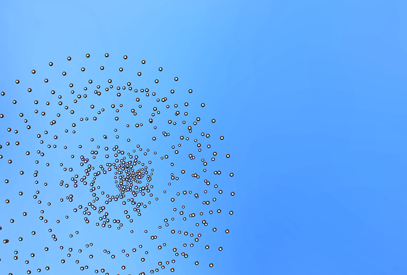
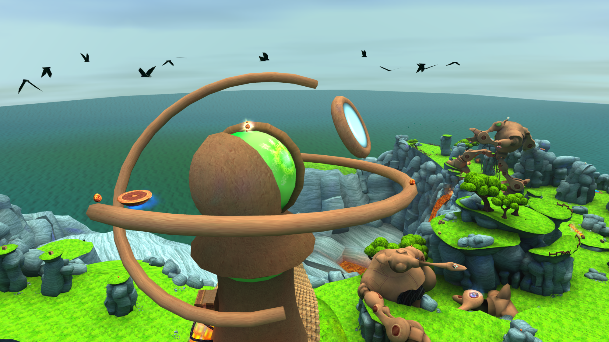
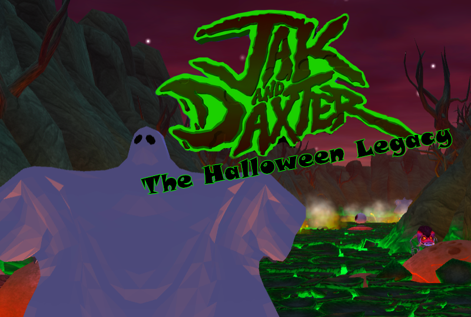
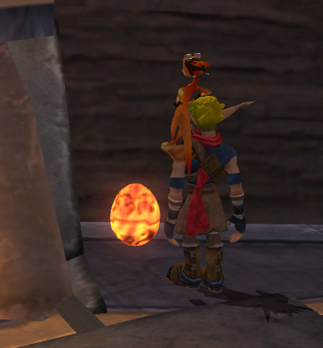
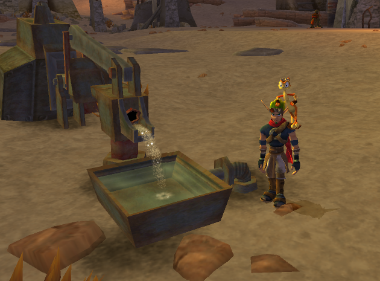
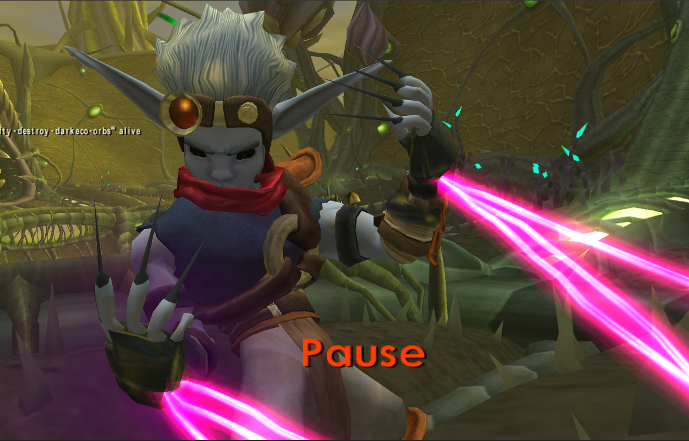

<head>
  <meta name="twitter:card" content="summary_large_image" />
</head>

Yet more fixes for Jak 3 and custom levels.

<!--truncate-->

## Release Info

This month's OpenGOAL Tooling (jak-project repo) release is `0.2.18`.

  

    <LauncherDownloadLink />
  

## Community Spotlight

:::info
If you want to play these mods, follow the instructions [here](https://jakmods.dev/) to set up the mod list for the OpenGOAL launcher.
:::

### Platformia

Grateful Forest's first mod, Platformia, was released earlier this month. It's a challenge mod featuring lots and lots of platforms moving in mesmerizing paths and your goal is to get to the top!

### Orb Hunt Updated for TFL Chapter 2

Barg's Orb Hunt mod has been updated to include the two levels that were added in the second chapter of Kuitar's Forgotten Lands, Crescent Top and Energy Bay.

### Jak and Daxter - The Halloween Legacy

Just in time for Halloween, Clanque has released their Halloween themed overhaul of Jak 1, featuring plenty of spooky model and texture replacements for the entire game. Check out the trailer!

<ReactPlayer
  controls
  url={"https://www.youtube.com/watch?v=SYEALIfXZsY"}
  className="blog-video"
/>

## General Changes

### Add `--iso-path` Parameter for `goalc` <PRLink href="https://github.com/open-goal/jak-project/pull/3692"/>

The compiler can now be given a custom ISO path with the new `--iso-path` command line parameter.

## Custom Levels

### Support for Compressed GLB Files <PRLink href="https://github.com/open-goal/jak-project/pull/3723"/>

Custom levels now support using compressed GLB files by utilizing Google's [Draco Library](https://google.github.io/draco/) for 3D model compression, saving tons of space.

### Miscellaneous Bug Fixes <PRLink href="https://github.com/open-goal/jak-project/pull/3736"/>

- Metallic textures will now be resized automatically to match the base color's texture size.
- Fix cases with bad vertex colors/alphas in certain spots.
- When changing scale on some objects in Blender, the length of exported normals would sometimes be wrong, so they are now normalized first.

## Jak 2

### Make Turret Controls Respect Camera Settings <PRLink href="https://github.com/open-goal/jak-project/pull/3715"/>

After entering a gunpod, the camera will now use the correct settings as defined in the Camera Options menu.

## Jak 3

We're getting close to fixing all of the (known) remaining graphics issues. This month, most of the bug fixes revolved around fixing or implementing missing/broken graphics features.

### Fix `maker` Projectile Flashing <PRLink href="https://github.com/open-goal/jak-project/pull/3702"/>

Due to a bad rotation value, whenever a projectile from one of the Dark Makers during the Defend Spargus mission was visible, a nauseating effect would be drawn over the screen.

:::danger
EPILEPSY WARNING

<ReactPlayer controls url={require("./video/maker-projectile.webm").default} />
:::

### Fix Envmap Texture <PRLink href="https://github.com/open-goal/jak-project/pull/3704"/>

Merc models were using the wrong default texture for their environment mapping effect.

### Merc Fade Support <PRLink href="https://github.com/open-goal/jak-project/pull/3710"/>

"Merc Fade" is a transparency effect on foreground models, used for example to make Jak invisible when interacting with a Dark Maker idol.

<ReactPlayer controls url={require("./video/merc-fade.mp4").default} />

### Fix `kleever-diaper` Secret <PRLink href="https://github.com/open-goal/jak-project/pull/3713"/>

A small decompilation error resulted in the "Kleiver's Diaper" secret not working as intended.

### Fix `bigmap` Player Cursor Texture <PRLink href="https://github.com/open-goal/jak-project/pull/3721"/>

The texture for the player cursor on the world map now shows up properly.

### Fix `neo-sat` Particles and Ropes <PRLink href="https://github.com/open-goal/jak-project/pull/3722"/>

During the Dark Satellite fight in the desert, the particle effect when it smashes into the ground and the ropes were not drawing correctly.

### Texture Animation Fixes <PRLink href="https://github.com/open-goal/jak-project/pull/3732"/> <PRLink href="https://github.com/open-goal/jak-project/pull/3734"/> <PRLink href="https://github.com/open-goal/jak-project/pull/3735"/>

The last of the remaining bugs with texture animations have been squashed, these include:

- Missing glider ring texture animation.
- Missing War Factory conveyor texture animation.
- Some special eye texture animations would not show up, like the Dark Jak eye effect in cutscenes.
- Texture animations that were using a size override would show up as black while not being animated.

<ReactPlayer controls url={require("./video/glider-ring.mp4").default} />
<ReactPlayer controls url={require("./video/tie-texture-anim.mp4").default} />

