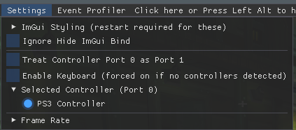
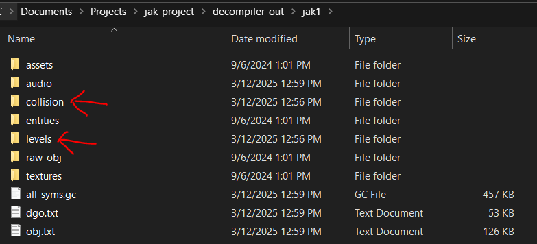
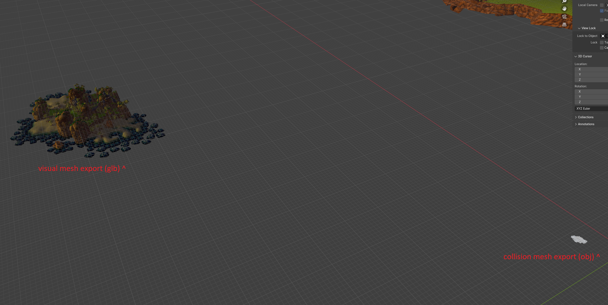
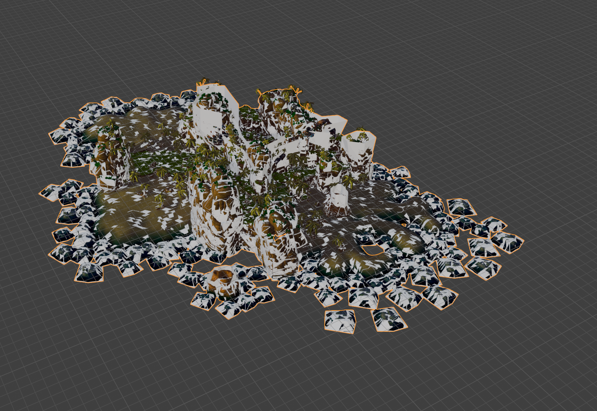
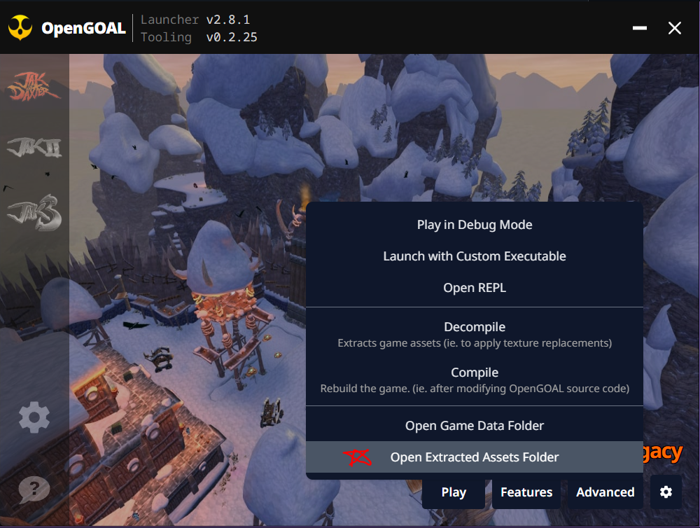
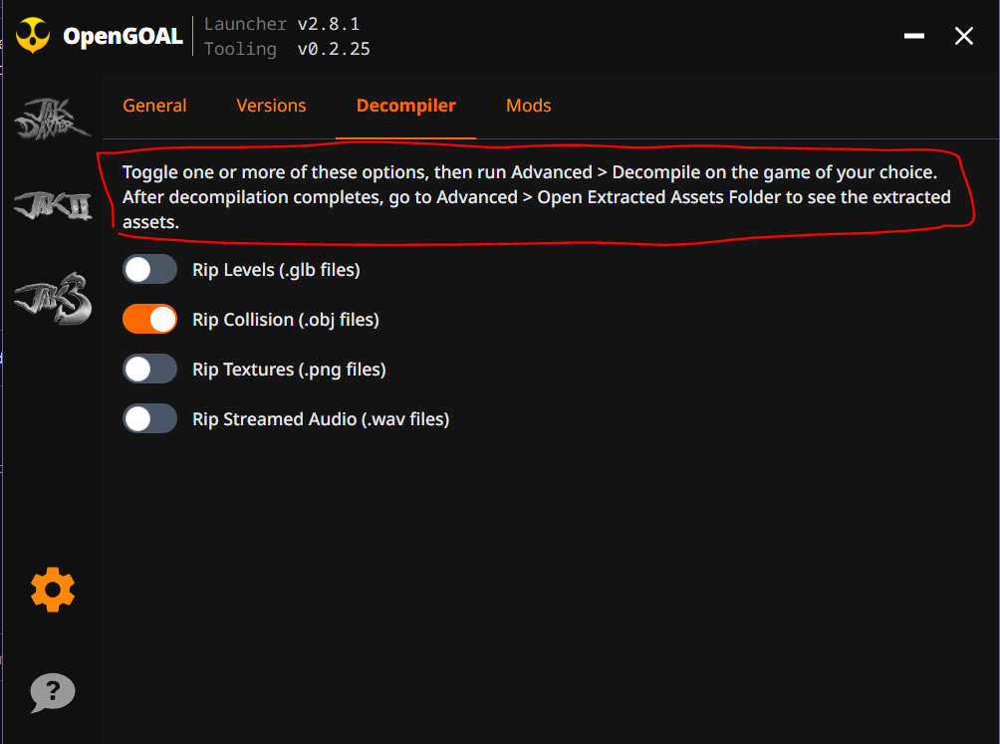
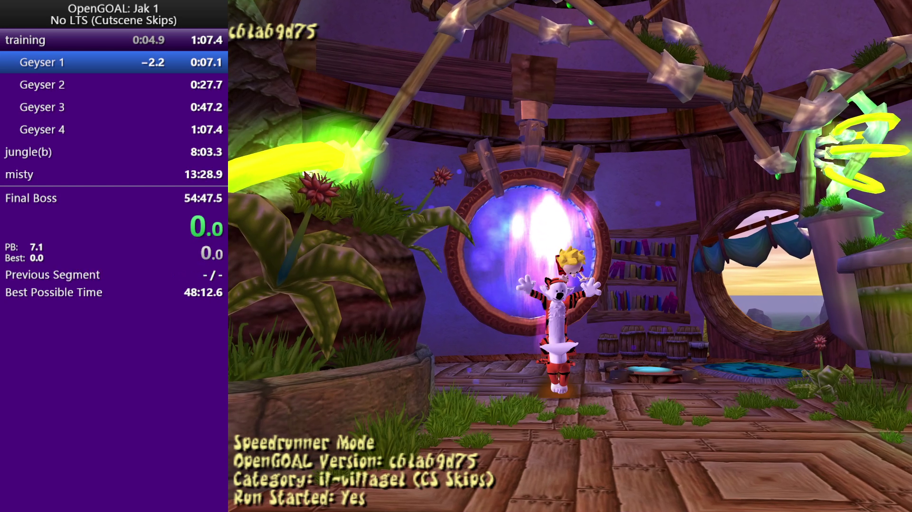
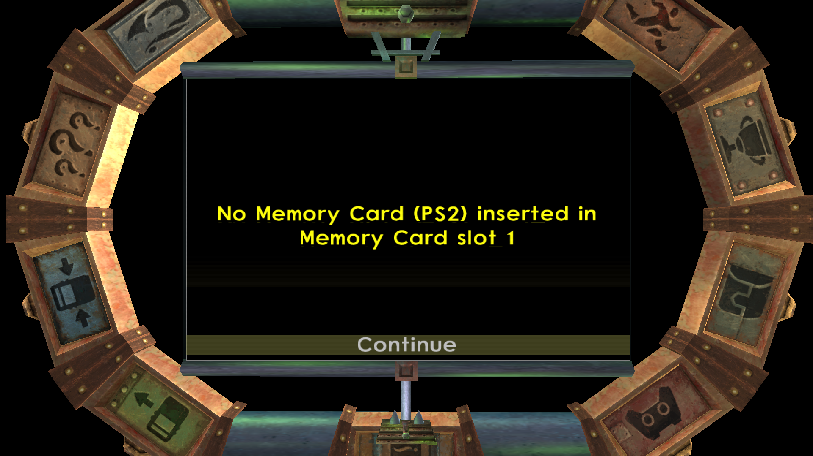
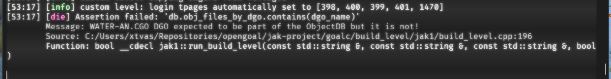

<head>
  <meta name="twitter:card" content="summary_large_image" />
</head>

As many of you noticed, it's been awhile since the last Progress Report 😅. Worry not, the project is still alive and well, but development on OpenGOAL Jak 3 has been a bit slower as of late.

<!--truncate-->

While we of course appreciate the enthusiasm and interest in the project, please keep in mind that this project only exists thanks to a small number of people working on it in their free time. Jak 3 development is quite far along, most missions are playable, but the known issues and missing features will take some dedicated time to complete. There is no ETA for a launcher release at this time, given the unknowns in the remaining work and uncertainty of developer availability.

You may also have noticed the title of this Progress Report says "Q2 2025" instead of "May 2025". Going forward, we are planning to release these Progress Reports on a quarterly basis, as we feel this should better match the pace of development (and less developer time spent writing reports = Jak 3 sooner, right?)

## Release Info

This month's OpenGOAL Tooling (jak-project repo) release is `0.2.26`.

  

    <LauncherDownloadLink />
  

## Community Spotlight

### The Forgotten Lands: Chapter 3

Kuitar and HatKid return with another update for The Forgotten Lands! If you've been living in the dark, The Forgotten Lands is an incredible Jak 1 mod with fully-fledged custom levels, music, voicelines, and more! We won't spoil too much here, but check out the trailer below.

<ReactPlayer
  controls
  url={"https://www.youtube.com/watch?v=PIrSHz4qw3Q"}
  className="blog-video"
/>

:::info
If you want to play this mod (and others), follow the instructions [here](https://jakmods.dev/) to set up the mod list for the OpenGOAL launcher.
:::

### CustomJak

Kuitar also recently blessed us with an amazing Blender plugin that lets you create a custom skin for the Jak model in Jak 1! This tool lets you change the color of Jak's clothes/skin/hair/etc, toggle accessories like a nosering, sword, or his backpack, and much more. See the video below for more info.

<ReactPlayer
  controls
  url={"https://www.youtube.com/watch?v=cpvJ3m8Otrc"}
  className="blog-video"
/>

:::info
If you want to use this plugin, download the latest release [here](https://github.com/Kuitar5/customJak/releases/latest).
:::

## General Changes

### Fix `merc` transparency for custom actors <PRLink href="https://github.com/open-goal/jak-project/pull/3875"/>

Because merc effects for custom models would always have the `envmap-usage` flag set, this would also set the `ignore-alpha` flag, making transparency effects not work. Now the `envmap-usage` flag is only set when the effect actually has an envmap, allowing for proper transparency support in custom models.

### Update to SDL3 <PRLink href="https://github.com/open-goal/jak-project/pull/3852"/> <PRLink href="https://github.com/open-goal/jak-project/pull/3913"/> <PRLink href="https://github.com/open-goal/jak-project/pull/3932"/> <PRLink href="https://github.com/open-goal/jak-project/pull/3923"/>

Simple DirectMedia Layer (SDL) is a library used by OpenGOAL which provides low level access to audio, keyboard, mouse, joystick, and graphics hardware. This PR upgraded from SDL2 to SDL3, which brought with it a handful of new features!

#### Controller functionality
- Pressure sensitivity support for DS3 controllers
- Trigger resistance and vibration effects for DualSense controllers
  - resistance when changing to dark jak
  - different gun shooting effects
    - red (resistance)
    - yellow (weapon trigger)
    - blue (vibrates)
    - purple (less resistance)
- Trigger vibration effects for Xbox One controllers
  - small vibrate when collecting dark eco
  - big vibrate when changing to dark jak
  - vibrate when shooting gun, proportional to gun type

:::note
The gun shooting effects require enabling a new "Swap R1 and R2" option
:::

#### New ImGUI Menu

The ImGUI menu options have been expanded to assist in selecting the active controller:

### De-duplicate custom level textures fix <PRLink href="https://github.com/open-goal/jak-project/pull/3874"/>

Blender has some special logic to display unique names for textures even if their underlying filenames are identical, but it doesn't use these unique names when exporting to a GLB file.

Previously the custom level tooling would de-dupe textures simply based on their filename, meaning one texture could be ignored and replaced by another texture that shares the same filename. This PR fixes the de-duplication logic to actually compare the file contents before discarding potential duplicates.

### All extracted assets in one folder <PRLink href="https://github.com/open-goal/jak-project/pull/3882"/>

Previously, textures and audio extracted from the games would end up in a `decompiler_out` folder, extracted levels would land in `glb_out`, and extracted collision in `debug_out`. With this change, all of these extractions now end up in the `decompiler_out` folder (and the newest launcher has a button to take you right there, see below)

This PR also fixed a small bug for Jak 1 where the extracted collision was scaled incorrectly (it was 1/16th the scale of the extracted level geometry).

Before:

After:

### Open Extracted Assets Folder <PRLink href="https://github.com/open-goal/launcher/pull/763"/>

Going hand-in-hand with the above change, we added an option in the Launcher to jump directly to the folder containing extracted assets.

We've also added a brief explanation about how to use the related Decompiler settings.

### Toggle fullscreen with Alt + Enter <PRLink href="https://github.com/open-goal/jak-project/pull/3901"/>

Adds a keybind (default is `Alt` + `Enter`) to toggle between Fullscreen and Windowed display modes.

### Toggle ImGUI menu on initial key press only <PRLink href="https://github.com/open-goal/jak-project/pull/3911"/>

Previously the ImGUI menu would flash between being hidden and shown repeatedly while holding `Alt`. With this PR, visibility is only toggled on the initial "key down" event, and *holding* the key down is ignored.

### Analog Stick sensitivity setting <PRLink href="https://github.com/open-goal/jak-project/pull/3919"/>

This introduces a simple multiplier to the gamepad axis input value received from SDL events. Normally the values it provides cannot satisfy the square range of the stick input. This is usually fine but it might play differently with different controllers and compared to on-console, especially considering the DualShock 1/2 have automatic calibration which works in mysterious ways. 

This PR sets 133% as the default, and exposes the setting in the Jak 1 and 2 menus so the user can adjust it for their controllers from 50% all the way to 200%.

## Jak 1

### Speedrunner Mode improvements <PRLink href="https://github.com/open-goal/jak-project/pull/3902"/>

Fixed up a few things for speedrunner mode in Jak 1:

- Changed autosplitter to (re)start run in line with ruleset (timing starts the first frame after blackout where jak is touching ground)
  - Also tweaked the verification text shown in bottom left to show "Run Started: Yes/No" to match this
- Changed speedrun menu button combo to match Jak 2/3 (only need to hold `L1`+`R1` and press `Start`/`Select`, no longer need to hold `X`)
- Treat speedrun menu via `Select` the same as `Start` (no more potential for funny pause buffer where actors freeze)

## Jak 2

### Subtitle fixes <PRLink href="https://github.com/open-goal/jak-project/pull/3872"/> <PRLink href="https://github.com/open-goal/jak-project/pull/3907"/> <PRLink href="https://github.com/open-goal/jak-project/pull/3910"/>

While adding support for subtitles in new languages (such as Polish), a bug was introduced where the selected subtitle language wasn't saved properly, causing crashes and incorrect subtitle languages to be used.

### Fix pagination in speedrun popup menu <PRLink href="https://github.com/open-goal/jak-project/pull/3883"/>

Fixes a small bug in how we paginate entries in non-dynamic popup menus (e.g. some submenus within the speedrun popup menu).

### Fix issue in `atoll-sig` mission <PRLink href="https://github.com/open-goal/jak-project/pull/3935"/>

Due to a [bug](https://github.com/open-goal/jak-project/issues/3929) that is not fully understood yet, sometimes an actor's bones will have NaN coordinates (garbage data). One manifestation of this bug is some weird behavior/softlock in the `atoll-sig` mission, and to add to the mystery: it seems to only happens on SteamDeck with certain SteamOS versions!

The sniper Metalheads will jump to 0,0,0 every other frame (far away from the mission), which causes Sig to stop charging his gun, and thus prevents you from progressing further in the mission. This PR adds a workaround to handle this scenario and prevent the mission from softlocking.

<ReactPlayer controls url={require("./video/atoll_sniper.mp4").default} />

## Jak 3

### Pause Menu PC Adjustments <PRLink href="https://github.com/open-goal/jak-project/pull/3898"/>

One common enhancement needed in these PC ports is to handle different screen resolutions and aspect ratios. The `progress` code for the pause menus throughout the games are notoriously fragile when it comes to supporting this. The settings code also needs to be extended to handle all the new options supported in the PC Port (MSAA, V-Sync, etc). This PR addresses a big chunk of this work for Jak 3.

### Subrails pillar transparency fixed <PRLink href="https://github.com/open-goal/jak-project/pull/3933"/>

When these pillars get very close to the screen, they fade it out, to avoid blocking the camera. But, for unknown reasons, they move this to an alpha bucket as well (normally not required for fade), but rely on merc disabling alpha blend. 

OpenGOAL's detection of alpha blending just checks the bucket, but there's more logic than this in the shader. Rather than figuring this out, this PR just fixes this specific case for now.

### Desert sand texture filtering <PRLink href="https://github.com/open-goal/jak-project/pull/3933"/>

Fixes missing texture filtering in the desert's `hfrag` renderer.

### Fix "No Memory Card inserted" warning <PRLink href="https://github.com/open-goal/jak-project/pull/3933"/>

In retail mode you'd previously get blocked by a warning about "No Memory Card inserted". We don't need this check in OpenGOAL 😅

### Fix shadow renderer crash <PRLink href="https://github.com/open-goal/jak-project/pull/3934"/>

This fixes a crash which could be reproduced by firing the Super Nova in Dark Ship. When the `dp-bipedal`s get blown up, their bones go to NaNs on the last frame. The shadow renderer doesn't handle this well and draws all possible triangles as single tris. This overflows the vif `unpack` field and triggered an assert when sizes inside the shadow renderer weren't consistent. As a workaround, if the bones are NaN, the shadow renderer treats them as 0, meaning there is no shadow drawn.

## Tooling Improvements

### Launcher upgraded to Tauri v2 <PRLink href="https://github.com/open-goal/launcher/pull/585"/> <PRLink href="https://github.com/open-goal/launcher/pull/708"/> <PRLink href="https://github.com/open-goal/launcher/pull/719"/> <PRLink href="https://github.com/open-goal/launcher/pull/738"/>

Tauri is the framework used by the OpenGOAL Launcher, and this PR upgraded the launcher to use the newer v2 version. The major benefit of this is flatpak support.

### Check DGO/CGOs exist within the ObjectDB when building levels <PRLink href="https://github.com/open-goal/jak-project/pull/3888"/>

Adds some simple safe-guarding code that will improve the error messaging when an expected DGO/CGO does not exist in the ObjectDB, instead of just a vague invalid map error.

### Optimized VCC checks and reduced log spam <PRLink href="https://github.com/open-goal/launcher/pull/710"/> <PRLink href="https://github.com/open-goal/launcher/pull/715"/> <PRLink href="https://github.com/open-goal/launcher/pull/717"/> <PRLink href="https://github.com/open-goal/launcher/pull/712"/>

The launcher checks the user's VCC version to ensure they'll be able to run the game properly. This PR reduces the number of times/places we do that check, and avoids flooding the logs with redundant info.

### Fix extractor assuming Jak 1 <PRLink href="https://github.com/open-goal/jak-project/pull/3896"/>

Previously the `extractor` would assume you were trying to run in `Jak1` game mode if the optional `--game` argument wasn't provided. Since the user must provide the ISO to `extractor`, we can just determine the game mode dynamically from the ISO hash/contents. This PR fixes the extractor to make use of that information when the `--game` argument isn't specified.

### Fix MacOS dynamically linked library <PRLink href="https://github.com/open-goal/jak-project/pull/3915"/>

`libidn2` which is a potential part of `libcurl` seemingly slipped into the latest release (0.2.25) and it was dynamically linked for MacOS, causing issues. The theory for why is that the underlying MacOS image changed (now includes this library) and so the cmake detected that and started building with it. This PR just disables it, as we don't need it.

### Misc launcher cleanup/fixes <PRLink href="https://github.com/open-goal/launcher/pull/721"/> <PRLink href="https://github.com/open-goal/launcher/pull/723"/> <PRLink href="https://github.com/open-goal/launcher/pull/725"/> <PRLink href="https://github.com/open-goal/launcher/pull/736"/> <PRLink href="https://github.com/open-goal/launcher/pull/739"/> <PRLink href="https://github.com/open-goal/launcher/pull/745"/> <PRLink href="https://github.com/open-goal/launcher/pull/746"/> <PRLink href="https://github.com/open-goal/launcher/pull/755"/> <PRLink href="https://github.com/open-goal/launcher/pull/756"/> <PRLink href="https://github.com/open-goal/launcher/pull/757"/> <PRLink href="https://github.com/open-goal/launcher/pull/762"/>

- Fixed button to open logs directory on MacOS
- Fixed bug where only 1 mod could be installed per launcher boot
- Fixed settings navigation to automatically open specific tabs (general, versions, mods)
- Fixed bug preventing texture pack installation
- Add confirmation dialog before auto-updating launcher
- Disabled navigation to other pages while updating/installing
- Fixed hard-to-read text in custom light/dark mode