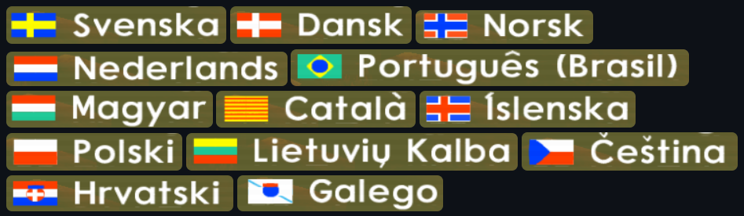
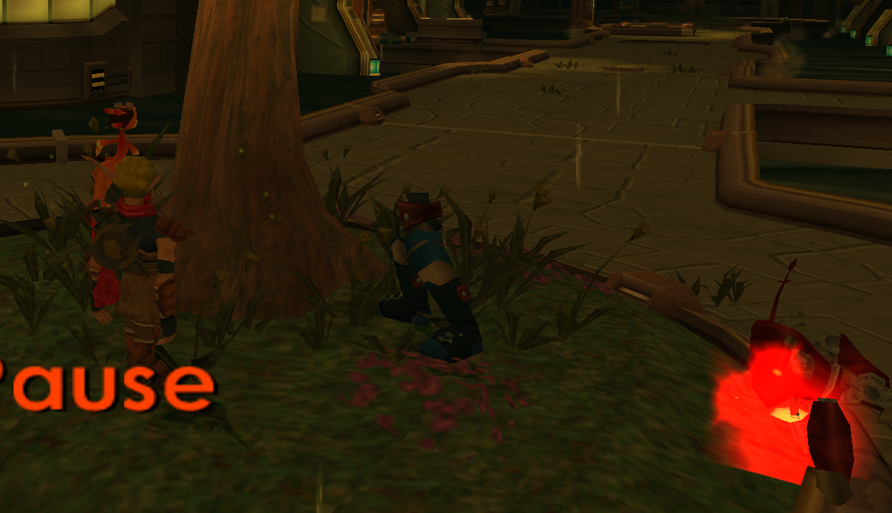

<head>
  <meta name="twitter:card" content="summary_large_image" />
</head>

Tons of bugfixes post-Jak 3 release, new features for mods, and a fresh look for the launcher!

<!--truncate-->

## Release Info

This month's OpenGOAL Tooling (`jak-project` repo) release is `0.3.4`.

<div className="row markdownMarginBottom">
  <div className="col col--12">
    <LauncherDownloadLink />
  </div>
</div>

## Community Spotlight

### Jak and Daxter: The JET-Board Legacy

HatKid has done the lord's work, and backported the JET-Board (with Jak 3 mechanics) to Jak 1! This feat was only possible after the decompiler was extended to support proper animation exporting, which was also implemented by HatKid.

<!-- TODO: some video here? <ReactPlayer
  controls
    src={require("./video/board.mp4").default}
/> -->


&nbsp;

:::info
If you want to play these mods (and others), follow the instructions [here](https://jakmods.dev/) to set up the mod list for the OpenGOAL launcher.
:::

<!-- ## Known Issues -->

## Launcher

### Launcher redesign <PRLink href="https://github.com/open-goal/launcher/pull/966"/> <PRLink href="https://github.com/open-goal/launcher/pull/968"/> <PRLink href="https://github.com/open-goal/launcher/pull/969"/> <PRLink href="https://github.com/open-goal/launcher/pull/967"/> <PRLink href="https://github.com/open-goal/launcher/pull/965"/> <PRLink href="https://github.com/open-goal/launcher/pull/971"/> <PRLink href="https://github.com/open-goal/launcher/pull/977"/> <PRLink href="https://github.com/open-goal/launcher/pull/983"/> <PRLink href="https://github.com/open-goal/launcher/pull/984"/> <PRLink href="https://github.com/open-goal/launcher/pull/986"/> <PRLink href="https://github.com/open-goal/launcher/pull/995"/> <PRLink href="https://github.com/open-goal/launcher/pull/1000"/> <PRLink href="https://github.com/open-goal/launcher/pull/1003"/> <PRLink href="https://github.com/open-goal/launcher/pull/1007"/> <PRLink href="https://github.com/open-goal/launcher/pull/1010"/> <PRLink href="https://github.com/open-goal/launcher/pull/1017"/> <PRLink href="https://github.com/open-goal/launcher/pull/1018"/> <PRLink href="https://github.com/open-goal/launcher/pull/970"/> <PRLink href="https://github.com/open-goal/launcher/pull/972"/> <PRLink href="https://github.com/open-goal/launcher/pull/973"/> <PRLink href="https://github.com/open-goal/launcher/pull/992"/> <PRLink href="https://github.com/open-goal/launcher/pull/994"/> <PRLink href="https://github.com/open-goal/launcher/pull/996"/> <PRLink href="https://github.com/open-goal/launcher/pull/997"/> <PRLink href="https://github.com/open-goal/launcher/pull/998"/> <PRLink href="https://github.com/open-goal/launcher/pull/1001"/> <PRLink href="https://github.com/open-goal/launcher/pull/1002"/> <PRLink href="https://github.com/open-goal/launcher/pull/1006"/> <PRLink href="https://github.com/open-goal/launcher/pull/1009"/>

- Redesign for header, sidebar, `GameControls`, locale selection page, mod pages
- Settings page for configuring background videos
- Light mode fixes
- Fix playtime maxing out at 23:59:59
- Handle edge case where `iso_data` folder has been removed
- Remove splash screen
- Improved version selection page
- Standalone mod page/sidebar entry
- Support per-game name/description overrides for mods
- Fix uninstall workflow on Linux
- Add options to hide playtime, titles on game pages
- Add button to choose random mod
- Categorize launcher as "Game" to OS
- Make launch string consistent regardless of active version
- Support texture packs for mods (TODO: not yet listed in PRs above)
- Misc internal fixes

<ReactPlayer
  controls
    src={require("./video/launcher.mp4").default}
/>

### Various support improvements <PRLink href="https://github.com/open-goal/launcher/pull/953"/> <PRLink href="https://github.com/open-goal/launcher/pull/957"/> <PRLink href="https://github.com/open-goal/launcher/pull/963"/> <PRLink href="https://github.com/open-goal/launcher/pull/964"/> <PRLink href="https://github.com/open-goal/launcher/pull/982"/>  <PRLink href="https://github.com/open-goal/launcher/pull/1005"/> <PRLink href="https://github.com/open-goal/launcher/pull/976"/>

- Log kernel uptime diagnostic in support packages
- Improved logging on `command.spawn` errors
- Improved logging for `game_gpu_test`
- Migrate logging to tracing, instrumentation
- Updated image for support package guide
- Improved requirements and bypass handling
- Misc related bugfixes

## General Changes

### Translations <PRLink href="https://github.com/open-goal/jak-project/pull/4197"/> <PRLink href="https://github.com/open-goal/jak-project/pull/4263"/> <PRLink href="https://github.com/open-goal/jak-project/pull/4272"/> <PRLink href="https://github.com/open-goal/jak-project/pull/4281"/>

TODO

<!-- All translations from [Crowdin](https://crowdin.com/project/opengoal) should now be updated and added to the games. This includes changes for French, Spanish, Catalan, Czech, German, Finnish, Italian, Japanese, Dutch, Norwegian, Polish, Portuguese, Danish, Hungarian, Croatian, Arabic, Greek, Serbian, and Portuguese (Brazilian)! -->

If you're interested in contributing translations, check out [these guides](https://opengoal.dev/docs/category/contributing).

### Update to SDL 3.4.10 <PRLink href="https://github.com/open-goal/jak-project/pull/4201"/> <PRLink href="https://github.com/open-goal/jak-project/pull/4301"/>

Updated the version of the SDL library used across OpenGOAL. Notably this fixed an issue with how the cursor was shown/hidden, and adds support for the new Steam Controller.

### Improved decompiler stack variable support <PRLink href="https://github.com/open-goal/jak-project/pull/4222"/> <PRLink href="https://github.com/open-goal/jak-project/pull/4264"/>

Previously, stack variables were not always properly detected, e.g. in `let` blocks and other expressions. This would result in messy decompilation results, where the code was often awkward to read.

These changes improve decompiler support for detecting stack variables, making the resulting code a bit easier on the eyes (and likely closer to how it looked in ND's code). For example, this before/after snippet from `citadel-obs.gc`:

```diff
-(let ((s4-0 sound-play-by-name)
-      (s3-0 (make-u128 #x7061 (the-as uint #x7a2d646c65696873)))
-      (s2-0 (new-sound-id))
-      (s1-0 1024)
-      (s0-0 0))
-  (set! sv-96 0)
-  (set! sv-112 1)
-  (let ((t2-1 (target-pos 0)))
-    (s4-0 (the-as sound-name s3-0) s2-0 s1-0 s0-0 sv-96 (the-as sound-group sv-112) (the-as symbol t2-1))))
+(sound-play "shield-zap" :position (the-as symbol (target-pos 0)))
```

### Misc decompiler cleanup <PRLink href="https://github.com/open-goal/jak-project/pull/4247"/>

Some cleanup of decompiler code and scripts. Added a tool to hash the contents of each function, which can be useful to check if a function is unchanged across games (e.g. will the code for Jak X's `vector-xz-cross!` be identical to what we have for Jak 3).

### Support Sony splash screen <PRLink href="https://github.com/open-goal/jak-project/pull/4236"/>

Added back the Sony Computer Entertainment splash screens on boot, which had been missing in OpenGOAL.


### Support animation exporting and master art-groups <PRLink href="https://github.com/open-goal/jak-project/pull/4260"/> <PRLink href="https://github.com/open-goal/jak-project/pull/4297"/>

Added initial support for exporting foreground models with animations - still has issues with some models in Jak 2/3.

The build-actor tool was also changed to support custom art groups linking their animations to a different master art group. In particular this lets you add custom animations to vanilla art groups - like the JET-Board animations added in the new Jak 1 mod!

<ReactPlayer
  controls
    src={require("./video/anims.mp4").default}
/>

### Reduce memory usage during texture pack installation <PRLink href="https://github.com/open-goal/jak-project/pull/4278"/>

Rewrote some of the texture replacement code to reduce memory footprint. This should help users trying to install larger texture packs on devices such as the Steamdeck.

### Update to latest version of `libco` <PRLink href="https://github.com/open-goal/jak-project/pull/4282"/>

Updated to the latest version of `libco`, a cooperative multithreading library used in OpenGOAL.

### Fix pressure sensitive axis handling <PRLink href="https://github.com/open-goal/jak-project/pull/4286"/>

Fixed a bug in controller event handling that may have impacted controllers with pressure sensitive buttons.

### `build-actor` set `shader-cnt` to 0 for dummy `merc-fragment` <PRLink href="https://github.com/open-goal/jak-project/pull/4296"/>

Addressed an issue when using custom actors, which could cause crashes during level unloading as textures get unlinked.

### Support regions for custom levels <PRLink href="https://github.com/open-goal/jak-project/pull/4300"/>

Added support for defining regions in custom levels - a big missing feature for Jak 2 and 3 mods!

<ReactPlayer
  controls
    src={require("./video/regions.mp4").default}
/>

### Allow manual reloading of `fr3` data <PRLink href="https://github.com/open-goal/jak-project/pull/4304"/>

Added a feature that lets you reload custom levels and textures on the fly with the game running. This is another useful feature for custom level building, letting you quickly iterate and test changes.

<ReactPlayer
  controls
    src={require("./video/reload.mp4").default}
/>

### Support camera entities and custom keyframe values for custom levels <PRLink href="https://github.com/open-goal/jak-project/pull/4310"/>

Added support for using camera entities in custom levels, and for setting custom keyframe values, which allows for properly configured cameras and water volumes.

### Include merc normals for glb extraction <PRLink href="https://github.com/open-goal/jak-project/pull/4271"/>

TODO - not yet merged

## Jak X

### Initial base files <PRLink href="https://github.com/open-goal/jak-project/pull/4266"/> <PRLink href="https://github.com/open-goal/jak-project/pull/4311"/>

There has indeed been some initial work for Jak X. However, all that has been done so far is copying over stuff that we have confirmed to be 100% identical between Jak 3 and Jak X.

This does NOT mean that we have officially started working on decompiling Jak X, let alone making a PC port. These PRs simply aim to lay the foundation so that anybody looking to pick up work on Jak X (whether it be us in the future or somebody else right now) will have an easier time getting started.

As of right now, most of the core devs are not interested in continuing work on Jak X for the foreseeable future and would rather work on other things for the time being (e.g. squashing any remaining bugs and improving the tooling for the existing games so modders have more features and capabilities for creating custom content).

If Jak X officially releases in the future, it will be on the `jak-project` repo [on GitHub](https://github.com/open-goal/jak-project) and be available in the official launcher, as has always been the case. Any other source is not vetted by us and should only be used at your own risk.

## Jak 3

### Version 0.3.1 Updates

See the [update on the previous Progress Report](progress-report-q1-2026#version-031-update) about the handful of fixes we released in version 0.3.1 following the Jak 3 beta release.

### Various speedrun fixes <PRLink href="https://github.com/open-goal/jak-project/pull/4193"/> <PRLink href="https://github.com/open-goal/jak-project/pull/4216"/> <PRLink href="https://github.com/open-goal/jak-project/pull/4257"/> <PRLink href="https://github.com/open-goal/speedrunning/pull/34"/> <PRLink href="https://github.com/open-goal/speedrunning/pull/33"/>

- Fixed the starting condition for speedruns - previously it required Jak to be in the `target-stance` state, so would fail if you were already moving on frame 1. This mainly affected Hero Mode runs, so it was less noticeable in Jak 2, but has also been fixed there.
- Fixed starting new game from title screen in speedrunner mode to skip intro cutscene, start autosplitter, and show verification text.
- Fixed endlessly looping bubble sound effect when resetting while being grabbed by ocean tentacle.
- Added autosplitter option for Precursor Robot Skip, since the skip doesn't fully close the task.
- Added option to speedrun menu to select unlocked Secrets for Hero Mode runs, as runners have different preferences.

### Fix broken Secrets option on title screen <PRLink href="https://github.com/open-goal/jak-project/pull/4194"/>

Some of the progress screens were rewritten for the PC port, and the title screen had a couple small bugs causing the Secrets option to always be drawn.

### Fix `bigmap` icon stretching and scanlines for wide aspect ratios, scrolling at high FPS <PRLink href="https://github.com/open-goal/jak-project/pull/4199"/>

- Expanded scanlines to cover whole screen, not just 4:3 area
- PS2 16:9 incorrectly squashes map icons, this was fixed for wider PC aspect ratios
- Adjusted map scrolling speed for high FPS

### Improved projectile focus fixes <PRLink href="https://github.com/open-goal/jak-project/pull/4207"/>

There was already a setting added in OpenGOAL to fix projectile focus, and this addressed some edge cases to further improve this. Most notably, the tentacles in final boss should no longer be targeted once they are dead.

### Add JET-Board trick name/score display <PRLink href="https://github.com/open-goal/jak-project/pull/4208"/> <PRLink href="https://github.com/open-goal/jak-project/pull/4224"/>

Ported over the trick display feature that was added in OpenGOAL for Jak 2, adding a new color for the L2 tricks.

This also fixed a couple bugs in the scoring logic, where we wouldn't count the last trick in a 16-trick combo, and where the score wasn't properly reset after dismounting.

If you want to see the full details of how tricks are scored, see [this comment](https://github.com/open-goal/jak-project/issues/3150#issuecomment-4241479134).

### New flags for PC port languages <PRLink href="https://github.com/open-goal/jak-project/pull/4209"/>

Aloqas added some new flags for languages that we've added support for in the PC port. These are all hand-crafted using a limited set of stripes, triangles, etc!



### Fix sound mode default <PRLink href="https://github.com/open-goal/jak-project/pull/4217"/>

Previously the game would try to default to Surround Sound, which OpenGOAL doesn't properly support. Now it will default to Stereo.

### Fix Dark Ship mech carry bug at high FPS <PRLink href="https://github.com/open-goal/jak-project/pull/4223"/>

Fixed a bug at higher FPS where the Dark Ship mech would pick up boxes but could not put them back down.

### Prevent infinite loop in `ff-squad-control` bubble sort <PRLink href="https://github.com/open-goal/jak-project/pull/4225"/>

Addressed one symptom of a larger underlying issue where some actors end up with NaN position coordinates, which we have yet to pin down. 

The Freedom Fighter `squad-control` code sorts the guards based on their distance to the target enemy, but if one of the guards has NaN coordinates, it leads to an infinite loop in the "bubble sort" algorithm, causing the entire game to hang. This patch just ignores any guards with NaN coordinates and only considers valid guards.

### Prevent NaN propagation in `spydroid` attack state <PRLink href="https://github.com/open-goal/jak-project/pull/4237"/>

Similar to the above, this addressed another symptom of the underlying NaN coordinates issue. Bugged guards will return NaN coordinates for their `bullseye-joint`, and since this is referenced in the `spydroid` `attack` code, it can propagate to the `spydroid`'s position, making it have NaN coordinates as well. The patch here will just uses the guard's overall position instead of the `bullseye-joint` position if it's NaN.

In the Defend HQ mission, the KG carriers are only supposed to spawn a set number of `spydroid`s, and if you hang around long enough this can result in an interesting situation. If the max number of `spydroid`s are spawned and all end up with NaN coordinates, the mission appears bugged, with no KG enemies visible.

We suspect this may also be related to the issue where the guards spawn with only half of their model visible.



### Fix death Daxter cutscenes not playing <PRLink href="https://github.com/open-goal/jak-project/pull/4243"/>

Fixed a bug causing the occasional Daxter cutscenes after dying to never play.

<ReactPlayer
  controls
    src={require("./video/dax.mp4").default}
/>

### Export documentation for website <PRLink href="https://github.com/open-goal/jak-project/pull/4254"/> <PRLink href="https://github.com/open-goal/open-goal.github.io/pull/324"/>

TODO - need to generate new jak-project release so the website builds

Configured the export of the Jak 3 `goal_src` docs for the website, which you can find [here](/docs/category/jak-3).

### Add speaker option to subtitles <PRLink href="https://github.com/open-goal/jak-project/pull/4230"/>

Ported over a feature added in Jak 1, which adds options to show the name of the person speaking in the subtitles. This is now supported in both Jak 2 and 3.

### Fix Dark/Light Eco vent powerup animation <PRLink href="https://github.com/open-goal/jak-project/pull/4269"/>

Fixed a bug causing the powerup animations when touching a Dark/Light Eco vent to play incorrectly. It would use the animation intended for Light Eco vents when touching Dark Eco vents.

This is another bug that just happened to luckily work out on PS2 hardware - the Eco vents send an event to Jak to make him go into the powerup state, but do not pass any event arguments which determine what animation to play and at what speed/start frame. For the Dark Eco vents, PS2 manages to somehow get the correct value of 7, but OpenGOAL was not so lucky.

As a side effect of this fix, we also get the originally intended behavior for the Light Eco vents of playing the full powerup animation from the start at a slower speed, rather than the much shorter one you see on PS2.

<ReactPlayer
  controls
    src={require("./video/ecovents.mp4").default}
/>

### Track orbs in crates for debug option <PRLink href="https://github.com/open-goal/jak-project/pull/4275"/>

In Jak 2 OpenGOAL a "Track Skill" feature was added to the debug menu, which would draw a red line from Jak to all of the currently spawned Precursor Orbs (internally called `skill`s). This feature was ported over to Jak 3, but until now it didn't handle the new cases where Orbs were hidden inside of crates, urns, etc.


### Fix Dark/Light Eco HUD flashing bug <PRLink href="https://github.com/open-goal/jak-project/pull/4285"/>

Fixed an original game bug where the Dark/Light Eco HUD elements would stop doing the intended flashing effect after your save file was several hours old.

The code determines how much to flash by referencing the `game-clock` from your save file as part of the formula, which uses a sine function to achieve the smooth flashing rhythm. The `game-clock` counts the number of ticks that have passed while playing the game (300 ticks per second), so after several hours it ends up being a very large number. OpenGOAL's `sin` function breaks down when you give it extremely large floating point values, and will start to return a constant value - effectively pausing the flashing effect indefinitely.

The number of ticks is effectively interpreted as degrees, sometimes with a multiplier to adjust the rate of flashing, and passed into the sine function. Since we know the sine function repeats every 360 degrees, we avoid extremely large floating point values but achieve the same intended results by using the tick value modulo 360.

### Make actor LoD setting affect lightning quality <PRLink href="https://github.com/open-goal/jak-project/pull/4292"/>

Copied over a change added in Jak 2 to use higher `lightning-quality` when the high LoD option is set, improving the appearance of `elec-gate`s from afar.

### Support ocean environment mapping <PRLink href="https://github.com/open-goal/jak-project/pull/4303"/>

Added proper environment mapping for the oceans. While the resulting envmap looks accurate compared to PCSX2 in Renderdoc, the end result does not seem 100% identical, but it is a big improvement over the default placeholder texture previously used. This is also supported in Jak 2 now.

<ReactPlayer
  controls
    src={require("./video/ocean.mp4").default}
/>

### Fix zoom blur flashbang in retail mode <PRLink href="https://github.com/open-goal/jak-project/pull/4305"/>

Fixed a visual bug where the zoom blur effect would incorrectly render as a bright white texture. This was probably most notable in the cutscene with Seem near the beginning of the game.

When `do_zoom_blur` sets up its draw, it doesn't update the blend settings, so it ends up inheriting the previous values.

In retail mode, the previous draw is from a texture animation, which sets up the blend in a specific way that causes it to draw a white texture over the screen. In debug mode, right before the zoom blur is drawn, the debug text is drawn, which modifies the blend settings to something that makes the blur look as it should.

### Decompile some debug tooling <PRLink href="https://github.com/open-goal/jak-project/pull/4200"/> <PRLink href="https://github.com/open-goal/jak-project/pull/4203"/>

While not needed for retail gameplay, there were some debug/development features that hadn't been decompiled until now. This includes:
- `visvol-edit`
- `editable`
- `editable-player`
- `mysql-nav-graph`
- `nav-graph-editor`
- `nav-mesh-editor-h`
- `nav-mesh-editor`
- `cam-debug`
- `hover-nav-edit`
- `pilot-recorder`

## Jak 2

### Add missing inline declaration in `vector*!` <PRLink href="https://github.com/open-goal/jak-project/pull/4287"/>

Fixed an issue in the `vector*!` definition for Jak 2 which caused the function to not be inlined, resulting in differing compiled output.

## Jak 1

### Fix crash when touching lightning moles on foot <PRLink href="https://github.com/open-goal/jak-project/pull/4294"/>

Fixed an original game bug where the game would crash if you touched a `lightning-mole` while on foot

This is another case of an event sent between processes missing proper arguments, similar to the Dark/Light Eco vent animation issue above. Unlike the Eco vent example however, PS2 hardware does not get lucky on this one, and also crashes.

### Cleanup `control-info` naming <PRLink href="https://github.com/open-goal/jak-project/pull/4295"/>

One more benefit to the codebase resulting from HatKid's work on the JET-Board mod - as he compared `target` code between Jak 3 and Jak 1 to make sense of and backport the JET-Board code, he was able to give meaningful names to some fields and enum values.

For example, `(water-flags wt24)` is now `(water-flag dark-eco)`, `(-> *target* control unknown-dword51)` is now `(-> *target* control attack-count)`, etc.

### Show max of `flying-lurker` distances on HUD <PRLink href="https://github.com/open-goal/jak-project/pull/4309"/>

Fixed a minor issue with the extra HUD element added in OpenGOAL for the `flying-lurker` Mountain Pass race. The HUD is supposed to show how many meters away the lurkers are, as the mission fails if *any* of them gets 500m away. However the value shown on the HUD was only checking against `flying-lurker-1`, so it was possible to fail while the HUD showed a value less than 500. Now it will show the maximum distance of the 3 lurkers.