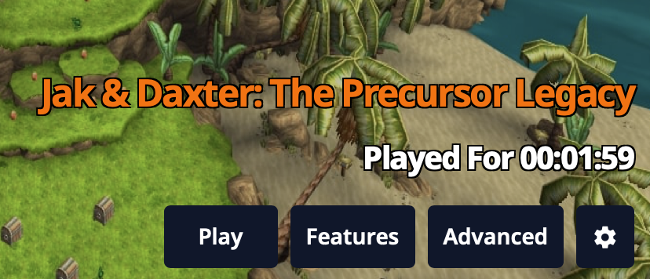
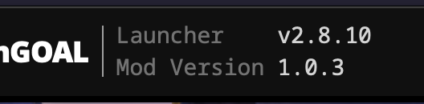
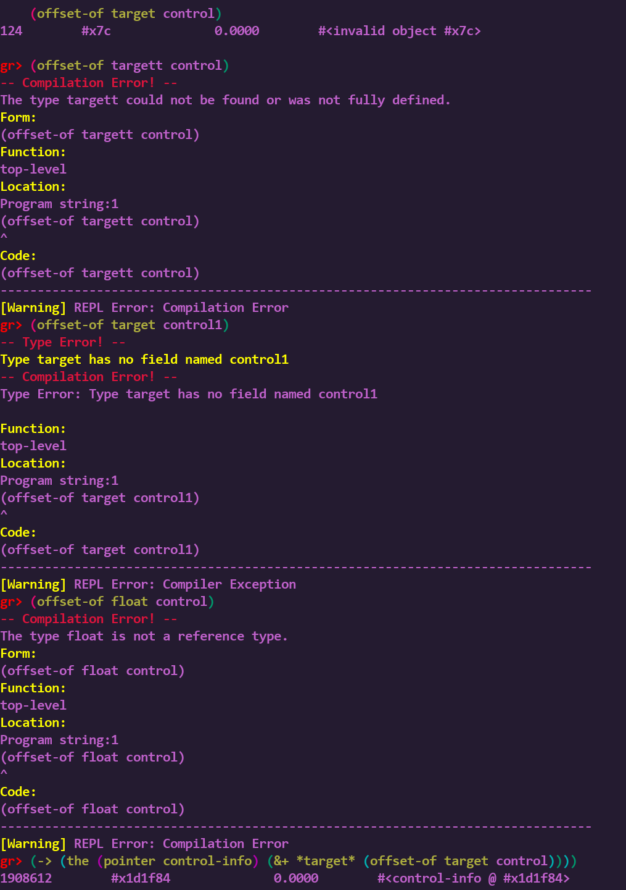
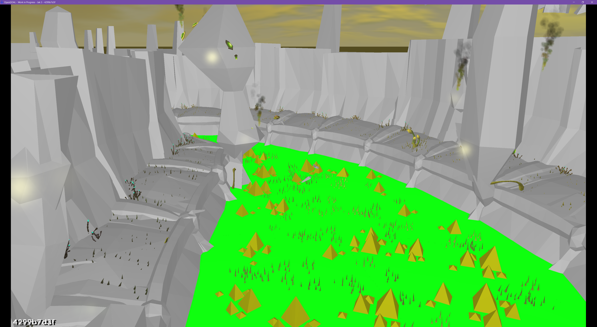
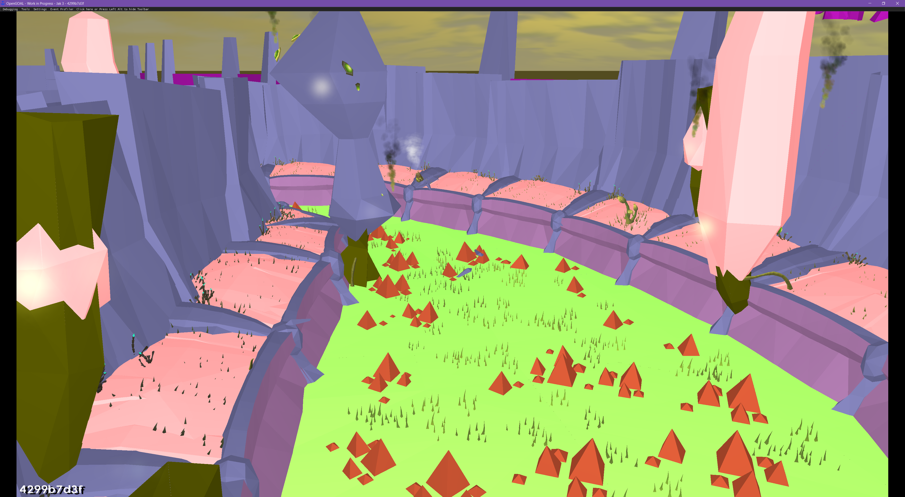
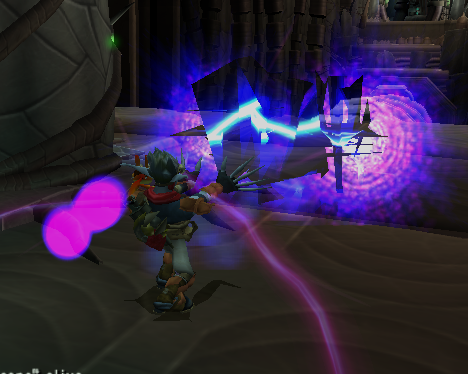

<head>
  <meta name="twitter:card" content="summary_large_image" />
</head>

Happy Holidays! Lots of fixes across all 3 games the past few months.

<!--truncate-->

## Release Info

This month's OpenGOAL Tooling (jak-project repo) release is `0.2.31`.

<div className="row markdownMarginBottom">
  <div className="col col--12">
    <LauncherDownloadLink />
  </div>
</div>

## Community Spotlight

### Cratetopia

GratefulForest (of [Platformia](https://www.youtube.com/watch?v=ZbhsCHf6X1s) infamy) is back with Cratetopia, a familiar-looking block game recreated in the OpenGOAL engine!

<ReactPlayer controls url={require("./video/cratetopia.mp4").default} />

### Pogo

EvelynTSMG came up with this Jak 1 challenge mod, where Jak is forced to keep jumping at all times! Be sure to check out the mod settings where you can adjust various difficulty settings.

<ReactPlayer
  controls
  url={"https://www.youtube.com/watch?v=oNcmiJjPhdA"}
  className="blog-video"
/>

:::info
If you want to play these mods (and others), follow the instructions [here](https://jakmods.dev/) to set up the mod list for the OpenGOAL launcher.
:::

<!-- ## Known Issues -->

## Launcher

### Build new AppImage format <PRLink href="https://github.com/open-goal/launcher/pull/853"/> <PRLink href="https://github.com/open-goal/launcher/pull/858"/>

Upgrades our Tauri version to support portable AppImages.

### Disable content selection in sidebar <PRLink href="https://github.com/open-goal/launcher/pull/862"/>

Fixes minor bug where you could highlight unintended parts of the UI.

### Restore playtime feature <PRLink href="https://github.com/open-goal/launcher/pull/872"/>

Restores a feature to track playtime per game, which was inadvertently removed during code cleanup.



### Support window resizing & allow Linux users to change install directory <PRLink href="https://github.com/open-goal/launcher/pull/856"/>

Now that the CSS is responsive, we can allow for the launcher window to be resized (e.g. fullscreen on Steamdeck). Also fixed an issue where Linux users couldn't change their installation directory.

### Improve support package output <PRLink href="https://github.com/open-goal/launcher/pull/875"/>

Improves the accuracy of installation metadata collected for the support package, which users can provide to developers to get help troubleshooting.

### Restore changelog page <PRLink href="https://github.com/open-goal/launcher/pull/873"/>

Adds back the page detailing what has changed when new updates are available. This also fixes responsive issues with the "Update Available" header positioning.

### Replace `svelte-navigator` with `sv-router` <PRLink href="https://github.com/open-goal/launcher/pull/874"/>

Replaces the deprecated `svelte-navigator` with the more modern `sv-router`, which has some new features and a much nicer reactive model.

### Correct header version display for mods <PRLink href="https://github.com/open-goal/launcher/pull/879"/>

Properly distinguishes between vanilla and mod versions in the header.



### Texture Pack / Mod feature cleanup <PRLink href="https://github.com/open-goal/launcher/pull/886"/> <PRLink href="https://github.com/open-goal/launcher/pull/891"/>

Fixes a bunch of typescript errors and refactored Texture Packs and Mods into isolated components.

### Fix local mod installation <PRLink href="https://github.com/open-goal/launcher/pull/880"/>

Fixes an issue where mods could no longer be installed from a local release package.

### Fix offline mod support <PRLink href="https://github.com/open-goal/launcher/pull/848"/> <PRLink href="https://github.com/open-goal/launcher/pull/887"/>

Fixes an issue where already-installed mods could not be played while offline. The launcher will now cache metadata about mods during installation, and will fall back to this if the information cannot be fetched from the mod list source (i.e. while offline).

### Fix brief UI flashes while navigating <PRLink href="https://github.com/open-goal/launcher/pull/885"/>

Fixes an issue where previous component state could be briefly visible while naviating between pages.

## General Changes

### Translations <PRLink href="https://github.com/open-goal/jak-project/pull/4027"/> <PRLink href="https://github.com/open-goal/jak-project/pull/4028"/> <PRLink href="https://github.com/open-goal/jak-project/pull/4107"/>

All translations from [Crowdin](https://crowdin.com/project/opengoal) should now be updated and added to the games. This includes changes for Spanish, Czech, Portuguese (Brazilian), French, Dutch, German, Polish, Finnish, and Norwegian!

If you're interested in contributing translations, check out [these guides](https://opengoal.dev/docs/category/contributing).

### Add REPL function `offset-of` <PRLink href="https://github.com/open-goal/jak-project/pull/4081"/>

Adds a new function to the REPL which will return the offset in memory for a field within a reference type.



### Improved decompiler output for `part-tracker` <PRLink href="https://github.com/open-goal/jak-project/pull/4082"/>

Improves the readability of decompiler output relating to particle groups / particle trackers. For example:

```diff
 (process-spawn part-tracker :init part-tracker-init
-   (-> *part-group-id-table* 104)
+   group-part-yellow-eco-fireball-hit
```

### Fix custom model meshes when reusing materials <PRLink href="https://github.com/open-goal/jak-project/pull/4070"/>

Fixes an issue where collision and visibility on custom actors would get skipped if multiple Blender objects shared the same material.

### Fix custom level missing collision issue <PRLink href="https://github.com/open-goal/jak-project/pull/4060"/>

Fixes an edge case in the BVH tree logic when processing custom level collision.

### Speedrunner mode/autosplitter updates <PRLink href="https://github.com/open-goal/jak-project/pull/4085"/> <PRLink href="https://github.com/open-goal/speedrunning/pull/27"/> <PRLink href="https://github.com/open-goal/jak-project/pull/4086"/> <PRLink href="https://github.com/open-goal/speedrunning/pull/28"/> <PRLink href="https://github.com/open-goal/jak-project/pull/4103"/> <PRLink href="https://github.com/open-goal/speedrunning/pull/29"/>

<!-- last pair of PRs arent merged yet, but should be good to go -->

Various changes relating to speedrunner mode and autosplitter:
- Jak 1
  - Fixes Hub 2/3 100% categories to start with correct Scout Fly counts for previous levels
- Jak 2
  - Adds intro autosplit points for the Stadium races
- Jak 3
  - Adds useful non-resolution autosplit points
  - Fixes end split timing to line up with last hit on final boss
  - Updates suggested splits/routes for LiveSplit

## Jak 3

### Add zoom blur and color filter effect <PRLink href="https://github.com/open-goal/jak-project/pull/4031"/> <PRLink href="https://github.com/open-goal/jak-project/pull/4037"/>

Adds the zoom blur effect, as used in some cutscenes and for a few weapons:
<ReactPlayer controls url={require("./video/zoom-blur.mp4").default} />

Adds the color filter effect, as used in Misson Failed screen:
<ReactPlayer controls url={require("./video/color-filter.mp4").default} />

`slow-time` blur effect and fixed color filter:
<ReactPlayer controls url={require("./video/slow-time.mp4").default} />

### Fix crash when entering Freedom League HQ <PRLink href="https://github.com/open-goal/jak-project/pull/4035"/> <PRLink href="https://github.com/open-goal/jak-project/pull/4038"/>

Fixes some issues that would lead to a crash when entering the Freedom League HQ.

### Fix crash from VAG out-of-bounds access <PRLink href="https://github.com/open-goal/jak-project/pull/4040"/>

Fixes an issue where all stereo VAG commands would write to an out-of-bounds array element and corrupt the whole VAG queue list. This was the cause of various sound-related crashes, such as when using Light Jak Freeze.

### Add support for brightness and contrast modifiers <PRLink href="https://github.com/open-goal/jak-project/pull/4041"/>

Adds renderer support for modifying brightness and contrast, a new feature added to the graphics options in Jak 3.

### Fix subtitle speaker colors <PRLink href="https://github.com/open-goal/jak-project/pull/4043"/>

Fixes copy/paste from Jak 2 for the text color of speakers in subtitles.

### Decouple wasteland storm particles and wind pushback effect from framerate <PRLink href="https://github.com/open-goal/jak-project/pull/4046"/>

Fixes an issue where the sandstorm in the wasteland had overly-aggressive particle effects and pushback effects on Jak. Players may have noticed this issue in the PS3 port, as it occurs because the newer console could maintain a better framerate than the PS2.

### Misc high FPS fixes <PRLink href="https://github.com/open-goal/jak-project/pull/4055"/> <PRLink href="https://github.com/open-goal/jak-project/pull/4059"/>

Various fixes to support framerates higher than 60 FPS:
- `prebot` sword attack and projectile speed
- Fast first person camera turning speed
- Slow turret camera turning speed
- `flyingsaw` movement and rotation speed
- Green eco drain rate on jetboard during `forest-kill-plants` mission
- `skeet` rotation speed
- `maker-grenade` tumble speed
- Jetboard spin speed
- Texscroll speed
- Slow walk anim after landing from a jump
- `hud-skill` rotation speed
- `gun-dark-shot` projectile speed
- `target-float` up/down speed
- Prevents instantly killing Jak when exiting some vehicles

### Collision Renderer support for new `pat-event`s and `pat-material`s <PRLink href="https://github.com/open-goal/jak-project/pull/4049"/>

Adds support to the OpenGOAL collision renderer for new `pat-event`s and `pat-material`s added in Jak 3:




### Fix cutscene blackout issues <PRLink href="https://github.com/open-goal/jak-project/pull/4056"/>

Fixes an edge case where cutscenes with a non-zero `artist-base` would start with an awkward amount of blackout frames, depending on framerate. This is another issue that can be seen on PS3 but not PS2 because of the framerate the consoles can maintain - for example during the Metal Head Tower `tower-destroy-res` scene.

### Fix menu scissoring for Mission/Scene Select <PRLink href="https://github.com/open-goal/jak-project/pull/4061"/>

Fixes the scissoring in the pause menu on the Mission Select and Scene Select screens.

### Add OpenGOAL-exclusive cheats `city-peace` and `desert-peace` <PRLink href="https://github.com/open-goal/jak-project/pull/4079"/>

Adds support for the `city-peace` cheat similar to what we added in Jak 2, which disables all enemies throughout Haven City. Also adds a new `desert-peace` cheat which disables the sandstorm effects and all maruaders in the Wasteland.

### Fix `generic2`/`prim` zbuffer issue and progress menu crash <PRLink href="https://github.com/open-goal/jak-project/pull/4091"/>

Fixes an issue in how the zbuffer is handled for the `generic2` renderer. This was quite noticeable in the Dark Strike and Arc Wielder effects.



### Support directional pad controls for Eco Grid (Pac-Man) minigame <PRLink href="https://github.com/open-goal/jak-project/pull/4083"/>

Adds a toggle under controller options to allow use of the directional pad for the Eco Grid minigame. Normally this minigame only respects inputs from the left analog stick.

### Fix `rigid-body` physics to not depend on FPS <PRLink href="https://github.com/open-goal/jak-project/pull/4095"/>

Fixes a issue where the physics logic for `rigid-body` systems (e.g. zoomer vehicles) depended on framerate. This was another difference that could be observed between PS3 and PS2.

For example, the "Superfasthoverbikeglitch" on OpenGOAL (pre-fix) vs PCSX2:
<ReactPlayer controls url={require("./video/sfhbg.mp4").default} />

### Fix War Factory `hemi-gradient-flames` texture and ocean culling <PRLink href="https://github.com/open-goal/jak-project/pull/4036"/>

Fixes a small typo relating to the `hemi-gradient-flames` texture used in the Hellcat bomb during the War Factory mission. Also fixes an issue with ocean culling during this mission, caused by the rotating background effect.

### Fix `prebot` sword texture <PRLink href="https://github.com/open-goal/jak-project/pull/4097"/>

Fixes a small issue with the Precursor Robot's sword trail texture not rendering.

### Fix audio language setting <PRLink href="https://github.com/open-goal/jak-project/pull/4093"/>

Fixes an issue where changing language didn't actually change the audio used for play hints and cutscenes.

### Fix `same-attack-invulnerable-timeout` clock drift bug <PRLink href="https://github.com/open-goal/jak-project/pull/3978"/>

Fixes an original game bug that could lead to increasingly long cooldowns between taking damage from the same source, such as a flaming torch. This is also fixed for Jak 2.

The game tracks when the player last took damage using one clock, but compares this to a different clock when deciding if the player should take damage if it's from the same source. Only one of these clocks is affected by slow-down effects, such as during mission fails, Dark Jak special attacks, or Light Jak freeze. After one or more of these slow-down effects, these two clocks can end up drifting significantly apart, and throw off the intended cooldown logic.

### Fix `*traffic-height-map*` array out-of-bounds bug <PRLink href="https://github.com/open-goal/jak-project/pull/4106"/>

Fixes an original game bug, where extreme `h-vehicle` coordinates could lead to a crash by accessing out-of-bounds data in the `*traffic-height-map*`. This is also fixed for Jak 2.

## Jak 2

### Fix `WakeupThread` Overlord/IOP issue <PRLink href="https://github.com/open-goal/jak-project/pull/4047"/>

Fixes an issue where `StreamListThread` should have been deadlocked waiting for the uninitialized `LfoList` semaphore, but instead it would get woken up by `WakeupThread` erroneously.

### Fix HUD alignment for various aspect ratios <PRLink href="https://github.com/open-goal/jak-project/pull/4075"/>

Fixes alignment of HUD elements to correctly scale with widescreen aspect ratios.

### Misc high FPS fixes <PRLink href="https://github.com/open-goal/jak-project/pull/4055"/> <PRLink href="https://github.com/open-goal/jak-project/pull/4059"/>

Various fixes to support framerates higher than 60 FPS:
- `hud-skill` rotation speed
- `gun-dark-shot` projectile speed
- `target-float` up/down speed
- Prevents instantly killing Jak when exiting some vehicles

## Jak 1

### Subtitle fixes <PRLink href="https://github.com/open-goal/jak-project/pull/4063"/>

Fixes a few typos in Uncle, Farmer, and Geologist subtitles.

### Misc high FPS fixes <PRLink href="https://github.com/open-goal/jak-project/pull/4067"/> <PRLink href="https://github.com/open-goal/jak-project/pull/4069"/> <PRLink href="https://github.com/open-goal/jak-project/pull/4105"/>

Various fixes to support framerates higher than 60 FPS:
- Water ripple effect
- `balance-plat` speeds
- Speed of slider options in pause menu

### Fix opening logo letterboxing for widescreen aspect ratios <PRLink href="https://github.com/open-goal/jak-project/pull/4073"/>

Fixes letterboxing/blackout during the opening "Jak and Daxter" logo for widescreen aspect ratios. Previously you would start to see Sandover Village on the sides of the screen early, before the logo burst animation happened.

<ReactPlayer controls url={require("./video/logo.mp4").default} />

### Fix custom levels tpages <PRLink href="https://github.com/open-goal/jak-project/pull/4074"/>

Fixes an issue where the `tpage` list for custom levels was ignored, which could cause texture remapping to behave incorrectly.

### Fix aspect ratio selection issues <PRLink href="https://github.com/open-goal/jak-project/pull/4101"/>

Fixes an issue where aspect ratio was not properly updated from the progress menu upon selection.