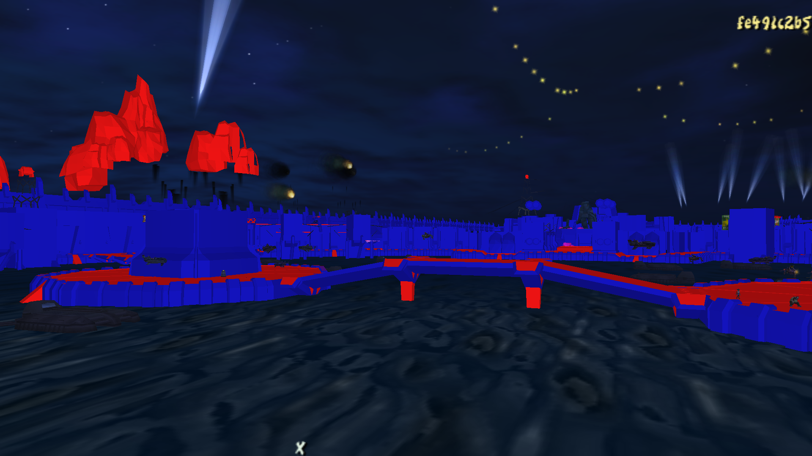

<head>
  <meta name="twitter:card" content="summary_large_image" />
</head>

TODO

<!--truncate-->

## Release Info

This month's OpenGOAL Tooling (jak-project repo) release is `0.1.42`.

  

    <LauncherDownloadLink/>
  

## General Changes

### Support for Exporting Wind Models <PRLink href="https://github.com/open-goal/jak-project/pull/2960"/>

The model extractor now exports models using the TIE wind effect. This includes things like the trees in Sandover and Sentinel Beach or the lava in Fire Canyon.

### Paths and Volumes in Entity Debugger <PRLink href="https://github.com/open-goal/jak-project/pull/2942"/>

An option has been added to toggle displaying path and volume metadata for entities in the Entity Debugger. This information was previously hidden by default as it bloats the entity metadata list.

### Dumping Entities to JSON, Speeding Up Custom Level Builds <PRLink href="https://github.com/open-goal/jak-project/pull/2973"/>

The decompiler will now dump all of the entity metadata for every level in a JSON format similar to custom levels. This is very handy for checking out an actor's metadata without having to open the game and find the actor in the Entity Debugger.

### `macro-expand` form <PRLink href="https://github.com/open-goal/jak-project/pull/3000"/>

Previously, the only way to see the expanded form of a macro was by getting a compiler error with the macro in it.

### A Bunch of Massive Code Refactors <PRLink href="https://github.com/open-goal/jak-project/pull/2974"/> <PRLink href="https://github.com/open-goal/jak-project/pull/2987"/> <PRLink href="https://github.com/open-goal/jak-project/pull/2992"/> <PRLink href="https://github.com/open-goal/jak-project/pull/2995"/> <PRLink href="https://github.com/open-goal/jak-project/pull/2996"/> <PRLink href="https://github.com/open-goal/jak-project/pull/3001"/> <PRLink href="https://github.com/open-goal/jak-project/pull/3008"/> <PRLink href="https://github.com/open-goal/jak-project/pull/3014"/> <PRLink href="https://github.com/open-goal/jak-project/pull/3026"/> <PRLink href="https://github.com/open-goal/jak-project/pull/3018"/> <PRLink href="https://github.com/open-goal/jak-project/pull/3031"/>

The main brunt of this month's work was in all of these refactors.

As we are pretty much done with the decompilation part of Jak 2 and Jak 3 is looming on the horizon, this is the ideal time to go through the entire codebase to find any areas that could use some cleanup/improvement which all three games can benefit from.

Among these PRs, one of the more important changes was the addition of an extra linting step in our CI that will check for any regression we may have made during a big refactor. This works by detecting the deletion of an `og:preserve-this` comment in the diff, so we started adding these to any manually patched sections of code, sitting at ~680 usages so far.

Aside from this, the changes in these PRs include:

- Fixing some bad decomp in a few files.
- Renaming `obj` to `this` in methods.
- Vastly improving decompilation of event and state handlers.
- Better handling usages of `find-parent-method`.
- Detection for the following macros:
  - `launch-particles`
  - `seconds-per-frame`
  - `time-elapsed?`
  - `set-time!`
  - `static-attack-info` in Jak 2

### Fix Ancient Compiler Bug <PRLink href="https://github.com/open-goal/jak-project/pull/3030"/>

Amidst all these refactors, an ancient compiler bug was unearthed!

This bug would cause compilation of conditions to output verbose code if the condition was a macro due to not attempting macro expansion, increasing code object file size and making the assembly less readable.

## Jak 1

### Polish Translation <PRLink href="https://github.com/open-goal/jak-project/pull/2961"/>

Most of the UI and some of the subtitles have been translated to Polish.

## Jak 2

### Option for High Resolution Clouds <PRLink href="https://github.com/open-goal/jak-project/pull/2951"/>

An option to use a 512x512 instead of the default 128x128 texture for the clouds has been added.

Before:

After:

### SQL Editor Improvements <PRLink href="https://github.com/open-goal/jak-project/pull/2954"/>

The SQL database for the in-game editor is now being seeded with the light and region data from each level.

### VAG File Dumping <PRLink href="https://github.com/open-goal/jak-project/pull/2969"/>

The decompiler now supports extraction of Jak 2's VAG files, which are used for streaming audio, into `.wav` files.

### Experimental Support for Higher Frame Rates <PRLink href="https://github.com/open-goal/jak-project/pull/2962"/>

Unlike Jak 1, Jak 2 has much better support for variable frame rates out of the box as the game has a harder time reaching 60 FPS in certain areas.
This meant that adding support for arbitrary frame rates beyond 60 was quite simple, so we added a menu option that allows you to select your frame rate from a bunch of common refresh rates.

<ReactPlayer
  controls
  url={require("./video/frame-rate-option.mp4").default}
  className="blog-video"
/>

:::caution
This frame rate setting is experimental and while the game can be fully completed with it, there is a high chance you will encounter a few bugs that may impact your experience.

Also, if your computer is not powerful enough to consistently run at your target frame rate, you may experience lag that will cause slowdowns.
:::

### PC Specific Settings in Progress Menu <PRLink href="https://github.com/open-goal/jak-project/pull/2968"/> <PRLink href="https://github.com/open-goal/jak-project/pull/3003"/>

The PC menu options from Jak 1 have been brought over into Jak 2's progress menu.

<ReactPlayer
  controls
  url={require("./video/game-options.mp4").default}
  className="blog-video"
/>

### Exporting the Collision Mesh and Adding Collision Renderer <PRLink href="https://github.com/open-goal/jak-project/pull/2977"/> <PRLink href="https://github.com/open-goal/jak-project/pull/3010"/>

The decompiler will now export a level's collision meshes and the collision renderer that was written for Jak 1 has been brought over to Jak 2 to display them.

### Speedrunner Mode <PRLink href="https://github.com/open-goal/jak-project/pull/2976"/>

Speedrunner Mode has been added to Jak 2, along with a new popup menu for quickly resetting the game.

### Implement Missing Kernel Functions <PRLink href="https://github.com/open-goal/jak-project/pull/3005"/>

Some functions in Jak 2's C kernel were stubbed out that prevented the game from being able to load and link object files at runtime, these have now been properly implemented.

### Controller LED Support <PRLink href="https://github.com/open-goal/jak-project/pull/3035"/>

Controllers will now have their LEDs light up in a specific color in certain circumstances.

- Copying the colors of the platforms in the Tomb puzzle
- Appropriate color when having a gun out
- Flickering depending on health
- Orange while you're playing as Daxter
- Yellow while in the Titan Suit
- Blue while on the JET-Board
- Purple when you're Dark Jak
- Flashing red while wanted

### Integrate Speedrun.com Leaderboards in High Score Menu <PRLink href="https://github.com/open-goal/jak-project/pull/3037"/>

When the game is in Speedrunner Mode, the high score menu will have new entries for Jak 2's various speedrun categories that will pull data directly from [Speedrun.com](https://www.speedrun.com/jak2) via their API.

<ReactPlayer
  controls
  url={require("./video/speedrun-leaderboards.mp4").default}
  className="blog-video"
/>
