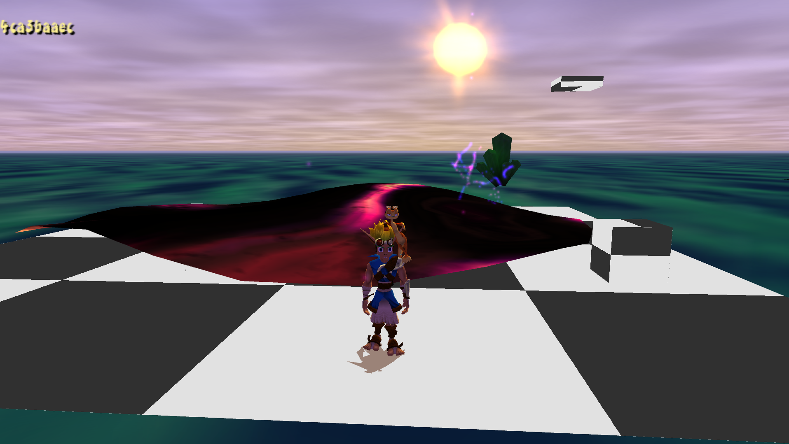
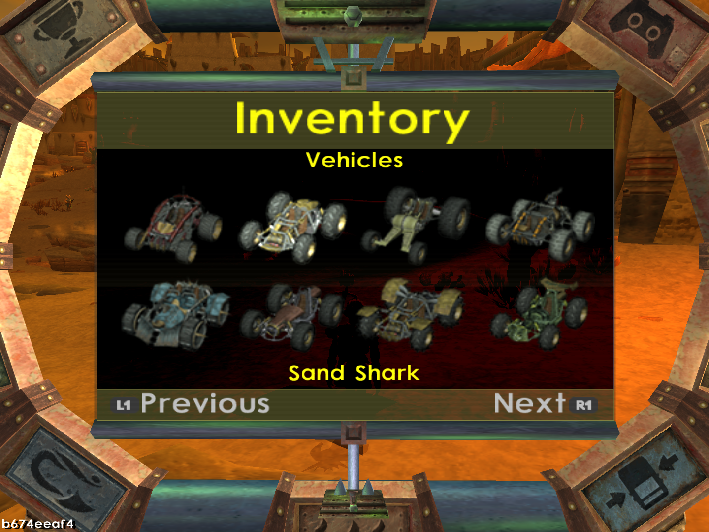
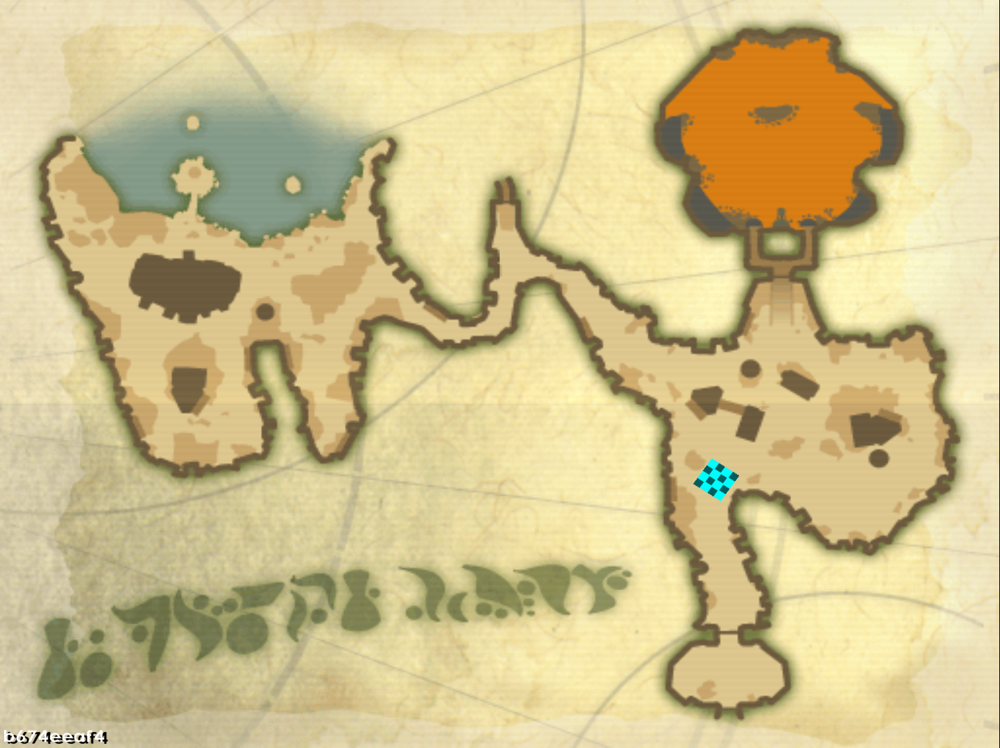

<head>
  <meta name="twitter:card" content="summary_large_image" />
</head>

Plenty of small Jak 3 bugfixes and some custom level improvements.

<!--truncate-->

## Release Info

This month's OpenGOAL Tooling (jak-project repo) release is `0.2.17`.

  

    <LauncherDownloadLink />
  

## Community Spotlight

### Overgrown

Cuttlefish (author of [Rockpool](https://www.youtube.com/watch?v=hrH-foTn0IQ) and [River to Water](https://www.youtube.com/watch?v=oWSa9BEHGFo)) has just released their newest custom level project, "Overgrown". You can play it via the official launcher if you have the mod list set up (instructions [here](https://jakmods.dev/)).

Watch the trailer here:

<ReactPlayer
  controls
  url="https://www.youtube.com/watch?v=Kbb2yiYg0cw"
  className="blog-video"
/>

### Big TeamRuns Update

[TeamRuns](https://teamruns.web.app/), the Jak 1 online multiplayer mod, just got a substantial update.

Up until now, it was based on an extremely old version of OpenGOAL, but has now been rebased on the most recent vanilla release, meaning it can now enjoy over a year of progress that has been made since, which should help a bit with things like performance.

Alongside that, a bunch of TeamRuns exclusive bugs were fixed and a couple of new features were added, such as a taunt menu, which allows you to play a small selection of voice lines to other players, and the ability to downpatch to older versions of both the game and the TeamRuns client.

## General Changes

### Use Normals From Custom Model in Model Replacement <PRLink href="https://github.com/open-goal/jak-project/pull/3649"/>

Custom model replacements will now use the normals from the custom model instead of the model they were replacing, which should make the replacements look much better.

## Custom Levels

### Improvements to Background Geometry <PRLink href="https://github.com/open-goal/jak-project/pull/3672"/>

Custom levels got support for a bunch of new features for the background geometry.
It is now possible to use transparent textures and alpha for vertex colors. You can also use environment maps on models by using a specific Blender material setup to give them a shiny look.

### Support for Vanilla Level Skies and Textures on `generic` Objects <PRLink href="https://github.com/open-goal/jak-project/pull/3691"/>

It is now possible to add vanilla skies to custom levels and to get proper textures for objects that are rendered with `generic`, like dark eco pools or dying enemies.

## Jak 2

### English Subtitle Fixes <PRLink href="https://github.com/open-goal/jak-project/pull/3665"/>

The timings and length of some of the English subtitles were adjusted to better line up with the audio.

### Workaround to Fix Sounds Getting Cut Off <PRLink href="https://github.com/open-goal/jak-project/pull/3660"/>

A longstanding issue since the first release of Jak 2. Most prominently occurring in the Gun Course, sounds would abruptly be cut off after a while.

Now, if too many sounds are playing, older sounds will be removed, which should prevent this issue from occurring.

## Jak 3

### Subtitle Text Fix <PRLink href="https://github.com/open-goal/jak-project/pull/3625"/>

The subtitle text in cutscenes will now display.

### Progress Menu Crash Fix, `bigmap` <PRLink href="https://github.com/open-goal/jak-project/pull/3657"/>

The progress/pause menu no longer crashes when selecting any of the options, which means you can now restart mission, save and load, etc. It still needs some work on the graphics side and the "PC port treatment" to make it easier to modify in the future.

Along with this, `bigmap` has been decompiled, which was the last big remaining critical file, used for the world map in the progress menu.

### Fix Collision `NaN`s <PRLink href="https://github.com/open-goal/jak-project/pull/3674"/> <PRLink href="https://github.com/open-goal/jak-project/pull/3686"/>

There is some collision code that will end up dividing by zero on the first frame that an object is spawned as its bones are still uninitialized. On PS2, this would just give you `0` and send the object to the origin for a frame until it's fully initialized. On PC, however, dividing by zero is not handled the same way, and it results in the propagation of `NaN`s everywhere.

This fixes:

- Bombbot bombs not spawning
- `mh-wasp`s not spawning in the Sewer levels
- Some cutscenes being started too early
- The Temple Watchers' position would become `NaN` after firing their laser at Jak.

### Fix Artifact Race Voice Lines and Crash <PRLink href="https://github.com/open-goal/jak-project/pull/3686"/>

Due to a small decompilation mistake, the Daxter voice lines in the artifact race missions would fail to play and the game would crash when attempting to play some specific ones.
