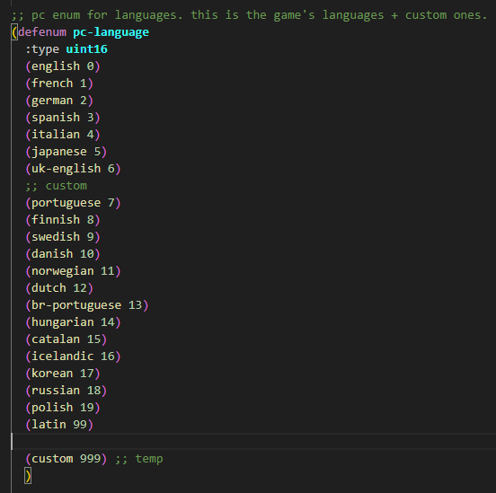
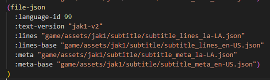

# Text Translations

The following document describes how to contribute text translations and the current limitations around them.

## TLDR

:::tip
Here's a brief rundown of the key points for translating text.
:::

- Jak's font is very limiting, keep this in mind when translating strings or for evaluating if your language is a good candidate. [#supported-characters](#supported-characters)
- Crowdin:
  - Only the custom strings we have added are able to be translated via [Crowdin](https://crowdin.com/project/opengoal)
  - The strings are keyed by their text-id. If it's not obvious what the context is, you can reference the text-id and where it is used in the code
    - [Jak 1](https://github.com/open-goal/jak-project/blob/master/goal_src/jak1/engine/ui/text-h.gc)
    - As time passes, hopefully translators will add this context into Crowdin so it becomes more obvious.
- If you need to modify original game strings, you will need to submit a PR with your changes.
  - This requires you to set up a development build of OpenGOAL and decompile the game by yourself.

## Crowdin

We've chosen Crowdin as our provider for hopefully simplifying the translation process. If you are interested in moderating / becoming a proof reader for a specific language, reach out in the Discord and we can make that happen.

You will need to provide your Crowdin username to do so, and you should probably have already contributed to some degree (which makes it even easier to elevate your privileges)

## Supported Characters

First off, the fonts included in the the games are quite limiting, they do not support the entire unicode character set (not even close). Therefore if your language isn't compatible, adding support for it is outside the scope of this guide.

### Jak 1

Jak 1's font supports the following characters from a translation string:

- <span className="yellowColor"><b>Uppercase</b></span> alphabetical characters (A through Z)
- 0-9
- Space
- The following ASCII special characters
  - `' ! ( ) + - , . / : = < > * % ? "`
  - `<TIL>` Represents `~`
- Other Special Characters
  - ``ˇ ` ¨ º ¡ ¿ Æ Œ Ç ß ™ 、Å Ø``
- Accents
  - Tildes
    - `Ñ Ã Õ`
  - Acute
    - `Á Ć É Í Ń Ó Ś Ú Ź`
  - Double Acute
    - `Ő Ű`
  - Circumflex
    - `Â Ê Î Ô Û`
  - Grave
    - `À È Ì Ò Ù`
  - Umlaut
    - `Ä Ë Ï Ö ö Ü`
  - Other
    - `Ą Ę Ł Ż`
- Japanese Characters (All katakana and hiragana used in modern Japanese writing)
  - Punctuation
    - `・ ゛ ゜ ー 『 』` (note that period is omitted, you must use the Western-script period)
  - Kanji
    - `海 界 学 岩 旧 空 撃 賢 湖 口 行 合 士 寺 山 者 所 書 小 沼 上 城 場 出 闇 遺 黄 屋 下 家 火 花 青 宝 石 赤 跡 川 戦 村 隊 台 長 鳥 艇 洞 道 発 飛 噴 池 中 塔 島 部 砲 産 眷 力 緑 岸 像 谷 心 森 水 船 世`
  - Katakana & Hiragana
    - `ァ ア ィ イ ゥ ウ ェ エ ォ オ カ キ ク ケ コ サ シ ス セ ソ タ チ ッ ツ テ ト ナ ニ ヌ ネ ノ ハ ヒ フ ヘ ホ マ ミ ム メ モ ャ ヤ ュ ユ ョ ヨ ラ リ ル レ ロ ヮ ワ ヲ ン`
    - `ぁ あ ぃ い ぅ う ぇ え ぉ お か き く け こ さ し す せ そ た ち っ つ て と な に ぬ ね の は ひ ふ へ ほ ま み む め も ゃ や ゅ ゆ ょ よ ら り る れ ろ ゎ わ を ん`
    - Dakuten
      - `ヴ ガ ギ グ ゲ ゴ ザ ジ ズ ゼ ゾ ダ ヂ ヅ デ ド バ ビ ブ ベ ボ`
      - `が ぎ ぐ げ ご ざ じ ず ぜ ぞ だ ぢ づ で ど ば び ぶ べ ぼ`
    - Handakuten
      - `パ ピ プ ペ ポ`
      - `ぱ ぴ ぷ ぺ ぽ`
- PS2 Buttons
  - `<PAD_X>` (PlayStation X button)
  - `<PAD_TRIANGLE>` (PlayStation Triangle button)
  - `<PAD_CIRCLE>` (PlayStation Square button)
  - `<PAD_SQUARE>` (PlayStation Circle button)

## Modifying Existing Translations

There are two ways to modify and contribute translations.

The first is to do it via [Crowdin](https://crowdin.com/project/opengoal) which has every custom string we have added to the games

- Pros
  - Keeps track of what isn't already translated
  - Zero knowledge of Git/Github required
- Cons
  - You are unable to see what the string would look like in game
  - Can only translate strings that have been added

As you are translating via Crowdin, if it is not obvious what the string is or where it is used you can cross reference the key with the text-id enum found here https://github.com/open-goal/jak-project/blob/master/goal_src/jak1/engine/ui/text-h.gc


The second is to modify the files and submit a PR via github https://github.com/open-goal/jak-project/tree/master/game/assets/jak1/text

- Pros
  - Can add a new language
  - Translate any text-id string you want
  - Test it out in the game if needed
- Cons
  - Requires submitting a PR
  - Requires familiarity with setting up the game and REPL

## Adding a brand new language

If you want to add a brand new language or locale to the game you will have to go down the PR route which is going to take significantly more time to set up.

:::caution Be aware that at the time of writing we use the original Jak 1 font, which has a very limited character set. Your language might not be supported well by this font so you'll want to confirm this first. Feel free to reach out for clarification if you are unsure. :::

### Step 1 - Setting up the project

First off, if you are going to work on a new language you will need to eventually get the changes merged into our GitHub repository - https://github.com/open-goal/jak-project

You should setup the project using the instructions in the repository's README:

- Windows - https://github.com/open-goal/jak-project#windows
- Linux - https://github.com/open-goal/jak-project#linux

And if you are unfamiliar with GitHub and Git, here are some useful links:

- How to fork our repository and submit a PR - https://www.youtube.com/watch?v=yr6IzOGoMsQ
- How to use Git via a GUI to commit your changes - https://www.youtube.com/watch?v=RPagOAUx2SQ

If you have successfully followed the steps and the game is successfully running out of the project directory, we can proceed.

### Step 2 - Adding a new language to the Menus

:::tip
If you're going to be editing the files with Visual Studio Code it is highly recommended that you install the OpenGOAL extension.
:::

#### Step 2.1 - Adding enum ID's to the Game's code

First we should start by adding an option in-game to pick the language we're currently working on:

1. Start by opening `goal_src/{GAME_NAME}/pc/pckernel-impl.gc` and look at the `defenum pc-language` list
2. If your language is not on this list, add it with a clear name and unique ID. For example `(latin 99)` (do not exceed the ID value of custom):\

3. We now have to setup text entries for this new language. First add it to the `text-id` enum in the respective `all-types.gc` file:
    - for Jak 1 that is `decompiler/config/all-types.gc`\
\
\
:::tip
These enum ID's are in Hexadecimal (ie. 1-9, A-F)
:::
4. Add this same entry to the same enum in `goal_src/{GAME_NAME}/engine/ui/text-h.gc`\

5. Lastly, add at least the english text entry for this in `game/assets/{GAME_NAME}/text/game_custom_text_en_US.json`\


#### Step 2.2 - Wiring up the Language

We can now wire up this new language to the game itself. This requires a few changes:

1. Add it to the `*text-languages*` and `*subtitle-languages*` lists in `goal_src/{GAME_NAME}/pc/progress-pc.gc`. Maintain the order by the numeric ID (ie. `english` is `0` so it comes first). If your language was brand new you should also add it to `*language-remap-info-pc*` in a similar fashion.\

1. Add it to the built-in debug menu for completeness in `goal_src/{GAME_NAME}/pc/debug/default-menu-pc.gc`\

1. Now we have to create the text files that will contain the translated strings for the game to read:
   - Grab the decompiled base game strings file from `decompiler_out/{GAME_NAME}/assets/game_text.txt`, copy it into `game/assets/{GAME_NAME}/text/` and rename it to `game_base_text_{LANG_CODE}.json`
   - Now copy and paste the `game_custom_text_en_US.json` in the same folder and rename it to `game_custom_text_{LANG_CODE}.json` as well
   - Then go to `game/assets/{GAME_NAME}/subtitle/` and copy and paste `subtitle_lines_en-US.json` and `subtitle_meta_en-US.json` in the same spot and rename them to `subtitle_lines_{LANG_CODE}.json` and `subtitle_meta_{LANG_CODE}.json` respectively
   - open `subtitle_meta_{LANG_CODE}.json`, delete everything and paste in the following:
   ```json
   {
   "cutscenes": {},
   "hints": {}
   }
   ```
1. Lastly, we have to point to these files in the code for the game to load them:
   - open `game/assets/{GAME_NAME}/jak1/game_text.gp` and add the base and custom text files to the list\
  
   - open `game/assets/{GAME_NAME}/jak1/game_subtitle.gp` and add the subtitle text file to the list\
  

#### Step 2.3 - Cleaning up the Base Game Strings file

If you would try compiling the game at this stage, you would encounter an error regarding our `game_base_text_{LANG_CODE}.json` file. That is because we need to clean it up first.

:::caution
This part assumes you're using Visual Studio Code to edit the file.
:::

1. Let's start with deleting these 3 lines of code, because we don't need them:\

2. Now let's turn all the hex ID's into proper JSON formatting:
   - start by selecting the first `(#x` at the top of the file, press `Ctrl+Shift+L` to select every single occurence of this combination of symbols in the file, it should look like this:\
  
   - now, simply type in a `"`, then move using the Arrow Keys to the end of the ID and add another `"` followed by a colon:\
  
   - select the `)` at the bottom of the first group of strings, press `Ctrl+F` to open up a `Find` window, press the right arrow button on the left side of it to expand it to show `Replace`, then in the `Replace` box type in a `,` and press `Replace All`, like so:
  
   - now add `{` at the top of the file, and `}` at the end:\
  \
  
1. Now we have to delete all of the unnecessary translated strings we don't need. So, for every string ID, delete every line other than the first, so it goes from this:\
\
To this:\
  \
   - to do this quickly select the `,` from the line below to the start of the line the `,` is on, like so:\
  
   - press `Ctrl+Shift+L`, hold `Shift` and press `Arrow Up` enough times, so the selection looks like this:\
  \
   - press `Backspace` to delete all of the selected lines
   - while your cursor is still in multiple places at once delete the spaces before the `,` for better readability, like so:\
  

We suggest you delete the credits starting here:\
\
And ending here:\
\
As they do not need translation.

1. Finally, remove the `,` just before the `}` at the end of the file to finish the cleanup.\


#### Step 2.4 - Compiling the Game and testing the Language

We need a test string to check if our language loads in the properly. Let's replace the prompt to talk with a placeholder text:
- in the `game_base_text_{LANG_CODE}.json` file we just cleaned up replace the string with ID `0104` with something else, like so:\


1. Let's recompile the game and boot it to make sure it's still working. If you followed the build setup instructions you should be familiar with this, but to recap:
   - Open a terminal / command prompt at the root of the folder and enter `task repl`
   - Once the REPL loads, run `(mi)`
   - When the `(mi)` completes, open a separate terminal and run `task boot-game`
   - If everything boots up successfully, you should be able to see your new language in the menu, and selecting it shouldn't cause any errors!\

1.  Since we changed the string for the prompt to talk, turn around and approach Keira to see your placeholder text in place\


### Step 3 - Translating a Base Game String

As stated above, Crowdin only includes new custom strings we have added in OpenGOAL (for example, `Graphics Settings`)
