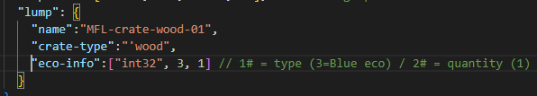
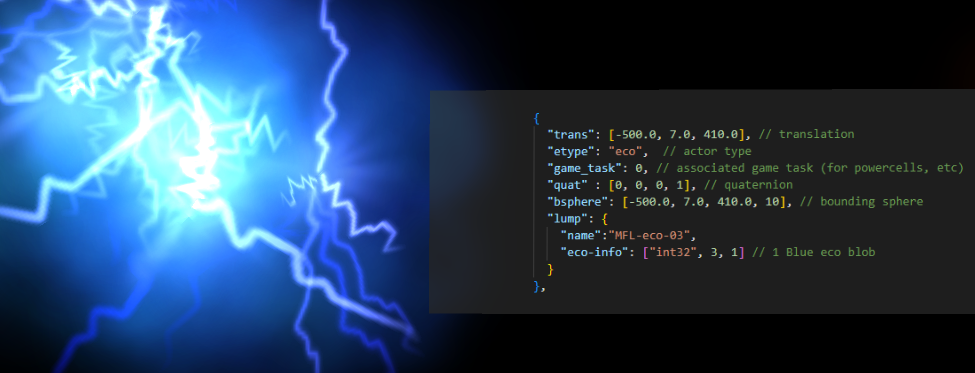
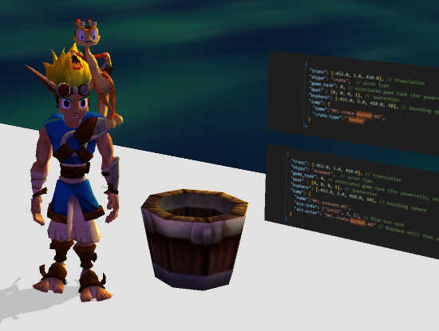

# Actors

## Common Actors

As mentioned earlier, "actors" are all of the interactive objects in the game. What I'm calling "common" actors are the ones that do not need anything special to be included in your level to work by themselves. These include the main collectables like Power Cells, Precursor Orbs or eco but also blue eco launch pads and eco vents.

Technically, some "common actors" are not always included and will need to be added to the `.gd` manually. I will omit those for now and they'll be explained in the "Advanced Actor" part of this guide.

## General Information for All Actors

This will apply to every actor, later on I will go more in detail for each type of actor.

The first thing to know is where to even create the actors. As mentioned earlier, this is done in the `.jsonc` file for your level.

If you've copied the `.jsonc` from `test-zone`, you'll already have some actors present in the file:

Let's look at all of these individually in detail.

### `trans`

`trans`, in this case, is short for "translation". This will be the position set for the actor in the game's world. It's set in meters by default. You can use either the "Stats \> Target" method or the Blender Empties method to find the correct placement for your actors.

### `etype`

The `etype` is simply the type of the actor you want to spawn. Here's a list of common actors `etype`s as well as what they actually are in the game:

- `money` is a Precursor Orb.
- `fuel-cell` is a Power Cell.
- `crate` is the base type for all the different types of crates, such as wooden chests, steel crates (which usually contain orbs in the base game), iron crates which contain Scout Flies, buckets and barrels.
  - `bucket` is a `crate` with the type set to `bucket` by default.
  - `barrel` is also a `crate` with a type set to `barrel` by default.
- `eco` is the base type for the different eco colors, similar to crates.
  - `eco-yellow` is yellow eco.
  - `eco-red` is red eco.
  - `eco-blue` is blue eco.
  - `health` is a big green eco blob.
  - `eco-pill` is a single green eco pill.
- `ecovent` is the base type for eco vents found throughout the game, the specific eco or item that they'll give you can be set.
  - `ventyellow` is a yellow eco vent, but it can technically be changed to give you anything else as well.
  - `ventred` is a red eco vent, but it can technically be changed to give you anything else as well.
  - `ventblue` is a blue eco vent, but it can technically be changed to give you anything else as well.
- `launcher` is the blue eco launch pad.

There's technically other "common" actors, but those won't be listed here, as those require extra files to be included in the `.gd` of the level which will be explained in the "Advanced Actors" part of this guide with the other actors.

### `game-task`

This will associate our actor with a game task. These are used to set which tasks have been done in the game. You'll need this for your Power Cells and Scout Flies to even count to the total, as well as when you want something in your levels to only happen if a specific task has been completed or not.

More on that in the "Tasks and Menu" part of this guide. You can keep the task at `0` for now.

### `quat`

`quat` is short for "quaternion". These will set the rotation of your actor. Quaternions are just a mathematical formula that uses 4 values to set the rotation of your object.

You do not need to do any of this math yourself, you can simply set Blender to use this method and copy the values as such:

### `bsphere`

-

### `lump`

The `lump` is a list of key-value pairs for your actor. Some keys will be able to be used in every actor, such as the "name" one which allows you to give an unique name to each actor.

Some will be specific to some "etype" of actors such as "eco-info" to set the collectable information of a crate or "spring-height" to set the height of a blue eco jump pad to name a few.

## Testing the Existing Actors

As a first test for actors, I'll simply be moving the 3 existing ones in the `.jsonc` to my level. Using the empty method, I'll set their position precisely where I want them in the level.

### Setting the Empties in Blender

Here's my empties all set in Blender:

You should also keep your file well organized. For big and complex levels, the actors will quickly add up. You should try to stay consistent between the name set in Blender and the `name` lump you give your actor and you should store all your actors in a collection in Blender:

You can even have different collections set for each `etype` if you have a lot of them. I'd also suggest using a different "Display As" for empties for different kinds of `etype`s so you can tell at a glance which one each is.

I usually use cubes for `crate` and spheres for `money` for example.

### Copying the Position to the `.jsonc`

Now that I have all these empties set where I want those actors to spawn, I'll simply copy the position values from Blender into the `.jsonc`, not forgetting to do the axis transformation and copying the same values to the `bsphere`:

Link to the commit: [028cd45192dec59b716ae286bd970d2245d1eb03](https://github.com/OpenGOAL-Unofficial-Mods/OpenGOAL-example-Code/commit/028cd45192dec59b716ae286bd970d2245d1eb03)

### Testing In-Game

Don't forget to save your file, compile the game and restart in debug mode. If you haven't set the spawn point, also select the `continue-point` of your level in the debug menu.

You'll now be greeted with a whole lot of…

Nothing.

Don't despair, the reason you can not see any of the actors is simply because they do not have any kind of visibility data to spawn then, so the game doesn't know it has to do so. You can bandage that by forcing the game to display all actors.

Simply go into the debug menu in "PC Settings… \> PS2 Actor Vis" and turn it off:

Your actors should now be visible in the game:

**Important note** : `PS2 Actor Vis` is only used here as a quick and dirty fix, this shouldn't be the final way you spawn your actors as doing it this way loads in every actor that is in any loaded level. This will impact performance a lot on weaker systems.

Some more efficient methods are being looked at for this at the moment and this part will be updated whenever a really good way is available.

You can also save the setting at the bottom of that same list so you do not need to always switch it on every reboot.

If the debug menu isn't allowing you to switch between on and off for the "all actors" option and your actors are not visible, you might have a version with a broken debug menu. To fix it,

you might need to update to a newer version of the mod-base or the main project.

## The `money` `etype`, AKA Orbs

Orbs don't have much more to set up. You just need to set the position correctly and I'd also suggest giving them a unique name. I usually do `levelname-etype-count` to keep track of everything.

Link to the commit: [03db97866818abe57b0007544ec7624c4c7dee24](https://github.com/OpenGOAL-Unofficial-Mods/OpenGOAL-example-Code/commit/03db97866818abe57b0007544ec7624c4c7dee24)

Small advice I can give for orbs is to move them 1.5 to 2.0 meters up from the ground for them to look "correct".

Link to the commit: [d926d4e18d54e643642cce5fc0af8da6a87c5e58](https://github.com/OpenGOAL-Unofficial-Mods/OpenGOAL-example-Code/commit/d926d4e18d54e643642cce5fc0af8da6a87c5e58)

If you mess around with the rotation of the orb, you can have some wild rotation that doesn't appear normally in the game as such:

Link to the commit: [70d7977c3b1b45044ed84572e60a6e3fc3000128](https://github.com/OpenGOAL-Unofficial-Mods/OpenGOAL-example-Code/commit/70d7977c3b1b45044ed84572e60a6e3fc3000128)

You can technically add an `eco-info` lump and change the type of collectible you'll get by collecting the orb. It'll still look like an orb in the game but will give you whatever collectible you changed it to.

Check the list in the `eco-info` part of the `crate` type.

You can also change the quantity in the second part of the `eco-info` which means you can make one orb give you several ones.

## The `fuel-cell` etype, AKA Power Cells

Power Cells also don't have too much going on either. The only special thing you need to take care of is the task which will be required if you want your cell to actually count. This part will however be explained in the "Tasks and Menu" part of the guide.
For now we'll just keep it at 0:

Link to the commit: [fe16dd4c1e19fab688eb108a449a27d9967d2ec0](https://github.com/OpenGOAL-Unofficial-Mods/OpenGOAL-example-Code/commit/fe16dd4c1e19fab688eb108a449a27d9967d2ec0)

Same as for Orbs, you should move them up by around 2.0 meters up from the ground for it to look normal.

## The `crate` etype

Crates have a few more things to keep track of. Mainly the type of crate as well as the content of said crate. The position of crates, as opposed to orbs and cells, should be placed exactly on the ground.

Furthermore, the `quat` for rotation is a lot more important to get right here so your crates look like they're sitting correctly on the ground.

### `crate-type`

The `crate-type`, which is part of the lump, will set what kind of crate you're spawning in.

#### `'wood` crate type

These are the basic wooden chests that usually have green eco pills in them in the original game with sometimes full health or another eco. You can however change whatever is inside as with every other crate.

#### `'iron` crate type

These are the iron crates with the red middle part that normally have a Scout Fly inside. For these to work, you'll also need to set the `eco-info`'s content, discussed in the next part, to `8`, which puts a Scout Fly inside.

For scout flies to work properly, they'll need their task set correctly. This part will however be explained in the "Tasks and Menu" part of the guide.

#### `'steel` crate type

These are the tough steel crates that can't be broken with simple attacks that normally have orbs inside and sometimes cells. Just like the wooden chest, you can also change the content of these to whatever you please.

As these steel crates can't be broken with simple attacks, make sure you add things in your level to break them. Such as yellow eco, Flut Flut, a zoomer or a way to fall down onto it from far enough up.

#### `'bucket` crate type

Buckets are technically also a type of crate. You can find some of them on Sentinel Beach. By default, they do not drop any item but you can change that if you want to.

#### `'barrel` crate type

Barrels are also another type of crate, they mostly work like wooden crates by default.

#### `'darkeco` crate type

Dark eco crates are the crates that damage you, they don't need anything specific other than the `crate-type` set to `'darkeco` to work.

The cluster of 8 dark eco crates you can see in zoomer levels are actually a different actor which needs to be included in the level's `.gd`, so that'll be explored in the "Advanced Actors" part of this guide.

You can also technically put anything inside like any other crate. I'd advise against doing so as players are taught to try to avoid these as much as possible. Unless you want to play with this very thing in itself and torture the players…

### `eco-info`

Don't get fooled by the name, the `eco-info`, also part of the lump, will actually be used to set any collectable that's inside the crate. Here's how it's set in the `.jsonc`:

The `int32` defines the type of the value your key will be using here. You need an integer here which is what this sets it to.

The **first number** sets the **type** of collectable that'll spawn from breaking that crate. Here's the values that you can set this for and what they'll spawn:

- **1** = Yellow eco blob
- **2** = Red eco blob
- **3** = Blue eco blob
- **4** = Green eco blob
- **5** = Orbs
- **6** = Power cell

Needs a "movie-pos" to work properly. Explained later.

- **7** = Green eco pill
- **8** = Scout fly

Also turns wood crate-type into iron but not any other.

Also make the crate bounce like iron crates even if it's another crate-type

- **9** = Several green eco pills

The **second number** sets either the **quantity** of items that drops **or** is used for the **task** in the case of power cells and scout flies, which again, will be explained in the "Tasks and menu" part of this guide.

### `movie-pos`

The `movie-pos`, which you can also add in the lump, will set where the Power Cell will spawn when you break the crate or collect the last Scout Fly linked to that crate. So you should only have to add this `movie-pos` in case you've added either a Power Cell (`6`) or a Scout Fly (`8`) to the crate.

Here's what it looks like in the lump:

You can simply copy the same position in meters that's in the `trans` which will make the Power Cell jump in place and stay there. You can also change it so the cell moves toward that new position when the crate is broken or the Scout Fly is collected if it's the last one.

### How to Get the Correct Rotation

Using the cube visualization in Blender for the empties used for the crates isn't just for nothing. This makes it a bit easier to line up with the ground. You can also make use of the "Create Orientation" and the "Align to Transform Orientation" functions to align it perfectly.

Or just manually rotate it.

Whenever the empty is aligned, you can copy the `quat` rotation values as explained earlier.

### Some Crate Examples

I'll create some examples here so you can see different combinations. You can copy and edit these around as well for more testing.

Use the commit at the end to be able to copy the code

Some wooden crates with different contents:

An iron crate with a Scout Fly in:

Some steel crates with different contents:

A bucket, barrel and dark eco crate with no set content:

Link to commit: [238370ae492932994c6913d3535124cf7e4d5c11](https://github.com/OpenGOAL-Unofficial-Mods/OpenGOAL-example-Code/commit/238370ae492932994c6913d3535124cf7e4d5c11)

I've also added the `.jsonc` info next to each actor on the level itself, so you can move around the level and see how it was created next to each actor:

## The `eco` `etype`

The `eco` `etype` allows you to put eco blobs on the ground without having to break a crate to access them.

You can technically use anything that you can put in an `eco-info` lump. But using things that aren't eco in these can become very confusing so I'd advise against doing so.

Here are some example of eco types:

1 Yellow eco blob

1 Red eco blob

1 Blue eco blob

1 Green eco blob

1 Green eco pill

You can also set the quantity value for green eco pills to a higher number than one. This won't spawn multiple ones but will make a single one count for more. This only works with eco pills and not the other eco types.

1 Green eco pill that counts for 10

Note that using `9` in the `eco-info` for the collectible's type will crash the game. This is only usable with crates. If you want several green eco pills on the ground, you'll need to add them individually as different actors.

Link to commit: [509199cffdcf5ca0b9baf430ff8e6bcf236f0e1a](https://github.com/OpenGOAL-Unofficial-Mods/OpenGOAL-example-Code/commit/509199cffdcf5ca0b9baf430ff8e6bcf236f0e1a)

## The `ecovent` etype

The eco vents can be set to the four base ecos by using the same `eco-info` values as for the eco blobs.

Note that the lower part of the vent in the game is not part of the actor but is actually part of the level's geometry, you'll need to add them/create them as well in Blender to get them in game.

### Basic Eco Vents

Here's some examples for the four basic eco vents you can make:

Yellow eco vent:

Red eco vent:

Blue eco vent:

Green eco vent:

Link to commit: [6d4b12795387180824f98bc55cab9103354066ec](https://github.com/OpenGOAL-Unofficial-Mods/OpenGOAL-example-Code/commit/6d4b12795387180824f98bc55cab9103354066ec)

### `alt-actor` For Blocked Vents

By adding an `alt-actor` in the lump, you can set the vent to only be active if another actor has been broken. You can set a variety of different actors for it but it has to be one that is broken, not just collected like an orb or cell.

Any type of crate will do fine and will be what I'll use in this example as they're the only common actor that you can break.

First you'll need an actor to break, I'll use a bucket here:

Then an `ecovent` with an `alt-actor` set to this breakable actor we just made:

In-game you'll just see the bucket:

Then after breaking it, the vent will start working:

Link to the commit: [089849870b3cd836285d7e989b1198544c950e56](https://github.com/OpenGOAL-Unofficial-Mods/OpenGOAL-example-Code/commit/089849870b3cd836285d7e989b1198544c950e56)

My two actors here are on top of each other to make it looks like the bucket is blocking the vent. You can however have them at two completely different spots and it'll still work.

Just make sure it makes sense as far as game design goes in your level if you have them separated like that.

### `options` For Deactivated Vents

(cba figuring this one rn, will write whenever I do)

### Other Collectables in Vents

While the `ecovent` are supposed to be used for eco, it's actually possible to put a different collectable in there. There won't be any particle animation for those but they are still functional.

As they don't look like anything, I'll just post the `.jsonc` info you need to spawn them.

This vent will give you orbs infinitely:

This vent will give you small green eco pills, which will heal you a bit slower than a normal green eco vent:

Link to the commit: [6dbd77a0a82ac626c0007a2c948852e627b9f7cb](https://github.com/OpenGOAL-Unofficial-Mods/OpenGOAL-example-Code/commit/6dbd77a0a82ac626c0007a2c948852e627b9f7cb)

## The `launcher` etype, AKA Blue Eco Launch Pads

There's two main things you can set with `launcher`s, the launcher's height and the landing spot. If you don't set a landing spot, you'll be free to move however you want when you use it.

### `spring-height` For the Launch Height

The `spring-height` will allow you to determine how far up the launcher will send you, you can set it to meters like I did to make it much easier to calculate how high you need it to put it.

Link to the commit: [cee84c58f4a1c902bd60fa6cfcaffb7fb3e2db34](https://github.com/OpenGOAL-Unofficial-Mods/OpenGOAL-example-Code/commit/cee84c58f4a1c902bd60fa6cfcaffb7fb3e2db34)

### `alt-vector` for the landing spot

The `alt-vector` will allow you to set the exact landing of the launcher. Don't forget that using this will make it so you can't move around during the jump. You can use either `vector` or `vector4m`, I'll be using `vector4m` so I don't have to do any unit conversion and easily set the position.

The position is set here to the spawn:

Link to the commit: [292f078128208cbfd54b30cf1028c90c93f5429c](https://github.com/OpenGOAL-Unofficial-Mods/OpenGOAL-example-Code/commit/292f078128208cbfd54b30cf1028c90c93f5429c)
