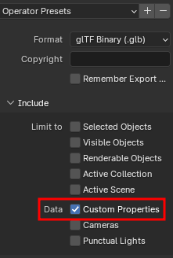
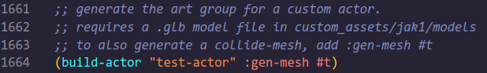
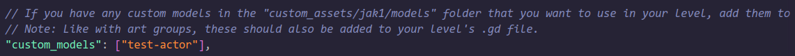
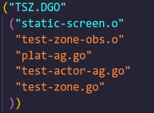
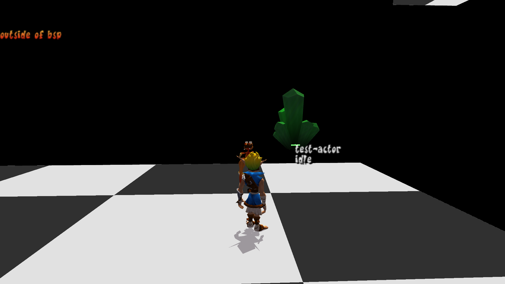

# Custom Actors

<PostAuthors authors={["hat-kid"]} authorNames={["Hat Kid"]} />

While still in early stages, the "Build Actor" tool allows you to take a mesh created in Blender and import it into the game to use for your own custom actors in custom levels.

This guide will cover the basics of what a custom actors needs to function, how to define a custom actor, and the minimum setup for the GOAL code. It will **not** cover how to create models in Blender or add any special custom behavior in GOAL.

## Limitations

Before we get started, it's worth covering the current limitations with this system.

### Games

This tool currently only supports Jak 1.

### Animations and Joints/Bones

Actors can have a skeleton. There is a limit of 100 bones. There is currently no support for the `align` bone.

Custom animations are supported. You can have multiple animations for an actor. Currently, animations have 60 keyframes per second, which is higher than usual in Jak.

:::info

- If there is no skeleton, actors will be given one `main` bone located at the root.
- If there are no animations, actors will be given a default `idle` animation that doesn't do anything, as actors need to have at least one animation in order to work.
- Try to keep the animation size reasonable, as there is a 2 MB file size limit for art groups. If your art group exceeds this limit, you will get a DGO heap overflow error when your art group is loaded.

:::

### Collision

Some actors have collision meshes defined for their model (e.g. platforms), while others just use collision spheres defined in code (e.g. most enemies, such as Babak Lurkers).

If you don't want/need to use a collision mesh for your model, defining collision spheres in GOAL will be explained further down.

Collision meshes for actors are defined by an array of `collide-mesh` GOAL objects, defined in the corresponding art group for their model. Most of the time, this array contains just a single [`collide-mesh`](https://github.com/open-goal/jak-project/blob/c64eea633741e67840d0a71a90927c392e49af8b/goal_src/jak1/engine/collide/collide-mesh-h.gc#L49), but there are exceptions, such as the model for the final boss Precursor Robot, which uses 19 (!) `collide-mesh`es.

The Build Actor tool also supports automatically generating `collide-mesh` objects out of models. For every Blender object that has custom collision properties applied, the tool will generate one `collide-mesh` to represent this mesh.

There is another important caveat you have to consider when creating collision for your model:
Because the triangles in a `collide-mesh` use `uint8`s for the vertex indices, there is a hard limit of 255 vertices per `collide-mesh`. If any objects in your model file that have collision properties applied have more than 255 vertices, the tool will assert and crash the compiler, so be mindful of that.

Though there is no theoretical limit for how many `collide-mesh`es you can fit in an array (aside from things like art group file size), you should try not to overdo it, since the game's collision cache does not like it when there's too many triangles grouped up too close together, which will result in Jak phasing through complex collision like this or the game potentially crashing (and you will also have set up collision in GOAL for each of these meshes which can get tedious with this many).

:::warning
Note that Blender's GLTF exporter will separate faces, which could increase the overall vertex count, so double check the total count on the `.glb` file itself and make adjustments if necessary.
:::

## Getting Started

To get started, you will need the following:

- Working OpenGOAL install with tooling version `>=0.2.13`. `>=0.2.16` if you plan on using custom animations.
- [Blender 4.0](https://download.blender.org/release/Blender4.0/) or [Blender 4.2](https://download.blender.org/release/Blender4.2/). Blender 4.1 will **not** work due to a quirk in the GLTF exporter.
- [OpenGOAL Blender plugin](https://github.com/open-goal/jak-project/blob/master/custom_assets/blender_plugins/opengoal.py) (only needed if you plan on using collision meshes).

## Custom Collision Properties in Blender

If you've worked on custom levels before, you are probably aware of/have already been using the [OpenGOAL Blender plugin](https://github.com/open-goal/jak-project/blob/master/custom_assets/blender_plugins/opengoal.py) to set collision properties for your level geometry, such as the collision mode, material and event.

For custom models, you can use the plugin to do the same for your collision mesh. Ideally, you would have the visual mesh set to `ignore` so the tool will not try to generate collision for it and instead create simpler meshes that approximate the visual mesh, set those to `invisible` so they don't show up when the model is imported and apply whatever collision properties you want for this mesh in order to keep the vertex count to a minimum.

## Requirements

An actor in Jak needs the following things to function:

### `art-group`

The `art-group` is a GOAL object that houses a bunch of "art" data for a specific actor. This includes joint geometry (`art-joint-geo`), compressed animation data (`art-joint-anim`), a collision mesh if required (`collide-mesh`), model data (`merc-ctrl`) and more. Art groups can have a number of each, many models for example have low LOD counterparts and a lot of different animations.

Thus, custom models will also require an art group to work. The Build Actor tool is what generates art groups for a given custom actor.

With the way OpenGOAL's foreground model renderer works, we luckily do not need to store the model data inside the art group (for custom models, we extract the model from the `.glb` file and store the data in the `.fr3` file for our custom level), so we can just insert some dummy data for the `merc-ctrl`. The game does, however, need at least some joint and animation data for the actor to work.

For the `art-joint-geo`, the armature from the GLB file is imported. If there is no armature present, a single `main` joint with a default bind pose is generated.

For the `art-joint-anim`, each animation present in the GLB file is converted to the game's animation format and compressed. If there are no animations, a default idle animation with nothing going on is generated.

### `skeleton-group`

The `skeleton-group` is technically also an `art-group`, but instead of being stored as a binary GOAL object file, it's actually defined in code. It also serves a slightly different purpose: It stores settings related to the actor in question, such as the name of the art group it uses, the default animation and joint geometry, shadow and LOD settings and the bounds sphere used for culling.

### GOAL Code

Every actor needs to be defined as its own type that inherits from `process-drawable` and have some logic set up in order to be able to be spawned and interacted with. If there is no code for the actor, its entity will spawn a `viewer-process` instead, which will, as the name suggests, just display the model and play back the first animation, and it cannot be interacted with in any way.

## File Setup

:::info
For the following, a custom level name of `test-zone` and a custom actor name of `test-actor` are assumed.
:::

First off, there's a couple of files you will need to edit/add:

### `custom_assets/jak1/models/custom_levels/test-actor.glb`

This should be the location of your model file. In Blender, go to `File > Export > glTF 2.0 (.glb/.gltf)` to export your project as a `.glb` file.

:::warning
If your model has a collision mesh, make sure that the `Custom Properties` checkbox is ticked in the export file dialog under `Include` so your custom collision properties are exported.


:::

### [`goal_src/jak1/game.gp`](https://github.com/open-goal/jak-project/blob/c64eea633741e67840d0a71a90927c392e49af8b/goal_src/jak1/game.gp#L1664)

To generate the art group for a custom actor, add `(build-actor "test-actor")` to the project file. Optionally, if you want to also have the tool generate a collision mesh for it, you can add `(build-actor "test-actor" :gen-mesh #t)` instead.



### [`custom_assets/jak1/levels/test-zone/test-zone.jsonc`](https://github.com/open-goal/jak-project/blob/c64eea633741e67840d0a71a90927c392e49af8b/custom_assets/jak1/levels/test-zone/test-zone.jsonc#L67)

Add `"test-actor"` to the `custom_models` list. This will add the model data to the FR3 for your custom level.



:::info
If you want your actor to be visible in levels other than your custom level, you can also add the model file to `custom_assets/jak1/models/common` with the name `test-actor-lod0.glb`. This adds the model data to the common level FR3, which will always keep it loaded.
:::

In the `actors` list, add an entry for the custom actor with etype `test-actor`.

### [`custom_assets/jak1/levels/testzone.gd`](https://github.com/open-goal/jak-project/blob/master/custom_assets/jak1/levels/test-zone/testzone.gd)

Add an entry for `test-zone-ag.go`. This is your actor's art group file which is automatically generated by the Build Actor tool. Also add an entry for the GOAL code file that will contain your actor logic, in this case `test-zone-obs.o`.



:::warning
Always keep the level file (`test-zone.go` in this case) as the last entry.
:::

## GOAL Code Setup

:::info
This guide will not delve too deep into the specifics of the GOAL language. If there is something you don't understand, you can check the following links for some documentation:

- [OpenGOAL Reference](/docs/reference)
- [Modding Examples](/docs/category/modding-examples)
- [Process and State](/docs/reference/process_and_state)

:::

By convention, the code for an actor is usually contained in one of two places:

- If it's a small and/or level specific actor, it will usually be located in the corresponding `*-obs.gc` file for the level (e.g. `test-zone-obs.gc`).
- If it's a more commonly used actor or it has too much code to fit in the `*-obs.gc` file, it gets its own file (e.g. `test-actor.gc`).

For now, we will put it in our level specific file, [`test-zone-obs.gc`](https://github.com/open-goal/jak-project/blob/master/goal_src/jak1/levels/test-zone/test-zone-obs.gc).

### Defining Our Type

First off, we need to define our type, which needs to be at least a child of `process-drawable`, since it we want it to be drawn as a foreground object that has a state and gets updated every frame.

```opengoal
(deftype test-actor (process-drawable)
  ((root collide-shape-moving :override)
   )
  (:methods (init-collision! (_type_) none))
  (:state-methods idle)
  )
```

The first list defines all the fields for the type. The only field we have here is the `root`. This defines your object's root transform.

By default, a `process-drawable`'s `root` is of type `trsqv`. For objects that only require position, rotation and velocity information, a `trsqv` is sufficient, but if we also want our actor to have collision, we need our `root` to be at least a `collide-shape`, so we override the `root` field to be a different type.

For the methods, we only have a single one used to set up the collision, which will be elaborated on in a bit.

We also have a single state method, `idle`. When our object is spawned and initialized, it will eventually enter the `idle` state. More on that later.

### Defining the `skeleton-group`

Our object needs a `skeleton-group` to function. We will use the [`defskelgroup`](https://github.com/open-goal/jak-project/blob/c64eea633741e67840d0a71a90927c392e49af8b/goal_src/jak1/engine/data/art-h.gc#L357) macro for this.

The macro requires at minimum:

- A name for the skelgroup.
- The name of the art group.
- The index of the default joint geometry in the art group.
- The index of the default animation in the art group.
- A list of all LODs and their maximum distance from which they are visible before switching to a lower LOD (we only have a single LOD, so we just set that to an effectively infinite distance).
- A bounds sphere. Make sure this covers your entire model or it will be culled early if the sphere is off screen!

Right now, the art group that is generated for the object will always have the joint geometry at index 0, the mesh group at index 1 and the first animation at index 2.

```opengoal
(def-art-elt test-actor-ag test-actor-lod0-jg 0)
(def-art-elt test-actor-ag test-actor-lod0-mg 1)
(def-art-elt test-actor-ag test-actor-idle-ja 2)

(defskelgroup *test-actor-sg* test-actor test-actor-lod0-jg test-actor-idle-ja
              ((test-actor-lod0-mg (meters 9999999)))
              :bounds (static-spherem 0 0 0 5)
              )
```

The `def-art-elt` definitions I added are not strictly required, but it just makes it look neater and lets you reference animations in code by that name instead of having to do `(-> self draw art-group data 2)`.

### Defining the Collision

Next, we define our `init-collision!` method that we declared earlier. Unfortunately, there are no fancy macros for this yet, so the code for this still looks quite ugly.

#### Allocating the `collide-shape`

This method will look a bit different depending on whether you choose to use collision meshes or collision spheres for your object, but the gist is the same: We first allocate our `root` object (which will either be a `collide-shape` or a child type like `collide-shape-moving`) and set some defaults for the collision reaction:

```opengoal
(let ((cshape (new 'process 'collide-shape-moving this (collide-list-enum hit-by-player))))
  (set! (-> cshape dynam) (copy *standard-dynamics* 'process))
  (set! (-> cshape reaction) default-collision-reaction)
  (set! (-> cshape no-reaction)
        (the (function collide-shape-moving collide-shape-intersect vector vector none) nothing)
        )
  ...
  )
```

#### Allocating the `collide-shape-prim-group`

Then, we allocate the `collide-shape-prim-group`, which will hold all of our collision spheres (and/or meshes). We need to set:

- How many prims we want to allocate (the fourth argument of the `new` call, in this case `(the uint 1)` to allocate a single prim).
  - **Make sure that you allocate enough prims for all your `collide-mesh`es if you use a collision mesh**! As mentioned earlier, for every object in Blender that has collision properties applied, a new `collide-mesh` will be generated, so that's how many you need to allocate.
- The prim ID for this group (last argument of the `new` call, in this case ID `0`).
- What type of collision we collide as (`(-> cgroup prim-core collide-as)`).
- What we can collide with (`(-> cgroup collide-with)`).
- The collision action (`(-> cgroup prim-core collide-action)`).
- The index of the bone we attach to (`(-> cgroup transform-index)`). If this is not set, it will use the root position by default.
- The radius of the bounds sphere for this prim group (make sure all objects in your prim group are contained within this sphere!).

Finally, the prim group we just defined needs to be set as the root prim for our `collide-shape`.

```opengoal
(let ((cgroup (new 'process 'collide-shape-prim-group cshape (the uint 1) 0)))
  (set! (-> cgroup prim-core collide-as) (collide-kind ground-object))
  (set! (-> cgroup collide-with) (collide-kind target))
  (set! (-> cgroup prim-core action) (collide-action solid rider-plat-sticky))
  (set! (-> cgroup transform-index) 0)
  (set-vector! (-> cgroup local-sphere) 0.0 0.0 0.0 (meters 5))
  (set-root-prim! cshape cgroup)
  ...
  )
```

#### Allocating the Prims

Now we need to allocate all our prims. If you use a collision sphere, you need to allocate `collide-shape-prim-sphere`s, if you use a collision mesh, you need `collide-shape-prim-mesh`es.

#### Allocating a `collide-shape-prim-mesh`

The `new` call arguments for a `collide-shape-prim-mesh` define the ID for this mesh and the prim ID that this mesh belongs to, respectively (`0` for both in this case). Each mesh should have its own ID and should have the prim ID set to whatever prim group it belongs to.

Similar to the prim group, you have to define the default collision properties for each mesh, the bounds sphere (make sure this covers your whole mesh or collision will not work properly!) and you need to append the mesh to the prim group.

```opengoal
(let ((mesh (new 'process 'collide-shape-prim-mesh cshape (the uint 0) (the uint 0))))
  (set! (-> mesh prim-core collide-as) (collide-kind ground-object))
  (set! (-> mesh collide-with) (collide-kind target))
  (set! (-> mesh prim-core action) (collide-action solid rider-plat-sticky))
  (set! (-> mesh prim-core offense) (collide-offense indestructible))
  (set! (-> mesh transform-index) 0)
  (set-vector! (-> mesh local-sphere) 0.0 (meters 0) 0.0 (meters 5))
  (append-prim cgroup mesh)
  )
```

#### Allocating a `collide-shape-prim-sphere`

`collide-shape-prim-sphere`s are defined very similarly to prim meshes, the main difference is that you do not need to define a mesh ID, you only need to set the prim ID for the corresponding prim group.

```opengoal
(let ((sphere (new 'process 'collide-shape-prim-sphere cshape (the uint 0))))
  (set! (-> sphere prim-core collide-as) (collide-kind enemy))
  (set! (-> sphere collide-with) (collide-kind target))
  (set! (-> sphere prim-core action) (collide-action solid))
  (set! (-> sphere prim-core offense) (collide-offense normal-attack))
  (set-vector! (-> sphere local-sphere) 0.0 0.0 0.0 (meters 2))
  (set-root-prim! cshape sphere)
  )
```

#### Final Touches

Once all your prims are defined, the last things to do are:

```opengoal
(set! (-> cshape nav-radius) (* 0.75 (-> cshape root-prim local-sphere w))) ;; the nav-radius is used by nav enemies to avoid this collision sphere
(backup-collide-with-as cshape) ;; back up the current collision settings, so they can be restored if the collision was manually disabled
(set! (-> this root) cshape) ;; set the root transform for our object to the collide-shape we just created
```

#### End Result

By the end, your method should look something like this:

```opengoal
(defmethod init-collision! ((this test-actor))
  (let ((cshape (new 'process 'collide-shape-moving this (collide-list-enum hit-by-player))))
    (set! (-> cshape dynam) (copy *standard-dynamics* 'process))
    (set! (-> cshape reaction) default-collision-reaction)
    (set! (-> cshape no-reaction)
          (the (function collide-shape-moving collide-shape-intersect vector vector none) nothing)
          )
    (let ((cgroup (new 'process 'collide-shape-prim-group cshape (the uint 1) 0)))
      (set! (-> cgroup prim-core collide-as) (collide-kind ground-object))
      (set! (-> cgroup collide-with) (collide-kind target))
      (set! (-> cgroup prim-core action) (collide-action solid rider-plat-sticky))
      (set! (-> cgroup transform-index) 0)
      (set-vector! (-> cgroup local-sphere) 0.0 0.0 0.0 (meters 5))
      (set-root-prim! cshape cgroup)
      (let ((mesh (new 'process 'collide-shape-prim-mesh cshape (the uint 0) (the uint 0))))
        (set! (-> mesh prim-core collide-as) (collide-kind ground-object))
        (set! (-> mesh collide-with) (collide-kind target))
        (set! (-> mesh prim-core action) (collide-action solid rider-plat-sticky))
        (set! (-> mesh prim-core offense) (collide-offense indestructible))
        (set! (-> mesh transform-index) 0)
        (set-vector! (-> mesh local-sphere) 0.0 (meters 0) 0.0 (meters 5))
        (append-prim cgroup mesh)
        )
      )
    (set! (-> cshape nav-radius) (* 0.75 (-> cshape root-prim local-sphere w)))
    (backup-collide-with-as cshape)
    (set! (-> this root) cshape)
    )
  (none)
  )
```

### Initializing the Process

Processes can generally be spawned in two different ways:

- From an entity defined in the level file (requires overriding the `init-from-entity!` method of `process-tree`)
- Manually by calling the `process-spawn` macro (requires an `init-by-other` function for the specific process)

We won't be covering the second case here, but the general idea is the same for both.

#### Overriding `init-from-entity!`

Since we want to place our actor in a custom level, we will want to initialize it from an entity. This means we need to override the `init-from-entity!` method of `process-tree`. When the game loads our level, it will attempt to birth every entity, which involves activating a process of the type defined by the entity's `etype` and running its `init-from-entity!` method.

At minimum, for a `process-drawable`, your `init-from-entity!` method will need to do the following:

- Allocate a `root` transform.
- Call `process-drawable-from-entity!` which reads the `trans` and `quat` from the entity to set the object's position and rotation.
- Call `initialize-skeleton` which sets up the object's `draw-control` using a `skeleton-group`.
- Once general initialization is finished, your process has to enter a state.

An absolutely barebones `init-from-entity!` method would look something like this:

```opengoal
(defmethod init-from-entity! ((this test-actor) (e entity-actor))
  (set! (-> this root) (new 'process 'trsqv)) ;; allocate root
  (process-drawable-from-entity! this e) ;; copy position and rotation from entity
  (initialize-skeleton this *test-actor-sg* '()) ;; set up draw-control
  (go (method-of-object this idle)) ;; enter idle state
  )
```

Since we are not using a `trsqv`, instead of running `(set! (-> this root) (new 'process 'trsqv))`, we would simply call the `init-collision!` method that we defined:

```opengoal
(defmethod init-from-entity! ((this test-actor) (e entity-actor))
  (init-collision! this) ;; allocate root and set up prim group
  (process-drawable-from-entity! this e) ;; copy position and rotation from entity
  (initialize-skeleton this *test-actor-sg* '()) ;; set up draw-control
  (transform-post) ;; update our root transform
  (go (method-of-object this idle)) ;; enter idle state
  )
```

If you add any extra fields to your object, make sure to initialize them here as needed.

#### Defining the `idle` State

A process needs to be in a state in order to function. There are virtual and non-virtual states. The difference is that non-virtual states are defined globally and cannot be inherited, while virtual states are specific to their type, are methods that are set to `state` objects rather than `function`s and, just like any other method, can be inherited and overridden by a child type.

A state can have different state handlers that run in roughly this order:

- `enter`: Runs a single time upon entering a state and before `trans` runs.
- `trans`: This runs every frame before `code`. If you `go` in a `trans` handler, the thread will be abandoned immediately.
- `code`: The main thread. Runs every frame and can be suspended. The process dies when this returns.
- `post`: Runs every frame after `code` runs. If you `go` in a `post`, the rest of the `post` will still run.
- `exit`: Runs once when doing a `go` in the main thread (i.e. exiting the state).
- `event`: Runs every frame to check for and react to events being sent from other processes.

Each of these are just behaviors that run when the process is in the given state. Most of these are optional, with the exception of the `code` handler.

For our example, we declared an `idle` state method in our `test-actor` type. To define it, we will use the [`defstate`](https://github.com/open-goal/jak-project/blob/c64eea633741e67840d0a71a90927c392e49af8b/goal_src/jak1/kernel/gstate.gc#L156) macro.

A state needs to at least have a `code` handler, so we can at minimum have something like this:

```opengoal
(defstate idle (test-actor)
  :virtual #t ;; virtual state
  :code (behavior ()
    (loop (suspend))
    )
  :post transform-post ;; run the transform-post handler which updates our root transform every frame
  )
```

This state would suspend itself forever while updating its collision every frame.

## Testing

Once you have everything set up, it should be ready for testing. Open the REPL and run `(mi)` in order to compile the game and run the Build Actor tool. If everything went well, the model should show up at the location you specified in the `.jsonc` file when you load your custom level.



Adding any sort of actual behavior is outside the scope of this guide, but you can look at the resources mentioned [here](#goal-code-setup) as well as the codebase to get an idea of how to implement more sophisticated behavior.
