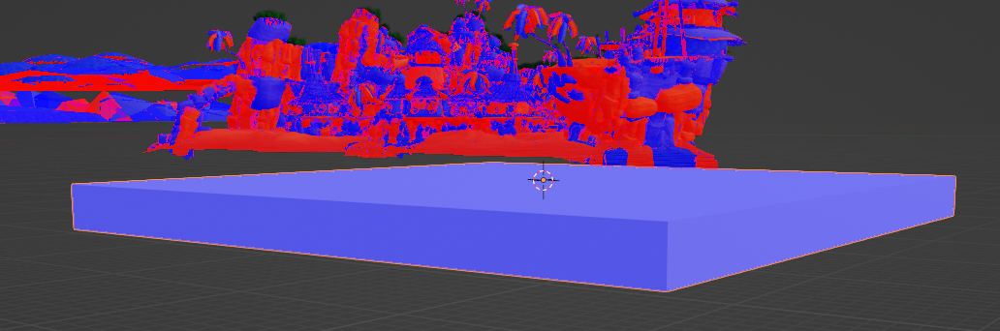

# Making your first level

As mentioned earlier, I'll personally be using GitHub to host and review this project, it'll also allow you to copy it to look at things in a much closer fashion so you can adapt stuff into your own project. I'll be basing it from the [opengoal-mod-base available here](https://github.com/OpenGOAL-Unofficial-Mods/opengoal-mod-base). I'd suggest you use this one as a template.

Here's a [link to the example folder with a copy of everything that'll be done](https://github.com/OpenGOAL-Unofficial-Mods/OpenGOAL-example-Code/tree/custom-levels-guide/Examples/Custom%20Levels%20Guide).

Every step will be set as a different commit that'll allow you to see the changes that have been made.

## Extracting and testing the base game

We'll first extract jak 1's iso and test if the game starts correctly. If you're only used to the launcher. All you need to do is to have both the folder with your game's iso and the main folder of your project with the _"extractor.exe"_ open then drag and drop the iso on the extractor.

It should open a console and show you the progress of extraction, then compile and start the game automatically.

If everything seems fine just close up the game and extractor console if it's still open.

## Files setup

While it's possible to just edit the base "test-zone" level, it's important to know how to create your own, especially if you plan on creating multiple different levels within the same mod.

However we'll copy the files that are already existing and edit them as that's much easier from writing them from scratch.

Navigate to "_data\custom_levels"_, copy the _"test-zone"_ folder, and rename it to the name of your custom level.

Enter that new folder and change the name of the files according to your level's name. Take note of these as they'll be really important later.

## The .gd file

The _".gd"_ file, _"myfirstlevel.gd"_ in my situation, will create the definition for our DGO file, aka our full level file. In short, we'll have to put everything that needs to be included inside of our level here.

For now, we'll just have to change a few names as such:

Link to the commit: [d05e1aa0aabff43dc310790998bac490f43f8440](https://github.com/OpenGOAL-Unofficial-Mods/OpenGOAL-example-Code/commit/d05e1aa0aabff43dc310790998bac490f43f8440)

## The .jsonc file

The ".jsonc" file, "my-first-level.jscon" in my situation, has multiple purposes:

- Telling the compiler which 3D file will be used to create the geometry of our level
- Setting up some automatic wall detection
- Spawning all the actors in our level

We'll keep the current automatic wall detection settings for now. More about those in the **Advanced collisions** part of this guide.

The actors are all the interactive things in the level that aren't geometry, so every collectable, moving platforms, enemy but also particles, sound effects, etc. More about those in the **Common actors** , **Advanced actors** , and **Particle systems** parts of this guide.

For now we'll just edit the names so the compiler use the right files as such:

Link to the commit: [aba4bd98f52212180ddd8df160a5fdebb219869f](https://github.com/OpenGOAL-Unofficial-Mods/OpenGOAL-example-Code/commit/aba4bd98f52212180ddd8df160a5fdebb219869f)

## Setting up to build the level in game.gp

We'll skip over the .glb for now as there's some other code we need to add and edit for the decompiler to even use our new files.

Once again we can copy the already existing _test-zone_ and edit the names to ours.

Location: _"data\goal_src\jak1\game.gp"_

Line: 1621

Link to the commit: [24bd68c09a25ab07d9a23902d5990f795a95fc3a](https://github.com/OpenGOAL-Unofficial-Mods/OpenGOAL-example-Code/commit/24bd68c09a25ab07d9a23902d5990f795a95fc3a)

**Important, if you ever edit the game.gp file while the compiler is running, you'll need to exit and relaunch it or you'll get a compiling error. This can also be accomplished with the command (reload) instead of quitting.**

## Creating the level in blender

We'll now open Blender to create our base level and export it. After opening it up, I'll use these quick shortcuts to clean the scene of the default objects:

" **A"** (to select every object in the scene)

" **Del"** (to delete selected objects)

### Placing your level in the world

The placement your level geometry has in blender will be used to place it automatically in the world. It is then crucial to know where to place things in Blender correctly.

Even if you plan on unloading every other level when playing your custom level, the triggers to load other levels are always there and you risk to hit them as you move in your custom level.

#### Axes differences

While "1 meter" in blender will equal to "1 meter" in Jak 1. The two use a different coordinate system.

In Blender, **up** is equal to **+Z**.

In OpenGOAL, **up** is equal to **+Y**.

This means the axes are rotated on the X axis by 90 degrees.

All you really need to know is when you'll convert coordinates between the two you'll need to do this conversion:

| **Jak 1** | **Blender**      |
| --------- | ---------------- |
| **X**     | **X**            |
| **Y**     | **Z**            |
| **Z**     | **Y (inverted)** |

#### The "Stats \> Target" method

One way to find a suitable location is by simply going to that place with Jak and copying the positions from there into Blender.

This is a method I personally do not use that often but some do prefer to do it this way so including it here is still important.

To access the target's position, aka Jak's position. You'll first need to restart the game in debug mode. To do so, press **"alt"** to show the top bar and select **"Debug Mode \> Reboot now!"**

Next thing is to open the in-game debug menu with **"R3"** or the corresponding input on your device and going to **"Stats… \> Target"** and activate it.

Press **"R3"** again to close the debug menu. You should now see a bunch of statistics about Jak.

The one we're looking for are the 3 numbers after **"pos:"** on the 4th line. You can then move Jak to the desired position for your custom level. Copy those values and apply the coordinates conversion explained earlier as such:

This is what the position then need to be set in blender for an object to appear at that exact same position:

#### The "importing level background" method

My preferred method to place my custom level in jak 1 is to import a level's geometry into my blender file directly. These will be positioned correctly within Blender. Which means you can just place your level in relation with that 3D file, giving you a better idea of how it'll fit there.

I'll first start by importing "village1_background.glb" and "training_background.glb" into my Blender file so I can locate an adequate location.

Note that you might have to adjust the view end clip so the levels don't disappear from the view because they're too far away. I usually use 10000 meters.

I'll use this position in between Geyser Rock and Sandover Village as there shouldn't be anything in the way and plenty of room for my testing.

Jak 1's ocean height is at exactly Blender Z=0 (in game Y=0). So keep that in mind when making your level as there's no water plane that's imported when importing the level files.

### Create your level's geometry

As said plenty of times, this guide isn't going to go over how to use Blender in detail to create your level. I'll still give you some specific tips regarding openGOAL level making but you'll still need to learn a lot about Blender on your own.

I'll suggest starting from very basic shapes or importing other assets. However importing other assets might come with some specific problems linked to those so you should start with basic shapes created directly in blender to begin with. You can get fancier with it when everything is well in place and working.

#### Size matter

As said earlier, 1 meter in the game is equal to 1 meter in Jak 1. **However** , the scale of that meter is off compared to real life. 1 meter in the game is quite small. Jak, for example, is around 3 meters tall when using the game's units.

This means you'll always have to keep in mind that those units are about two times as small as they should be. If you're importing, or creating something, with "correct" size, you'll usually have to scale it up by a factor of 2.

I'll create a platform that's 30 by 30 meters to get enough room to move around and place other things on later.

#### Collisions and Normals

The Jak games work on a single sided collision system. This means when interacting with, for example, a wall, you'll get blocked one way, but going the other way, you'll be able to phase through the wall.

The way the game decides which side of the face is solid is using its normal. To see if the normals of your level's geometry are correct, you can check the option "Face Orientation" in the "Viewport Overlays"

Once that's turned on, you can look at your model, the side that is blue is the side that Jak will interact with and the red one the one he'll phase through.

As you can see, my platform's normals are correctly set but the imported level's normals are all over the place.

A quick fix that'll work for most objects' normals is:

- Go into edit mode
- Press "A" to select all vertices
- Press "M" and select "By distance" to merge overlapping vertices
- Press "alt + N" and select "Recalculate Outside" to recalculate the normals so they're facing outside of the model

Here's Samos' hut before and after that quick fix

Some normals are still facing the wrong way but it'll still save you a lot of time to start from there and finish the rest more manually.

Once you're done with correcting normals, you can disable "face orientation" again, do not just deactivate the viewport overlay as that'll hide other useful things.

#### Triangles density

Jak 1's collision system has a cap with how many triangles you can interact with. Importing or creating meshes with a high density of triangles will at best make jak ignore collision and at worst crash the game when you interact with it.

For now, try to use models with a pretty low triangle density. You'll be able to still use high density meshes at some point. More on that in the "Advanced collisions" part of this guide.

### Exporting the level's geometry to the .glb

Once your level is "done" we can now export it. You'll always be able to adjust things and export it again to test your changes so don't worry about having everything perfect on the first go.

#### Objects you don't want to export

If, like me, you have imported the base game's level geometry into your Blender file, you won't want to export it in the .glb or that geometry will appear when you load your level.

To only export some parts of the Blender file, I'll suggest using different collections in the outliner.

This trick can also be used to create multiple levels within the same Blender file so you can line them up perfectly.

The other solution is to simply delete the parts of the file you don't want to export, which is what I'll do as my blender file will be available online with the rest.

#### Exporting settings

Go to "File \> Export \> glTF 2.0 (.glb/gltf)".

You can then click on the cogwheel top right of this window to open the exporting settings. Here's the settings I'll use:

Here's the reason for each of them:

- **glTF Binary (.glb)** is the format used by the compiler.

- **Remember Export Settings** is pretty self explanatory, it'll save these settings so you don't have to always edit them for every export.
- **Active Collection** is only needed if there's part of the level you don't want to export as explained in the previous point. Since I've deleted the part I do not wish to export, I don't need to have this selected.
- **+Y Up** will change the axis to make +Y the Up position, this will automatically do the transformation I've talked about in "Axes differences"
- **Apply Modifiers** isn't going to be of any use if you're not using any kind of modifiers. However if you do, they'll be automatically applied to the meshes and the change made by those will be in your level.
- **UVs** will be a requirement to place textures correctly onto your models later.
- **Normals** are required for the game to place collisions correctly as explained before.
- **Vertex Colors** will be needed later when adding lighting to your level.

Once the settings are correct, locate the .glb of your level in your files and export directly onto it to overwrite it.

You should also add the level's folder into your blender bookmark to easily locate it back whenever you need to do so.

#### Save your Blender file

**Make sure you also save your ".blend" file.** You should never work from the ".glb", a lot of extra data blender use will be lost that way. Always work from a Blender file and just export when making changes and also save the Blender file to work on.

I saved my Blender file into the level's folder but you can save it any place you want.

Link to the commit: [c6496df152233ed79362a02bb8a91d94c87f8e38](https://github.com/OpenGOAL-Unofficial-Mods/OpenGOAL-example-Code/commit/c6496df152233ed79362a02bb8a91d94c87f8e38)

## Creating the checkpoint in the level-info.gc

We're almost done to be able to get to our level in the game. The last thing we'll need is to create a continue-point to be able to load and spawn into it.

Once again we can copy the already existing _test-zone_ and edit it to fit our level.

Location: _"data\goal_src\jak1\engine\level\level-info.gc"_

Line: 1975

(set the zoom to 200% to see the text or just open the commit to see the code)

Link to the commit: [7431e2dcf66bacf2bf1f5d028d23304d843f28d6](https://github.com/OpenGOAL-Unofficial-Mods/OpenGOAL-example-Code/commit/7431e2dcf66bacf2bf1f5d028d23304d843f28d6)

Edit: **keep the ocean to #f** or you'll risk crashing when loading the level, this is fixed in a later commit.

You also need to **change the index to a unique one** , 27 instead of 26 in this case.

### Finding the continue-point's position

To know exactly where we'll set Jak's position, we'll use Blender. We'll see later in "Checkpoints and load boundaries" how to get all the information of jak and the camera.

Back into Blender, you can do a "Shift + Right click" anywhere on your mesh to set the cursor's position on that face. We could already take the position of the cursor but I find it really useful to create empties for the position of every "continue-point" as well as actors.

Press "Shift + A" and select "Empty \> any option". I usually use Arrows for "continue-point"

The empty will serve as a point in space we can always look back at and change. Name it the same as the name of the continue-point in "level-info.gc" so you can easily know what it is and find it through the search.

Now that you have an empty set for your continue-point, you can look at its position to copy them over to "level-info.gc". Don't forget the axes conversion.

Link to commit: [5bf474f4f76feb569c7445f770d16c0a80fecb49](https://github.com/OpenGOAL-Unofficial-Mods/OpenGOAL-example-Code/commit/5bf474f4f76feb569c7445f770d16c0a80fecb49)

It's also a good idea to organize your blender file with collections inside the main one for each type of objects like this:

### Adding our level to the list

If you'd try to go in the game right now, you would still not be able to find your continue-point in the list. We first need to tell the compiler to add it. To do so, go to the bottom of the "level-info.gc" file.

Once again, you can copy the line for test-zone and edit the name.

Link to commit: [4a67fd5fc1241822136a01a1ddd0e4f62a6176af](https://github.com/OpenGOAL-Unofficial-Mods/OpenGOAL-example-Code/commit/4a67fd5fc1241822136a01a1ddd0e4f62a6176af)

This also has the fix for the ocean and index.

## Test your level

Everything should now be set up to test your level. Make sure you've saved every change in all your files and exported the last version of the ".glb" for the level's geometry.

### Using the compiler

To use the compiler, start "goalc.exe" and run the command (mi), don't forget the parenthesis.

If everything compiles correctly. The end of the logs should show your level being compiled as well.

If an error occur; check into the log to see from which file and line and double check the part talking about that specific edit.

### Loading the level

We should now be able to start the game and load our continue-point to our custom level.

Start the "gk.exe" to start the game and press "alt" to see the top bar and restart in debug mode.

Once in debug, you can press "R3" to open the debug menu and navigate to "Game... \> Continue… \> your level's checkpoint"

If everything was done correctly, you should have now spawned in your custom level, at the right position and with the level loaded and placed exactly where you wanted it.

Congratulation!

If the game crashes when loading your level, make sure you've fixed the ocean and index as explained earlier.

If it still crashes despite those fixes, check how to attach the debugger to the game in the opengoal documentation so you can copy and read the crash logs.

## Advices to work efficiently

This whole setup is, fortunately, only required once per new level added. You'll be able to work much quickly now to actually create the level.

### Keeping the compiler and game open

After starting the compiler and the game for the first time, you can keep both of them open as you go make the next changes.

Keeping the compiler open allows the next (mi) run to only recompile the file it needs to. If you're only making changes to the ".jsonc" or the ".glb" of the level, the compiling time will be reduced by a lot. Some files will still have you recompile most of the game.

Keeping the game open allows you to instantly press the "reboot now!" button after a successful compile to see and test the changes.

### Changing the debug continue-point

The debug continue-point can be changed, doing so can save you a lot of time if you have to do a lot of iteration and always need to open the debug menu to load in your level.

#### If you're using the mod-base

The mod-base has an extra file for mod related settings. This file also contains an overwrite for the starting debug continue-point.

Navigate to: "data\goal_src\jak1\engine\mods\mods-settings.gc"

Line: 40

Then simply edit the continue-point to the one in your level.

Link to the commit: [fee907ca02c665167bf1c003d28e96b60fa55f13](https://github.com/OpenGOAL-Unofficial-Mods/OpenGOAL-example-Code/commit/fee907ca02c665167bf1c003d28e96b60fa55f13)

Another advantage of this method is that you're not changing some of the base code of the game and editing this later on makes for a very quick recompile with (mi).

#### If you're not using the mod-base

Even if you're not using the mod-base, you'll still be able to change this which I'd still suggest doing. The compile time whenever you want to change it will be a lot longer but it's probably still going to be a huge time save overall.

Navigate to: "data\goal_src\jak1\engine\game\game-info.gc"

Line: 219

Find the "\*debug segment" continue-point, which should be "village1-hut" by default and replace it with your level's continue-point.

Link to the commit: [db993fc0adf1d1b11de144910833a51a390e0200](https://github.com/OpenGOAL-Unofficial-Mods/OpenGOAL-example-Code/commit/db993fc0adf1d1b11de144910833a51a390e0200)

### Test your changes often

Compiling and testing your changes doesn't take a long time, especially if you follow the last two pieces of advice.

So it's a very good idea to test any big changes, especially in the code. You don't want to have changed 10 files and then have your level crash and no idea why.
