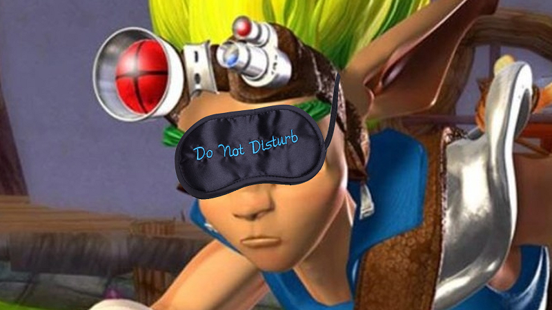
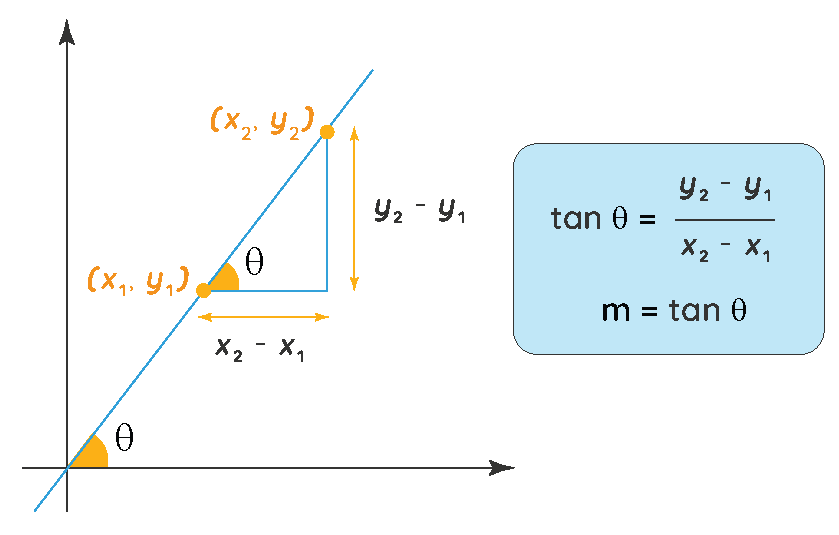
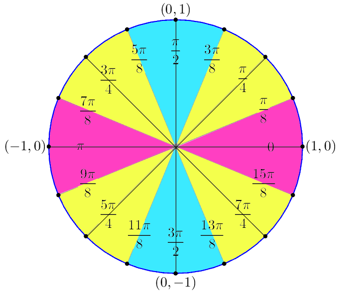
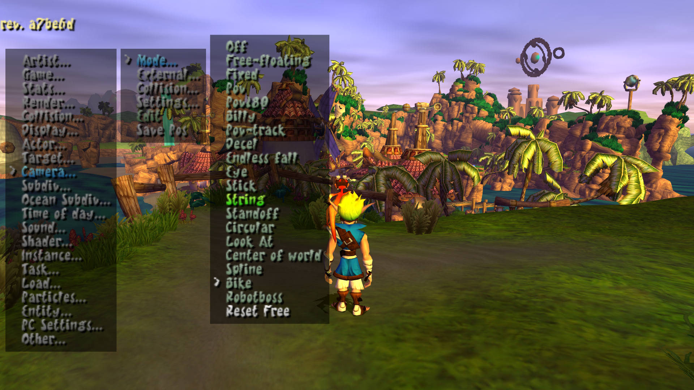

# Blindfold Assist Mod

<PostAuthors authors={["dallmeyer"]} authorNames={["barg034"]} />

## Background

Today I'm going to run through the process of building a mod to assist with blindfolded runs. I chose to kick things off with this mod because it only required a few simple changes, so I think reviewing the code should be easy enough. If you'd like to play this mod yourself, you can find it in the [Unofficial Mod Launcher](https://opengoal-unofficial-mods.github.io/).



If you're unfamiliar with [blindfolded video gaming](https://www.denofgeek.com/games/blindgolded-gaming-speedruns-history-explained/), one of the key steps is finding setups for progressing through levels that can be consistently repeated. In 3D games, you'll often see strategies like:

- aligning the character against walls or other level geometry
- being able to move in straight lines and/or consistent distances
- manipulating the camera in consistent patterns

When it comes to Jak, the game's responsive engine provides maybe too much flexibility in controlling Jak's movement and the camera 😅. This ends up hindering the consistency of blindfolded setups - so for this mod we'll actually be limiting some functionality! Here are the two changes I set out to tackle (thanks Borrdi for the suggestions):

- limit analog stick input to 8 directions ↑ ↗ → ↘ ↓ ↙ ← ↖ (every 45 degrees)
- add a button combo to (attempt to) center the camera behind Jak

I'll go through things in more detail below, but you can [click here to see the full diff](https://github.com/OpenGOAL-Unofficial-Mods/blindfold-assist/commit/1cd217498b5efa501c4980241d253a6b09e8c330) of changes for this mod. It's only 69 lines across 3 files, and most of that is duplicated code for the left vs right analog sticks.

<ReactPlayer
  controls
  url={require("./video/blindfold-assist.mp4").default}
  className="blog-video"
/>

## Limiting analog stick input to 8 directions

### Where/how is controller input defined?

On the OpenGOAL side, the controller input is represented by the [`cpad-info` type](https://github.com/open-goal/jak-project/blob/ee3bc182e13a440f90e20a6f7be7d3b294a7e56a/goal_src/jak1/engine/ps2/pad.gc#L49-L100). In particular, the below fields (some from the parent `hw-cpad` type) relate to the analog stick inputs:

```opengoal
;; data that comes directly from hardware. it's 32 bytes + type tag (ignored in C kernel).
(deftype hw-cpad (basic)
  (
    ...
    (rightx  uint8     :offset-assert 8) ;; right stick xdir
    (righty  uint8     :offset-assert 9) ;; right stick ydir
    (leftx   uint8     :offset-assert 10) ;; left stick xdir
    (lefty   uint8     :offset-assert 11) ;; left stick ydir
    ...
    )
  )

;; data from hardware + additional info calculated here.
(deftype cpad-info (hw-cpad)
  (
    ...
    (stick0-dir         float           :offset-assert 72)
    (stick0-speed       float           :offset-assert 76)
    ...
    )
  )
```

But let's take a step back - what if you didn't know where the controller inputs were handled? Well one way would be to look at the code for moving Jak (who is known as `target` in the code) and work backwards to find the controller input that affects Jak's movement. With some digging and some luck, you'll find yourself in `goal_src/jak1/engine/target/logic-target.gc`, and towards the end of the file are [a few functions](https://github.com/open-goal/jak-project/blob/ee3bc182e13a440f90e20a6f7be7d3b294a7e56a/goal_src/jak1/engine/target/logic-target.gc#L1522-L1895) that update Jak's position differently, depending on if he's swimming, sliding, etc. In most of these there's a `read-pad` call, which populates a vector that is then used in the logic for updating Jak's position.

[Looking at `read-pad` itself](https://github.com/open-goal/jak-project/blob/ee3bc182e13a440f90e20a6f7be7d3b294a7e56a/goal_src/jak1/engine/target/logic-target.gc#L488-L501), we can see that the vector is populated by taking the sine/cosine of `(-> self control unknown-cpad-info00 stick0-dir)`. And if we [hunt down the `unknown-cpad-info00` field](https://github.com/open-goal/jak-project/blob/ee3bc182e13a440f90e20a6f7be7d3b294a7e56a/goal_src/jak1/engine/collide/collide-target-h.gc#L51), we find it's a `cpad-info`!

### Reading & adjusting controller input

You can sort of think of `rightx` and `righty` as the X and Y "coordinates" for the position of the right analog stick, read directly from the hardware. Since they are `uint8`s they range in value from 0 (left/up) to 255 (right/down) - so both would be 128 while neutral (assuming no stick drift). The same applies for `leftx` and `lefty` for the left analog stick, however there is an extra step where `stick0-dir` and `stick0-speed` are computed from the values of `leftx` and `lefty`, happening once per frame [within `service-cpads`](https://github.com/open-goal/jak-project/blob/ee3bc182e13a440f90e20a6f7be7d3b294a7e56a/goal_src/jak1/engine/ps2/pad.gc#L344-L349).

Ok so we know about `cpad-info`, now what? Reading through `service-cpads`, you can see that there is already a [tweak to the analog stick inputs to account for mirror mode](https://github.com/open-goal/jak-project/blob/ee3bc182e13a440f90e20a6f7be7d3b294a7e56a/goal_src/jak1/engine/ps2/pad.gc#L337-L342). Further, this happens after the [call to read inputs from hardware](https://github.com/open-goal/jak-project/blob/ee3bc182e13a440f90e20a6f7be7d3b294a7e56a/goal_src/jak1/engine/ps2/pad.gc#L283-L284) and before `stick0-dir` and `stick0-speed` are computed, so it feels like a logical place to [further adjust the inputs](https://github.com/OpenGOAL-Unofficial-Mods/blindfold-assist/blob/1cd217498b5efa501c4980241d253a6b09e8c330/data/goal_src/jak1/engine/ps2/pad.gc#L344-L406).

### Trigonometry time

This next part gets a little math-heavy, but the basic idea for limiting to 8 directions is to compute the angle from the X and Y coordinates, and use that to figure out which of the 8 directions has the closest angle. First I subtract 128 from both X and Y values to shift the range from [0,255] to [-128, 127]. From here I compute the slope, and take the arctan of the absolute value of the slope to get the angle from the X-axis.

```opengoal
(let* ((leftx (- (the int (-> pad leftx)) 128))
       (lefty (- (the int (-> pad lefty)) 128))
       (leftslope (/ (the float lefty) (the float leftx)))
       (leftrad (atan-rad (abs leftslope)))
       )
```



Since we took the absolute value of the slope, `leftrad` will always be between 0 and π/2. Therefore we can just check if it's closer to 0 (the X-axis, left/right), to π/4 (45 degrees, diagonal), or to π/2 (the Y-axis, up/down), and multiply by -1 afterwards where needed. If we're closest to the X-axis, we can just set the Y coordinate to 0 to snap to the X-axis, leaving the X coordinate alone. Vice-versa if we're closest to the Y-axis. If we're closest to the diagonal, we can set the X/Y coordinates both to the average of their absolute values - guaranteeing a 45-degree angle. For the final results, we need to make sure we're using the [0,255] range.



```opengoal
(cond
  ((< leftrad (/ PI 8))
    ;; closest to x axis, set y to "zero" (pink)
    (set! (-> pad lefty) (the-as uint 128))
    )
  ((< leftrad (/ (* 3 PI) 8))
    ;; closest to 45 degrees, set both to average (yellow)
    (let ((mid (/ (+ (abs leftx) (abs lefty)) 2)))
      (if (< leftx 0)
        (set! leftx (* -1 mid))
        (set! leftx mid)
        )
      (if (< lefty 0)
        (set! lefty (* -1 mid))
        (set! lefty mid)
        )
      (set! (-> pad leftx) (the-as uint (+ 128 leftx)))
      (set! (-> pad lefty) (the-as uint (+ 128 lefty)))
      )
    )
  (else
    ;; closest to y axis, set x to "zero" (blue)
    (set! (-> pad leftx) (the-as uint 128))
    )
  )
```

And that's it! We repeat this code for the right stick, and everything downstream now uses our modified analog stick input values!

## Button combo to center camera behind Jak

### Where/how is the camera defined?

On the OpenGOAL side, the camera is represented by a few different types, but perhaps the most important one is the [`camera-master` type](https://github.com/OpenGOAL-Unofficial-Mods/opengoal-mod-base/blob/a775793814ad424bf9ba919aa5f5c39834a3101f/data/goal_src/jak1/engine/camera/camera-h.gc#L445-L508), and the commonly-used global variable `*camera*` of that type.

Assuming you've played your fair share of Jak & Daxter, you are likely aware that Naughty Dog's camera system is quite sophisticated (even if it does get stuck occasionally). When I first started looking into this I was a little overwhelmed - even though we've identified the `camera-master` process, how do we get it to do what we want? There are so many fields to make sense of and conditions to think about (e.g. what if there's a wall right behind Jak?), it's hard to know where to start!

Lucky for us, the developers left a debug menu directly in the game, which offers a lot of functionality for toying around with the camera. If you reboot OpenGOAL in debug mode (press Alt to show the top menu, and select Debug Mode > Reboot Now), you can press R3 and you'll be greeted with the debug menu. If you haven't seen this before, I highly encourage you to spend some time messing around with the various options.

If you head into `Camera > Mode`, you can see the current camera mode, and switch between other various camera modes. Most of the time while playing as Jak, the game uses the String camera mode. Throughout the game different camera modes are used in cutscenes, minigames, while on the zoomer, or even just while in specific areas where ND felt it was necessary to force a certain perspective (e.g. you can easily notice this at the top of FJ Tower).



### Manipulating the camera

Well, after playing around with these camera modes, I noticed that switching to the Bike mode (used for the Zoomer) will rotate the camera around behind Jak, so that it faces the same direction he's facing - pretty much exactly what I was hoping to do in this mod! There are some limitations to this, such as when Jak is backed up against a wall, but there's no real way around that without potentially clipping the camera into Jak or the wall. I decided this was sufficient for the purposes of this mod, and piggy-backed on this Bike camera mode rather than trying to reinvent my own logic for centering the camera behind Jak.

So how do we actually trigger the Bike camera mode? Let's see what the debug menu does! The debug menu code mostly lives in `goal_src/jak1/engine/debug/default-menu.gc`, and the [Bike camera option is configured here](https://github.com/OpenGOAL-Unofficial-Mods/opengoal-mod-base/blob/a775793814ad424bf9ba919aa5f5c39834a3101f/data/goal_src/jak1/engine/debug/default-menu.gc#L815-L817). You can see what happens in detail when creating a new `debug-menu-item-flag` [here](https://github.com/OpenGOAL-Unofficial-Mods/opengoal-mod-base/blob/a775793814ad424bf9ba919aa5f5c39834a3101f/data/goal_src/jak1/engine/debug/menu.gc#L174-L186), but what you really need to know is that selecting it will call `dm-cam-mode-func` and pass `cam-bike` as an argument.

[Looking at `dm-cam-mode-func`](https://github.com/OpenGOAL-Unofficial-Mods/opengoal-mod-base/blob/a775793814ad424bf9ba919aa5f5c39834a3101f/data/goal_src/jak1/engine/debug/default-menu.gc#L22-L30), we see it sends 2 events to `*camera*`: `'change-state` and `'query-state`. The first event will tell the camera to change the camera mode to whatever is in `arg0` (`cam-bike` in our case). The second event is querying the camera to find out what camera mode it ended up in at the end of the frame, and is used for updating the selected mode in the debug menu - although we may have requested that it switch to Bike mode, other triggers in-game could force it back to String, Fixed, etc.

For this mod, we only really care about being able to send that first event to change the camera mode. If we `(lt)` and connect our REPL to the running game, we can send the event manually to confirm that it works as intended:

```opengoal
(send-event *camera* 'change-state cam-bike 0)
```

Oh but wait - now we're stuck in Bike camera mode, when really we just wanted to rotate the camera while staying in the "normal" camera mode. Lucky for us, the game stores the current "normal" camera mode in `*camera-base-mode*`, so it's easy to flip back using a similar event:

```opengoal
(send-event *camera* 'change-state *camera-base-mode* 0)
```

### Button combo for rotating camera

Alright so we know how to jump between camera modes, which gives us a hacky but workable method of centering the camera behind Jak. Now we need to give players a button combo to do this on-demand.

#### Reading inputs every frame

In the previous section we looked at the code where controller inputs are read from hardware every frame in `service-cpads`, but we sort of glossed over how the `logic-target` code is called to read and utilize the button inputs for that frame held in `cpad-info`. The game needs to read inputs every frame or, well, it will drop inputs 🙃. In the case of the `logic-target` code, the `target` process runs this code every frame as part of the `post` hook - see the [documentation on processes and states](../../reference/process_and_state/#how-do-i-make-a-process-do-something) for more details on this.

For centering the camera behind Jak, we will also need to run some code every frame in order to check if the user has pressed our desired button combo. Lucky for you, we've already created a helper function `runs-every-frame` [in the opengoal-mod-base](https://github.com/OpenGOAL-Unofficial-Mods/opengoal-mod-base/blob/336eb824403c0c38d1445e5156fc510f692ca4c2/data/goal_src/jak1/engine/mods/put-custom-code-here.gc#L24-L28) that gets executed on every frame of the [main display loop](https://github.com/OpenGOAL-Unofficial-Mods/opengoal-mod-base/blob/336eb824403c0c38d1445e5156fc510f692ca4c2/data/goal_src/jak1/engine/game/main.gc#L633)!

#### Checking for buttons pressed/held

The easiest way to check if a specific button was pressed or held on the current frame is to use `cpad-pressed?` or `cpad-hold?`, respectively. The first parameter it takes is the controller number (0 being the first controller), and the second parameter is the button we want to check. I decided to use R2 as the button for centering the camera behind Jak, and I also wanted to ensure Jak was actually spawned. If both of these conditions are met, I change the camera mode to Bike, otherwise I revert back to the default camera:

```opengoal
(if (and *target* (cpad-hold? 0 r2))
  (send-event *camera* 'change-state cam-bike 0) ;; set camera to behind jak
  (send-event *camera* 'change-state *camera-base-mode* 0)
  )
```

The last change I made was just to disable R2 from bringing up the HUD (since we still have L2 for that). There are only a handful of places where the game checks for L2 and R2 being held, so it's pretty easy to find the [code that brings up the HUD](https://github.com/OpenGOAL-Unofficial-Mods/blindfold-assist/blob/1cd217498b5efa501c4980241d253a6b09e8c330/data/goal_src/jak1/engine/ui/hud.gc#L62-L63). I simply commented out the R2 half of the condition, so that only the check for L2 remained.

---

## Appendix

- [Using the OpenGOAL REPL](../repl)
- [OpenGOAL unofficial Mod Launcher](https://opengoal-unofficial-mods.github.io)
- [OpenGOAL Mod Base - Github](https://github.com/OpenGOAL-Unofficial-Mods/opengoal-mod-base)
- [OpenGOAL Blindfold Assist Mod - Github](https://github.com/OpenGOAL-Unofficial-Mods/blindfold-assist)
  - [Full Diff](https://github.com/OpenGOAL-Unofficial-Mods/blindfold-assist/commit/1cd217498b5efa501c4980241d253a6b09e8c330)
- [OpenGOAL Language Reference](../../reference)
  - [`if`](../../reference/lib/#if)
  - [`and`](../../reference/goos/#and)
  - [`cond`](../../reference/lib/#cond)
  - [`let`](../../reference/lib/#let)
  - [`let*`](../../reference/lib/#let-1)
  - [`+`](../../reference/lib/#-2)
  - [`-`](../../reference/lib/#-)
  - [`/`](../../reference/lib/#-4)
  - [`set!`](../../reference/goos/#set)
  - [`the-as`](../../reference/lib/#the-as)
  - [Processes and States](../../reference/process_and_state)
  - [Comments](../../reference/syntax/#comments)
