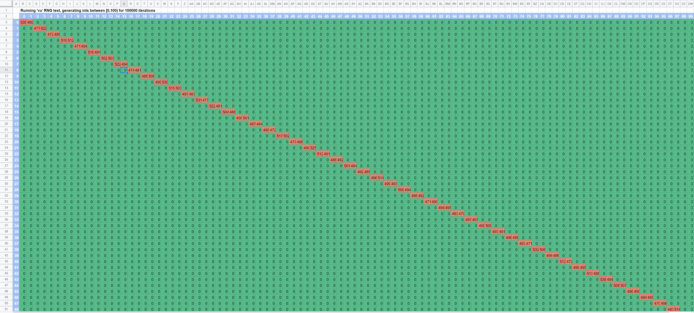
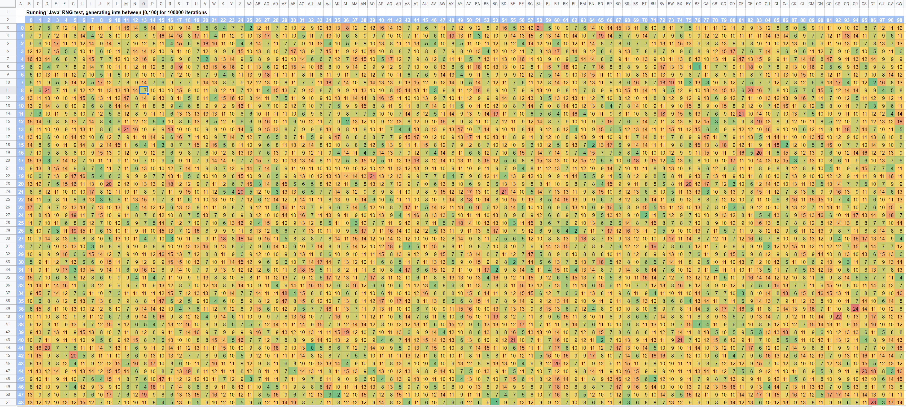

# Checkpoint Randomizer Mod

<PostAuthors authors={["dallmeyer"]} authorNames={["barg034"]}/>

## Background

👋 Today I'm going to walk through the changes we made to build the Checkpoint Randomizer mod. To my knowledge, this was one of the earliest OpenGOAL mods, and as such there was a lot of trial and error to get things right. I'll do my best to describe the *process* of figuring out how things worked and what we needed to do, in addition to walking through the latest version of the code.


A little backstory to this mod - before OpenGOAL, there was actually a [predecessor that ran alongside the PCSX2 emulator](https://www.youtube.com/watch?v=jpYPk8eoDts), which would read from/write to PCSX2 memory, developed by [Ruh](https://www.youtube.com/@PunishedRuh). Around mid-2022 as OpenGOAL Jak 1 development was wrapping up, [MikeGamePro](https://github.com/MikeGamePro) and [Zed](https://github.com/Zedb0T) then ported the concept over to OpenGOAL. This is actually what sparked my interest in OpenGOAL modding, and how I met these guys 😅 Zed popped into my stream while I was trying out their original randomizer, we started talking about enhancements, and the rest is history. If you'd like to play this mod yourself, you can find it in the [Unofficial Mod Launcher](https://opengoal-unofficial-mods.github.io/).

Initially, the intent of the mod was pretty straightforward - whenever you collect a Power Cell, it should warp you to a randomly selected checkpoint in the game. If you want to see what that looks like, check out this speedrun of that randomizer category from [OutrageousJosh](https://www.twitch.tv/outrageousjosh):

<iframe width="640" height="360" src="https://www.youtube.com/embed/MPPQ-9oYs3c?start=1013" title="YouTube video player" frameborder="0" allow="accelerometer; autoplay; clipboard-write; encrypted-media; gyroscope; picture-in-picture; web-share" allowfullscreen></iframe>

Over time, we've added quite a few enhancements and variations to this, such as:
- addressing miscellaneous softlocks and edge cases
- refactoring the random checkpoint logic to make it consistent based on an initial seed value
- letting the user change various options:
  - random seed vs set seed
  - randomizing by level vs by checkpoint
  - number of Power Cells collected before being warped
  - toggling warp when picking up Power Cells, Precursor Orbs, Scout Flies, Eco and/or dying
  - toggling a few additional custom checkpoints
- extending the pause menu to configure the above options, and persisting them to file

Unfortunately I don't have the cleanest *full* diff for this, because our Checkpoint Randomizer mod is bundled with some other challenge options (bonkless, pacifist, etc) and a bit of local multiplayer code. With that said [here is the full diff](https://github.com/dallmeyer/jak-project/compare/master...dallmeyer:jak-project:rando?w=1#files_bucket) of changes for this mod - I'll point out the specific pieces relating to the Checkpoint Randomizer as we go.

## Main idea

### Checkpoint warping

First let's talk about the checkpoint system a bit. We'll start by looking at what the built-in debug menu offers, similar to how we explored what was possible with the camera in the [Blindfold Assist mod](./blindfold_assist#wherehow-is-the-camera-defined).


Under `Game > Continue` you'll find the list of all checkpoints - your current checkpoint will be highlighted, and you can select any of them to warp to that checkpoint within your current game. This menu is incredibly useful in general for development purposes, and a great jumping off point for building this mod.

If we search for the `"Continue"` string in `goal_src/jak1/engine/debug/default-menu.gc`, we'll see that [here](https://github.com/open-goal/jak-project/blob/65f2146d736cf6cb4d8e0c09f12aceda18835e05/goal_src/jak1/engine/debug/default-menu.gc#L3536-L3538) it calls a `build-continue-menu` function, which looks like this:

```opengoal
(defun build-continue-menu ((arg0 debug-menu) (arg1 game-info))
  (let ((s5-0 *level-load-list*))
    (while (not (null? s5-0))
      (let ((s4-0 (-> (the-as level-load-info (-> (the-as symbol (car s5-0)) value)) continues)))
        (while (not (null? s4-0))
          (let* ((v1-2 (the-as level-load-info (car s4-0)))
                 (a1-2 (new 'debug 'debug-menu-item-flag (the-as string (-> v1-2 name)) (-> v1-2 name) dm-current-continue))
                 )
            (debug-menu-append-item arg0 a1-2)
            )
          (set! s4-0 (cdr s4-0))
          )
        )
      (set! s5-0 (cdr s5-0))
      )
    )
  (the-as debug-menu-context arg0)
  )
```

Let's break this down - first it sets a local variable `s5-0` to `*level-load-list*` which is defined [here in `goal_src/jak1/engine/level/level-info.gc`](https://github.com/open-goal/jak-project/blob/b130b2eac27966c43f6816ee604a3a93a67e82fa/goal_src/jak1/engine/level/level-info.gc#L1943-L1970). `*level-load-list*` is technically of type [`pair`](../../reference/reader/#pair), but you can think of it like a [linked list](../../reference/reader/#list). Within this list, each element is an object of type [`level-load-info`](https://github.com/open-goal/jak-project/blob/b130b2eac27966c43f6816ee604a3a93a67e82fa/goal_src/jak1/engine/level/level-h.gc#L92-L127), defining a level within the game. Note that 'level' here refers to how the engine actually loads levels, and this doesn't always correspond one-to-one with the levels you see in the pause menu - for example, Spider Cave is actually represented as 3 distinct levels: `maincave`, `darkcave`, and `robocave`.

So for a list like this, what `s5-0` really represents is a reference to the first element in the list, whose `value` would be the `training` instance of `level-load-info` in our case. With this in mind, on the next line we see a `while` loop which runs until that reference becomes null - so you might reasonably guess that we'll be iterating through the list. Sure enough, a few lines down you'll see it reassigns `s5-0` to `(cdr s5-0)`, which advances us to the next element in the list. [`cdr`](../../reference/lib/#car-and-cdr) extracts the second element of the `pair`, which in the case of this list will either be another `pair` or null once we've reached the end of the list.

Within the level loop, we can see we have a new local variable `s4-0`, which is initially set to `(-> (car s5-0) value continues)` (type conversions removed for readability). [`car`](../../reference/lib/#car-and-cdr) extracts the first element of the `pair`, whose `value` in this case is the actual `level-load-info` object. Similar to how `*level-load-list*` is a list of `level-load-info` objects, each `level-load-info` object's [`continues`](https://github.com/open-goal/jak-project/blob/b130b2eac27966c43f6816ee604a3a93a67e82fa/goal_src/jak1/engine/level/level-h.gc#L110) field is a list of the `continue-point`s within that level. For example, we can see the `finalboss` level has 2 `continue-point`s:

```opengoal
(define finalboss
  (new 'static 'level-load-info
    ...
    :continues '((new 'static 'continue-point
        :name "finalboss-start"
        :level 'finalboss
        :trans (new 'static 'vector :x 11548456.0 :y 2215872.0 :z -19409498.0 :w 1.0)
        :quat (new 'static 'quaternion :y 0.7325 :w 0.6807)
        :camera-trans (new 'static 'vector :x 11513311.0 :y 2234999.5 :z -19435708.0 :w 1.0)
        :camera-rot (new 'static 'array float 9 0.5883 0.0 -0.8085 0.1074 0.9911 0.0781 0.8014 -0.1328 0.5831)
        :load-commands '((special "citb-exit-plat-4" #t))
        :vis-nick 'fin
        :lev0 'finalboss
        :disp0 'display
        :lev1 'citadel
        :disp1 'special
        )
      (new 'static 'continue-point
        :name "finalboss-fight"
        :level 'finalboss
        :trans (new 'static 'vector :x 12288335.0 :y 1970461.9 :z -19848522.0 :w 1.0)
        :quat (new 'static 'quaternion :y -0.5359 :w -0.8442)
        :camera-trans (new 'static 'vector :x 12265366.0 :y 1984228.5 :z -19842574.0 :w 1.0)
        :camera-rot (new 'static 'array float 9 -0.243 0.0 -0.97 0.2594 0.9635 -0.065 0.9346 -0.2675 -0.2341)
        :load-commands '((special "citb-exit-plat-4" #t))
        :vis-nick 'fin
        :lev0 'finalboss
        :disp0 'display
        :lev1 'citadel
        :disp1 'special
        )
      )
    ...
    )
  )
```

From here the code uses a similar `while` loop to go through all the `continue-point`s in each level, and adds a new debug menu item for each one. I'll gloss over the details of the debug menu itself, but the important takeaway is that when one of these options is selected, it will run the `dm-current-continue` function and pass the name of the `continue-point` as an argument.

OK we're finally getting to where the magic happens! Within [`dm-current-continue`](https://github.com/open-goal/jak-project/blob/b130b2eac27966c43f6816ee604a3a93a67e82fa/goal_src/jak1/engine/debug/default-menu.gc#L301-L306), we see `(start 'play (get-continue-by-name *game-info* arg0))`. `arg0` here is the name of the `continue-point`, based on which option was selected in the debug menu. We can confirm this is the relevant code by connecting our REPL and running a sample such as `(start 'play (get-continue-by-name *game-info* "finalboss-fight"))`, which will send us to the final boss fight.

### Making it random

Alright so now we know how to warp to a particular `continue-point`, let's work on randomizing where we warp to. Let's assume you didn't know anything about RNG implementation in OpenGOAL - one way to figure out how RNG works is to pick something in the game that you know relies on RNG, and read through the related code. A nice isolated candidate for this is the fishing game in Forbidden Jungle, which uses RNG to determine the fish types and patterns.

If you search the codebase for "fishgame" you should eventually find yourself in `goal_src/jak1/levels/jungle/fisher.gc`, which contains the code for the fisherman and his fishing game. With some luck, you'll come across [the code where the fish are spawned](https://github.com/open-goal/jak-project/blob/65f2146d736cf6cb4d8e0c09f12aceda18835e05/goal_src/jak1/levels/jungle/fisher.gc#L1461-L1491), and in particular let's look at this `cond` branch:

```opengoal
(cond
  ((rand-vu-percent? (-> self params powerup-percent))
    (if (and (>= (- (-> *display* base-frame-counter) (-> self ambient-big-one)) (seconds 30))
            (play-ambient (-> self ambient) "FIS-TA03" #t (-> self root-override trans))
            )
        (set! (-> self ambient-big-one) (-> *display* base-frame-counter))
        )
    'powerup
    )
  ((rand-vu-percent? (-> self params bad-percent))
    'bad
    )
  ((rand-vu-percent? (-> self params deadly-percent))
    'deadly
    )
  (else
    'normal
    )
  )
```

As you might guess from the name, `rand-vu-percent?` is one of the ways RNG can be introduced. Defined in [`goal_src/jak1/engine/math/math.gc`](https://github.com/open-goal/jak-project/blob/08ce65fd9bafa56f0d0017a9670112acc1019bb7/goal_src/jak1/engine/math/math.gc#L230-L233), this function will return `#t` with the probability that is provided as an argument. In this case, it's used to randomly determine whether a 5 pound fish (`'powerup`), an eel (`'bad`), or a 1 pound fish (`'normal`) will be spawned next, based on the probabilities set for that part of the fish game (`'deadly-percent` is always 0, so the `'deadly` branch is never hit 🤷‍♂️). 

`math.gc` actually contains a whole library of RNG functions that we can use in different scenarios, so now how can we use these to randomly choose a `continue-point` to warp to? Well if we had an array of 10 checkpoints, we could select an index by generating a random integer between 0 and 9 (inclusive) using [`rand-vu-int-count`](https://github.com/open-goal/jak-project/blob/08ce65fd9bafa56f0d0017a9670112acc1019bb7/goal_src/jak1/engine/math/math.gc#L230-L233). 

Unfortunately with the nested linked list design of `*level-load-info*` and the inner `continues` lists, it's tough to apply something like this directly. There are also a few test checkpoints that we'd want to exclude in the randomizer. So instead we can build a custom flat array of the checkpoints we want to use:

```opengoal
(define *checkpoint-list* 
  (the-as (array string) 
    (new 'static 'boxed-array :type string :length 77 :allocated-length 77
      "game-start"
      "village1-hut"
      "village1-warp"
      "beach-start"
      ...
      "citadel-generator-end"
      "citadel-elevator"
      )
    )
  )
```

And then we're free to combine our checkpoint warp command with `rand-vu-int-count` to randomize where we warp to:

```opengoal
(let ((checkpoint-name (-> *checkpoint-list* (rand-vu-int-count 77))))
  (start 'play (get-continue-by-name *game-info* checkpoint-name))
  )
```

### Triggering on Power Cell pickup

The last piece of the puzzle for the original mod is to trigger this randomized checkpoint warp whenever the player picks up a Power Cell. Internally these are known as `fuel-cell`s, and are [defined in `goal_src/jak1/engine/common-obs/collectables.gc`](https://github.com/open-goal/jak-project/blob/08ce65fd9bafa56f0d0017a9670112acc1019bb7/goal_src/jak1/engine/common-obs/collectables.gc#L1305-L1317). 

There are a few core steps in the process of collecting a Power Cell:

- [`fuel-cell` enters `pickup` state](https://github.com/open-goal/jak-project/blob/a76f55853779118efe98a3115c7d78546ae40b6c/goal_src/jak1/engine/common-obs/collectables.gc#L1525-L1965)
  - [`*target*` is sent `'get-pickup` event](https://github.com/open-goal/jak-project/blob/a76f55853779118efe98a3115c7d78546ae40b6c/goal_src/jak1/engine/common-obs/collectables.gc#L1659)
    - [`*target*` receives `'get-pickup` event](https://github.com/open-goal/jak-project/blob/a76f55853779118efe98a3115c7d78546ae40b6c/goal_src/jak1/engine/target/target-handler.gc#L42-L60)
      - [`(-> *target* fact-info-target)` is updated](https://github.com/open-goal/jak-project/blob/a76f55853779118efe98a3115c7d78546ae40b6c/goal_src/jak1/engine/game/game-info.gc#L616-L631)
        - [`*game-info*` (Power Cell internal counter) is updated](https://github.com/open-goal/jak-project/blob/a76f55853779118efe98a3115c7d78546ae40b6c/goal_src/jak1/engine/game/game-info.gc#L378-L399)
          - misc Power Cell stats are updated
          - related `entity-perm-status` and `game-task` is marked complete
  - [game auto-saves](https://github.com/open-goal/jak-project/blob/a76f55853779118efe98a3115c7d78546ae40b6c/goal_src/jak1/engine/common-obs/collectables.gc#L1667)
  - [Power Cell victory cutscene plays](https://github.com/open-goal/jak-project/blob/a76f55853779118efe98a3115c7d78546ae40b6c/goal_src/jak1/engine/common-obs/collectables.gc#L1668-L1673)

For this mod, we decided to [disable the victory cutscene](https://github.com/dallmeyer/jak-project/blob/76a46a233cad22c5d84f001329836d6a752f5aa4/goal_src/jak1/engine/common-obs/collectables.gc#L1700-L1707) and [execute the checkpoint warp here](https://github.com/dallmeyer/jak-project/blob/76a46a233cad22c5d84f001329836d6a752f5aa4/goal_src/jak1/engine/common-obs/collectables.gc#L1723-L1726), after the internal counter and related `entity-perm-status` and `game-task` are updated. In effect, the moment the victory cutscene would normally appear is when Jak is warped away.

It may be worth noting that if you use cheat/debug mode to give yourself Power Cells with L1 + R1 in the pause menu, this jumps directly to [sending `*target*` the `get-pickup` event](https://github.com/open-goal/jak-project/blob/66c680e8a348160de75c4fcda72c444c8378d9c8/goal_src/jak1/engine/ui/progress/progress.gc#L1883-L1892), without actually spawning any `fuel-cell`, auto-saving, or playing any victory cutscene. Because we added our checkpoint warping code to the `fuel-cell` code itself, "picking up Power Cells" this way does not trigger a warp.

## Softlocks & edge cases

### Citadel missing elevator

This was an interesting and important edge case we stumbled across: if you collected the Green Sage Power Cell and just so happened to warp back to the top of Citadel checkpoint, the elevator door would open but no elevator would appear (unless you died or de/respawned the elevator). What we realized was that the `(start 'play ...)` method of warping to a checkpoint would not reload any currently loaded levels or entities.

The [solution](https://github.com/dallmeyer/jak-project/blob/f3bdd9273531ea03e47c588862649fd9d7726a83/goal_src/jak1/engine/mods/checkpoint-randomizer.gc#L334-L343) we settled on was to instead warp by manually setting the checkpoint and then killing Jak 😬 which ensures the level is reloaded properly after the Power Cell has been collected. Our previous checkpoint warp approach would end up [setting the checkpoint here in `init-target`](https://github.com/open-goal/jak-project/blob/a76f55853779118efe98a3115c7d78546ae40b6c/goal_src/jak1/engine/target/logic-target.gc#L1932). If we look at the [definition for `set-continue!`](https://github.com/open-goal/jak-project/blob/a76f55853779118efe98a3115c7d78546ae40b6c/goal_src/jak1/engine/game/game-info.gc#L113), we see it should accept a `continue-point` or a string as an argument. Now we just need a proper way to kill Jak, and we again borrowed from the debug menu - this time looking at `Game > New Life` and copying the underlying [`(initialize! *game-info* 'die ...)` call](https://github.com/open-goal/jak-project/blob/a76f55853779118efe98a3115c7d78546ae40b6c/goal_src/jak1/engine/debug/default-menu.gc#L3391-L3395).

```opengoal
(defun warpToCheckpoint ((checkpointName string))
  ;; warps to checkpoint, assuming it is already safe to use
  (format 0 "RANDOMIZER: ...warping to ~A~%" checkpointName)
  (set-continue! *game-info* checkpointName)

  ;; trigger death to warp to checkpoint
  ;; this ensures init functions for new level run (misty boat, citadel elevator)
  (initialize! *game-info* 'die (the-as game-save #f) (the-as string #f))
  (none)
  )
```

### Citadel softlock

One of the first softlocks we ran into was around Gol & Maia's Citadel, and the 2 things that initially prevent you from entering (or more important in this case, exiting):

1. There will be a large invisible wall in front of the Citadel entrance until you've collected the End of Lava Tube Power Cell from the Zoomer pad
2. The Citadel door won't open until you've pressed the Lava Tube warp gate button

With the checkpoint randomizer, it's entirely possible to collect all the Citadel Power Cells before unlocking these two things in Lava Tube. If you end up in this scenario and happen to get warped to Citadel again, there's no way to get out (at least without some level deloading shenanigans, which we don't expect players to perform)! To address this issue, we decided to automatically unlock the Citadel door and remove the invisible wall whenever you are in Lava Tube or Citadel.

To unlock the Citadel door, first we need to figure out its type so that we can identify the code that's involved. In the debug menu, there's a useful setting we can toggle to help with this: `Actor > Actor Mark > On`.


Now you can see the names (and infer the types) of all the actors around you! There's a useful "Distance Check" filter that you can get to from `Tools > Filters` in the top menu bar, so only the names of the closest actors would be shown.


So we see this is a `citb-iris-door`, which is [defined in `goal_src/jak1/levels/citadel/citadel-obs.gc`](https://github.com/open-goal/jak-project/blob/96761000397faea0480b6b9b8553bd7162187eba/goal_src/jak1/levels/citadel/citadel-obs.gc#L509-L515). Since no new fields or methods are defined for this type, the only thing this definition really tells us is that this is a child type of `eco-door`, which is [defined in `goal_src/jak1/engine/common-obs/baseplat.gc`](https://github.com/open-goal/jak-project/blob/66c680e8a348160de75c4fcda72c444c8378d9c8/goal_src/jak1/engine/common-obs/baseplat.gc#L150-L177).

This type has a field `locked` which sounds pretty suspicious - sure enough if we read through this file, we can see [`locked` is part of the check to decide if the door should go from `door-closed` to `door-opening`](https://github.com/open-goal/jak-project/blob/66c680e8a348160de75c4fcda72c444c8378d9c8/goal_src/jak1/engine/common-obs/baseplat.gc#L216-L223). We did some tests to try to unlock the door, looking it up by name and setting the field directly:


```opengoal
(set! (-> (the citb-iris-door (process-by-ename "citb-iris-door-21")) locked) #f)
```

But the door remained locked. Looking back to the `door-closed` state, we found there's a [call](https://github.com/open-goal/jak-project/blob/66c680e8a348160de75c4fcda72c444c8378d9c8/goal_src/jak1/engine/common-obs/baseplat.gc#L215) to this method [`dummy-26`](https://github.com/open-goal/jak-project/blob/66c680e8a348160de75c4fcda72c444c8378d9c8/goal_src/jak1/engine/common-obs/baseplat.gc#L321-L330) right before the `locked` field gets checked. This method will update the `locked` field if there is a `state-actor` defined for the door, based on the actor's `entity-perm-status` - which in our case is the Lava Tube warp gate:

```opengoal
gc> (-> (the citb-iris-door (process-by-ename "citb-iris-door-21")) state-actor)
44726468        #x2aa78c4              0.0000        #<entity-actor :name warp-gate-switch-12 @ #x2aa78c4>
```

Our attempt to unlock the Citadel door was reversed by the door re-locking itself immediately after, because the warp gate switch was not pressed. The [solution](https://github.com/dallmeyer/jak-project/blob/1589034851b300b6890137be4bc27b15439f24ef/goal_src/jak1/engine/mods/mods-common.gc#L60-L72) we settled on was to break the `state-actor` connection between the door and the switch:

```opengoal
(defun unlock-citadel-door-no-cells ()
  ;; Unlock citadel door if the randomizer is on. Invis wall is removed elsewhere (racer.gc). Softlocks bad.
  (if (entity-by-name "citb-iris-door-21")
    ;; we break the link between the citadel door's state and the warp gate switch, 
    ;; and then manually open the door
    (let ((citb-iris-door-21 (the eco-door (-> (entity-by-name "citb-iris-door-21") extra process))))
      (set! (-> citb-iris-door-21 state-actor) #f)
      (set! (-> citb-iris-door-21 locked) #f) 
    )
  ))
```

As the comment there reminds us, we still have an invisible wall to dispose of. Unfortunately the debug tools (that I've tried) don't show anything for the invisible wall itself, but we knew from playing the game that it was somehow tied to the End of Lava Tube Power Cell. If we use the `Actor Marks` tool on that, it points us in the right direction again:


`racer` is defined in `goal_src/jak1/levels/racer_common/racer.gc`, and [at the top of the file](https://github.com/open-goal/jak-project/blob/66c680e8a348160de75c4fcda72c444c8378d9c8/goal_src/jak1/levels/racer_common/racer.gc#L8-L9) you might notice a couple of forward-declared functions: `blocking-plane-destroy` and `blocking-plane-spawn`. Turns out these are the functions used to spawn and despawn the invisible walls, a common feature of all the Zoomer (and Flutflut) pads throughout the game. In addition to limiting on-foot movement like here in Lava Tube, they are used to keep the Zoomer/Flutflut within their intended levels. Let's take a look at this `blocking-plane-spawn` that appears in the [init method for `racer`](https://github.com/open-goal/jak-project/blob/66c680e8a348160de75c4fcda72c444c8378d9c8/goal_src/jak1/levels/racer_common/racer.gc#L441-L450):

```opengoal
(blocking-plane-spawn
  (the-as
    curve-control
    (if (or (and *target* (logtest? (-> *target* control root-prim prim-core action) (collide-action ca-9)))
            (= (-> obj condition) 3)
            )
        (-> obj path-racer)
        (-> obj path-target)
        )
    )
```

Each `racer` has 2 possible `path-controls` it will use for the invisible wall: `path-racer` and `path-target` (technically this is a `curve-control`, a child of `path-control`). When `racer` is initialized, there are a couple of conditions under which we will use `path-racer` (otherwise we will fall back to `path-target`):

- `(and *target* (logtest? (-> *target* control root-prim prim-core action) (collide-action ca-9)))` 
  - this is just the way of checking if you're already on the Zoomer 
  - you'll see a similar condition but with `(collide-action ca-14)` for [Flutflut's invisible walls](https://github.com/open-goal/jak-project/blob/66c680e8a348160de75c4fcda72c444c8378d9c8/goal_src/jak1/levels/flut_common/flutflut.gc#L370)
- `(= (-> obj condition) 3)`
  - `obj` here is the `racer` itself, and its [`condition` field is populated](https://github.com/open-goal/jak-project/blob/66c680e8a348160de75c4fcda72c444c8378d9c8/goal_src/jak1/levels/racer_common/racer.gc#L423) from the `'index` [res tag](https://github.com/open-goal/jak-project/blob/66c680e8a348160de75c4fcda72c444c8378d9c8/goal_src/jak1/engine/entity/res.gc#L8-L31_)
  - I won't pretend to understand what [all the different `racer` `condition`s represent](https://github.com/open-goal/jak-project/blob/66c680e8a348160de75c4fcda72c444c8378d9c8/goal_src/jak1/engine/entity/res.gc#L8-L31) (an enum sure would be nice), but the effect of `condition` 3 is that we'll [stay in `wait-for-start` state until the Power Cell has been collected](https://github.com/open-goal/jak-project/blob/66c680e8a348160de75c4fcda72c444c8378d9c8/goal_src/jak1/levels/racer_common/racer.gc#L164-L189)
  - TL;DR - this means the Power Cell hasn't been collected yet (at the time of `racer` initialization)

In the case of the `racer-36` at the end of Lava Tube, `path-target` is actually empty (it has 0 cverts compared to `path-racer` which has 2 cverts) which would result in no invisible wall being spawned:

```opengoal
gc> (inspect (-> (the racer (process-by-ename "racer-36")) path-target))
[0023b6f4] curve-control
        ...
        num-cverts: 0
        ...
2340596        #x23b6f4              0.0000        #<curve-control @ #x23b6f4>

gc> (inspect (-> (the racer (process-by-ename "racer-36")) path-racer))
[0023b724] path-control
        ...
        num-cverts: 2
        ...
2340644        #x23b724              0.0000        #<path-control @ #x23b724>
```

So in the end, our solution is just to [force `path-target` to be used during `racer` initialization](https://github.com/dallmeyer/jak-project/blob/1589034851b300b6890137be4bc27b15439f24ef/goal_src/jak1/levels/racer_common/racer.gc#L442-L457):

```opengoal
  (blocking-plane-spawn
    (the-as
      curve-control
      (if (enable-unlock-citadel-door-no-cells?)
        ;; in randomizer, don't spawn the invisible wall between lavatube/citadel
        (-> obj path-target)
        ;; original logic
        (if (or (and *target* (logtest? (-> *target* control root-prim prim-core action) (collide-action ca-9)))
                (= (-> obj condition) 3)
                )
            (-> obj path-racer)
            (-> obj path-target)
            )
      )
    )
  )
```

With these two changes, you are free to exit Citadel even if you've never stepped foot in Lava Tube 👍

### Misty softlock

A similar issue could leave you marooned on Misty Island. The fisherman's boat might appear at Misty, but it won't give the "PRESS O TO USE" prompt unless you've collected the fishing game Power Cell. So if you collected everything on Misty Island before doing that, you'll end up with way back to the mainland!

Debug menu to the rescue again - we can see that the boat on Misty Island is a [`fishermans-boat`](https://github.com/open-goal/jak-project/blob/66c680e8a348160de75c4fcda72c444c8378d9c8/goal_src/jak1/levels/village1/fishermans-boat.gc#L486-L530):


There's a function `fishermans-boat-leave-dock?` in which we can see a reference to `(game-text-id press-to-use)` as well as a check `(cpad-pressed? 0 circle)`. This is where the game does some checks (e.g. is Jak close enough to the boat?) and conditionally shows the text prompt / listens for controller input to use the boat.

We can see one of the other checks in here is that you've completed the fishing game (or that you're in cheat mode and holding L3). The [simplest solution](https://github.com/dallmeyer/jak-project/blob/1589034851b300b6890137be4bc27b15439f24ef/goal_src/jak1/levels/village1/fishermans-boat.gc#L835-L842) we could come up with was just to extend this condition, and also let you use the boat whenever Misty Island is loaded. Since Misty Island is not loaded when you're still in Sandover Village, this does NOT let you use the boat back on the Sandover side, unless you meet one of the other conditions.

```opengoal
(or 
  (task-complete? *game-info* (game-task jungle-fishgame)) 
  (and *cheat-mode* (cpad-hold? 0 l3)) 
  (or
    (= (-> *level* level 0 name) 'misty)
    (= (-> *level* level 1 name) 'misty)
    )
  )
```

## RNG Seeding

### Pre-generating checkpoint list

After ironing out these initial issues, we started thinking about speedruns of the checkpoint randomizer. One of the points that came up was around the integrity of runs and the checkpoints that were randomly chosen - how could we detect spliced runs or if the code was modified to give optimal checkpoints?

Our solution was to choose the checkpoints based on a particular seed for the RNG system, which would be displayed at the start of the run similar to the Speedrunner Mode display in vanilla OpenGOAL. This would ensure that anyone could replay a run using the same seed, and they ought to get the exact same checkpoints every time.

Unfortunately with our existing code, the checkpoints we got were still inconsistent even once we [set a specific seed for the `rand-vu` RNG system](https://github.com/open-goal/jak-project/blob/fb20bf34df7419f3279bd9170d06048625f2a1bb/goal_src/jak1/engine/math/math.gc#L172-L180) at the beginning of the run. We figured out this was because many other parts of the game were utilizing `rand-vu`, and cycling through a different number of random values depending on how you played. Since we were not calling `rand-vu` to choose the next checkpoint until the moment you picked up a Power Cell, this meant we'd end up hitting a different random value each time.

To get consistent values from a given seed, we needed to avoid any `rand-vu` calls in between the ones used for the checkpoint warps. We obviously couldn't just get rid of RNG throughout the game, so instead we chose to generate the entire checkpoint list at once - up front at the beginning of the run.

```opengoal
(deftype rando-state (structure)
  (
    (next-idx int)
    (checkpoint-list (array string))
    )
  ...
  )

(define *rando-list-length* 1000)
(define *rando-state* (new 'global 'rando-state *rando-list-length*))

(defun generateCheckpointList ((seed float) (length int))
  ;; set the seed which will be used for generating checkpoint list
  (rand-vu-init seed)

  (dotimes (idx length)
    ;; append checkpoint
    (set! (-> *rando-state* checkpoint-list idx) (-> *checkpoint-list* (rand-vu-int-range 0 (-> *checkpoint-list* length))))
    )

  ;; reset initial index
  (set! (-> *rando-state* next-idx) 0)
  (none)
)
```

The original version stored the checkpoints in a linked list (like `*level-load-list*`) rather than an array, but otherwise the concept was the same. We initalize the RNG engine with the seed, and immediately generate the checkpoint list in a tight loop, thus guaranteeing we get a consistent list from any seed.

When the player collects a Power Cell, we just use the checkpoint at index `(-> *rando-state* next-idx)` for the warp, and then increment the `next-idx` field in preparation for the next warp. Just in case we somehow reach the end of the array, we can use the `mod` function to adjust the index and wrap back around to the beginning:

```opengoal
(defun orchestrateCheckpointWarp ()
  (let ((checkpointName (-> *rando-state* checkpoint-list (-> *rando-state* next-idx))))
    ;; increment checkpoint list index for next time
    (set! 
        (-> *rando-state* next-idx)
        (mod (+ (-> *rando-state* next-idx) n) *rando-list-length*)
        )
    (warpToCheckpoint checkpointName)
    )
  )
```

### Restoring state after `gk` is closed

In the early versions of the randomizer, crashes were not uncommon. The game itself would auto-save when picking up the Power Cell, but the `rando-state` wasn't persisted. Since our code was only generating the checkpoint list when starting a new game, any crash meant you couldn't really continue your randomizer run (aside from manual intervention via the REPL).

With the new seeded approach we only needed to save two values in order to recreate the `rando-state`: the seed we used, and the latest `next-idx`. I'll go into more details about writing to/reading from files in [a later section](#randomizer-settings-file), but let's assume for now that we just need to update `*randomizer-settings*`, which looks like this:

```opengoal
(deftype randomizer-settings (basic)
    (
      (checkpoint-randomizer? symbol) ;; enable Zed's checkpoint randomizer
      (current-seed uint) ;; seed used to generate random checkpoint.
      (backup-next-idx int) ;; backup in case of game crash
      )
    ...
    )
```

If we run into the case where the checkpoint list is not initialized (e.g. after a crash and reboot), we can regenerate the checkpoint list and advance through it to restore the previous state:

```opengoal
(defun advanceCheckpointList ((n int))
  (set! 
    (-> *rando-state* next-idx)
    (mod (+ (-> *rando-state* next-idx) n) *rando-list-length*)
    )
  )

(defun orchestrateCheckpointWarp ((amount int))
  ;; in case of crash/closed window/etc, generate from last seed and advance checkpoints
  (when (null? (-> *rando-state* checkpoint-list 0))
    ;; generate checkpoint list from seed and advance idx
    (generateCheckpointList (-> *randomizer-settings* current-seed) *rando-list-length*)
    (advanceCheckpointList (-> *randomizer-settings* backup-next-idx))
    )
  ;; do checkpoint warp
  (let ((checkpointName (-> *rando-state* checkpoint-list (-> *rando-state* next-idx))))
    ;; increment checkpoint list index for next time
    (advanceCheckpointList 1)
    (set! (-> *randomizer-settings* backup-next-idx) (-> *rando-state* next-idx))
    (warpToCheckpoint checkpointName)
    )
  )
```

### Checkpoint predictability

After the refactoring to generate the checkpoint list up front, something interesting happened - speedrunner [Bintendo42](https://www.twitch.tv/bintendo42) started noticing patterns in the checkpoints she was getting, and eventually could often correctly predict what her next checkpoint would be!

Reviewing the code, I couldn't see any immediate issue with what we had added... until I recalled reading something in Discord about OpenGOAL not replicating the PS2 RNG exactly. On the PS2, there is a `Q` register which holds the quotient value from the most recent division operation, and this value is used as a source of randomness within the `rand-vu` engine.


As water explains above (also mentioned in [this comment in `goal_src/jak1/engine/math/math.gc`](https://github.com/open-goal/jak-project/blob/fb20bf34df7419f3279bd9170d06048625f2a1bb/goal_src/jak1/engine/math/math.gc#L190-L194)), OpenGOAL omits this adjustment involving `Q`. So what's the impact of this on randomly generated values? Well I ran a test - I generated a random integer between 0 and 99 (inclusive) 100,000 times and... the results were pretty evenly distributed across the 100 possible values 🤔

I ran another test, inspired by Bin's ability to predict her checkpoint based on the previous one. This time I kept track of the most recent 2 random values chosen, so that I could review the distribution across the 100x100 possible pairs of subsequent values. The heatmap below plots these subsequent values (X and Y) from my test, and the results were pretty clear. There is a definite relationship between one randomly generated value and the next, even though all individual values are approximately equally likely to be chosen.



Remember when we refactored the code to [generate a consistent checkpoint list up front from the seed](#pre-generating-checkpoint-list), and we wanted to avoid the miscellaneous `rand-vu` calls throughout the game? Well it turns out those calls were helping improve the randomness between checkpoint warps, and sidestepping them caused us to highlight this limitation in the OpenGOAL version of `rand-vu`.

This difference in `rand-vu` doesn't really cause any issues in most gameplay... though speedrunners have a few RNG manipulation tricks which can be performed on PS2 that don't work the same way in OpenGOAL. For the checkpoint randomizer, this was going to be a problem - we needed a way to consistently generate a list from a given seed, and to have the list feel truly random, without any patterns.

I did some research into RNG and eventually found the [`java.util.Random` documentation](https://docs.oracle.com/javase/8/docs/api/java/util/Random.html), which explains in detail their implementation of "a linear congruential pseudorandom number generator as defined by D. H. Lehmer and described by Donald E. Knuth in The Art of Computer Programming, Volume 3: Seminumerical Algorithms, section 3.2.1". 

The implementation really isn't too complicated, but we don't really need to get into the details here - as long as it results in more random values. I went ahead and [ported this RNG engine over to OpenGOAL](https://github.com/open-goal/jak-project/blob/master/goal_src/jak1/pc/util/knuth-rand.gc) based on the Java docs. Once I had it working correctly, I ran the same sequential number test as I had previously run against the `rand-vu` engine, and the results were quite different:



Happy with these results, I switched the checkpoint randomizer over to using this new `knuth-rand` engine instead of `rand-vu`. Zed and I did some testing, and we could no longer reproduce the predictable checkpoints pairs Bin had called out with the `rand-vu` version. We released an update and asked her to try it out - she confirmed that the checkpoints felt truly random now 👍

While it is not used in the vanilla OpenGOAL engine, the [`knuth-rand` library is included in the codebase](https://github.com/open-goal/jak-project/blob/bc40fc5d2f942b49b73bf43e7725ea21d971e191/goal_src/jak1/pc/util/knuth-rand.gc) for anyone to use.

## RNG Options

### Random seed vs set seed

We glossed over this important bit earlier, but there are actually a couple ways to play (and speedrun) these RNG-seeded games: either using a random seed, or a specific "set seed". 
- A random seed is going to give you a unique experience, and require you to think on your feet
- A set seed could be used for a few things, such as:
  - multiple players racing each other on the same seed
  - speedrunning on a particularly optimal seed
  - recreating another player's run for speedrun verification purposes

At first, I followed what `rand-vu` does, and initialized our `knuth-rand` engine with this [mysterious, not-quite-square-root-of-2 seed](https://github.com/open-goal/jak-project/blob/bc40fc5d2f942b49b73bf43e7725ea21d971e191/goal_src/jak1/engine/math/math.gc#L182-L183). However unlike `rand-vu`, `knuth-rand` is not used throughout the rest of the game. So when it came time for us to generate the checkpoint list, the `knuth-rand` state had not advanced at all - meaning we got the same checkpoint list every time, effectively making it set-seed.

We did two things to break away from this and better support random seeds. First, we [changed the initial seed for the `knuth-rand` engine, based on the computer's current system time](https://github.com/open-goal/jak-project/blob/bc40fc5d2f942b49b73bf43e7725ea21d971e191/goal_src/jak1/pc/util/knuth-rand.gc#L86). Second, on every frame we [advanced the `knuth-rand` state](https://github.com/dallmeyer/jak-project/blob/dac983b5ab1944a3a6969b731947a9ba57b4b815/goal_src/jak1/engine/mods/checkpoint-randomizer.gc#L289-L290), so in effect the seed chosen for the checkpoint list would change depending on how long you waited before starting a new game. These two sources of randomness worked like a charm, and now we just needed to support both random and set seed modes.

```opengoal
(deftype randomizer-settings (basic)
    (
      (checkpoint-randomizer? symbol) ;; enable Zed's checkpoint randomizer
      (use-random-seed? symbol) ;; boolean (#t = random seed / #f = set seed)
      (current-seed uint) ;; seed used to generate random checkpoint.
      (backup-next-idx int) ;; backup in case of game crash
      )
    ...
    )
```

We extended our randomizer settings file - which was already storing the current seed - to also store whether the player was playings random or set seed mode. Since the seed is a `uint64` it can be up to 20 digits long, this settings file was a nice way to let users input their set seed (as opposed to some sort of pause menu screen - though now that we have some keyboard support, maybe we could revisit this...)

Anyways, once we had the new setting defined, we just needed to tweak a couple behaviors based on its value. On each frame, we only need to advance the `knuth-rand` state if we're in random seed mode:

```opengoal
(when (-> *randomizer-settings* use-random-seed?)
  ;; burn through a random number every frame for improved randomness
  (knuth-rand-advance-seed)
)
```

And when we start a new game and need to generate the checkpoint list, if we're in set seed mode we just want to restart from the seed that's already in our file. In other words, we only overwrite the current seed if we're in random seed mode:

```opengoal
(when (-> *randomizer-settings* use-random-seed?)
  (set! (-> *randomizer-settings* current-seed) (knuth-rand-next-int))
  )
```

### Randomizing by level

Early on while playing, we noticed that you get warped to some levels (Snowy Mountain, Citadel) way more often than other levels (Sentinel Beach, Forbidden Jungle, Precursor Basin). We quickly realized this was simply because there were way more checkpoints in some levels than others - Snowy Mountain has 8, and Citadel has 8-10 (depending on if you count the ones that are actually in Lava Tube).

Depending on the number of Power Cells in a level, this could be a bit frustrating. And boy, that gondola ride down from Snowy Mountain feels longer and longer each time. So the quick and dirty fix we came up with was to simply repeat checkpoints in our array for the levels that are under-represented, in order to balance things out. 

```opengoal
(define *checkpoint-list* (the-as (array string) (new
                                             'static
                                             'boxed-array
                                             :type string :length 77 :allocated-length 77
  "game-start"
  "village1-hut"
  "village1-warp"
  "beach-start"
  "beach-start"
  "jungle-start"
  "jungle-start"
  "jungle-tower"
  "jungle-tower"
  ...
```

Later on, we added a `checkpoint-logic` setting with a `'logic-random-level` option to first choose a level randomly, and then choose a checkpoint within that level randomly. This has its pros and cons - you will probably see less Snowy Mountain, but you'll also see a lot more Fire Canyon, which only has 2 Power Cells.

```opengoal
(deftype randomizer-settings (basic)
    (
      (checkpoint-randomizer? symbol) ;; enable Zed's checkpoint randomizer
      (use-random-seed? symbol) ;; boolean (#t = random seed / #f = set seed)
      (current-seed uint) ;; seed used to generate random checkpoint.
      (backup-next-idx int) ;; backup in case of game crash
      (checkpoint-logic symbol) ;; the logic used when generating checkpoint lists
      )
    ...
    )
```

```opengoal
(define *checkpoint-list-by-level-idx* 
  (new 'static 'boxed-array :type (array string) :length 16 :allocated-length 16
    ;; Geyser Rock
    (new 'static 'boxed-array :type string :length 2
      "game-start"
      )
    ;; Sandover
    (new 'static 'boxed-array :type string :length 3
      "village1-hut"
      "village1-warp"
      )
    ...
    ;; Gol and Maia's Citadel
    (new 'static 'boxed-array :type string :length 8
      "citadel-start"
      "citadel-plat-start"
      "citadel-plat-end"
      "citadel-launch-start"
      "citadel-launch-end"
      "citadel-generator-start"
      "citadel-generator-end"
      "citadel-elevator"
      )
    )
  )

(defun generateCheckpointList ((seed uint) (length int))
  ;; set the seed which will be used for generating checkpoint list
  (knuth-rand-init (the int64 seed))

  (dotimes (idx length)
    ;; append checkpoint
    (set! (-> *rando-state* checkpoint-list idx)
      (case (-> *randomizer-settings* checkpoint-logic)
        (('logic-random-level)
          ;; choose random level first...
          (let ((random-level-idx (knuth-rand-int-range 0 (-> *checkpoint-list-by-level-idx* length))))
            ;; ...then choose random checkpoint within that level
            (let ((random-level-checkpoint-idx (knuth-rand-int-range 0 (-> *checkpoint-list-by-level-idx* random-level-idx length))))
              (-> *checkpoint-list-by-level-idx* 
                random-level-idx 
                random-level-checkpoint-idx
                )
              )
            )
          )
        (('logic-random-checkpoint)
          ;; original logic, just choose random checkpoint from list
          (-> *checkpoint-list* (knuth-rand-int-range 0 (-> *checkpoint-list* length)))
          )
        )
      )
    )
  ;; reset initial index
  (set! (-> *rando-state* next-idx) 0)
  (none)
  )
```

### Additional custom checkpoints

Something else we did to balance out the checkpoint warps was to add in some custom checkpoint locations of our own! As we saw before, the checkpoints are all configured within the `level-load-info` definitions in [`goal_src/jak1/engine/level/level-info.gc`](https://github.com/open-goal/jak-project/blob/bc40fc5d2f942b49b73bf43e7725ea21d971e191/goal_src/jak1/engine/level/level-info.gc). For example, here's the Sentinel Beach checkpoint:

```opengoal
  :continues '((new 'static 'continue-point
      :name "beach-start"
      :level 'beach
      :trans (new 'static 'vector :x -504960.22 :y 9477.325 :z -223513.81 :w 1.0)
      :quat (new 'static 'quaternion :y 0.9486 :w -0.3163)
      :camera-trans (new 'static 'vector :x -487550.16 :y 28354.15 :z -184211.05 :w 1.0)
      :camera-rot (new 'static 'array float 9 -0.9139 0.0 0.4058 -0.0551 0.9907 -0.1241 -0.4021 -0.1358 -0.9054)
      :load-commands '()
      :vis-nick 'bea
      :lev0 'beach
      :disp0 'display
      :lev1 'village1
      :disp1 'display
      )
    )
```

`trans` here is the position and `quat` is the rotation that will be [used for Jak](https://github.com/open-goal/jak-project/blob/bc40fc5d2f942b49b73bf43e7725ea21d971e191/goal_src/jak1/engine/target/target-death.gc#L82-L85) when spawning at this checkpoint. Similarly `camera-trans` and `camera-rot` are the position and rotation that the camera will be given. `lev0`/`disp0` and `lev1`/`display1` specify the levels that will be loaded in slot 0 and slot 1, and their display state.

Let's start with Jak's position and rotation - as usual we can go back to the Debug Menu to get some help understanding these numbers. Under `Target` we'll find `Target Stats`:


Toggling this on shows us a ton of information about Jak's current state, and in particular this line shows us Jak's position:


While Jak is spawned at `beach-start` in this screenshot, these numbers look a bit different than the `:x -504960.22 :y 9477.325 :z -223513.81` we saw in `level-info.gc`, because they are shown in meters here. There's a [1-to-4096 ratio](https://github.com/open-goal/jak-project/blob/bc40fc5d2f942b49b73bf43e7725ea21d971e191/goal_src/jak1/engine/util/types-h.gc#L29-L51) between the two units , so taking the `x` position as an example: `(meters -123.28)` is (approximately) `-504960.22`.

Unfortunately as far as I can tell the Debug Menu doesn't give us Jak's rotation, but we can always turn to the REPL:

```opengoal
gc> (inspect (-> *target* control trans))
[001f0070] vector
        [-504960.1875] [   9477.5449] [-223513.8281] [      1.0000]
2031728        #x1f0070              0.0000        253966

gc> (inspect (-> *target* control quat))
[001f0080] quaternion
        [      0.0000] [      0.9488] [      0.0000] [     -0.3158]
        axis:       0.0000       1.0000       0.0000            angle: (deg 216.8222)
2031744        #x1f0080              0.0000        253968
```

When spawning at a checkpoint, the [camera position and rotation is setup here](https://github.com/open-goal/jak-project/blob/bc40fc5d2f942b49b73bf43e7725ea21d971e191/goal_src/jak1/engine/target/target-death.gc#L144-L165), just after Jak's. There's a similar Debug Menu option `Display > Camera Info` that will display the camera position in meters. but for rotation the REPL is again your best option:

```opengoal
gc> (inspect (-> *camera-combiner* trans))
[00201d30] vector
        [-485964.4062] [  29398.7519] [-180741.7187] [      1.0000]
2104624        #x201d30              0.0000        263078

gc> (inspect (-> *camera-combiner* inv-camera-rot))
[00201d40] matrix
        [     -0.9138] [     -0.0000] [      0.4060] [      0.0000]
        [     -0.0500] [      0.9923] [     -0.1125] [      0.0000]
        [     -0.4029] [     -0.1232] [     -0.9068] [      0.0000]
        [      0.0000] [      0.0000] [      0.0000] [      1.0000]
2104640        #x201d40              0.0000        263080
```

With these commands, we've got everything we need to setup custom checkpoints! We can start by copying an existing checkpoint in the level, then we just position Jak and the camera in-game at our desired checkpoint, and use these commands to get the new values for our new checkpoint.

```opengoal
  (new 'static 'continue-point
    :name "beach-far"
    :level 'beach
    :trans (new 'static 'vector :x -988223.5000 :y 34618.9492 :z -1674829.7500 :w 1.0)
    :quat (new 'static 'quaternion :y 0.7691 :w 0.6391)
    :camera-trans (new 'static 'vector :x -937688.8750 :y 55687.8085 :z -1667184.6250 :w 1.0)
    :camera-rot (new 'static 'array float 9 -0.1929 0.1475 0.9700  -0.0000 0.9886 -0.1504  -0.9812 -0.0290 -0.190)
    :load-commands '()
    :vis-nick 'bea
    :lev0 'beach
    :disp0 'display
    :lev1 'village1
    :disp1 'display
    )
```

Here are [all the custom checkpoints](https://github.com/dallmeyer/jak-project/compare/master...dallmeyer:jak-project:rando?w=1#diff-6491ccc7408c985642b6a5c7ba1ba31a520f909b450158ed278b1f6a6860a030) we added. We also added a way to disable any of them in the pause menu for the purists, which I'll cover [later](#pause-menu-randomizer-options).


## Warp trigger variations

### Every X Power Cells

Once we had the core gameplay ironed out, we started thinking about different variations. One of the first variations we added was to let you control how many Power Cells you collect before the checkpoint warp kicks in - for example you could warp on every 5th Power Cell you collect.

```opengoal
(deftype rando-state (structure)
  (
    (next-idx int)
    (checkpoint-list (array string))
    (collectable-interval int) ;; serves as a counter, counts up until it reaches collectables-needed-to-warp, then resets back to 0
    )
  ...
  )
```

To do this, we added an internal counter `collectable-interval` to our randomizer state, and when collecting a Power Cell we would increment this counter rather than immediately doing the checkpoint warp. After incrementing, we just check if the counter has reached our target `collectables-needed-to-warp`, and if so we do the checkpoint warp and reset the counter:

```opengoal
(defun orchestrateCheckpointWarp ()
  ...
  (+! (-> *rando-state* collectable-interval) 1)

  ;; if we're above the collectable threshold, then warp
  (when (>= (-> *rando-state* collectable-interval) (-> *randomizer-settings* collectables-needed-to-warp))
    (format 0 "RANDOMIZER: warping from ~A...~%" (-> *level* level 0 name))
    (warpToCheckpoint (the-as string (getNextCheckpoint)))
    (set! (-> *rando-state* collectable-interval) 0)
    )
  ...
  )
```

We also decided to add a display on screen showing this collectable counter/threshold. Looking at how the [HUD's Orb counter is drawn to screen](https://github.com/open-goal/jak-project/blob/0cf285ef994e16a7d50a52d5fc56d171fb6ec45d/goal_src/jak1/engine/ui/hud-classes.gc#L741-L801) as an example, we can see we need to use `with-dma-buffer-add-bucket` and call `draw-string-xy` on every frame.

```opengoal
(defun update-collectable-hud-counters ()
  (when (and (-> *randomizer-settings* show-warp-counter?)
             (> (-> *rando-state* collectable-count) 0)
             (= *master-mode* 'game)
             (not (or (movie?) (< (-> *display* base-frame-counter) (-> *game-info* letterbox-time)))))
    (let ((str-x (the int (* 0.01 512)))
          (str-y (the int 60)))
      (with-dma-buffer-add-bucket ((buf (-> (current-frame) global-buf)) (bucket-id debug))
        (draw-string-xy (string-format "~D/~D" (the int (-> *rando-state* collectable-interval)) (the int (-> *randomizer-settings* collectables-needed-to-warp)))
          buf str-x str-y (font-color white) (font-flags shadow kerning large left))
        )
      )
    )
  )
```


### Scout Flies

Supporting checkpoint warps when picking up a Scout Fly was one of the next things we tackled. Internally, Scout Flies are represented by a [type named `buzzer`](https://github.com/open-goal/jak-project/blob/bc40fc5d2f942b49b73bf43e7725ea21d971e191/goal_src/jak1/engine/common-obs/collectables.gc#L2123). In the randomizer settings, we added an on/off toggle for both Power Cells and for Scout Flies:

```opengoal
(deftype randomizer-settings (basic)
    (
      (checkpoint-randomizer? symbol) ;; enable Zed's checkpoint randomizer
      (use-random-seed? symbol) ;; boolean (#t = random seed / #f = set seed)
      (current-seed uint) ;; seed used to generate random checkpoint.
      (backup-next-idx int) ;; backup in case of game crash
      (warp-on-cell? symbol) ;; warp on cell
      (warp-on-buzzer? symbol) ;; warp on scoutfly
      (collectables-needed-to-warp float);; number of cells/flies needed to trigger a random checkpoint warp
      (checkpoint-logic symbol) ;; the logic used when generating checkpoint lists
      )
    ...
    )
```

And then we checked these conditions before calling our `orchestrateCheckpointWarp` function:

```opengoal
(defstate pickup (fuel-cell)
  ...
  :code (behavior ((arg0 object) (arg1 handle))
  ...
  ;; warp to random checkpoint if randomizer enabled
  (when (and (-> *randomizer-settings* checkpoint-randomizer?) (-> *randomizer-settings* warp-on-cell?))
    (orchestrateCheckpointWarp)
    )
...

(defstate pickup (buzzer)
  ...
  :code (behavior ((arg0 object) (arg1 handle))
  ...
  ;; warp to random checkpoint if randomizer enabled
  (when (and (-> *randomizer-settings* checkpoint-randomizer?) (-> *randomizer-settings* warp-on-buzzer?))
    (orchestrateCheckpointWarp)
    )
...
```

Since they share the same counter, "warp every X Power Cells" is now "warp every X Power Cells or Scout Flies", assuming you have both warp options enabled.

### Precursor Orbs

At first, warping when picking up Precursor Orbs (internally called [`money`](https://github.com/open-goal/jak-project/blob/bc40fc5d2f942b49b73bf43e7725ea21d971e191/goal_src/jak1/engine/common-obs/collectables.gc#L1083)) sounds like it should be straightforward, just make a similar change as what we did for Power Cells or Scout Flies. However we ran into some complications with Precursor Orb vents (internally called [`orb-cache-top`](https://github.com/open-goal/jak-project/blob/bc40fc5d2f942b49b73bf43e7725ea21d971e191/goal_src/jak1/engine/common-obs/orb-cache.gc#L12)).

We noticed that after collecting Precursor Orbs from a vent and getting warped to another checkpoint, if you returned to the vent the number of remaining Precursor Orbs was not always updated properly. Since collecting the Orb and warping happens before the `orb-cache-top` updates the number of Orbs it has remaining, Orbs were effectively getting duplicated!

The way we decided to work around this was to wait until you collected the final Orb from a vent before triggering any checkpoint warp. With our new approach we'd only be calling `orchestrateCheckpointWarp` once per vent, which if you're warping on every 1 collectable, doesn't really matter. 

But if for example you're warping on every 25 collectables, the counter ought to increment by the number of Precursor Orbs it held. To correct this, we added an `amount` parameter to the `orchestrateCheckpointWarp`, so that we could increment our counter by an accurate amount.

```opengoal
(defun orchestrateCheckpointWarp ((amount int))
  ...
  (+! (-> *rando-state* collectable-interval) amount)

  ;; if we're above the collectable threshold, then warp
  (when (>= (-> *rando-state* collectable-interval) (-> *randomizer-settings* collectables-needed-to-warp))
    (format 0 "RANDOMIZER: warping from ~A...~%" (-> *level* level 0 name))
    (warpToCheckpoint (the-as string (getNextCheckpoint)))
    (set! (-> *rando-state* collectable-interval) 0)
    )
  ...
  )
```

For Power Cells, Scout Flies, and individual Precursor Orbs, we just pass 1 for the amount to increment. For Precursor Orb vents, once the remaining count has reached 0 we can call `orchestrateCheckpointWarp` with the original count of Orbs. The remaining Orb count update happens in this `pos-logic` method:

```opengoal
(defmethod pos-logic orb-cache-top ((obj orb-cache-top) (arg0 symbol))
  ...
  ;; if we collected orbs and now there are no more, give credit for the total orbs in this cache
  (when (and
        orbs-collected?
        (zero? (-> obj money))
        (-> *randomizer-settings* checkpoint-randomizer?)
        (-> *randomizer-settings* warp-on-orb?)
      )
      (format 0 "RANDOMIZER: got ~D orbs from cache, checking warp~%" (-> obj initial-money))
      (orchestrateCheckpointWarp (-> obj initial-money))
    )
...
```

We also need to make sure that individual Precursor Orbs picked up from these vents don't trigger calling `orchestrateCheckpointWarp`. The `orb-cache-top` will be the parent of the `money` process, so we can check this to decide if the Orb pickup should count or not:

```opengoal
(defstate pickup (money)
  :code (behavior ((arg0 object) (arg1 handle))
    (let ((money-parent (ppointer->process (-> self parent))))
      ...
      ;; if the randomizer is on AND set to warp on orbs AND this isn't from an orb cache, warp the target.
      ;; see orb-cache.gc for how those warps are handled
      (when (and 
          (-> *randomizer-settings* checkpoint-randomizer?) 
          (-> *randomizer-settings* warp-on-orb?)
          (!= (-> money-parent type) orb-cache-top)
        )
        (orchestrateCheckpointWarp 1)
      )
...
```

Here's poor Josh trying out a buggy early version and making use of all three - warping on any Power Cell, Precursor Orb, or Scout Fly 🙃

<iframe width="640" height="360" src="https://www.youtube.com/embed/B5mEhVt0v68" title="YouTube video player" frameborder="0" allow="accelerometer; autoplay; clipboard-write; encrypted-media; gyroscope; picture-in-picture; web-share" allowfullscreen></iframe>

### Eco

Supporting checkpoints on eco (internally called [`eco-collectable`](https://github.com/open-goal/jak-project/blob/bc40fc5d2f942b49b73bf43e7725ea21d971e191/goal_src/jak1/engine/common-obs/collectables.gc#L104)) pickup was fairly straightforward, with eco vents (internally called [`vent`](https://github.com/open-goal/jak-project/blob/bc40fc5d2f942b49b73bf43e7725ea21d971e191/goal_src/jak1/engine/common-obs/collectables.gc#L2769)) being the main additional piece to solve for. We have a slight tweak on the usual `pickup` code to account for the different eco variants:

```opengoal
(defstate pickup (eco-collectable)
  ...
  :code (behavior ((arg0 object) (arg1 handle))
    ...
    (when (and 
        (-> *randomizer-settings* checkpoint-randomizer?)
        (or 
          (and (-> *randomizer-settings* warp-on-green-eco?) (= (-> self fact pickup-type) (pickup-type eco-green)))
          (and (-> *randomizer-settings* warp-on-green-eco?) (= (-> self fact pickup-type) (pickup-type eco-pill)))
          (and (-> *randomizer-settings* warp-on-blue-eco?) (= (-> self fact pickup-type) (pickup-type eco-blue)))
          (and (-> *randomizer-settings* warp-on-red-eco?) (= (-> self fact pickup-type) (pickup-type eco-red)))
          (and (-> *randomizer-settings* warp-on-yellow-eco?) (= (-> self fact pickup-type) (pickup-type eco-yellow)))
        )
      )
      (orchestrateCheckpointWarp 1)
      )
...
```

For the vents, we do the checkpoint warp in the equivalent `vent-pickup` state:

```opengoal
(defstate vent-pickup (vent)
  :code (behavior ((arg0 handle))
    (when (and
        (-> *randomizer-settings* checkpoint-randomizer?)
        (-> *randomizer-settings* warp-on-eco-vents?)
        (or
          (and (-> *randomizer-settings* warp-on-green-eco?) (= (-> self fact pickup-type) (pickup-type eco-green)))
          (and (-> *randomizer-settings* warp-on-blue-eco?) (= (-> self fact pickup-type) (pickup-type eco-blue)))
          (and (-> *randomizer-settings* warp-on-red-eco?) (= (-> self fact pickup-type) (pickup-type eco-red)))
          (and (-> *randomizer-settings* warp-on-yellow-eco?) (= (-> self fact pickup-type) (pickup-type eco-yellow)))
        )
        )
      (orchestrateCheckpointWarp 1)
      )
...
```

### Death

One last option we added was to warp whenever Jak dies. Similar to the Power Cell cutscenes, we wanted this warp to happen before any Daxter death cutscene played. Those cutscenes occur around [here in `target`'s `target-death` state](https://github.com/open-goal/jak-project/blob/bc40fc5d2f942b49b73bf43e7725ea21d971e191/goal_src/jak1/engine/target/target-death.gc#L1340), so just before that we'll insert our checkpoint warp:

```opengoal
(defstate target-death (target)
  :code (behavior ((arg0 symbol))
  ...
  (when (and (-> *randomizer-settings* checkpoint-randomizer?) (-> *randomizer-settings* warp-on-death?))
    (orchestrateCheckpointWarp 1)
    )
...
```

## Randomizer settings file

Alright so let's talk about writing to/reading from files. First off, there's a `pc-settings.gc` file and [associated type](https://github.com/open-goal/jak-project/blob/bc40fc5d2f942b49b73bf43e7725ea21d971e191/goal_src/jak1/pc/pckernel-h.gc#L211) where the vanilla game stores all your settings like aspect ratio, MSAA, inverted controls, etc. Every time you close the start menu it writes `*pc-settings*` to this file (note: the actual game saves are not stored in this file).

Unless we change the path to this file, we will share the file with vanilla versions of the game - so it's best not to make any changes that would be written to `pc-settings.gc` and possibly break other OpenGOAL installations. Instead, we created a `randomizer-settings` type that mirrored everything `pc-settings` did, except it had the fields we needed and wrote to a different filename.

```opengoal
(deftype randomizer-settings (basic)
  (
    (version uint64) ;; version of this settings
    (checkpoint-randomizer? symbol) ;; enable Zed's checkpoint randomizer
    (use-random-seed? symbol) ;; boolean (#t = random seed / #f = set seed)
    (current-seed uint) ;; seed used to generate random checkpoint.
    (backup-next-idx int) ;; backup in case of game crash
    (warp-on-cell? symbol) ;; warp on cell
    (warp-on-orb? symbol) ;; warp on orb
    (warp-on-buzzer? symbol) ;; Warp on scoutfly
    (warp-on-green-eco? symbol) ;; Warp on green eco
    (warp-on-blue-eco? symbol) ;; Warp on blue eco
    (warp-on-red-eco? symbol) ;; Warp on red eco
    (warp-on-yellow-eco? symbol) ;; Warp on yellow eco
    (warp-on-eco-vents? symbol) ;; Controls whether eco vents count towards above eco warps
    (warp-on-death? symbol) ;; Warp on death
    (collectables-needed-to-warp float);; number of cells/orbs/flies needed to trigger a random checkpoint warp
    (show-warp-counter? symbol) ;; boolean controlling if warp collectable count displayed
    (rng-lib symbol) ;; the RNG library to use in main game (randomizer itself always uses knuth)
    (checkpoint-logic symbol) ;; the logic used when generating checkpoint lists
  )

  (:methods
    (new (symbol type) _type_)
    (reset (_type_) none)
    (read-from-file (_type_ string) symbol)
    (commit-to-file (_type_) none)
    (write-to-file (_type_ string) symbol)
    (load-settings (_type_) int)
    )
  )
```

There are a handful of methods that needed to be implemented, but they're all pretty straightforward and just needed to be tailored to the `randomizer-settings` fields. For the `write-to-file` method, you may want to refer to the [`format` documentation](../../reference/lib/#format) to understand the string escape sequences.

```opengoal
(defmethod new randomizer-settings ((allocation symbol) (type-to-make type))
  "make a new randomizer-settings"
  (let ((obj (object-new allocation type-to-make (the-as int (-> type-to-make size)))))
    (reset obj)
    ;; auto load settings if available
    ;; if saved settings are corrupted or not found, use defaults
    (load-settings obj)
    obj))

(defmethod reset randomizer-settings ((obj randomizer-settings))
  "Set the default settings for non-vanilla randomizer settings"

  (format 0 "resetting randomizer settings~%")

  (set! (-> obj version) RANDO_SETTINGS_VERSION)
  (set! (-> obj checkpoint-randomizer?) #f)
  (set! (-> obj collectables-needed-to-warp) 1.0)
  (set! (-> obj show-warp-counter?) #f)
  (set! (-> obj use-random-seed?) #t)
  (set! (-> obj current-seed) 42069)
  (set! (-> obj backup-next-idx) 0)
  (set! (-> obj warp-on-cell?) #t)
  (set! (-> obj warp-on-orb?) #f)
  (set! (-> obj warp-on-buzzer?) #f)
  (set! (-> obj warp-on-green-eco?) #f)
  (set! (-> obj warp-on-blue-eco?) #f)
  (set! (-> obj warp-on-red-eco?) #f)
  (set! (-> obj warp-on-yellow-eco?) #f)
  (set! (-> obj warp-on-eco-vents?) #f)
  (set! (-> obj warp-on-death?) #f)
  (set! (-> obj rng-lib) 'rand-vu)
  (set! (-> obj checkpoint-logic) 'logic-random-checkpoint)

  (none))

(defmethod read-from-file randomizer-settings ((obj randomizer-settings) (filename string))
  "read settings from a file"

  (if (not filename)
    (return #f))

  (let ((file (new 'stack 'file-stream filename 'read)))
    (when (not (file-stream-valid? file))
      (return #f))

    ;;Check version
    (let ((version RANDO_SETTINGS_VERSION))
      (with-settings-scope (file)
        (case-str (file-stream-read-word file)
          (("settings")
            (set! version (file-stream-read-int file))
            (cond
              ((= (logand version #xffffffff00000000) (logand RANDO_SETTINGS_VERSION #xffffffff00000000))
                ;; minor difference
                )
              (else
                ;; major difference
                (format 0 "Randomizer settings version mismatch! Got ~D.~D vs ~D.~D~%" RANDO_SETTINGS_VERSION_MAJOR RANDO_SETTINGS_VERSION_MINOR (bit-field int version 32 16) (bit-field int version 48 16))
                (file-stream-close file)
                (return #f)
                )
              )
            ;;read through the file and set fields
            (dosettings (file)
              (case-str *pc-temp-string*
                (("Randomizer?") (set! (-> obj checkpoint-randomizer?) (file-stream-read-symbol file)))
                ;; left as "cells-needed-to-warp" in settings for backwards compatibility
                (("cells-needed-to-warp") (set! (-> obj collectables-needed-to-warp) (file-stream-read-float file)))
                (("show-warp-counter?") (set! (-> obj show-warp-counter?) (file-stream-read-symbol file)))
                (("use-random-seed?") (set! (-> obj use-random-seed?) (file-stream-read-symbol file)))
                (("Seed") (set! (-> obj current-seed) (file-stream-read-uint file)))
                (("backup-next-idx") (set! (-> obj backup-next-idx) (file-stream-read-int file)))
                (("WarpOnCell?") (set! (-> obj warp-on-cell?) (file-stream-read-symbol file)))
                (("WarpOnOrb?") (set! (-> obj warp-on-orb?) (file-stream-read-symbol file)))
                (("WarpOnBuzzer?") (set! (-> obj warp-on-buzzer?) (file-stream-read-symbol file)))
                (("WarpOnGreenEco?") (set! (-> obj warp-on-green-eco?) (file-stream-read-symbol file)))
                (("WarpOnBlueEco?") (set! (-> obj warp-on-blue-eco?) (file-stream-read-symbol file)))
                (("WarpOnRedEco?") (set! (-> obj warp-on-red-eco?) (file-stream-read-symbol file)))
                (("WarpOnYellowEco?") (set! (-> obj warp-on-yellow-eco?) (file-stream-read-symbol file)))
                (("WarpOnEcoVents?") (set! (-> obj warp-on-eco-vents?) (file-stream-read-symbol file)))
                (("WarpOnDeath?") (set! (-> obj warp-on-death?) (file-stream-read-symbol file)))
                (("rng-lib") (set! (-> obj rng-lib) (file-stream-read-symbol file)))
                (("checkpoint-logic") (set! (-> obj checkpoint-logic) (file-stream-read-symbol file)))

                )
              )
            )
          )
        )

      )
      (inspect file)
    (file-stream-close file)
    )

  (format 0 "pc settings file read: ~A~%" filename)

  #t
  )

(defmethod commit-to-file randomizer-settings ((obj randomizer-settings))
  "commits the current settings to the file"
  ;; auto load settings if available
  (format (clear *pc-temp-string-1*) "~S/Mods/randomizer-settings.gc" *pc-settings-folder*)
  (pc-mkdir-file-path *pc-temp-string-1*)
  (write-to-file obj *pc-temp-string-1*)
  (none))

(defmethod write-to-file randomizer-settings ((obj randomizer-settings) (filename string))
  "write settings to a file"

  (if (not filename)
    (return #f))

    (let ((file (new 'stack 'file-stream filename 'write)))
    (if (not (file-stream-valid? file))
      (return #f))

    (format file "(settings #x~X~%" (-> obj version))
    ;; left as "cells-needed-to-warp" in settings for backwards compatibility
    (format file "  (cells-needed-to-warp ~F)~%" (the-as float(-> obj collectables-needed-to-warp)))
    (format file "  (show-warp-counter? ~A)~%" (-> obj show-warp-counter?))
    (format file "  (Randomizer? ~A)~%" (-> obj checkpoint-randomizer?))
    (format file "  (use-random-seed? ~A)~%" (-> obj use-random-seed?))
    (format file "  (Seed ~D)~%" (-> obj current-seed))
    (format file "  (backup-next-idx ~D)~%" (-> obj backup-next-idx))
    (format file "  (WarpOnCell? ~A)~%" (-> obj warp-on-cell?))
    (format file "  (WarpOnOrb? ~A)~%" (-> obj warp-on-orb?))
    (format file "  (WarpOnBuzzer? ~A)~%" (-> obj warp-on-buzzer?))
    (format file "  (WarpOnGreenEco? ~A)~%" (-> obj warp-on-green-eco?))
    (format file "  (WarpOnBlueEco? ~A)~%" (-> obj warp-on-blue-eco?))
    (format file "  (WarpOnRedEco? ~A)~%" (-> obj warp-on-red-eco?))
    (format file "  (WarpOnYellowEco? ~A)~%" (-> obj warp-on-yellow-eco?))
    (format file "  (WarpOnEcoVents? ~A)~%" (-> obj warp-on-eco-vents?))
    (format file "  (WarpOnDeath? ~A)~%" (-> obj warp-on-death?))
    (format file "  (rng-lib ~A)~%" (-> obj rng-lib))
    (format file "  (checkpoint-logic ~A)~%" (-> obj checkpoint-logic))

    (format file "  )~%")
    (file-stream-close file)
    )

  (format 0 "randomizer settings file write: ~A~%" filename)

  #t
  )

(defmethod load-settings randomizer-settings ((obj randomizer-settings))
  "load"

  (format (clear *pc-temp-string-1*) "~S/Mods/randomizer-settings.gc" *pc-settings-folder*)
  (if (pc-filepath-exists? *pc-temp-string-1*)
    (begin
      (format 0 "[Randomizer] Randomizer Settings found at '~S'...loading!~%" *pc-temp-string-1*)
      (unless (read-from-file obj *pc-temp-string-1*)
        (format 0 "[Randomizer] Randomizer Settings found at '~S' but could not be loaded, using defaults!~%" *pc-temp-string-1*)
        (reset obj)))
    (format 0 "[Randomizer] Randomizer Settings not found at '~S'...initializing with defaults!~%" *pc-temp-string-1*))
  0)
```

## Randomizer options in pause menu

### How does the pause menu work?

Now that we can programmatically change the randomizer settings and read from/write to the randomizer file, we need to give users a way to change these settings in-game. We can again follow what was done for `*pc-settings*`, and expose our randomizer settings through the pause menu (internally called the [`progress`](https://github.com/open-goal/jak-project/tree/master/goal_src/jak1/engine/ui/progress) menu).

Most of what I'll cover will only relate to the Options menus, but the Power Cell, Scout Fly, and Precursor Orb screens are also handled within the `progress` code. Here's a breakdown of how the files are organized:

- [`progress-draw.gc`](https://github.com/open-goal/jak-project/blob/6d99f1bfc1aa4f3ab5a5f3dfca7d4688434f2984/goal_src/jak1/engine/ui/progress/progress-draw.gc)
  - this is where the Power Cell, Scout Fly, and Precursor Orb menus are drawn
  - the *original* Options menu would be drawn here as well
- [`progress-h.gc`](https://github.com/open-goal/jak-project/blob/6d99f1bfc1aa4f3ab5a5f3dfca7d4688434f2984/goal_src/jak1/engine/ui/progress/progress-h.gc)
  - many of the main types, enums, and a few globals used across the `progress` codebase are defined here
- [`progress-part.gc`](https://github.com/open-goal/jak-project/blob/6d99f1bfc1aa4f3ab5a5f3dfca7d4688434f2984/goal_src/jak1/engine/ui/progress/progress-part.gc)
  - Power Cell, Scout Fly, Precursor Orb, Memory Card, etc icons are defined here
- [`progress-static.gc`](https://github.com/open-goal/jak-project/blob/6d99f1bfc1aa4f3ab5a5f3dfca7d4688434f2984/goal_src/jak1/engine/ui/progress/progress-static.gc)
  - the *original* Options menu is defined here
  - the 16 levels (as shown in the game/menus) are defined here, as well as a mapping from these to the 21 physical levels
  - the mapping from Power Cell `game-task`s to their corresponding levels and display text happens here
- [`progress.gc`](https://github.com/open-goal/jak-project/blob/6d99f1bfc1aa4f3ab5a5f3dfca7d4688434f2984/goal_src/jak1/engine/ui/progress/progress.gc)
  - the *original* logic for transitioning through the menus, responding to controller inputs, etc is here
- [`progress-pc.gc`](https://github.com/open-goal/jak-project/blob/6d99f1bfc1aa4f3ab5a5f3dfca7d4688434f2984/goal_src/jak1/pc/progress-pc.gc)
  - thanks to [Dass](https://github.com/ManDude), this is where a lot of the code for the Options menu is overridden and simplified
  - this is where additional OpenGOAL-exclusive menus (MSAA, inverted controls, etc) are added

Let's take a look at the [root `*main-options-pc*` menu in `progress-pc.gc`](https://github.com/open-goal/jak-project/blob/6d99f1bfc1aa4f3ab5a5f3dfca7d4688434f2984/goal_src/jak1/pc/progress-pc.gc#L108-L118) as a starting point below. Note that `*main-options-secrets*` and `*options-pc*` are very similar menus, and are used in place of `*main-options-pc*` once secrets are unlocked or if you are at the title screen.

```opengoal
(define *main-options-pc* (new 'static 'boxed-array :type game-option
    (new 'static 'game-option :option-type (game-option-type menu) :name (game-text-id game-options) :scale #t :param3 (game-option-menu game-settings))
    (new 'static 'game-option :option-type (game-option-type menu) :name (game-text-id graphic-options) :scale #t :param3 (game-option-menu graphic-settings))
    (new 'static 'game-option :option-type (game-option-type menu) :name (game-text-id sound-options) :scale #t :param3 (game-option-menu sound-settings))
    (new 'static 'game-option :option-type (game-option-type menu) :name (game-text-id load-game) :scale #t :param3 (game-option-menu load-game))
    (new 'static 'game-option :option-type (game-option-type menu) :name (game-text-id save-game) :scale #t :param3 (game-option-menu save-game))
    (new 'static 'game-option :option-type (game-option-type menu) :name (game-text-id disable-auto-save) :scale #t :param3 (game-option-menu memcard-disable-auto-save))
    (new 'static 'game-option :option-type (game-option-type menu) :name (game-text-id quit-game) :scale #t :param3 (game-option-menu quit))
    (new 'static 'game-option :option-type (game-option-type button) :name (game-text-id back) :scale #t)
    )
  )
```

This menu has 8 options - the first 7 are submenus `(game-option-type menu)` that we can proceed further into, and the last is just a clickable text label `(game-option-type button)`, in this case to return back to the previous menu.

The `name` field of each option is a `game-text-id`, which is a reference to a specific block of text, that can then possibly be translated into the user's language. The enum is defined here in [`goal_src/jak1/engine/ui/text-h.gc`](https://github.com/open-goal/jak-project/blob/6d99f1bfc1aa4f3ab5a5f3dfca7d4688434f2984/goal_src/jak1/engine/ui/text-h.gc#L14), and the hex value corresponds to a string found in [`game/assets/jak1/text/game_text_en.gs`](https://github.com/open-goal/jak-project/blob/6d99f1bfc1aa4f3ab5a5f3dfca7d4688434f2984/game/assets/jak1/text/game_text_en.gs) (or e.g. for Japanese, in the adjacent [`game_text_ja.gs`](https://github.com/open-goal/jak-project/blob/6d99f1bfc1aa4f3ab5a5f3dfca7d4688434f2984/game/assets/jak1/text/game_text_ja.gs) file).

The `param3` field of each option dictates which submenu should be loaded in if the option is selected, based on the mappings in `*options-remap*`. For instance, the first option `game-settings` is mapped to a submenu `*game-options-pc*` [here](https://github.com/open-goal/jak-project/blob/6d99f1bfc1aa4f3ab5a5f3dfca7d4688434f2984/goal_src/jak1/pc/progress-pc.gc#L739). Note that the `game-option-menu` enum is just a [copy](https://github.com/open-goal/jak-project/blob/6d99f1bfc1aa4f3ab5a5f3dfca7d4688434f2984/goal_src/jak1/engine/ui/progress/progress-h.gc#L168C10-L170) of `progress-screen`.

```opengoal
(define *game-options-pc* (new 'static 'boxed-array :type game-option
    (new 'static 'game-option :option-type (game-option-type on-off) :name (game-text-id vibrations) :scale #t)
    (new 'static 'game-option :option-type (game-option-type on-off) :name (game-text-id play-hints) :scale #t)
    (new 'static 'game-option :option-type (game-option-type on-off) :name (game-text-id subtitles) :scale #t)
    (new 'static 'game-option :option-type (game-option-type on-off) :name (game-text-id hinttitles) :scale #t)
    (new 'static 'game-option :option-type (game-option-type language) :name (game-text-id language) :scale #t)
    (new 'static 'game-option :option-type (game-option-type language-subtitles) :name (game-text-id subtitles-language) :scale #t)
    (new 'static 'game-option :option-type (game-option-type language-text) :name (game-text-id text-language) :scale #t)
    (new 'static 'game-option :option-type (game-option-type speaker) :name (game-text-id subtitles-speaker) :scale #t)
    (new 'static 'game-option :option-type (game-option-type menu) :name (game-text-id camera-options) :scale #t :param3 (game-option-menu camera-options))
    (new 'static 'game-option :option-type (game-option-type menu) :name (game-text-id misc-options) :scale #t :param3 (game-option-menu misc-options))
    (new 'static 'game-option :option-type (game-option-type button) :name (game-text-id back) :scale #t)
    )
  )
```

Going one layer deeper into `*game-options-pc*`, we start to see some modifiable settings, some of which will need to be saved to the `*pc-settings*` object and related file. For certain `game-option-type`s, such as `on-off` and `language`, the `value-to-modify` can be [mapped directly to the field in our settings object](https://github.com/open-goal/jak-project/blob/6d99f1bfc1aa4f3ab5a5f3dfca7d4688434f2984/goal_src/jak1/pc/progress-pc.gc#L821-L828), which happens as part of the `init-game-options` function:

```opengoal
(defun init-game-options ((obj progress))
  "Set the options for all of the menus."
  ...
  (set! (-> *game-options-pc* 0 value-to-modify) (&-> *setting-control* default vibration))
  (set! (-> *game-options-pc* 1 value-to-modify) (&-> *setting-control* default play-hints))
  (set! (-> *game-options-pc* 2 value-to-modify) (&-> *pc-settings* subtitles?))
  (set! (-> *game-options-pc* 3 value-to-modify) (&-> *pc-settings* hinttitles?))
  (set! (-> *game-options-pc* 4 value-to-modify) (&-> *setting-control* default language))
  (set! (-> *game-options-pc* 5 value-to-modify) (&-> *progress-carousell* int-backup))
  (set! (-> *game-options-pc* 6 value-to-modify) (&-> *progress-carousell* int-backup))
  (set! (-> *game-options-pc* 7 value-to-modify) (&-> *progress-carousell* int-backup))
  ...
  )
```

As an example here, the 3rd option (index 2) will be used to toggle subtitles either on `#t` or off `#f`. While `*pc-settings*` is saved to a single shared file, the `*setting-control*` fields are saved into the individual save files. We ended up using the single shared file pattern for `*randomizer-settings*`.

`*progress-carousell*` refers to the type of menu option where you cycle left/right between various (usually 3+) options. The way this style of menu option operates is a bit strange, but in short the `int-backup` field is just used temporarily to [store or reset to your last selection in the `respond-common` method](https://github.com/open-goal/jak-project/blob/6d99f1bfc1aa4f3ab5a5f3dfca7d4688434f2984/goal_src/jak1/pc/progress-pc.gc#L1492-L1695). The initial value for the carousell is [read from the appropriate settings fields here](https://github.com/open-goal/jak-project/blob/6d99f1bfc1aa4f3ab5a5f3dfca7d4688434f2984/goal_src/jak1/pc/progress-pc.gc#L1512C33-L1569), and is [written back to the respective settings field around here](https://github.com/open-goal/jak-project/blob/6d99f1bfc1aa4f3ab5a5f3dfca7d4688434f2984/goal_src/jak1/pc/progress-pc.gc#L1628-L1686).


Each type of carousell must also be added to a handful of allowlists for carousell-specific behavior, such as handling [left](https://github.com/open-goal/jak-project/blob/0cf285ef994e16a7d50a52d5fc56d171fb6ec45d/goal_src/jak1/pc/progress-pc.gc#L996-L1015) and [right](https://github.com/open-goal/jak-project/blob/0cf285ef994e16a7d50a52d5fc56d171fb6ec45d/goal_src/jak1/pc/progress-pc.gc#L1099-L1117) inputs. The same goes for the [on/off style options](https://github.com/dallmeyer/jak-project/blob/ef66d16865ea4b5ab78a7628d60f1f28b4c84ecc/goal_src/jak1/pc/progress-pc.gc#L956-L980).

There are also options that use numerical sliders, such as the game volume settings. The minimum and maximum values are configured using `param1` and `param2` in the `game-option` definitions:

```opengoal
(define *sound-options-pc* (new 'static 'boxed-array :type game-option
    (new 'static 'game-option :name (game-text-id sfx-volume) :scale #t :param1 0.0 :param2 100.0)
    (new 'static 'game-option :name (game-text-id music-volume) :scale #t :param1 0.0 :param2 100.0)
    (new 'static 'game-option :name (game-text-id speech-volume) :scale #t :param1 0.0 :param2 100.0)
...
```


Another section of code I'll point out is the [overridden `post` handler for `progress-normal`](https://github.com/open-goal/jak-project/blob/0cf285ef994e16a7d50a52d5fc56d171fb6ec45d/goal_src/jak1/pc/progress-pc.gc#L2462-L2464), where the PC screens are ultimately drawn. Without the `(draw-options self ...)` line, the menu won't be accessible. This is also where positioning and scaling are applied as needed. For example, these particular screens have quite a bit of text and need to be scaled down to 65%:

```opengoal
  (((progress-screen camera-options) (progress-screen checkpoint-select) (progress-screen speedrun-il-options) (progress-screen speedrun-cat-ext-options))
    (hide-progress-icons)
    (draw-options self 115 25 0.65)
    )
```

The last thing to make note of is this [method `can-go-back?`](https://github.com/open-goal/jak-project/blob/6d99f1bfc1aa4f3ab5a5f3dfca7d4688434f2984/goal_src/jak1/engine/ui/progress/progress.gc#L806-L857), which as the name suggests is used to determine if the player can go back given the `progress` menu state and current screen. Any new `progress-screen` that needs to support going back will have to be added to the [PC port allowlist here](https://github.com/open-goal/jak-project/blob/6d99f1bfc1aa4f3ab5a5f3dfca7d4688434f2984/goal_src/jak1/engine/ui/progress/progress.gc#L829-L851).

### Adding custom menu and options

With this knowledge, we can implement the various pieces for all the new randomizer options menus we desire:

- [`game/assets/jak1/text/game_text_en.gs`](https://github.com/dallmeyer/jak-project/blob/35a4935b5aab54f69eaf86bdbab1edc2e636ad08/game/assets/jak1/text/game_text_en.gs#L449-L535) - text entries for menus
- [`goal_src/jak1/engine/ui/text-h.gc`](https://github.com/dallmeyer/jak-project/blob/35a4935b5aab54f69eaf86bdbab1edc2e636ad08/goal_src/jak1/engine/ui/text-h.gc#L809-L856) - `game-text-id` entries for menu text
- [`goal_src/jak1/engine/ui/progress/progress-h.gc`](https://github.com/dallmeyer/jak-project/blob/57897557abcb60b379dea0144f0df961bf712a1a/goal_src/jak1/engine/ui/progress/progress-h.gc)
  - [`progress-screen`](https://github.com/dallmeyer/jak-project/blob/57897557abcb60b379dea0144f0df961bf712a1a/goal_src/jak1/engine/ui/progress/progress-h.gc#L123-L127) entries for submenus
  - [`game-option-type`](https://github.com/dallmeyer/jak-project/blob/57897557abcb60b379dea0144f0df961bf712a1a/goal_src/jak1/engine/ui/progress/progress-h.gc#L170-L172) entries for carousells and new yes/no style options 
- [`goal_src/jak1/pc/progress-pc.gc`](https://github.com/dallmeyer/jak-project/blob/35a4935b5aab54f69eaf86bdbab1edc2e636ad08/goal_src/jak1/pc/progress-pc.gc#) - `progress` menu configuration
  - option in root Options menus [`*main-options-pc*`](https://github.com/dallmeyer/jak-project/blob/35a4935b5aab54f69eaf86bdbab1edc2e636ad08/goal_src/jak1/pc/progress-pc.gc#L111), [`*main-options-secrets*`](https://github.com/dallmeyer/jak-project/blob/35a4935b5aab54f69eaf86bdbab1edc2e636ad08/goal_src/jak1/pc/progress-pc.gc#L124), [`*options-pc*`](https://github.com/dallmeyer/jak-project/blob/35a4935b5aab54f69eaf86bdbab1edc2e636ad08/goal_src/jak1/pc/progress-pc.gc#L139)
  - [submenu definitions](https://github.com/dallmeyer/jak-project/blob/35a4935b5aab54f69eaf86bdbab1edc2e636ad08/goal_src/jak1/pc/progress-pc.gc#L206-L262)
  - [`*options-remap*`](https://github.com/dallmeyer/jak-project/blob/35a4935b5aab54f69eaf86bdbab1edc2e636ad08/goal_src/jak1/pc/progress-pc.gc#L874-L884) and [`value-to-modify`](https://github.com/dallmeyer/jak-project/blob/35a4935b5aab54f69eaf86bdbab1edc2e636ad08/goal_src/jak1/pc/progress-pc.gc#L932-L968) mappings
  - [`(draw-options self ...)`](https://github.com/dallmeyer/jak-project/blob/35a4935b5aab54f69eaf86bdbab1edc2e636ad08/goal_src/jak1/pc/progress-pc.gc#L2708-L2727) calls
  - on-off style options
    - [left](https://github.com/dallmeyer/jak-project/blob/5f4567d3bbf3e050efb445e09f233aaec773ff97/goal_src/jak1/pc/progress-pc.gc#L1095) and [right](https://github.com/dallmeyer/jak-project/blob/5f4567d3bbf3e050efb445e09f233aaec773ff97/goal_src/jak1/pc/progress-pc.gc#L1208) input allowlists
    - [storing `on-off-backup` value](https://github.com/dallmeyer/jak-project/blob/5f4567d3bbf3e050efb445e09f233aaec773ff97/goal_src/jak1/pc/progress-pc.gc#L1638)
    - [restoring `on-off-backup` value](https://github.com/dallmeyer/jak-project/blob/5f4567d3bbf3e050efb445e09f233aaec773ff97/goal_src/jak1/pc/progress-pc.gc#L1313)
    - [mapping on/off selection to value](https://github.com/dallmeyer/jak-project/blob/5f4567d3bbf3e050efb445e09f233aaec773ff97/goal_src/jak1/pc/progress-pc.gc#L2240-L2257)
    - drawing [selected](https://github.com/dallmeyer/jak-project/blob/5f4567d3bbf3e050efb445e09f233aaec773ff97/goal_src/jak1/pc/progress-pc.gc#L2238) and [unselected](https://github.com/dallmeyer/jak-project/blob/5f4567d3bbf3e050efb445e09f233aaec773ff97/goal_src/jak1/pc/progress-pc.gc#L2372) options
  - carousells
    - [definitions](https://github.com/dallmeyer/jak-project/blob/35a4935b5aab54f69eaf86bdbab1edc2e636ad08/goal_src/jak1/pc/progress-pc.gc#L100-L101)
    - [left](https://github.com/dallmeyer/jak-project/blob/35a4935b5aab54f69eaf86bdbab1edc2e636ad08/goal_src/jak1/pc/progress-pc.gc#L1133-L1134) and [right](https://github.com/dallmeyer/jak-project/blob/35a4935b5aab54f69eaf86bdbab1edc2e636ad08/goal_src/jak1/pc/progress-pc.gc#L1239-L1240) input allowlists
    - [menu option to carousell mapping](https://github.com/dallmeyer/jak-project/blob/35a4935b5aab54f69eaf86bdbab1edc2e636ad08/goal_src/jak1/pc/progress-pc.gc#L1742-L1743)
    - [settings to `int-backup` mapping](https://github.com/dallmeyer/jak-project/blob/35a4935b5aab54f69eaf86bdbab1edc2e636ad08/goal_src/jak1/pc/progress-pc.gc#L1704-L1716)
    - [`int-backup` to settings mapping](https://github.com/dallmeyer/jak-project/blob/35a4935b5aab54f69eaf86bdbab1edc2e636ad08/goal_src/jak1/pc/progress-pc.gc#L1834-L1846)
    -  drawing [selected](https://github.com/dallmeyer/jak-project/blob/35a4935b5aab54f69eaf86bdbab1edc2e636ad08/goal_src/jak1/pc/progress-pc.gc#L2279-L2280) and [unselected](https://github.com/dallmeyer/jak-project/blob/35a4935b5aab54f69eaf86bdbab1edc2e636ad08/goal_src/jak1/pc/progress-pc.gc#L2373-L2374) carousell options
- [`goal_src/jak1/engine/ui/progress/progress.gc`](https://github.com/dallmeyer/jak-project/blob/f46d4549ca3dca265b2bf2e51c01fceaa50edd4a/goal_src/jak1/engine/ui/progress/progress.gc#L836-L840) - allowlist entries for `can-go-back?`


---

## Appendix

- [Using the OpenGOAL REPL](../repl)
- [OpenGOAL unofficial Mod Launcher](https://opengoal-unofficial-mods.github.io)
- [OpenGOAL Mod Base - Github](https://github.com/OpenGOAL-Unofficial-Mods/opengoal-mod-base)
- [OpenGOAL Randomizer Mod Pack - Github](https://github.com/OpenGOAL-Unofficial-Mods/opengoal-randomizer-mod-pack)
  - [Full Diff](https://github.com/dallmeyer/jak-project/compare/master...dallmeyer:jak-project:rando?w=1#files_bucket)
- [OpenGOAL Language Reference](../../reference)
  - [`inspect`](../../reference/method_system/#inspect)
  - [`format` and string escape sequences](../../reference/lib/#format)
  - [`pair`](../../reference/reader/#pair)
  - [`list`](../../reference/reader/#list)
  - [`car` and `cdr`](../../reference/lib/#car-and-cdr)
  - [`logtest?`](https://github.com/open-goal/jak-project/blob/0cf285ef994e16a7d50a52d5fc56d171fb6ec45d/goal_src/goal-lib.gc#L634-L637)
  - [`dotimes`](https://github.com/open-goal/jak-project/blob/0cf285ef994e16a7d50a52d5fc56d171fb6ec45d/goal_src/goal-lib.gc#L331-L341)
  - [`case`](https://github.com/open-goal/jak-project/blob/0cf285ef994e16a7d50a52d5fc56d171fb6ec45d/goal_src/goal-lib.gc#L457-L494)
  - [`none`](../../reference/syntax/#the-special-none-type)
  - [`draw-string-xy`](https://github.com/open-goal/jak-project/blob/0cf285ef994e16a7d50a52d5fc56d171fb6ec45d/goal_src/jak1/engine/gfx/font.gc#L1822-L1827)
  - [`draw-options`](https://github.com/open-goal/jak-project/blob/0cf285ef994e16a7d50a52d5fc56d171fb6ec45d/goal_src/jak1/pc/progress-pc.gc#L1933)
  - [`if`](../../reference/lib/#if)
  - [`when`](../../reference/lib/#when)
  - [`and`](../../reference/goos/#and)
  - [`cond`](../../reference/lib/#cond)
  - [`let`](../../reference/lib/#let)
  - [`let*`](../../reference/lib/#let-1)
  - [`+`](../../reference/lib/#-2)
  - [`set!`](../../reference/goos/#set)
  - [Static Objects](../../reference/syntax/#static-objects)
  - [Processes and States](../../reference/process_and_state)
  - [Comments](../../reference/syntax/#comments)
