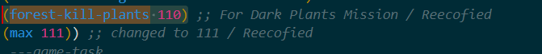
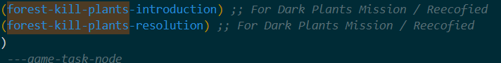

# Custom Missions in Jak 2

<PostAuthors authors={["Majora12"]} authorNames={["Majora12"]} />

## Background

Today I'm going to talk about what needs to be done to implement Custom Missions in Jak 2. This will only cover progress missions or the type of missions that you do to progress the game's story, not side missions/missions for orbs. I'll do my best to describe what needs to be done and what does what, that way it is easier for you to make your own Custom Missions. So, let's get started!

## The Mission

### The `enum` Entries

First, every progress mission in Jak 2 is entered into two different `enum`s. These `enum`s exist in the `game-task-h.gc` file. The first place you want to add your mission entry to is `(defenum game-task`. This enum is setup as a `uint8`, that means it can contain 256 different entries. If you scroll to the bottom you will see an entry that says, `(max 110)`. You will need to change this and add your custom mission entries before it. For example, I added `(forest-kill-plants 110)`, so I changed `(max 110)` to `(max 111)`. All this enum needs is the name of each of your tasks, entered like the example I provide.



Next, we need to edit the `(defenum game-task-node` enum. This enum is a `uint32` so it can contain 2^32 entries. In this enum we will specifically be adding the nodes for our tasks/missions. Every mission in the game has at least Two task nodes: An introduction node, and a resolution node. Much like the previous enum, scroll to the bottom and add your entries. For my mission I had only two, `(forest-kill-plants-introduction)` and `(forest-kill-plants-resolution)`, so that is what I added. 



### Game Task Entries 

Okay! Now that we have our `game-task-h.gc` file setup with our missions we need to go to `game-task.gc` and make some entries there. The first entry we need to make is a new `game-task-info` entry. These look like this:
```opengoal
(new 'static 'game-task-info
            :name "forest-kill-plants" ;; Name of your Task 
            :pre-play-node (game-task-node forest-kill-plants-introduction)
            :kiosk-play-node (game-task-node forest-kill-plants-introduction)
            :pre-play-continue "forest-start"
            :play-node (game-task-node forest-kill-plants-introduction)
            :play-continue "forest-start"
            :kiosk-play-continue #f
            )
```

Let's break this down, explain what each field does, and how it needs to be filled out. 
- The first field `:name` is the name your task will be referred to as in the debug menu.
- The second field `:pre-play-node` is the node for your task that will be opened when selecting it from the pre-play menu.
- The third field `:kiosk-play-node` is the node for your task that will be opened when selecting it from the kiosk-play menu.
- The fourth field `:pre-play-continue` is the continue point that Jak will spawned at when selecting the mission from the pre-play menu.
- The fifth field `:play-node` is the node for your task that will be opened when selecting it from the debug Play menu.
- The sixth field `:play-continue` is the continue point that Jak will be spawned at when selecting the mission from the debug Play menu.
- The seventh field `:kiosk-play-continue` is the continue point that Jak will be spawned at when selecting the mission from the kiosk-play menu.

The last thing we need to do is setup the `game-task-node-info` entries. They will look like this: 

```opengoal
(new 'static 'game-task-node-info
            :level 'forest
            :task (game-task forest-kill-plants)
            :name "forest-kill-plants-introduction"
            :when-open #f
            :flags (game-task-node-flag save-on-life task-manager)
            :parent-node (new 'static 'array game-task-node 4
              (game-task-node ruins-mech-resolution)
              (game-task-node none)
              (game-task-node none)
              (game-task-node none)
              )
            :on-open #f
            :info (new 'static 'task-manager-info
              :level 'mountain
              :intro-scene #f
              :resolution-scene #f
              :resolution-scene-continue #f
              :retry-continue #f
              :fail-continue #f
              :init-hook #f
              :cleanup-hook #f
              :update-hook #f
              :code-hook #f
              :complete-hook #f
              :fail-hook #f
              :event-hook #f
              :final-node (game-task-node forest-kill-plants-introduction)
              :on-complete #f
              :on-fail #f
              :end-sphere (new 'static 'sphere :x -2332701.5 :y 492573.0625 :z 859517.1875 :r 81920.0)
             )
            :borrow '((forest 1 lforplants display))
            :open? #f
            :on-close #f
            :description (text-id progress-missions-kill-plants)
            )
 ```
I'll breakdown this as well:
- The first field `:level` is the level that your task takes place in. In this case, mine is Haven Forest so I use `'forest`. 
- The second field `:task` is the game task associated with that game task node definition. Since this is the introduction node for the forest-kill-plants game task, we put `(game-task forest-kill-plants)` as the game task.
- The third field `:name` is the name of the game task node you're defining. 
- The fourth field `:when-open` is code that runs when/while the task node is open.
- The fifth field `:flags` are the flags associated with the task node. 
- The sixth field `:parent-node` are the nodes that are required to be closed in order for a task to be available. You can set up to 4. This field is basically how you set the mission order. For example, I used it to make it so that my `forest-kill-plants` mission is done after the mission Get Life Seed in Deadtown, and is required to be completed to do Protect Samos in Haven Forest, which allowed me to make the custom mission required for main game progression.
- The seventh field `:on-open` is code that will be ran upon the task node being opened. 
- The eighth field `:info` is for the task manager info. This is where you would tell it what cutscenes to play, where it should place Jak after the cutscene, code that should run upon completion and failing, if there is an ending sphere for the mission, what the final node is, and what all the task-manager hooks are if you have any. 
- The ninth field `:borrow` is the borrow level that is loaded for your mission. The borrow level is a special type of level that borrows memory from the level it is associated with, and generally contains actors for missions.
- The tenth field `:open?` is to set conditions for the task to open aside from the parent-node being closed/complete
- The eleventh field `:on-close` is code that will be run upon the task node being closed/completed. 

### Coding and Adding Your Mission's Code

Unfortunately, I can't really give an example of how to code a mission. To do so I'd have to upload my entire `.gc` file. The best advice I can give is to take a look at how the vanilla missions are coded. They generally create a task handler and/or manager that keeps track of and manages the task as it is being completed and/or use the task-manager hook system. 

Once your mission is coded and you have the entries setup for your mission it's time to actually make the game see your mission. All we've done so far is setup the game so our mission can be played once it's complete. If you were to try and select your mission to play right now, you'd just be taken to the continue point you set up with the task node open. The task wouldn't actually be completable by normal means. So, to make the game see your mission, you need to add your mission's `.gc` file into the `goal_src\jak2` folder. I recommend creating a folder called "custom-missions" inside that folder to put them in. Then, in `game.gp add this code but for your mission: `(goal-src /custom-missions/forest-kill-plants.gc)` in the area under where it says "Example Custom Levels". This will tell the game to build and compile the file that contains all the code for your mission. The final thing you need to do is setup a custom level, as well as the actors which will be used in your mission, which I will not be covering in this guide as making Custom Levels and Custom Actors is already covered on the [Custom Levels Page](https://opengoal.dev/docs/category/custom-levels).


