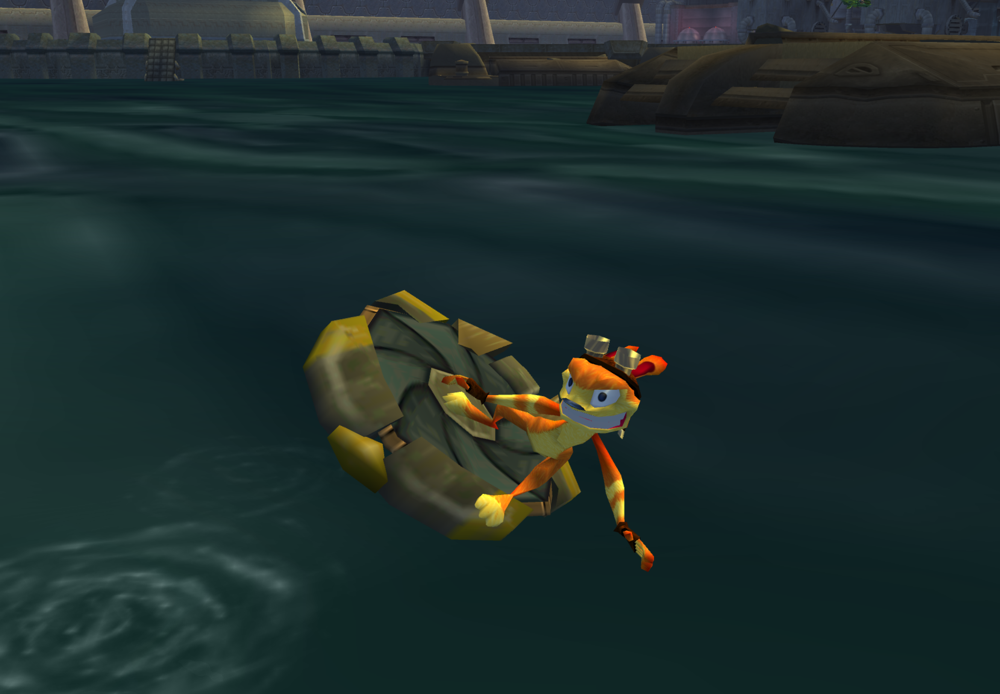

# Daxter 2 Mod

<PostAuthors authors={["dallmeyer"]} authorNames={["barg034"]} />

## Background

This post is going to go through the changes I made for my Jak II mod "Daxter 2", in which you play as Daxter throughout the entire game. Just to limit your expectations up front - it mostly reuses the playable Daxter from the Mars Tomb mission, so there aren't any *completely new* models or animations created as part of this mod, though I have made several tweaks to *existing* models and animations. If you'd like to play this mod yourself, you can find it in the [Unofficial Mod Launcher](https://jakmods.dev/).

I'll go through things in more detail below, but you can [click here to see the full diff](https://github.com/OpenGOAL-Mods/OG-Mod-Base/compare/main...OpenGOAL-Mods:OG-Daxter2:131ab7bce2ce26cf18e41dda4601213c2cbf314f) of changes for this mod.



### "Play the whole game as X" style mods

The concept for this mod is similar in spirit to a few mods we've done in the past for Jak 1, like the [FlutFlut Legacy](https://www.youtube.com/watch?v=_z8GhVWFYfI) or [Zoomer Legacy](https://www.youtube.com/watch?v=BDvvCY8gFDQ), where you're stuck trying to beat the game without playing as Jak on foot as you normally would. 

At a high-level, the development approach for these kind of mods is something like:
1. Understand how the gameplay mode of choice (FlutFlut, Zoomer, Daxter, etc) is represented and handled in the codebase
2. Ensure necessary code and art groups for the gameplay mode are loaded at all times
3. Write some code to switch to the gameplay mode of choice under appropriate conditions (e.g. when not already in that mode)
4. Do some playtesting and see how well it works, what breaks, etc
5. Debug any issues, and patch/extend the codebase to address them
   - This often involves reusing code from normal Jak states for unhandled cases in the other states
6. Go back to step 4 and repeat until happy with the results

## Understanding `target` fields and states

In the Jak games - regardless of whether you're playing as Jak on foot, riding the JET Board, driving the Titan Suit, playing as Daxter, etc - the player is represented as `*target*`, an instance of the `target` type. This very important child of `process-drawable`/`process-focusable` has dozens of different possible states corresponding to all the different states and gameplay modes the game offers. You may want to read the documentation on [Processes and States](../../reference/process_and_state) to for more info on how processes and states work in general.

### Learnings from Jak 1 mods

To start, here are a few sample `target` states from Jak 1:
- Jak standing still is `target-stance`
- Jak hanging from an edge is `target-edge-grab`
- Jak double-jumping out of water is `target-swim-jump-jump`
- Playing fish game is `target-fishing`

In Jak 1, you can send a `'change-mode` event to `*target*`, and [instruct it to switch states](https://github.com/open-goal/jak-project/blob/2ce7b365688a1c20a26d7ca2a2aeff9565cc004e/goal_src/jak1/engine/target/target-handler.gc#L777-L823) with various params. In particular, `'flut` and `'racing` were the relevant cases we utilized in the FlutFlut and Zoomer Legacy mods, respectively. There are a handful of different states for [FlutFlut](https://github.com/open-goal/jak-project/blob/2ce7b365688a1c20a26d7ca2a2aeff9565cc004e/goal_src/jak1/engine/target/target-h.gc#L76-L93) (`target-flut-air-attack`, `target-flut-death`, `target-flut-start`, etc) and the [Zoomer](https://github.com/open-goal/jak-project/blob/2ce7b365688a1c20a26d7ca2a2aeff9565cc004e/goal_src/jak1/engine/target/target-h.gc#L113-L126) (`target-racing-bounce`, `target-racing-death`, `target-racing-start`, etc).

Additionally, there is an important field within the `target` type `(-> *target* control root-prim prim-core action)` that is generally used to check if the player is currently on FlutFlut or on the Zoomer (or riding a moving platform, on a swingpole, etc). For example, here are a couple helper functions:

```opengoal
(defun target-on-flut? () 
  (and 
    *target* 
    (logtest? (-> *target* control root-prim prim-core action) (collide-action flut))
    )
  )

(defun target-on-zoomer? () 
  (and 
    *target* 
    (logtest? (-> *target* control root-prim prim-core action) (collide-action racer))
    )
  )
```

### Jak 2 `target`

In Jak 2, this hasn't changed too drastically. Here are a few sample `target` states from Jak 2 (many were carried over from Jak 1):
- Jak standing still is `target-stance`
- Jak hanging from an edge is `target-edge-grab`
- Jak double-jumping out of water is `target-swim-jump-jump`
- Jak hitting a grenade on the JET board is `target-board-grenade`

The playable Daxter mission in Mars Tomb is a mode that you can switch to with `(send-event *target* 'change-mode 'indax #f)` and there are various corresponding `target` states for the Daxter mode (`target-indax-death`, `target-indax-jump`, `target-indax-start`, etc).

Instead of the buried `collide-action` field from Jak 1, in Jak 2 the `process-focusable` parent type introduces a `focus-status` field that is used to check if the player is in Daxter mode, is on the JET Board, is using a gun, etc. There is an easy to use `focus-test?` macro to go with this, for example:

```opengoal
(defun target-indax? () 
  (and 
    *target* 
    (focus-test? *target* indax)
    )
  )

(defun target-board? () 
  (and 
    *target* 
    (focus-test? *target* board)
    )
  )
```

## Keeping `indax` code and art groups loaded

One thing I've glossed over until this point is that you can only use these different gameplay modes if you have all the necessary dependencies loaded. If you try to switch to `indax` mode and don't have the `tombe` level loaded, the game will crash! The same thing happens in Jak 1 with FlutFlut if you don't have Boggy Swamp or Snowy Mountain loaded, or with the Zoomer if you don't have one of its levels loaded. 

From some trial and error in building the Jak 1 mods, we know how to rearrange the dependencies to keep specific code files and art groups loaded at all times.

### Adding `game.gd` dependencies

First, we need to add dependencies to `game.gd`, to load the code and art-groups on startup:

```opengoal
("GAME.CGO"
 ("types-h.o"
  ...
  "entity-debug.o"
  "mod-settings.o"
  "mod-common-functions.o"
  "mod-custom-code.o"
  ;; keep indax loaded
  "target-indax.o"
  "jak-indax+0-ag.go"
 ))
 ```

`target-indax.o` is the code from the `target-indax.gc` file - since the `indax` states are defined there with all of the gameplay and animation logic, we definitely need that! We also need the art group that has the animations for these `indax` states, which lives in the `jak-indax+0-ag.go` file. The `sidekick.o` and `daxter-ag.go` files are also required, but luckily these are already included in `game.gd` since they're needed for Daxter to ride around on Jak's shoulder the entire game.

### Removing level-specific dependencies

These changes alone *will* allow you to play as Daxter anywhere in the game. However, if you actually go to Mars Tomb and load `tombe` (the Daxter boulder/spider chase section), when `tombe` is unloaded, the game will crash! This is because we left `target-indax.o` and `jak-indax+0-ag.go` as dependencies in `toe.gd` (for `tombe`), so the game unloaded them when the level unloaded. We saw this same issue in the Jak 1 mods as well, and the solution is simple - just get rid of the level-specific dependencies:

```opengoal
("TOE.DGO"
 (;; "target-indax.o" ;; prevent indax unload
  ;; "jak-indax+0-ag.go"
  "tomb-boulder.o"
  "tpage-2374.go"
  "tpage-2375.go"
  "tpage-2376.go"
  "tomb-boulder-ag.go"
  "tomb-baby-spider-ag.go"
  "tomb-plat-pillar-ag.go"
  "spider-eyes-ag.go"
  "tomb-bounce-web-ag.go"
  "tombe-vis.go"
 ))
```

With these 2 changes together, it should be safe to switch to `indax` mode anywhere and load/unload levels without issue.

## Switching to `indax` mode under appropriate conditions

At this point, we've established how to switch the player's mode, we know which states are used for the different modes, and we can check whether the player is currently in a given mode. So we should be ready to write some basic code that checks every frame if, based on the player's conditions, we need to send a `'change-mode 'indax` event.

Our Mod Base comes with a `runs-every-frame` function where we might put this code, and an initial implementation might do something like:

```opengoal
(defun runs-every-frame ()
  (when (and *target*
             (not (focus-test? *target* indax)))
    (send-event *target* 'change-mode 'indax #f)
    )
  )
```

I haven't tested this exact code, but it should force you to play as Daxter at all times throughout the game!

### So what doesn't work?

While the mod is *functional* now, is it actually playable? Well if you try to start a new game, you'll quickly realize that with Daxter's vanilla movement options, you're probably not getting out of prison... And even if you could escape, Daxter can't use guns, the JET Board, or drive vehicles... Getting around the world and defeating enemies is going to be annoying, if not straight-up impossible at times.

Let's look at a specific issue and think about how it might be addressed. Skipping over some tricky platforming in the first few rooms of the prison level, one of the more explicit blockers early on is the grate you need to ground-pound through to drop down to a lower level. 


So what's the problem? Well Daxter has no ground-pound move, and that obstacle specifically only breaks from the `'flop` attack (did you know even Dark Bomb doesn't work here?). As far as I know, there aren't any out-of-bounds or other ways to get around this.

### Reuse a Jak 1 solution?

One way you might fix this is to change the grate's event handler to allow it to break from other attacks, such as Daxter's spin attack. Or you could even just require Daxter to simply touch the grate for it to break. But those options are kind of lame, and wouldn't it be cool if we *could* give Daxter a ground-pound attack?

In the Jak 1 mods, we extended the FlutFlut/Zoomer gameplay logic to allow the use of some on-foot Jak states, such as using launchpads, and going into the first-person goggles. We could do the same thing in this Daxter mod, but the glaring difference is that Jak's model will pop in and out of existence during these states, similar to how the FlutFlut/Zoomer models would disappear and reappear with this solution in Jak 1.

## A dozen birds with 1 stone

Well, what if we just hid Jak's model in these states? Turns out that's actually pretty easy to do: `(logior! (-> *target* draw status) (draw-control-status no-draw-bounds2))` will hide Jak but leave Daxter. 

Keep in mind that if we want to allow the use of some non-`indax` Jak states, we'll need to change the condition we previously came up with for when to send the `'change-mode` event. Otherwise we'd immediately get sent right back to the initial `target-indax-start` state.

### JET Board

I originally wanted to get this working for the JET Board, and so I updated the condition to use a `case` to filter out the `target-board` states:

```opengoal
(defun runs-every-frame ()
  ;; switch in/out of daxter states
  (when *target*
    (case (-> *target* state name)
      ((;; jetboard
        'target-board-clone-anim
        'target-board-duck-stance
        'target-board-falling
        'target-board-flip
        'target-board-get-off
        'target-board-get-on
        'target-board-grab
        'target-board-grenade
        'target-board-halfpipe
        'target-board-hit
        'target-board-hit-ground
        'target-board-hold
        'target-board-jump
        'target-board-jump-kick
        'target-board-pegasus
        'target-board-ride-edge
        'target-board-stance
        'target-board-start
        'target-board-trickx
        'target-board-turn-to
        'target-board-wall-kick
        )
        ;; do nothing
        )
      (else
        ;; force to indax mode
        (send-event *target* 'change-mode 'indax #f)
        )
      )
    
    ;; hide jak
    (logior! (-> *target* draw status) (draw-control-status no-draw-bounds2))
    )
  )
```

The first issue I ran into is that Daxter didn't respond to pressing R2 to get onto the JET Board. This is supposed to happen in `target`'s [`flag-setup`](https://github.com/open-goal/jak-project/blob/f17427bc26b50d8469a7515692fbbe3295509d49/goal_src/jak2/engine/target/logic-target.gc#L1632-L1634), and I found the issue is that the `'change-mode 'board` event is ignored in the [`target-indax-handler`](https://github.com/open-goal/jak-project/blob/f17427bc26b50d8469a7515692fbbe3295509d49/test/decompiler/reference/jak2/levels/tomb/target-indax_REF.gc#L70-L89) that is used across the `indax` states.

I reused a trick I learned from the Jak 1 mods - when some kind of event isn't handled, just pass it off to some other event handler that you know will handle it properly:

```opengoal
(defbehavior target-indax-handler target ((arg0 process) (arg1 int) (arg2 symbol) (arg3 event-message-block))
  ...
  (case arg2
    ...
    (('change-mode)
      (let ((v1-5 (-> arg3 param 0)))
        (cond
          ...
          ;; fallback to jak's event handler to get on jetboard
          ((= v1-5 'board)
            (target-standard-event-handler arg0 arg1 arg2 arg3)
            )
          )
        )
      )
    ...
    )
  ...
  )
...
```

Okay, now Daxter tries to get on the JET Board when you press R2... but the board is invisible, because it respects Jak's `draw-control-status`. I fixed this by changing the condition [here](https://github.com/OpenGOAL-Mods/OG-Daxter2/blob/131ab7bce2ce26cf18e41dda4601213c2cbf314f/goal_src/jak2/engine/target/board/board-util.gc#L52-L58), so that the board's visibilty is now directly tied to whether we're actively using it.

It is possible to keep the JET Board visible when not using it, and have it follow Daxter's position like it does for Jak. But the alignment and scaling would need adjustments since it's expecting a much taller Jak model. I decided to leave this alone for the time being, so the board just pops in and out of existence as it's used.

<ReactPlayer
  controls
  url={require("./video/dax-jetboard.mp4").default}
  className="blog-video"
/>

And that was it, suddenly I was riding around on the JET Board as Daxter! I was pretty happy with how well the JET Board animations worked with just Daxter visible, but I wasn't sure if the approach would work well enough for other Jak states/animations.

### Ground pound

### Swingpoles

### Driving (and in-vehicle guns)

### Titan Suit

### Turrets

### Warp Gates

### Edge Grabs

## Dark Daxter

Adding Dark Daxter was something I definitely wanted to do from the beginning, but I knew it would be one of the more challenging changes. This too relies on the "reuse Jak states with Jak hidden" strategy, but I also made a bunch of additional customizations that I'll break down.

### Getting in and out of `dark` mode

### Changing Daxter's color

### Changing Daxter's scaling

### Giving Daxter creepy eyes

### Lightning/particle tracking fix

### Dark Bomb

### Dark Blast

### Dark Giant

## Bug fixes

### Infinite health bug

### Gun Course softlock fix

### Krimzon Guard line-of-sight fix

### `dangerous`/`harmless` punch fix

### Mars Tomb Praxis fight spydroid "softlock" fix

## Other gameplay changes

### Maintaining momentum from Jak states to `indax` states

### Daxter high jump

### Punch into spin attack 

(or did I make this up?)

### Punch into jump

### Standpoint on slippery surfaces

## Clean up

### Skipping Daxter's look back animation

### Hiding Jak in cutscenes

### Swapping Jak HUD & Intro textures for Daxter ones

### Swapping Dark Jak text with Dark Daxter

### Swapping Jak death audio for Daxter one

### Skipping roll jump hint

---

## Appendix

- [Using the OpenGOAL REPL](../repl)
- [OpenGOAL unofficial Mod Launcher](https://jakmods.dev)
- [OpenGOAL Mod Base - Github](https://jakmods.dev/modbaseRedirect.html)
- [OpenGOAL Daxter 2 Mod - Github](https://github.com/OpenGOAL-Mods/OG-Daxter2)
  - [Full Diff](https://github.com/OpenGOAL-Mods/OG-Mod-Base/compare/main...OpenGOAL-Mods:OG-Daxter2:131ab7bce2ce26cf18e41dda4601213c2cbf314f)
- [OpenGOAL Language Reference](../../reference)
  - [`if`](../../reference/lib/#if)
  - [`and`](../../reference/goos/#and)
  - [`cond`](../../reference/lib/#cond)
  - [`let`](../../reference/lib/#let)
  - [`let*`](../../reference/lib/#let-1)
  - [`+`](../../reference/lib/#-2)
  - [`-`](../../reference/lib/#-)
  - [`/`](../../reference/lib/#-4)
  - [`set!`](../../reference/goos/#set)
  - [`the-as`](../../reference/lib/#the-as)
  - [Processes and States](../../reference/process_and_state)
  - [Comments](../../reference/syntax/#comments)
