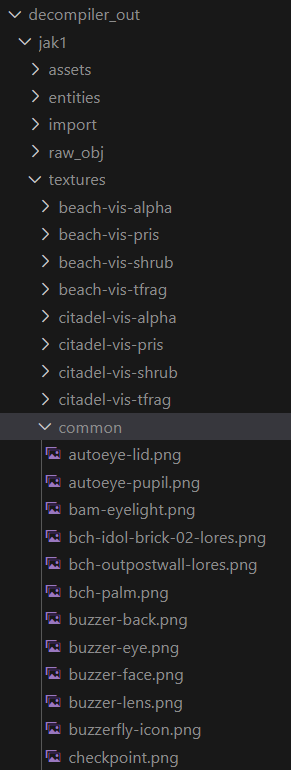
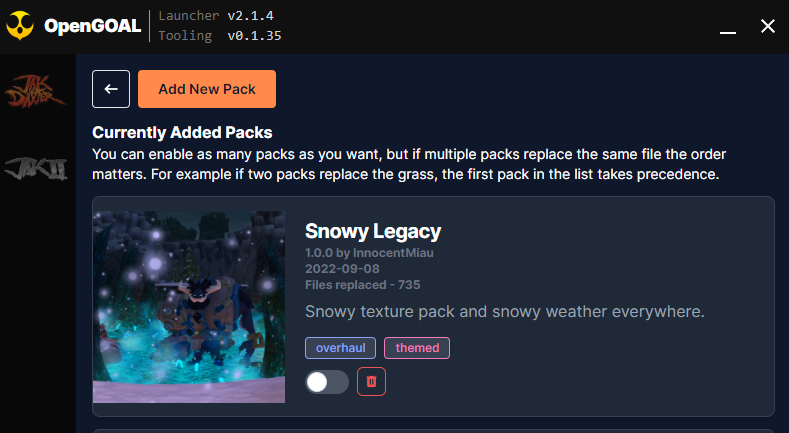
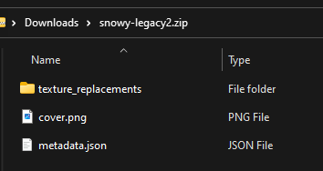
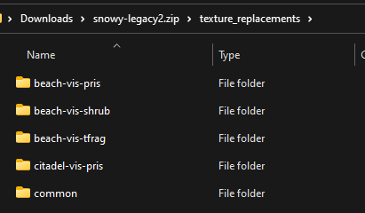

# Texture Packs

This information should help you along the process of creating and distributing a texture pack properly.

## Restrictions

Do not change the resolution of the sky, clouds, or eye textures. Other textures should let you change the size. Using extremely large textures will use more VRAM and will load slower.

The PNG file should have an alpha channel. Some textures use their alpha channels for transparency, or for indicating which parts should have environment mapping applied. It may be useful to look at how the original texture uses the alpha channel first, especially for particle effects.

## Texture pack structure

The structure of your texture pack (the file and directory names) must match the ones from the original game, so the recommended workflow is to first extract these original textures as PNG files, and use this as a starting point for your modifications.

### Extracting original textures

First make sure that the `save_texture_pngs` option is set to `true` in the [decompiler config file](https://github.com/open-goal/jak-project/blob/291c89a851458ac3d884816ae71c9407f9b02d71/decompiler/config/jak1/jak1_config.jsonc#L123) for the game. You can find this file at `data/decompiler/config/jak1/jak1_config.jsonc`, or if you're using the OpenGOAL Launcher at `<your-install-directory>/active/jak1/data/decompiler/config/jak1/jak1_config.jsonc`. There's a separate `jak2/jak2_config.jsonc` file for Jak 2, so make sure you update the right one.

Afterwards you'll need to run the decompiler/extractor again to extract the textures. Once that completes successfully you should find the extracted textures at `data/decompiler_out/jak1/textures`, or if you're using the OpenGOAL Launcher at `<your-install-directory>/active/jak1/data/decompiler_out/jak1/textures`.



### Setting up `texture_replacements`

Now you can see how the textures are laid out, and you can start setting up your texture pack. Let's say you want to change the Precursor Orb texture `egg-ndimadman.png`, which you can find in the `common` folder.

You can copy/paste the whole `common` folder into the `custom_assets/jak1/texture_replacements` folder. Then you can modify the PNG files directly in `custom_assets/jak1/texture_replacements/common`. Feel free to delete any textures you're not modifying - the decompiler will just continue using the original textures if it doesn't find a replacement in your pack.

If you're using the OpenGOAL Launcher and want to replace textures for your active version, you want to use the folder at `<your-install-directory>/active/jak1/data/custom_assets/jak1/texture_replacements/`.

### Replacing a repeated texture across multiple folders

You may notice some texture are repeated in several different folders - for instance, textures for the "Babak" Lurker such as `bab-fur.png` are repeated in each level that needs them (which is not all of them - probably why they don't live under `common`).

If you'd like to globally replace a texture such as this across the game, you can create a special `_all` folder within your `custom_assets/jak1/texture_replacements/` folder and put the textures there. Note that any level-specific texture replacements WILL take precedence over textures in the `_all` folder - you can find more info in [this PR](https://github.com/open-goal/jak-project/pull/3234).

## Rebuilding the game with modified textures

Run the decompiler/extractor again to rebuild with modified textures.

If it worked, you will see:

```
Replacing jak-project/texture_replacements/jak1/common/jng-precursor-metal-plain-01-lores.png
```

as part of the output.

## Distributing

If you want your texture pack to be installable via the Launcher, there are some simple rules you should follow when bundling it up.



1. Ensure it is a `.zip` file with a top level `custom_assets/<jak1|jak2|jak3|jakx>/texture_replacements` folder. This folder should contain all of your texture replacements in the same layout they would be while creating the pack. For example:




2. If you want your texture pack to have a nice thumbnail in the launcher, you should add a top level `cover.png` image as shown above.

3. Lastly, if you want your texture pack to have associated metadata (such as a description and author name) you should add a top level `metdata.json` file that abides by the following format - https://github.com/open-goal/mod-bundling-tools/blob/main/schemas/texture-packs/v1/texture-pack-schema.v1.json
   - If you aren't familiar with JSON schema, here is an example (which may become out of date in terms of newly supported fields)

```json
{
  "name": "Snowy Legacy",
  "version": "1.0.0",
  "author": "InnocentMiau",
  "releaseDate": "2022-09-08",
  "supportedGames": ["jak1"],
  "description": "Snowy texture pack and snowy weather everywhere.",
  "tags": ["overhaul", "themed"]
}
```
