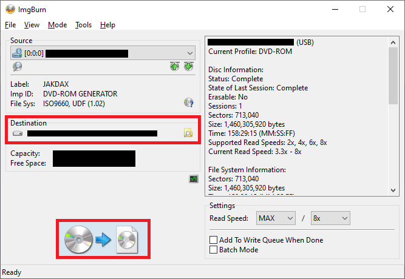
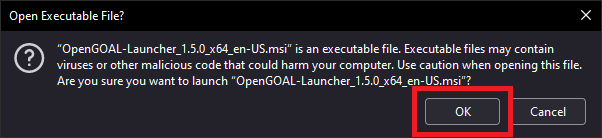
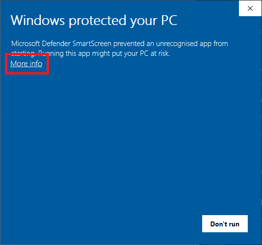

import Requirements from '../../partials/_requirements.mdx';

# Installation

## Opening notes

> Please note that help and support for this project is not always available, as everyone involved is donating their time to this project for free. If this page or the [FAQs](/docs/faq) can't answer your question, you might be able to find help in the OpenGOAL [discord](https://discord.gg/VZbXMHXzWv), but we do not guarantee support.

At the moment OpenGOAL only supports running the first Jak and Daxter game, and Jak 2 is currently in progress. There are no timelines for their completion, as this is an open source passion project, but you're more than welcome to contribute to their development with us! See [Contributing](/docs/category/contributing) and [Developing](/docs/category/developing) for more information.

Additionally, if you'd like to see a video copy of this installation, there is a guide available [on YouTube](https://www.youtube.com/watch?v=p8I9NfuZOgE) that you can follow along with.

There are 3 main steps required to set up OpenGOAL on your machine, which are:

- Creating your `.iso` file containing (these contain the official Jak and Daxter assets)
- Installing OpenGOAL
- Running the OpenGOAL setup

Once these steps are complete you'll be able to run Jak and Daxter within OpenGOAL, and see everything this project has to offer. Follow the instructions below to prepare your installation and start playing!

## Requirements

<Requirements/>

### Windows Specific

:::info
We only support Windows 10, and Windows 11.
- Windows 7 has been out of support since January 2020
- Windows 8.1 will be end of life January 2023
:::

You may need to install the [latest 64-bit C++ redistribution](https://aka.ms/vs/17/release/vc_redist.x64.exe).

### Linux Specific

Nothing additional should be required other than functional GPU drivers

## Step 1: Preparing your ISO

The first major step requires a legal copy of any retail version of Jak and Daxter (early builds and demos not supported), as well as a CD drive to read it. We will be using these to create a `.iso` file, which contains all of the assets (such as the 3d models and sound files) that are stored on the PS2 disc, and are needed to run OpenGOAL.

:::danger
You will need your own legitimately obtained copy of the original game. The Jak games are not rare and can be found used for very affordable prices at a variety of second-hand and online stores.

[Example _Jak and Daxter_ listing (THIS IS NOT AN ENDORSEMENT).](https://www.ebay.com/sch/i.html?_from=R40&_trksid=p2380057.m570.l1313&_nkw=jak&_sacat=0)
:::

This guide will include one example of how to do this using ImgBurn, but any software that reads your disc will likely be able to do this. More information about this process and some alternatives can be found in the [PCSX2 guide](https://pcsx2.net/guides/basic-setup/#dumping-ps2-discs-via-imgburn).

The first step is to download ImgBurn and install, which is hosted by a number of mirrors listed on the [ImgBurn website](https://www.imgburn.com/index.php?act=download).

We do not provide support for ImgBurn directly, but there are many documents about this on the ImgBurn site and across the web. With any luck you won't need to troubleshoot the install, it's generally very stable.

Once it is installed, you'll need to insert your Jak and Daxter CD into your CD drive, and let ImgBurn read it. On the opening screen, this can be done with the `Create image file from disc` command, followed by choosing a location to save your `.iso` and starting the read. Some images of this process are included below.

<details>
  <summary>Expand this section to see step by step ImgBurn screenshots</summary>
  <div>





  </div>
</details>

This process will take a few minutes, so leave it running while we continue on with the next step: installing OpenGOAL itself.

:::caution
If you are on a SteamDeck, you will likely need to use the compiled releases, instead of the Launcher.  See Step 2b below!
:::

## Step 2a: Installing via the Launcher

The launcher is the preferred way of getting and using OpenGOAL:
- You can easily update both the launcher and the game
- Designed for non-technical users
- More useful features in the future

### Launcher Pre-requisites

There are a few requirements depending on your platform that you may need to handle.

#### Windows

The Launcher depends on WebView2, which has been shipping on Windows 10+ since April 2018.  If for some reason you still don't have it and have been keeping your PC up to date, you can explicitly download it here https://developer.microsoft.com/en-us/microsoft-edge/webview2/

:::warn
Unfortunately, due to the following issues in a recent WebView2 release (which have since been fixed) you may experience issues getting the Launcher to open.

If you have this problem, please attempt to install the latest version yourself from [https://developer.microsoft.com/en-us/microsoft-edge/webview2/#download-section](here).  You will likely require the `x64 Standalone Installer` download. **If the installation fails, you may have to run it as administrator.**

If you're interested, these are the underlying issues:
- https://github.com/MicrosoftEdge/WebView2Feedback/issues/3138#issuecomment-1387432722
- https://github.com/MicrosoftEdge/WebView2Feedback/issues/3137
- https://github.com/MicrosoftEdge/WebView2Feedback/issues/3136
:::

#### Linux

The Launcher is distributed as an AppImage, in recent distributions such as Ubuntu 22.04, you may see an error like the following:


If so, install the following package

```bash
sudo apt install libfuse2
```

### Downloading and Installing

The latest release of the Launcher can be found using the link below.

<div className="row markdownMarginBottom">
    <div className="col col--4">
        <LauncherDownloadLink />
    </div>
</div>

#### Windows Defender Warnings

The installer however is not signed, which may lead to warnings from Microsoft Defender or your antivirus of choice, as installing unsigned applications can be a security risk. This is unfortunately something we can not fix, as signing an application is both expensive and time consuming, and this project is being developed free of charge by a community of volunteers.

If you trust this application even without the signature, some screenshots of how to pass through the most common warnings can be found below. If you have some technical experience, and would prefer to build this application from the source yourself to avoid these errors, then take a look at the [project README instructions](https://github.com/open-goal/jak-project#setting-up-a-development-environment) instead. Support for this however is outside the scope of this document.

<details>
  <summary>Expand this section to see examples warnings and ignore them (if you trust this application!)</summary>
  <div>





  </div>
</details>

If you have chosen to continue installing the application after these warnings, you'll be shown a simple installation wizard that will allow you to configure and launch OpenGOAL. Some step by step screenshots have been included below.

<details>
  <summary>Expand this section to see the process of installing OpenGOAL</summary>
  <div>


  </div>
</details>

If you choose to launch OpenGOAL once the install is completed, you'll skip right to the next step. If not you'll need to navigate to the location you chose for OpenGOAL to install (by default this location is `C:\Program Files\OpenGOAL-Launcher`), and run `OpenGOAL-Launcher.exe`.

If this opens successfully, you've reached the final stage! Up next we'll be setting up the launcher, including extracting the assets from your `.iso` file.

### Using the Launcher

In recent versions of the Launcher there is no longer a set `jak-project` release.  You are free to download or roll-back to any official or unofficial release.

If it is your first time using the launcher, you will be prompted to select an installation directory.  This is the folder where all of the following will go:
- `jak-project` version releases you download
- extracted ISO contents
- the built game files


When the launcher loads, you will not have a tooling version downloaded.  In regards to official versions, these correspond to the releases that can be found [here](https://github.com/open-goal/jak-project/releases)

To select one (likely the latest) follow the prompt.


Click the download button on the latest version, then select it, and save your changes.  This is where you could rollback to a previous version, if for example, we release a breaking bug.


With this you can now go back to the respective game menu and install it.

:::danger
Before the installation takes place, the Launcher will check that you meet the minimum requirements.

If you don't, you unfortunately **WILL NOT** be able to continue with the installation. OpenGOAL requires a minimum OpenGL version from your GPU as well as AVX support from your CPU, and if either of those requirements aren't met you **WILL NOT** be able to run OpenGOAL.
:::


:::tip
If at any point during the installation something goes wrong and you are going to ask for help or report an issue.  Download the **Support Package** in order to easily give the person helping you everything they could ask for all at once.

There is a button to download this in the help page, as well as one should appear on the installation page if it fails.


:::


Once you've reached this screen, you're all set up and ready to go! Just hit `PLAY` to start the game. The other controls are not something you'll need to play the game, as most of them are tools for developers, or helpful links to folders such as your save files.

That's everything! At this point you should have a working copy of the game to play. Join us in the [discord](https://discord.gg/VZbXMHXzWv) or finding streams/streaming yourself on [Twitch](https://www.twitch.tv/directory/game/Jak%20and%20Daxter:%20The%20Precursor%20Legacy) to get involved in the community.

**ENJOY!**

## Step 2b: Installing via a `jak-project` Release

If you don't want to use the Launcher or it is not applicable for your platform, you can use the minimal base release instead.

These releases can be found here - https://github.com/open-goal/jak-project/releases
- For **Windows** you want to download the `opengoal-windows-vX.X.X.zip` asset
- For **Linux** you want to download the `opengoal-linux-vX.X.X.tar.gz` asset

:::tip
If you have some technical experience, and would prefer to build this application from the source yourself, then take a look at the [project README instructions](https://github.com/open-goal/jak-project#setting-up-a-development-environment) instead. Support for this however is outside the scope of this document.
:::

### Windows

If you would prefer a video, see the following:

<ReactPlayer url={"https://www.youtube.com/watch?v=yQBKCnS5MDY"} style={{marginBottom: "1em"}}/>

1. Extract the `.zip` file wherever you'd like
2. Drag your `.iso` file onto the `extractor.exe` file
3. Run `gk.exe` to open the game

### Linux

If you're continuing with the builds from the latest releases, extract the contents of the `.tar.gz` file to get a folder with a similar list of files to the below.


Once you have these files extracted, there are two main steps required. The first is to extract all of the assets from the `.iso` file you created earlier, using the `extractor` from the install above (eg `./extractor <path-to-iso>`). Once this extraction completes, you should be able to run `gk` from the same folder to start the game.

### Linux (Steam Deck)

If you are here looking to set up OpenGOAL on your Steam Deck there is a video guide for Steam Deck users that covers the process of installing and running OpenGOAL very thoroughly. The only change in this video is that we do now support other non black label versions of Jak and Daxter, so any disc should work!

<ReactPlayer url={"https://www.youtube.com/watch?v=Cv7mlCSHKxc&t=564s"} style={{marginBottom: "1em"}}/>

> NOTE: For Steam Deck users, you can add OpenGOAL to your Steam library after installation by pointing to the `gk` file in this folder. You will need to change the `File type` to `All Files` in order to see it!
>
> 


## MacOS

:::danger
We do not support macOS at this time. Unfortunately macOS does not currently support the version of OpenGL we use for this project, and we additionally do not support any ARM processors, meaning significant changes would be required.
:::

## Conclusion

That's everything! At this point you should have a working copy of the game to play. Join us in the [discord](https://discord.gg/VZbXMHXzWv) or finding streams/streaming yourself on [Twitch](https://www.twitch.tv/directory/game/Jak%20and%20Daxter:%20The%20Precursor%20Legacy) to get involved in the community.
