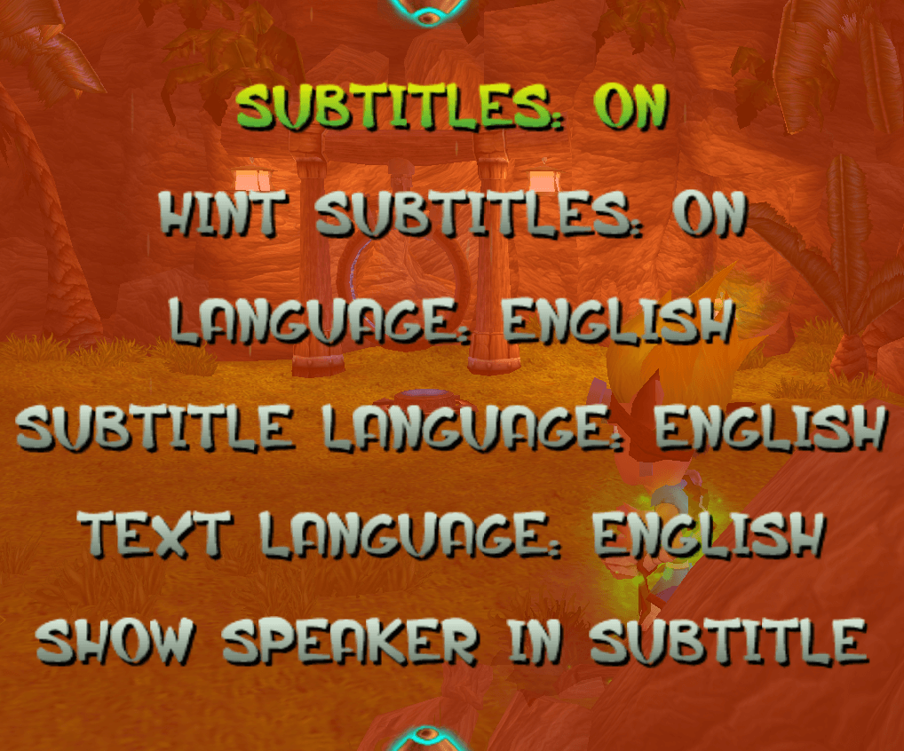
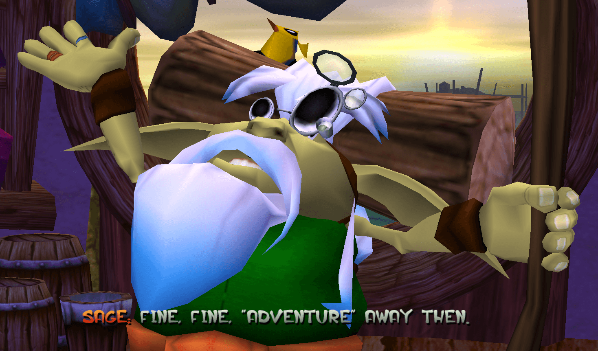
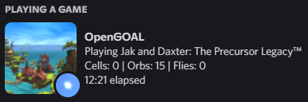
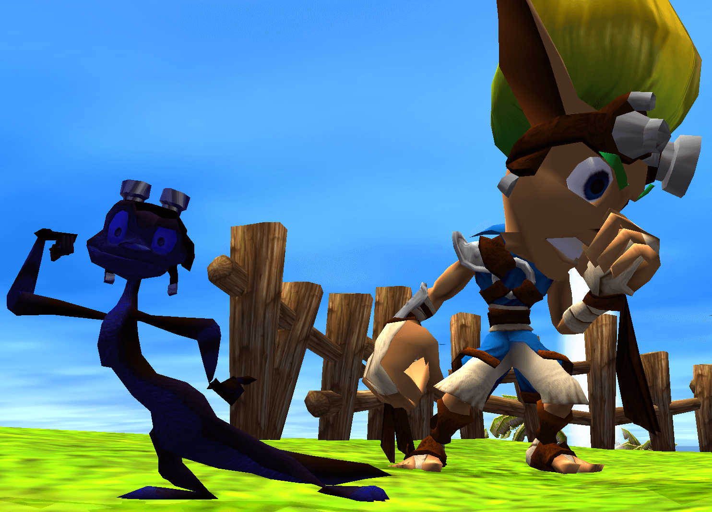

# In-game Settings

Compared to the original game, OpenGOAL provides a different set of settings that can be changed in-game. This page goes into further detail into what each setting entails and recommended values for them to be set to. Once you've had a look through this page, [try changing them yourself in game](/docs/usage/installation)!

## Game Options

Under the **GAME OPTIONS** sub-menu is a variety of settings related to the gameplay experience that is not necessarily tied to audio or visuals. These include settings such as accessibility controls, localization and control adjustment.

### VIBRATIONS

When enabled, controller rumbling will occur as additional feedback for various actions and events in the game. Default value is on. This setting only affects controllers and will not make your keyboard vibrate.

### PLAY HINTS

When enabled, non-playable characters (mainly Daxter) will assist Jak over the course of the game by offering tips and tutorials on how to complete certain objectives or directions on where to head next. Default value is on. Recommended value is on, for new or unfamiliar players.

### SUBTITLES

Subtitles represent a major additional feature that was not present in the original game. When enabled, displays subtitles for the in-game cutscenes. This can be toggled on and off by using the punch button (Square on PlayStation) during an in-game cutscene, which you will be notified about during the intro cutscene of the game. Default value is off.

### HINT SUBTITLES

When enabled, displays subtitles for the in-game hints (see **PLAY HINTS** above). Default value is on.

### LANGUAGE, SUBTITLE LANGUAGE and TEXT LANGUAGE

These three settings govern the language that is used for certain aspects of the game. **LANGUAGE** affects the language used for game audio (including the credits text), **SUBTITLE LANGUAGE** affects the language used for all the subtitles and **TEXT LANGUAGE** affects the language used for all remaining on-screen text.

The languages available for each of these settings is different due to different levels of localization completion. Below is a table of supported languages for each of these settings. This list may expand as more languages are added.

import Jak1LanguageStatusTable from './language_status.js';

<Jak1LanguageStatusTable game="jak1" />

Note that if a language is marked with "No" in this table then it will not appear as a selectable option for that column's setting. "Partial" indicates a significant amount of missing text. A text language marked with "Yes" can still be missing a few strings of text due to the continuously developing nature of OpenGOAL.

If you're interested in adding new subtitles or text to the game, or editing existing ones, take a look [at the subtitle translations page](/docs/contributing/subtitle-translations).

### SHOW SPEAKER IN SUBTITLES

Determines whether the name of the speaker will be displayed at the start of each string of text for the subtitles. Three options are available: "ALWAYS" will make the name always appear, "NEVER" will make the name never appear and "OFF-SCREEN" will make the name appear if the speaker is off-screen (note: hints are always considered "off-screen" for this purpose). Default value is **OFF-SCREEN**.

    

        

            <CaptionedImage caption="Subtitle speaker hidden" src={require("./img/subtitle-speaker-off.png").default} />
            <CaptionedImage caption="Subtitle speaker shown" src={require("./img/subtitle-speaker-on.png").default} />
        

    

### CAMERA OPTIONS

Settings to modify the orientation of the camera movement controls. The **RESTORE DEFAULTS** option does what you'd expect and restores these options to their default value.

#### 1ST-PERSON HORIZONTAL CAMERA

Affects the horizontal movement of the first-person cameras: google view, Billy mini-game, jungle periscope, cannon, etc. Default value is **NORMAL**.

#### 1ST-PERSON VERTICAL CAMERA

Affects the horizontal movement of the first-person cameras: google view, Billy mini-game, jungle periscope, cannon, etc. Default value is **INVERTED**.

#### 3RD-PERSON HORIZONTAL CAMERA

Affects the horizontal movement of the third-person cameras. Default value is **INVERTED**.

#### 3RD-PERSON VERTICAL CAMERA

Affects the horizontal movement of the third-person cameras. Default value is **INVERTED**.

### MISCELLANEOUS

Settings that don't quite fit into any other specific category.

#### PRECURSOR ORB GLOW

Adds a glow backdrop effect to all Precursor Orbs. This is a small visual tweak, but one that can make orbs easier to see in the distance or on certain backgrounds. It might also help you find that one last missing orb! Default value is off.

    

        

            <CaptionedImage caption="Orb glow off, the original" src={require("./img/orb-glow-off.png").default} />
            <CaptionedImage caption="Orb glow on, new option" src={require("./img/orb-glow-on.png").default} />
        

    

#### DISCORD RICH-PRESENCE

The rich presence setting will show some of your gameplay stats to people viewing your Discord profile. If you're interested in showing off your progress in game through Discord, then this setting is for you! Default value is on.

#### CUTSCENE SKIPS

Long-awaited, this setting determines whether you can use the skip cutscene button (Triangle on PlayStation) to skip the majority of the game's cinematics (there is no confirmation!). Note that various shorter scenes cannot be skipped regardless. This option does not make cutscenes get skipped automatically. Default value is on.

#### SPEEDRUNNER MODE

For those of you looking to speedrun the game, there's a dedicated speedrunner mode that takes care of some of the default settings, and makes sure that your run is compliant with the [OpenGOAL Jak 1 speedrun categories](https://www.speedrun.com/jak1og). This includes settings like disabling hints and skipping the opening cutscene. Default value is off.

Effects of speedrunner mode:
- When starting a new game, **PLAY HINTS** is set to off (except for the "All Cutscenes" category extension).
- Frame rate is set to and locked at 60.
- Additional text is displayed at the beginning of speedruns.

## Graphic Options

Options that affect the game's visuals. Note that a few of the options present in the original game, such as **VIDEO MODE** and **CENTER SCREEN**, have been removed as they are no longer useful.

### GAME RESOLUTION

Affects the game resolution. When playing on windowed mode, this affects the window size so that it matches the internal resolution. Note that this setting affects windowed and fullscreen modes separately.

This menu brings up a list of resolutions, which will vary according to your monitor's available resolutions1. When in fullscreen mode, two additional resolution options will show up as well: 512x224, the game's original NTSC resolution for a single [field](https://en.wikipedia.org/wiki/Field_(video)) and 512x448, the game's original NTSC resolution when interlaced.

Default values are 640x480 for windowed mode and your monitor's resolution for fullscreen modes. Recommended value is whatever you think looks best without a performance drawback!

    

        

            <CaptionedImage caption="Running at 512x224 on a 1920x1080 display" src={require("./img/game-resolution-ntsc.png").default} />
            <CaptionedImage caption="Running at 1920x1080 on a 1920x1080 display" src={require("./img/game-resolution-1080.png").default} />
            <CaptionedImage caption="Running at 3840x2160 on a 1920x1080 display" src={require("./img/game-resolution-4k.png").default} />
        

    

1 If OpenGOAL detects the wrong monitor or the wrong settings for this for this, it is possible for resolutions that do not work properly to be displayed here and could lead to a game crash when used. Please select a smaller resolution if this is the case.

### DISPLAY MODE

Alters the display mode of the game. Available options are **WINDOWED**, (exclusive) **FULLSCREEN** and **BORDERLESS** (fullscreen). Default value is **FULLSCREEN**. Recommended value is whatever looks the best and causes the least issues. Note that it is possible for there to be issues with one fullscreen mode that do not occur on the other. The nature of these issues makes them extremely difficult to track down and fix, so please explore this option whenever possible.

### DISPLAY

Choose which display is used for the game. Default value is your main monitor.

### V-SYNC

Toggles v-sync to reduce screen tearing in non-windowed modes. Default value is on. Recommended value is on. This option may cause issues with input delay or framerate when enabled.

### ASPECT RATIO

Pick the aspect ratio for the display area of the game. The options marked with **(PS2)** use the original game's settings for aspect ratio as opposed to OpenGOAL's more versatile (but incomplete) scaling. For example, the original game would crop out the field of view vertically if the aspect ratio was wider than 4X3, but OpenGOAL will instead expand it.

    

        

            <CaptionedImage caption="OpenGOAL 16x9 on a 16x9 display area" src={require("./img/aspect-16x9-native.png").default} />
            <CaptionedImage caption="PS2 16x9 on a 16x9 display area" src={require("./img/aspect-16x9-ps2.png").default} />
        

    

Default value is **FIT TO SCREEN** which will automatically expand or contract the aspect ratio according to the size of the display area of the game. Recommended value is **FIT TO SCREEN**, although only **4X3 (PS2)** and **16X9 (PS2)** are guaranteed to have zero graphical issues.

When any option other than **FIT TO SCREEN** is selected, the excess parts of the window will be letterboxed or pillarboxed accordingly.

    

        

            <CaptionedImage caption="4x3 on a 4x3 display area" src={require("./img/aspect-pc-4x3.png").default} />
            <CaptionedImage caption="OpenGOAL 16x9 on a 4x3 display area" src={require("./img/aspect-pc-16x9.png").default} />
        

    

### MSAA

**<u>M</u>**ulti**<u>s</u>**ample **<u>A</u>**nti-**<u>A</u>**liasing is setting commonly found in most modern games, and is an approach to "smooth out" jagged edges found in images or models to improve their appearance. A comparison of the lowest setting (off) against the highest setting (16x) is shown below. Notice the edges of the scout fly box on both, particularly at the top of the image.

    

        

            <CaptionedImage caption="MSAA off, the lowest setting" src={require("./img/msaa_off.png").default} />
            <CaptionedImage caption="MSAA 16x, the highest setting" src={require("./img/msaa_16x.png").default} />
        

    

Default setting is 2x. Recommended value is as high as you can go without running into performance issues. Note that super-sampling (rendering at a higher resolution than what is shown) is preferred over MSAA.

### FRAME RATE

An experimental setting to alter the game's framerate. The game's visuals and physics must run at the same framerate and due to technical reasons only a few values can be picked. While they have been tested a fair amount, settings that are not 60 can potentially cause all sorts of strange bugs with the game! Default value is 60. Recommended value is 60.

### PS2 OPTIONS

Additional visual modifiers that affect the game's built-in engine limitations that were set up specifically for the purpose of being able to run on the PlayStation 2. Alter these if you want your experience to be closer to the original PS2 game, or just for fun!

#### LEVEL OF DETAIL (BACKGROUND)

Affects the level of detail used for the background scenery in the game. This is generally the parts that don't move (or simply sway in the wind). Default value is **HIGH**. Reccommended value is **HIGH**. Performance impact is nearly nonexistant.

    

        

            <CaptionedImage caption="High level of detail" src={require("./img/lod-bg-hi.png").default} />
            <CaptionedImage caption="Low level of detail" src={require("./img/lod-bg-lo.png").default} />
        

    

#### LEVEL OF DETAIL (FOREGROUND)

Affects the level of detail used for the foreground actors in the game. This is every 3D graphic that is not the background, such as enemies, crates and moving platforms. Default value is **HIGH**. Reccommended value is **HIGH**. Performance impact is nearly nonexistant.

    

        

            <CaptionedImage caption="High level of detail" src={require("./img/lod-fg-hi.png").default} />
            <CaptionedImage caption="Low level of detail (PS2 behavior)" src={require("./img/lod-fg-lo.png").default} />
        

    

#### PARTICLE CULLING

Affects the particle culling effect, where less and less particle effects spawn as the camera moves further away. When disabled, this effect is removed completely making all particles spawn regardless of camera distance. It also raises the maximum amount of on-screen particle effects by a whopping 12x and makes the off-camera particle effects spawn more aggressively. This makes the game look more lively, especially at higher resolutions. Default value is off. Recommended value is off. Performance impact is very small, but on rare occasions enabling this might fix some massive lag spikes.

    

        

            <CaptionedImage caption="Culling disabled" src={require("./img/sprite-pc.png").default} />
            <CaptionedImage caption="Culling enabled (PS2 behavior)" src={require("./img/sprite-ps2.png").default} />
        

    

#### FORCE ENVIRONMENT MAPPING

Controls the environment mapping effect on foreground objects, such as Precursor Orbs. When enabled, environment mapping and ripple effects (seen in bodies of liquid) are always rendered instead of fading out with the camera distance, removing the noticeable level-of-detail fading. Default value is on. Recommended value is on. Performance impact is nearly nonexistant.

    

        

            <CaptionedImage caption="PS2 environment mapping" src={require("./img/envmap-off.png").default} />
            <CaptionedImage caption="Forced environment mapping" src={require("./img/envmap-on.png").default} />
        

    

    

        

            <CaptionedImage caption="PS2 ripple effect" src={require("./img/ripple-off.png").default} />
            <CaptionedImage caption="Forced ripple effect" src={require("./img/ripple-on.png").default} />
        

    

## Sound Options

This menu remains unaltered from the original game and its settings are self explanatory. Huh!

## Secrets

### CHEATS

A staple feature of Jak and Daxter games that only got introduced in Jak II, now in the first game thanks to contributions from the OpenGOAL community. We won't spoil the various cheats, but here's just a quick sneak peek...

