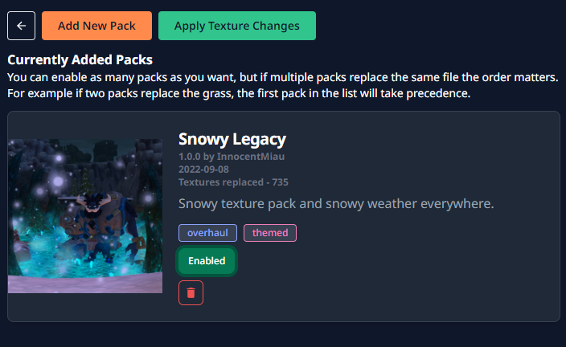
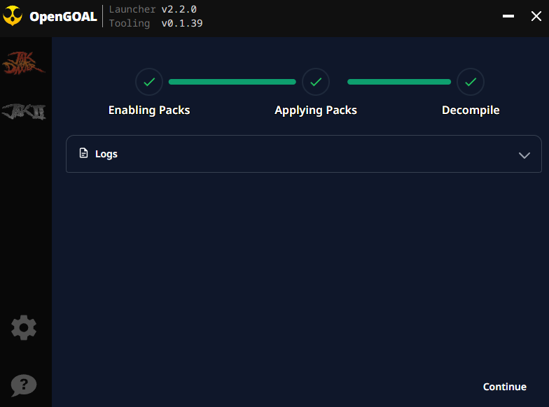
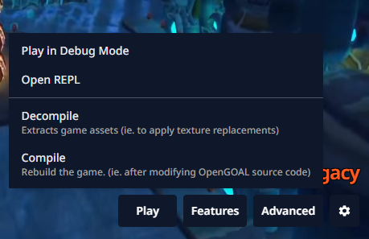

# How to Replace Textures

:::caution
The following instructions depend on if you are using a release version (pre-compiled) or building the project from source.
:::


## Using the OpenGOAL Launcher

### Using a proper bundle

If the texture pack has been bundled into a valid `.zip` file, you can let the launcher install the pack for you.

First open the texture pack page:


Next add your zip file, if it is in a valid format it should add successfully:



Next you'll want to enable the pack and apply the changes, and that should be it!




### Manually

If you don't want to use this feature, or the texture pack is not in the correct format, you can apply texture replacements yourself manually.

Navigate to the folder that you set as the Installation Directory.  You can find this in the settings page.

From there, you'll want to create a `texture_replacements/` folder in the following directory:

```
<INSTALLATION_DIRECTORY>/active/<GAME>/data
```

And copy your texture replacements into it.

Once this is done, you'll need to `Decompile` the game:



## Using a Release build

Create a folder called `texture_replacements` inside the `data` directory. The directory structure should be

```
data/texture_replacements/page_name/texture_name.png
```

Where `page_name` is the name of the folder in `data/decompiler_out/jak1/textures` and `texture_name.png` is the name of the texture.

### From source

Textures to be replaced should be saved in

```
jak-project/texture_replacements/page_name/texture_name.png
```

Where `page_name` is the name of the folder in `decompiler_out/jak1/textures` and `texture_name.png` is the name of the texture.

:::tip
You'll have to create the `texture_replacements` folder yourself.
:::

